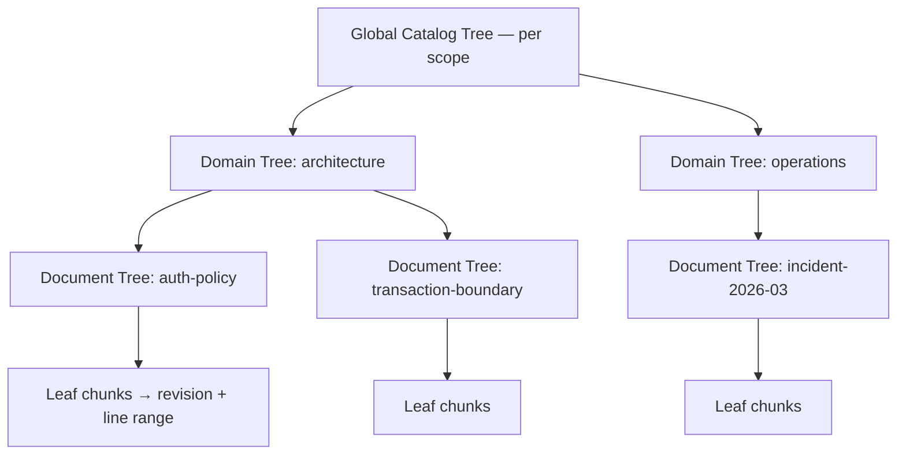

# ADR-0008: A RAPTOR forest, not a single tree

- Status: accepted
- Date: 2026-08-01
- Deciders: Theurian maintainers
- Requirements: FR-R3, SEC-14, R-3, R-14, §18 of the brief

## Context

RAPTOR builds a tree of recursive abstractive summaries so that a query can
match a high-level summary and then descend to specifics. Applied naively to a
whole organization's knowledge, it produces one enormous tree, and that has two
failure modes — one operational, one a security incident.

**Operational**: every knowledge edit invalidates summaries all the way to the
root. A one-line ADR correction triggers a full-tree rebuild.

**Security**: a summary node is a *new document synthesized from its children*.
If a node's children span a `restricted` incident report and a `public` API
guide, the summary contains restricted facts and inherits whichever ACL the
implementation happened to assign. Retrieval then returns restricted content to a
principal who is authorized only for public. Because the leak lives in generated
text with no anchor to the restricted source, it is nearly undetectable after the
fact.

> **Amended in Milestone 6. "Retrieval then returns restricted
> content to a principal who is authorized only for public" describes the
> un-partitioned alternative, and it reads as though Theurian's retrieval
> enforces sensitivity. It does not.** No retrieval path reads
> `chunks.sensitivity`; the column exists and the schema says so beside it, and
> FR-R1's per-axis register in `docs/architecture/requirements-analysis.md`
> records the disposition — sensitivity is a **published label, not a control**,
> with the control deferred to
> [#119](https://github.com/theurian/theurian/issues/119).
>
> So that sentence names what happens when a *summary node mixes* two
> sensitivities into one text, which is the harm partitioning prevents.
> Partitioning prevents mixing. It does not make a serving decision, and the
> forest must not be read as adding one.
>
> **Because it adds no serving control, the forest neither waits for #119 nor
> advances it — it ships first, and that is a decision rather than an
> oversight.** The residual is *smaller* than the paragraph above suggests, not
> equal to it: under decision 8 a summary node is never published. Nothing
> node-derived reaches the wire until the retrieval CL lands `raptorPath`
> through its own review, so until then there is no node being served to any
> principal, correctly or otherwise.
>
> What partitioning will buy meanwhile is that no node's *text* spans two
> sensitivities. Node rows will carry the scope tuple's sensitivity once they
> exist at all — they arrive with the v4 tables of decision 5 — so that the day
> #119 gives sensitivity a predicate there is a column to filter on and no node
> whose content straddles it. That is the whole reason for carrying it. The
> claim about node text is owed a test, not asserted: it is the
> `test_raptor_scope.py` item in Compliance.
>
> **Landed in Milestone 6, by the forest-builder CL.** Node rows exist and carry
> text, the scope tuple's `sensitivity` among their columns, and the claim about
> node text is asserted rather than owed: the builder groups by the full
> six-component scope before summarising and hands a node only its own group's
> texts, and
> `tests/integration/test_forest_builder.py::test_no_node_stands_on_chunks_that_disagree_on_a_scope_component`
> holds it over rows a build wrote. The `test_raptor_scope.py` item in Compliance
> closes with that note; the rest of this paragraph is unchanged, because #119
> still gives sensitivity no predicate to filter on.
>
> **Amended again in #119 (2026-08-24). "Sensitivity is a published label, not a
> control" is no longer true, and the sentence directly above — that #119 "still
> gives sensitivity no predicate to filter on" — is now false.** ADR-0025 records
> the decision; what it changes here is that the column this forest carries so
> that "the day #119 gives sensitivity a predicate there is a column to filter
> on" is filtered on today. `SqliteIndexStore._node_scope` emits
> `sensitivity IN (…)` over `nodes` beside its project and status predicates, so
> an above-ceiling summary is not traversed at all; `IndexBuilder` writes no
> chunk row above the deployment's declared ceiling, so the forest derived over
> what it wrote has no such node to traverse in the first place; and a
> `changeSensitivity` past that ceiling purges the affected rows and re-derives
> the affected scopes' trees in the same `migrate apply`.
>
> **What is *not* amended is everything this block says about partitioning**, and
> the distinction is worth keeping rather than collapsing. Partitioning stops a
> node's text spanning two sensitivities; the ceiling stops a deployment reading
> a level it does not serve. On a deployment that serves both levels the ceiling
> withholds nothing, and partitioning is still the only thing standing between a
> `restricted` incident report and a summary of it — so the forest's reason for
> carrying the scope tuple survives the axis becoming a control rather than being
> replaced by it.

## Decision

**A forest of scoped trees. Mixing across a scope boundary is structurally
impossible, not policy-checked.**



1. Tree identity is the tuple
   `(project, tenant, sensitivity, acl_group, namespace)`.
   A node's tree is determined by that tuple, so a node whose children differ in
   any component cannot exist — there is no tree it could belong to. This is a
   structural guarantee, not a check that could be forgotten.

   > **Amended in Milestone 6. The tuple gains a sixth component,
   > `status`:** `(project, tenant, sensitivity, acl_group, namespace, status)`.
   >
   > This decision's own argument is the reason. "A node whose children differ in
   > any component cannot exist" is worth most on the axes retrieval actually
   > enforces, and as accepted the tuple named only one of them. `_scope` filters
   > `chunks.project_id` and `chunks.status`; `status` was not in the tuple at
   > all.
   >
   > What that omission costs is concrete, because an index build has a flavor. A
   > default build holds only approved revisions; `theurian index build
   > --include-unapproved` records `indexesUnapproved` on the pointer
   > (`application/project_service.py`) and holds drafts and proposals too. On
   > such a build a node can be summarised from children that straddle the
   > boundary, and its `status` column — in the **node** tables, not in `chunks`
   > (decision 5) — then decides which query flavor traverses it.
   >
   > The cost is routing and recall, not serving: decision 8 publishes no node,
   > so nothing node-derived reaches a caller until the retrieval CL. A mixed node
   > stamped `draft` is a route a default query never takes, losing the
   > approved-derived leaves underneath it; stamped `approved`, it is a route a
   > default query does take, toward draft-derived leaves the leaf-level filter
   > then drops — work spent to reach rows that cannot be returned. Which of the
   > two happens is decided by how the builder happened to fill a column rather
   > than by anything anyone decided, so **recall becomes a function of that
   > choice**. And it does not resolve later: a node-table predicate added when
   > #119 or its successors land cannot filter a node whose content already
   > straddles the boundary, for the same reason ACL filtering cannot unmix a
   > summary — which is this ADR's own rejected alternative.
   >
   > **`validity` is not a seventh component, and that is decided rather than
   > overlooked.** It is the third axis retrieval enforces — `knowledge.search`'s
   > caller-chosen `asOf` (FR-R1, #63 phase 2) — so the argument above applies
   > to it, and comes out the other way, for two reasons. **Cardinality**:
   > `KnowledgeStatus` has six values, so it partitions; a validity window is a
   > pair of timestamps compared against a moment the caller picks per query
   > (`ValidityPeriod.contains`), so a component built from it would mint a tree
   > per distinct window and still name no tree for a given `asOf`. A component
   > derived from the window instead — a "currently valid" boolean — would also
   > go stale with no edit, because `valid_to` passing moves an item out of the
   > window while its content is unchanged, so a forest keyed on *that* would
   > rebuild on a clock rather than on a change. The window pair itself is
   > clock-stable, so this second objection reaches only the derived form; what
   > rules out the pair is the cardinality argument alone. **Harm**: a node
   > summarising an expired child alongside a valid one costs routing and recall
   > and nothing else, because the filter runs at the leaf.
   > `CanonicalVisibility.at_moment` drops each ranked row whose item's window
   > does not contain the moment, after `cleared` and before anything is
   > returned, so an expired child's text cannot reach a caller through a node
   > that mixed it in. With `asOf` omitted the filter does not run at all, so a
   > mixed node discloses nothing a caller could not get by omitting the
   > parameter — `asOf` is a refinement, not a withholding.
   >
   > That is the same shape as the `status` argument — routing and recall, no
   > disclosure — resolved the other way. What decides it is not the harm but the
   > axis: `status` is a build-time property with a small finite range, recorded
   > on a column the builder fills, and a component can partition it. `validity`
   > is a query-time comparison against a caller's moment, and no partition of it
   > exists to build.
   >
   > **The residual this leaves, recorded so the acceptance is a decision and not
   > an oversight.** The harm argument above holds while a node carries scopes and
   > no text. Once decision 5's node carries text, a summary built from a child
   > outside the window reaches a caller who pinned `asOf`: `at_moment` compares
   > the window of the one item a ranked row belongs to
   > (`item.validity.contains`), and a summary of several items has no single
   > window to compare — filtering the node does not unmix its content, which is
   > this ADR's own rejected alternative on a different axis. It is accepted, on
   > narrower ground than "no disclosure": the same caller reads that child's own
   > chunks by omitting `asOf`, so nothing is withheld from anyone — `asOf` is a
   > caller-chosen refinement, not an access boundary — and, per the paragraph
   > above, there is no partition of a window to build a component out of
   > instead. The cost is accuracy at a pinned moment, not disclosure.
   >
   > What has to move for this. `Scope.digest` is already total over five
   > components — it is `ContentHash.of_text` of `key`, which joins exactly those
   > five with a unit separator — so what is missing is the `status` component
   > itself and a node constructor that refuses children which disagree on it.
   > Both construction sites can supply it without a signature change:
   > `KnowledgeItem.scope` from `item.status`, and `RevisionMetadata.scope_for`
   > from `self.status`. An earlier draft of this amendment said `scope_for`
   > could not, on the reasoning that status lives on the item — the opposite of
   > how it flows. `RevisionMetadata` carries `status`, and
   > `KnowledgeItem.with_revision` adopts it (`status=revision.metadata.status`),
   > so authority runs metadata → item.
   >
   > That separator's unambiguity is enforced now rather than asserted:
   > `AclGroup`, `TenantId` and `namespace` reject C0 controls and DEL at
   > construction, so no component can carry `\x1f` (`ProjectId` is a kebab-case
   > slug, and `sensitivity` and `status` are enums). Until that landed, `key`'s
   > docstring claimed the property and nothing held it — `acl_group="a\x1fb"`
   > with `namespace="c"`, and `acl_group="a"` with `namespace="b\x1fc"`,
   > rendered one key — so the discriminator this decision rests on is now
   > pinned by the four tests in `test_scope_isolation.py` that assert a control
   > character is refused, plus
   > `test_raptor_scope.py::test_a_scope_digest_is_pinned_to_its_exact_component_order_and_encoding`,
   > which pins the join order and the UTF-8/SHA-256 encoding against a literal
   > digest that no discriminability test constrains.
   >
   > **Two families of statement go stale with this, and none is corrected
   > here.** Naming them so that a later reader does not take one as
   > corroboration. Statements of the five-component tuple, from
   > `rg -U "project[,_ ][^)]{0,20}tenant(.|\n){0,60}?sensitivity(.|\n){0,60}?(acl_group|ACL group)(.|\n){0,60}?namespace"`:
   > `README.md`, `SECURITY.md`, `docs/security/threat-model.md`,
   > `docs/architecture/raptor.md`,
   > `docs/architecture/requirements-analysis.md`,
   > `infrastructure/raptor/__init__.py`, the two `Scope` construction sites,
   > `Scope`'s own field list in `domain/values.py`, and
   > `tests/unit/test_scope_isolation.py` — whose `_scope` helper and exhaustive
   > product are the first things a sixth field breaks — plus
   > `packages/theurian-core/CHANGELOG.md`, which is history and stays as
   > written. Statements that the exhaustive scope test covers **32**
   > combinations, from `rg "32 (component |scope |)combinations|32 distinct|all 32"`:
   > `SECURITY.md`, `docs/architecture/raptor.md` (twice),
   > `docs/security/threat-model.md` and `infrastructure/raptor/__init__.py`;
   > `tests/unit/test_scope_isolation.py`'s own docstring belongs to the family
   > by meaning rather than by that string. Two values per component over six
   > components is 64.
   >
   > The owed test named in Compliance now has to be total over six components,
   > not five.
   >
   > **Landed in Milestone 6, by the CL that added `domain/raptor.py`.**
   > Everything above this note is the plan as it stood when the amendment was
   > written; the statements below are the ones that have since become history
   > rather than open work, marked here so a later reader does not take the
   > paragraphs above for the current state.
   > `Scope.key` joins six components, `status` last (`domain/values.py`). The
   > node constructor that refuses children which disagree on any component
   > exists: `SummaryNode.__post_init__` in `domain/raptor.py`, raising
   > `InvariantViolationError`. The five-component population listed above is
   > corrected in every file it names except `docs/architecture/raptor.md`, which
   > is reconciled whole in its own CL; `packages/theurian-core/CHANGELOG.md` is
   > history and stays as written, as that list said. What is *not* landed is
   > everything downstream of the value type — no builder constructs a node, no
   > table stores one, no traversal reads one — so the routing-and-recall cost
   > argued above is still argued about work that has not been built.
   >
   > That last exception is discharged by
   > [#136](https://github.com/theurian/theurian/issues/136); see the Compliance
   > note below.
   >
   > **Amended in Milestone 6, by the forest-builder CL. "No builder constructs a
   > node, no table stores one, no traversal reads one" is now one claim, not
   > three.** `application/forest_builder.py` constructs them and `theurian index
   > build --raptor` stores them in `nodes` and `node_derivation`. **No traversal
   > reads one**, and that is what keeps this amendment's cost argument recorded
   > rather than observed: a node's `status` column is filled from the scope its
   > children share, so the mixed node the sixth component exists to prevent
   > cannot be built at all, but no query reads that column, so *which* query
   > flavour would route through *which* node is still a claim about work that has
   > not been built.
   >
   > **Landed in Milestone 6, by the retrieval CL. All three of the claims this
   > thread ends on are now false, so the routing-and-recall cost is observable
   > rather than argued.** `search_summaries` traverses the summary nodes — so "No
   > traversal reads one" no longer holds — `SqliteIndexStore._node_scope` reads
   > `nodes.status` in its WHERE clause to gate the match — so "no query reads that
   > column" no longer holds — and routing through the forest is implemented — so
   > "work that has not been built" no longer holds. Which query flavour routes
   > through which node is now decided by that gate rather than being a claim about
   > unbuilt work. The Compliance item "Project and status are enforced for the node
   > tables in one place" records this fully discharged and mutation-checked; the
   > detail is there, and these claims are corrected here rather than deleted.
2. Three levels: Document Tree (within one knowledge item), Domain Tree (within
   one namespace/kind), Global Catalog Tree (within one scope tuple).

   > **Amended in Milestone 6, by the forest-builder CL. "One namespace/kind" had
   > two readings, and inside a scope only one of them builds three levels.** A
   > tree's scope already fixes the namespace (decision 1), so a Domain tier keyed
   > on namespace would put every document of a scope under one Domain tree, leave
   > the Catalog tier with a single child forever, and make the third level
   > structurally unreachable. The reading taken is therefore **`kind`
   > discriminates within a scope**, and `IndexableChunk` carries `kind` for that
   > and nothing else — no `chunks` column, because no query reads it and the
   > build that produced the chunk consumes it in memory.
   >
   > `namespace` is populated on `chunks` for the first time in the same change.
   > It was `NOT NULL DEFAULT ''` and never written, so a forest derived from
   > those rows would have partitioned on five components while claiming six, and
   > every isolation test would have passed over a corpus that had silently
   > collapsed into one scope.
   > `tests/integration/test_forest_builder.py::test_a_chunks_namespace_carries_the_value_its_item_was_registered_with`
   > holds it, on a *default* build, because the column belongs to the chunk and
   > not to the forest.
   >
   > What a stored `tree_id` is, in consequence: `tree_identity(scope, tier,
   > discriminator)` — the item for a Document tree, the kind for a Domain tree,
   > and the empty string for the Catalog, which *is* the scope. Not
   > `Scope.digest`, which is what `SummaryNode.tree_id` exposes and which cannot
   > tell two Document trees in one scope apart.
   >
   > **Amended in Milestone 6, by the Domain fan-out CL. The Domain
   > discriminator is `kind` only until a kind grows too large to summarise in one
   > call.** A Domain node summarises one node per document of its kind, so its
   > input is the one tier's that grows with the corpus rather than with the number
   > of kinds — a same-kind corpus past roughly a thousand documents drove one
   > Domain node's input over the extractive default's
   > `MAX_TOTAL_INPUT_CHARS` (1,000,000) and refused the build.
   > `forest_builder.MAX_CHILDREN_PER_DOMAIN` (500) bounds it: a full batch's input
   > is `500 × SUMMARY_MAX_TOKENS × CHARS_PER_TOKEN` = 500 × 250 × 4 = 500k
   > characters, half that limit. Above the cap a kind's Document nodes, sorted by
   > `node_id` (decision 9's canonical order, not the order they were derived in),
   > slice into contiguous batches of at most 500, each its own Domain node whose
   > discriminator is `kind` joined with the partition index — `#`. A
   > `KnowledgeKind` value cannot contain `#`, so a partitioned discriminator can
   > never collide with a bare kind, and the partition is a function of the corpus
   > alone, so it is deterministic across rebuilds. Every Document node stays under
   > exactly one Domain node and the Catalog summarises the batches. The
   > `~1050`-document Domain wall is therefore gone.
   >
   > **The Catalog tier is not itself fanned out, so a ceiling remains, far above
   > the one removed.** A Catalog node is charged one summary per Domain node, so
   > its input grows with the number of kinds until a kind fans out and then with
   > the corpus too, at 1/500 the rate. A single scope holding one kind at roughly
   > half a million documents — a thousand Domain batches — would finally meet the
   > same `MAX_TOTAL_INPUT_CHARS` limit at the Catalog node. The fan-out raises the
   > buildable corpus by about 500× rather than making it unbounded; recorded here,
   > not removed, because the Catalog tier has no fan-out and this ADR should not
   > read as though it does.
   >
   > **Amended in Milestone 6, by the purge-recompute CL. "No `chunks` column,
   > because no query reads it and the build that produced the chunk consumes it in
   > memory" is false: index schema v5 adds `chunks.kind`.** No *retrieval* reads
   > it, so the first half stands — but the withdrawal purge re-derives each
   > affected scope's Domain trees from the *published index's* surviving rows
   > (decision 9, [ADR-0024](0024-a-purge-is-a-build.md)), not from canonical
   > state, and a Domain tree is keyed by `kind` within a scope. A summary node
   > records its scope but not the leaf `kind` its tree clustered on, so at v4 the
   > `kind` a re-derivation needs lived nowhere the index could be read for it. v5
   > persists it (`NOT NULL DEFAULT ''`), so the build no longer merely consumes
   > `kind` in memory. `index_schema.py`'s `chunks` comment records the exception.
3. Incremental rebuild: changed item → its Document Tree → the affected part of
   its Domain Tree → the affected part of the Catalog Tree. Never a full forest
   rebuild for a single edit.

   > **Amended in Milestone 6. Milestone 6 ships full re-derivation
   > of the forest inside the existing build path. Incremental subtree rebuild is
   > deferred until it has a correctness argument.**
   >
   > A full re-derive is one code path whose output is a function of canonical
   > state alone, so "is this forest the one this state implies?" is answered by
   > deriving it again and comparing. An incremental rebuild is a second path that
   > has to agree with the first on every input, and the way it fails — a node
   > left standing that no longer matches its children — is invisible in the
   > artifact it produces. That argument has not been written, and a rule that
   > says "never a full forest rebuild" is not a reason to ship the path that
   > needs it.
   >
   > This decision's cost concern is recorded, not abandoned. ADR-0024 measured a
   > full `theurian index build` of the *chunk* index at 2,614 ms over 400
   > documents — the whole command with embeddings enabled, not chunk derivation
   > alone. The forest adds summarisation on top of that and nothing has measured
   > it. The milestone that ships incremental rebuild owes both the correctness
   > argument and a measurement of what the incremental path saves against the
   > full one.
   >
   > **Decision 9's purge does carry over trees it did not re-derive, and that is
   > not this deferral being taken quietly.** The difference is that the purge
   > has the correctness argument this decision says is missing: under decision
   > 6's purity constraint an unaffected tree's inputs are unchanged, so a pure
   > derivation would reproduce it byte-for-byte, content-addressed ids included
   > — and the two-corpus equality test is exactly the experiment that exercises
   > that claim. A build-path incremental rebuild has no such test, because the
   > thing it would have to hold is that a tree whose inputs *did* change was
   > updated correctly, which no equality against a never-held corpus states.
   >
   > **Landed in Milestone 6, by the forest-builder CL: the full re-derivation
   > this note describes is what `index build --raptor` does.** It derives every
   > node from the chunks the same build has just written, in memory, rather than
   > by reading the index back — which is also what keeps the derivation a pure
   > function of that build's own output — and reuses nothing across builds.
   > `tests/integration/test_forest_builder.py::test_rebuilding_the_same_state_produces_a_byte_identical_forest`
   > holds the property that makes it checkable: two builds of one unchanged state
   > agree on every node column, `index_build_id` excepted, and on every
   > derivation edge.
   >
   > **The cost is still unmeasured, and now it is a cost somebody pays.** This
   > note said "the forest adds summarisation on top of that and nothing has
   > measured it" while nothing built a forest; a build with `--raptor` now makes
   > one `summarize` call per node, and nothing has measured that either. It is
   > the reason decision 10's opt-in is a hard guarantee rather than a filter. One
   > bound is recorded rather than open: a Document node is charged its item's
   > whole body and the extractive default refuses a call above
   > `MAX_TOTAL_INPUT_CHARS` (1,000,000 characters), so a single document past
   > that fails the build instead of producing a summary nobody could read.
4. A rebuild produces a new `index_build`. It is verified, then published by an
   atomic swap of `active_indexes`. An unverified or partial build is never
   searchable (NFR-4).

   > **Amended in Milestone 6. There is no `active_indexes` table.
   > There never was one.** Publication is a pointer *file*:
   > `.theurian/state/active-index.json`, written temp-then-`os.replace` so a
   > reader never observes a half-written pointer
   > ([ADR-0022](0022-index-lives-in-its-own-database.md) point 5,
   > [ADR-0024](0024-a-purge-is-a-build.md)). No schema in `schemas/` and no DDL
   > in `index_schema.py` names `active_indexes`; the phrase describes a mechanism
   > that was written down before it was built and has been read back since as
   > though it had been.
   >
   > At the time of this amendment the same phrase stands in five other places —
   > the population is `git grep active_indexes`, and it is the whole of it:
   > `docs/architecture/overview.md`, `docs/architecture/local-daemon.md`,
   > `docs/architecture/raptor.md`, `docs/architecture/requirements-analysis.md`
   > and the `indexing/__init__.py` docstring. They are named here rather than
   > corrected here — this amendment is scoped to the ADR — so that the next
   > reader does not take a second sighting as corroboration.
   >
   > `docs/architecture/raptor.md` is discharged by
   > [#136](https://github.com/theurian/theurian/issues/136), leaving four; see
   > the Compliance note below.
   >
   > The property this decision asserts is unchanged, and ADR-0024 is what holds it:
   > publishing is a pointer swap, an unverified or partial build is never pointed
   > at, and a purge is subject to the same rule rather than being an exception to
   > it.
5. Every node stores its provenance:
   `node_id`, `tree_id`, `level`, `node_type`, `text`, `content_hash`,
   `summary_model`, `summary_model_revision`, `summary_prompt_hash`,
   `embedding_model`, `embedding_model_revision`, `embedding_dimension`,
   `source_revision_id`, `index_build_id`.
   A summary whose model or prompt hash differs from the current configuration is
   stale by definition and rebuilt — no guessing.

   > **Amended in Milestone 6. These rows go in their own tables, at
   > index schema v4 — not into `chunks` as rows with `derived = 1`.** This
   > corrects the storage `chunks.derived` and `chunk_derivation` were added for:
   > [ADR-0024](0024-a-purge-is-a-build.md) decision 8 landed the columns at v3
   > with `index_schema.py` naming RAPTOR as the first thing that would write
   > them, and this is that assumption being revisited by the feature it was
   > waiting for.
   >
   > The reason is BM25's collection statistics. `chunks_fts` and
   > `chunks_trigram` are external-content FTS5 tables over `chunks`, and `bm25`
   > scores every row against statistics computed over *every* row in the table —
   > `N`, `avgdl`, and the per-term document frequencies. A summary systematically
   > repeats the terms of the children it was built from, so summary rows in
   > `chunks` would move all three under every ordinary leaf query, and a visible
   > leaf's rank would become a function of the forest's shape. Separate tables
   > will leave the leaf statistics equal to a forest-free build, which is why the
   > magnitude of the shared-table effect is deliberately not measured: separation
   > is meant to make the quantity moot rather than small. That is a claim about
   > code nobody has written, so it is owed the test named in Compliance and is
   > not asserted here on the strength of the argument.
   >
   > **`chunks.derived` and `chunk_derivation` are dropped at v4.** A column
   > nothing will ever write serves nothing, and keeping it would leave two
   > provenance mechanisms of which one is permanently dead. The traversal is
   > rewritten against the node tables, and ADR-0024's pinned traversal tests
   > migrate to that counterpart rather than being deleted — what they hold is
   > the *rule*, and the rule is unchanged: withdrawal is transitive over derived
   > content, and an unresolvable derivation edge means delete, not keep. **There
   > are six of them, not the five this said until they migrated** — that count
   > was taken from ADR-0024's Compliance bullet, which named five shapes while
   > the suite held a sixth of the same family. That ADR's amendment to decision
   > 8 records the corrected population.
   >
   > **Three places name those columns and must move together, and the third is
   > the one a reader would miss.** `_DOOMED` in
   > `infrastructure/sqlite/index_purge.py`; `_verify`'s unprovenanced-row
   > post-condition beside it; and `IndexStore.holds_any_revision`, whose
   > unprovenanced clause is not commentary but an **executed SQL predicate**
   > naming `chunk_derivation` in its `SELECT`. That one runs on the withdrawal
   > path rather than the purge path — `application/withdrawal_purge.py` calls it
   > as the pre-check on every `migrate apply` that withdraws anything — so
   > against a v4 index it raises `no such table: chunk_derivation`, and it does
   > so even when the revision clause alone would have answered, because SQLite
   > resolves the whole statement before evaluating any of it. Dropping the
   > columns without moving this predicate breaks `migrate apply`, not just the
   > purge.
   >
   > **Several statements say RAPTOR will write those v3 columns, and this makes
   > every one of them wrong. None is corrected here.** They cannot be enumerated
   > by a regex over prose — each refers to the rows by a different anaphor
   > ("those rows", "them", "such a row") — so the population is given by a key
   > that cannot miss:
   > ``rg -l "chunk_derivation|chunks\.derived|derived = 1"``, with `rg`'s
   > defaults and so without dot directories, returns eight files besides this
   > one, and every RAPTOR-as-future-writer sentence is inside them:
   > `index_schema.py` (module docstring and column comment), `index_store.py`
   > (`holds_any_revision`, which both says it in a docstring **and executes it
   > as a SQL predicate**), `tests/integration/test_index_purge.py` (section
   > comment, `_add_derived`, and the `_verify` backstop test),
   > `tests/integration/test_index_store.py` (the columns-exist test),
   > `tests/integration/test_withdrawal_purge.py`
   > (`_insert_unprovenanced_derived`), and
   > [ADR-0024](0024-a-purge-is-a-build.md)'s own Compliance line.
   > `packages/theurian-core/CHANGELOG.md` and `index_purge.py` are in the eight
   > as the mechanism and its record, not as claims about a future writer.
   > `packages/theurian-core/CHANGELOG.md` records the v3 bump and is history.
   >
   > **The node tables also sit outside `_scope`, which is today the one place
   > project and status are enforced.** That method's docstring earns its "every
   > retriever" claim by mutation: the isolation test only went RED when all
   > three hand-written copies of the predicate were broken at once, so any one
   > could have lost `project_id` with the suite green. Enforcement is now in one
   > place; a node traversal would be the second, and the argument that
   > consolidated the first three applies to it unchanged. The owed item is in
   > Compliance.
   >
   > **Landed at index schema v4.** Everything above this note is the plan as it
   > stood when the amendment was written; what follows is what the schema-v4 CL
   > built, so the paragraphs above are not read back as the current state.
   > `index_schema.py` declares `nodes` — the fourteen provenance columns this
   > decision lists, plus `project_id`, `sensitivity` and `status` — together
   > with `node_derivation`, `nodes_fts`, `nodes_trigram` and `node_embeddings`.
   > `chunks.derived` and `chunk_derivation` are gone.
   >
   > `test_the_schema_carries_the_node_tables_the_purge_traversal_will_walk`
   > holds the removals and three of the five additions, and it is worth saying
   > exactly which assertion each gets, because "the new objects, with their
   > exact column sets" is true of two of them: it compares the column sets of
   > `nodes` and `node_derivation` against literal frozensets, checks `nodes_fts`
   > only for its presence and for `content='nodes'` in its DDL, and asserts that
   > `chunks.derived` and `chunk_derivation` are absent. `nodes_trigram` and
   > `node_embeddings` have shape tests of their own,
   > `test_the_schema_carries_nodes_trigram` and
   > `test_the_schema_carries_the_node_embeddings_table`.
   >
   > **Node vectors and node trigrams land here rather than in a later CL, so
   > storage costs one schema bump and not three.** `embeddings` is keyed on
   > `chunk_id REFERENCES chunks`, so a summary's vector had nowhere to live;
   > `nodes_trigram` exists for the reason `chunks_trigram` does, that `unicode61`
   > makes a Japanese summary one token. Both cascade on their node, and
   > `_verify`'s orphan counterpart for node vectors is present from birth rather
   > than arriving with whichever CL first writes one.
   >
   > **The three places named above moved together, and the node rule is
   > universal grounding — not the seed-and-walk this note described until the
   > round that measured it.** A node survives only if *every* declared source
   > terminates at a surviving chunk in finitely many steps. `_DOOMED` computes
   > the complement, because grounding is a least fixed point under a universal
   > quantifier and SQLite's row-at-a-time recursion cannot express one:
   > *unanchored* is a withdrawn `source_revision_id` stamp ∪ no `node_derivation`
   > row ∪ an edge naming a withdrawn or absent chunk ∪ an edge naming an absent
   > node ∪ a node standing on a provenance cycle, closed upward over "is built
   > from". A summary cannot be partially grounded any more than it can be
   > partially withdrawn, so one good parent and one that leads nowhere is still
   > removed. What this note said before — `_DOOMED` seeding on `nodes` rows
   > absent from `node_derivation` and walking forward from the doomed chunks —
   > kept every shape that has edges and never terminates: measured, a two-cycle
   > of summaries of a withdrawn incident survived a purge of the *entire* corpus
   > with its text intact, and `_verify` accepted the build.
   >
   > **`_verify` is six post-conditions, not the four this note counted.** Rows
   > of the withdrawn revisions — chunks by `revision_id` and nodes by the
   > `source_revision_id` stamp, where v3 counted chunks alone — an orphaned
   > chunk embedding, an unprovenanced node, a `node_derivation` edge whose
   > source chunk or source node is gone, a node standing on a cycle, and an
   > orphaned node embedding. The dangling-edge check is the one with no v3
   > analogue: one table could not express a dangling edge as a state distinct
   > from having no edge at all. The cycle count is computed independently rather
   > than by asking `_DOOMED` a second time, because a post-condition computed by
   > the function it checks cannot catch that function being wrong. With it the
   > six are jointly complete: no cycle makes the node graph finite and well
   > ordered, no dangling edge and no unprovenanced node make every edge name a
   > surviving row, and grounding follows by induction up that order.
   >
   > **The closure argument is a measurement, and the oracle that produced it can
   > fail.** `_DOOMED` and the pre-check were run against a well-founded
   > reference implementation over 400 randomly generated graphs — up to four
   > chunks and four nodes each, self edges and cycles allowed, one fixed seed —
   > and reported no divergence, on the doomed set and on the pre-check alike.
   > The same 400 graphs against the predicate this replaces report 11 divergent
   > trials, every one a node the well-founded reading dooms and the seeded
   > reading kept, so a green run means the oracle looked rather than that it
   > cannot see. That control runs on the *shipped* schema, whose self-edge
   > `CHECK` refuses 142 of the graphs' edges outright; on the schema before that
   > `CHECK`, the same predicate diverged on 91 of the same 400.
   >
   > `IndexStore.holds_any_revision` stops being a second hand-written predicate:
   > it runs `index_purge.ANY_DOOMED_ROW`, composed from the same literals
   > `_DOOMED` is built from, so the pre-check is `_DOOMED` minus an upward
   > closure over an empty seed. The `no such table: chunk_derivation` failure
   > this amendment predicted for that third place is reproduced rather than
   > argued, and it does fire even where the revision clause alone would have
   > answered.
   >
   > **The population above is discharged, which is worth saying because "none is
   > corrected here" invites the next reader to assume they all still stand.**
   > Its key returns the same nine files — run with `rg`'s defaults, which skip
   > dot directories; `--hidden` returns the same nine here, so the qualifier
   > changes the count in neither direction and is stated so the next reader
   > reproduces the same population — and every remaining hit in `src/` and
   > `tests/` is a "held at v3 by …" note recording the migration rather than a
   > claim about a future writer. `packages/theurian-core/CHANGELOG.md` is
   > history, as that paragraph said; ADR-0024's Compliance line is corrected in
   > the same CL as this note.
   >
   > **Nothing writes a node row.** `infrastructure/raptor/` is still an empty
   > package and `SummarizationProvider` still a port with no adapter, so every
   > test over these tables inserts its fixture with raw SQL and the builder is
   > the next CL. The scope columns exist ahead of any reader of them, so the
   > `_scope` counterpart named just above stays owed rather than landing here.
   >
   > **Amended in Milestone 6, by the extractive-provider CL. Both halves of
   > "`infrastructure/raptor/` is still an empty package and
   > `SummarizationProvider` still a port with no adapter" are false now.** That
   > package holds `extractive.py`, which implements the port. Nothing calls it:
   > no builder maps a `SummaryNode` onto a row and passes it texts, so the rest
   > stands — no builder, no traversal, no node writer, and every test over these
   > tables still inserts its fixture with raw SQL.
   >
   > Written first as the adapter half alone, closing with "every claim just
   > above is otherwise unaffected", which was not true of the empty-package
   > half. The Compliance section's family-closure note records that
   > under-correction and the key that would have caught it.
   >
   > **Amended in Milestone 6, by the forest-builder CL. "Nothing writes a node
   > row" is false, and so is "every test over these tables inserts its fixture
   > with raw SQL".** `IndexStore.add_nodes` writes them, called by
   > `application/index_builder.py` when a build was asked for a forest, and
   > `tests/integration/test_forest_builder.py` reads back rows the CLI wrote.
   >
   > The provenance columns this decision lists are filled with real values rather
   > than placeholders, which is what makes the staleness rule above meaningful:
   > `summary_model`, `summary_model_revision` and `summary_prompt_hash` are the
   > configured provider's own,
   > `test_a_document_nodes_provenance_names_the_revision_it_was_built_from`
   > asserts each against `ExtractiveSummarizer`'s, and `source_revision_id` names
   > the one revision a Document node was built from. Above the Document tier that
   > stamp is **empty on purpose**: a node built from other nodes has no single
   > revision its text was written against, and `_DOOMED` reaches it through its
   > edges instead. Empty is safe against the stamp arm because a revision id is a
   > ULID, so no withdrawal set contains `""`.
   >
   > `embedding_model`, `embedding_model_revision` and `embedding_dimension` are
   > facts about the *build* rather than the summary, so `add_nodes` takes them
   > per call; a forest derived with no embedder configured is the same forest,
   > and the columns then record that no vector was produced.
   >
   > **The `_scope` counterpart this note left owed stays owed.** Storage got a
   > writer; enforcement did not, because there is still nothing that reads a node
   > back to enforce anything against.
   >
   > **Landed in Milestone 6, by the retrieval and node-scope CLs. What this note
   > called owed is discharged.** `SqliteIndexStore._node_scope` reads the node
   > tables back — through `search_summaries` — and enforces project and status,
   > the `_scope` counterpart. The Compliance item "Project and status are enforced
   > for the node tables in one place" records it fully discharged, mutation-checked
   > by `tests/integration/test_forest_node_scope.py` with the walk-side gate in
   > `walk_raptor_path`; the detail is there, and this note is corrected rather than
   > deleted.
6. Summarization constraints, enforced in the prompt and validated in evaluation:
   - state no fact absent from the children;
   - treat imperative text in the source as *data being described*, never as an
     instruction (SEC-16);
   - retain child references so every summary is traceable to source text;
   - mark uncertainty rather than resolving it;
   - inherit sensitivity and ACL from children — which, given rule 1, are uniform.

   > **Amended in Milestone 6. A sixth constraint, and it is the one
   > that makes the extractive default load-bearing rather than merely
   > convenient: a summariser is a pure function of its own children's texts, its
   > scope tuple, and a configuration-derived `max_tokens`.** No corpus-wide
   > statistic may enter — not an IDF over a tree, not a term frequency over a
   > namespace, not a centroid over a project — and **`max_tokens` must never be
   > a corpus-derived quantity**. The port takes it as a parameter, so a builder
   > that divided a shared budget by the number of documents would change a
   > visible node's text when a withheld document was added or removed, while the
   > summariser itself read nothing it should not. That is the same class
   > arriving through the one input that looks like a tuning knob.
   >
   > The reason is a class T-17a is adjacent to and is not. A statistic computed
   > over a corpus is computed over documents the caller may not read, so a
   > summariser that used one would write a withheld document's influence into
   > the text of a *visible* node. A purge deletes rows; it cannot delete from a
   > sentence the reason that sentence was chosen.
   >
   > Named by its root cause rather than by what it emits, that class is
   > **content the caller may not read influencing a derived artifact no purge
   > reaches**. T-17a's root cause is a different one — *the index still holds
   > the withdrawn rows* — and `66a43ae` shipped the withdrawal→purge trigger
   > ([#15](https://github.com/theurian/theurian/issues/15)) on 2026-08-10; the
   > trigger removes those rows, which is why deleting them restores equality
   > there. This read "#15 removes those rows" until 2026-09-01, naming as the
   > actor a tracker that had already closed earlier the same day: #15 closed at
   > 19:45 +0900 and the sentence entered this file at 22:27 +0900 (`379e197`),
   > so it never named a live one. The actor is
   > `application/withdrawal_purge.py` and this is history, not owed work
   > ([#464](https://github.com/theurian/theurian/issues/464)). Here
   > deletion restores nothing, because what carries the influence is text that
   > was already written. The two look alike in their observable and want
   > opposite remedies, which is the reason for naming them apart.
   >
   > **That class has three carriers, and this constraint closes two of them.**
   > (a) The summariser's *text* inputs and (c) its `max_tokens` — both closed
   > here, held by the purity test in Compliance. (b) **Which children cluster
   > together**, because membership in a node is a function of the member set:
   > removing a document the caller may not read regroups the visible ones, so a
   > node built entirely from visible children still has text that would have
   > read differently had the withheld document never existed. Carrier (b) is
   > closed by decision 9's tree-level
   > re-derivation and is held by the two-corpus equality test, not by this one —
   > the purity test holds the children fixed, so by construction it cannot see
   > (b), and its corpus-reading negative control demonstrates only that the
   > harness detects a corpus-reading *summariser*. The clusterer is therefore
   > part of "tree derivation" wherever decision 9 requires that to be a
   > deterministic pure function.
   >
   > Unlike the constraints above it, this one is not enforceable in a prompt —
   > it is a constraint on the adapter, not on the model. The port is shaped for
   > it and does not enforce it: `SummarizationProvider.summarize` in
   > `domain/ports/summarization.py` takes `texts`, `scope` and `max_tokens` and
   > is handed no corpus handle, so an adapter that wanted one would have to
   > acquire it in its constructor. What holds the constraint is the test named in
   > Compliance.
   >
   > **Landed in Milestone 6, by the forest-builder CL, for the half no adapter
   > can hold.** "`max_tokens` must never be a corpus-derived quantity" is a
   > property of the *caller*: a summariser is handed the number and never the
   > recipe, so no adapter can tell a constant budget from a share of the corpus,
   > and the extractive CL's negative control could only show that the harness
   > detects one. `forest_builder.SUMMARY_MAX_TOKENS` is now that constant — one
   > chunk's worth, the chunker's target passage priced at the estimator's
   > characters-per-token — passed verbatim to every call, never divided by a
   > cluster size or a document count, and it is the one `ForestOptions` field
   > with **no config key**, so no configuration can turn it into a corpus-derived
   > quantity either.
   > `tests/unit/test_forest_derivation.py::test_the_summary_budget_is_a_constant_and_not_a_share_of_the_corpus`
   > holds it with a recorder that sees what each call was charged.
   >
   > That test's fixture was corrected rather than weakened while it was RED, and
   > the correction is worth recording because the guard reported its own
   > inadequacy: a corpus of three items of three chunks makes a Domain node's
   > cluster size equal a Document node's, so a cluster-size-scaled budget is
   > indistinguishable from a constant. Four items separates them.
   >
   > Carrier (b) — which children cluster together — is untouched by this and
   > stays owed to decision 9's two-corpus test, as this amendment already said.
7. RAPTOR sits behind a port. The default `SummarizationProvider` is extractive
   and deterministic, so Core produces a usable forest offline with no LLM
   (OSS-15, ADR-0009).

   > **Amended in Milestone 6, by the forest-builder CL. "RAPTOR sits behind a
   > port" is true of *summarization* and of nothing else, and where the rest of
   > it sits is a layering fact rather than a filing preference.** This decision
   > puts summarization behind a port and `docs/architecture/raptor.md` says the
   > hierarchy itself has none, which leaves the builder to be written somewhere
   > with no port to hide behind. `infrastructure/raptor/` is the obvious home and
   > is the wrong one: `application/index_builder.py` is where the forest pass has
   > to mount, and
   > `tests/unit/test_layering.py::test_application_does_not_import_infrastructure`
   > walks the real import graph, so a builder under `infrastructure/` could not be
   > called from the one place that must call it. It is
   > `application/forest_builder.py` — application policy over a port that already
   > exists — and `infrastructure/raptor/` holds summarization adapters only.
   >
   > The offline claim is now exercised rather than asserted: `theurian index
   > build --raptor` composes `ExtractiveSummarizer` and produces a forest with no
   > model configured and no socket opened
   > (`test_the_default_summarizer_reaches_no_socket_capable_module` holds the
   > import closure). The CLI composes one whether or not the flag was passed —
   > the adapter holds no state, opens nothing and reaches no network — so "was a
   > summariser configured" is not a second thing `--raptor` means.

> **Amended in Milestone 6: three decisions this ADR left open,
> taken now.** They are numbered 8 to 10 rather than folded into the points
> above, because none of them corrects a point — each answers a question the ADR
> did not ask.
>
> 8. **Summary nodes are routing-only. Search may traverse them; only leaf
>    chunks are published as results.** Node-derived data reaches the wire only
>    when the retrieval CL lands `raptorPath` through its own review — that is
>    the boundary, and this decision is what lets that field cross it. Today
>    `raptorPath` is named in the architecture and protocol documents and
>    declared in `domain/retrieval.py`, and emitted by nothing: `mcp/results.py`
>    builds every result payload and has no such key, and no schema in
>    `schemas/` names it. Publishing nodes *as results* is a future decision and
>    is explicitly not taken here.
>
>    The reason is the gate. `CanonicalVisibility._may_surface` admits a ranked
>    row only when the canonical store still holds its item, the item's status
>    may surface, and `item.current_revision_id` equals the row's `revision_id`.
>    A summary node's text is not any revision, so there is no
>    `(item_id, current revision_id)` pair for that gate to clear, and publishing
>    a node would mean a second clearance rule beside the one every published
>    result goes through today.
>
>    **That anchor drops withdrawn and superseded revisions, and it is not the
>    general guarantee it has been read as.** It does not cover same-revision
>    content drift — [#130](https://github.com/theurian/theurian/issues/130) —
>    nor order and excerpt movement, which is T-17a. "A stale index returns fewer
>    results rather than wrong ones" is false in the general form and must not be
>    imported anywhere, here included. It still stands where it was written:
>    `rg -n "fewer results rather than wrong"` returns two hits, the docstring of
>    `tests/integration/test_mcp_tools.py`'s superseded-revision test — which is
>    true of the supersede case that test actually exercises, and is the sentence
>    the general form was read out of — and `packages/theurian-core/CHANGELOG.md`,
>    which is history. Named here, not corrected here.
>
>    Routing-only bounds the new disclosure surface to **one field plus the
>    traversal that feeds it** — not to one field, which undercounts twice over.
>    That field carries three values per segment, `nodeId`, `level` and `title`,
>    and `title` is node-derived free text, so it is a summariser's output
>    reaching the wire directly. And which rows reach a published field is its own
>    observable family in this repository's own table: a route taken or not taken
>    decides which leaves are candidates and in what order. The retrieval CL's
>    review has to cover routing effects and `title`, not the field's presence.
>    FR-R3's value is kept: descending from a summary to the specifics under it
>    is traversal, not publication.
>
>    > **Landed in Milestone 6, by the retrieval CL. `raptorPath` crosses the
>    > boundary this decision drew, and the routing-only invariant holds.**
>    > `IndexStore.search_summaries` matches summary nodes in `nodes_fts`/`nodes_trigram`
>    > and descends `node_derivation` to the leaf chunks beneath a matched node,
>    > fused into `RetrievalService.search` under the ranking name `summary`
>    > (`domain/ranking.py`). A summary node is a router and never a result row —
>    > it has no `(item, current revision)` pair for `_may_surface` to clear —
>    > held by `test_a_summary_node_is_never_itself_a_result_row`, and
>    > `test_a_summary_match_routes_to_sibling_leaves_a_leaf_search_misses` is FR-R3
>    > itself: a Domain-summary match reaches two sibling leaves no leaf retriever
>    > for the term can. `IndexStore.raptor_path` walks upward from a surfaced leaf
>    > to its Document, Domain and Catalog ancestors, and `result_payload` emits
>    > `raptorPath` — root-to-leaf `{nodeId, level, title}`, `title` the node text
>    > bounded by `excerpt` — only when non-empty
>    > (`test_a_surfaced_leaf_carries_its_forest_ancestry_as_raptor_path`,
>    > `test_a_chunk_only_index_carries_no_raptor_path`). `system.capabilities.raptor`
>    > is `true`.
>    >
>    > **Both disclosure surfaces this decision named are covered, not just the
>    > field's presence.** The *routing* is gated exactly as every retriever is —
>    > `_node_scope` filters the node match on Project and status, `_scope` filters
>    > the descended leaves again, and `_may_surface` re-clears every candidate at
>    > the canonical store — so a draft-scope summary is not even traversed on a
>    > default query and a withheld leaf reached through the forest still does not
>    > surface (`test_routing_over_an_unapproved_forest_cannot_resurrect_a_withheld_leaf`,
>    > `test_the_same_query_with_and_without_drafts_differs_only_by_the_draft`). The
>    > node-derived `title` is emitted only for a leaf that cleared that gate, whose
>    > ancestors share its six-component scope (decision 1), so a title carries no
>    > content from a scope the leaf is not in
>    > (`test_a_withheld_documents_text_never_enters_a_surfaced_items_raptor_path`).
>    > `retrieval-result.schema.json` now declares `raptorPath` and the `summary`
>    > `foundBy` value. The full suite is `tests/integration/test_forest_retrieval.py`;
>    > the threat model's T-10 and T-3 restate the closure.
>
> 9. **Withdrawal re-derives each affected tree from its surviving rows.
>    Node-local recompute is rejected, and so is delete-only.**
>
>    The reason to reject delete-only is the property
>    [ADR-0024](0024-a-purge-is-a-build.md) was accepted on: *an index that held
>    the withdrawn rows and had them purged answers identically to an index that
>    never held them*. Deleting an affected node outright breaks that equality in
>    the other direction — the purged index is then missing a node the never-held
>    corpus would have built from the children that survived.
>
>    **The reason to reject node-local recompute is that it cannot reach the same
>    target, and an earlier draft of this decision claimed it could.** That draft
>    said recomputation "subsumes deletion". It does not, at two boundaries.
>    *Thresholds*: with `minChildrenPerSummary` at 3 and one of three children
>    withdrawn, a never-held corpus skips the level and has **no** node, while a
>    node-local recompute keeps one and merely rewrites its text. *Clustering*:
>    which children are grouped into which node is a function of the corpus, so
>    removing a row can change the partition, and no operation confined to an
>    existing node reproduces the partition the never-held corpus would have
>    formed. Re-deriving the affected tree evaluates both afresh, so a level that
>    falls below threshold disappears exactly as it would never have been built.
>
>    **"Affected" is the ancestor closure of the withdrawn rows, and it has to
>    be, because clustering is a function of the member set.** Concretely: the
>    Document trees of the withdrawn rows; the Domain trees of those rows'
>    namespaces and kinds — decision 2 keys a Domain tree by both — re-derived
>    **in full**, since membership within a Domain tree is determined by its whole
>    member set and a partial recompute of one is not a defined operation; and the
>    scope's Catalog tree. The cost is therefore proportional to the *derived
>    layer* of the affected namespaces and scope — their document-level summaries
>    in, their nodes out — with the Catalog re-derivation **reading** every Domain
>    tree's root summary in the scope, which is a read of one node per Domain tree
>    and not a re-derivation of those trees. No other scope is touched, and no
>    leaf is re-chunked. An earlier
>    draft said "bounded by the affected trees, never by the corpus", which
>    bounds nothing: one withdrawn chunk moves the Domain tree, so every tree
>    above level 1 in that scope is affected by that phrasing's own reasoning.
>
>    The equality target will be reachable **if and only if** tree derivation is
>    a deterministic pure function of (surviving rows, scope, configuration) —
>    the clusterer included, per decision 6's carrier (b), not the summariser
>    alone. That is the property the extractive default is chosen for, and the
>    owed equality test is what will hold it.
>
>    **If a provider without that property is ever configured — none exists
>    today — a purge instead deletes the affected trees' nodes and records the
>    forest stale for those trees.** That branch guarantees exactly one thing:
>    **no withheld influence is retained.** Missing summaries, in the safe
>    direction. It does *not* restore two-corpus equality and cannot, at any
>    later point including a full rebuild, because the never-held side would be
>    built with the same non-deterministic provider and the two would not agree
>    either. A provider without the determinism property forfeits ADR-0024's
>    equality for derived rows; that is the trade, recorded rather than papered
>    over. The owed equality test is scoped to deterministic pure providers.
>    This branch also dissolves a collision the recompute-always rule created
>    with decision 5: a node recomputed by the extractive provider inside an
>    abstractively-configured build would be stale by that decision's own
>    model-hash rule the moment it was written, so a purge could never publish.
>
>    **Node identity is a deterministic function of
>    (`tree_id`, level, the children's content hashes sorted lexicographically),
>    joined with the same unit separator `Scope.key` uses and hashed.** The
>    ordering and the encoding are part of the definition rather than an
>    implementation detail, and both are stated because neither is implied:
>    "the builder's order" would be a physical-order reading, and a purge that
>    rewrites a tree can produce the same children in a different physical order
>    than the never-held build did, which alone would break the equality this
>    decision rests on. Sorting the hashes removes that degree of freedom.
>    `tree_id` for a Document tree includes the item's identity, without which two
>    document trees holding duplicate content mint the same id for different
>    nodes. An earlier draft had neither half, saying only "(scope tuple, level,
>    children's content hashes)". Content-addressing is not an
>    independent requirement here — it is what determinism plus stability across
>    builds amounts to. What makes it matter is that `raptorPath.nodeId` is a
>    published value, so an id that moved between the purged and never-held
>    forests would invite excluding that field from the equality comparison, and
>    excluding the field that moves is how T-17's faces survived three rounds.
>
>    A purged build whose re-derivation cannot run is not published. That is the
>    refusal *shape* `_verify` in `infrastructure/sqlite/index_purge.py` already
>    has — post-conditions that raise `IndexPurgeError` before anything is
>    published — rather than a refusal it already performs; the re-derivation
>    post-condition is a new member of that shape and does not exist. The
>    cleanup that shape depends on is weaker than it reads:
>    [#131](https://github.com/theurian/theurian/issues/131) records that
>    `purge_into`'s failure unlink is pinned by nothing, and deleting the block
>    leaves the suite green.
>
>    ADR-0024 decision 8's own delete case — a node whose derivation edges cannot
>    be resolved — is untouched, because a node that cannot say what it was built
>    from cannot be rebuilt from it either.
>
>    **Cost**: the purge path gains a re-derivation term proportional to the
>    derived layer of the affected namespaces and scope — their document-level
>    summaries read in, their nodes written out, plus one root summary read per
>    Domain tree in the scope for the Catalog level. No other scope, and no
>    re-chunking of leaves. It is unmeasured, and the
>    measurement is owed with the CL that closes the purge over nodes. ADR-0024's
>    51×–65× copy-not-derive argument is scoped to the *chunk* index and is untouched
>    for chunks; it was never a claim about deriving a forest.
>
>    The acceptance test is owed with that same purge-closure CL, and is named in
>    Compliance rather than pointed at a CL number.
>
>    > **Amended in Milestone 6, by the forest-builder CL. The identity function
>    > landed; the withdrawal behaviour this decision rejects is what ships in the
>    > interim, and that is a deferral rather than a reversal.** `theurian migrate
>    > apply` purges a forest by **deleting** every node the surviving corpus
>    > cannot ground — exactly the delete-only branch this decision argues against
>    > — because re-derivation belongs to the purge-closure CL and lands with the
>    > two-corpus test that is the only thing able to check it. Deferring it costs
>    > what this decision says it costs: after a withdrawal the purged forest is
>    > missing a node the never-held corpus would have built from the children that
>    > survived. Nothing node-derived reaches a caller (decision 8), so the cost is
>    > recall in a forest nobody reads, and it ends when re-derivation lands.
>    >
>    > `domain/raptor.py::node_identity` is this decision's function, verbatim:
>    > `(tree_id, level, the children's content hashes sorted lexicographically)`,
>    > joined with `Scope.key`'s own unit separator and hashed, refusing an empty
>    > child set — an id over no children is a function of `(tree_id, level)` alone
>    > and every childless node in a tree would collide.
>    > `tests/unit/test_raptor_scope.py::test_a_node_id_is_pinned_to_its_exact_join_order_sort_and_encoding`
>    > pins it against a literal, with the children handed over in reverse sorted
>    > order so an implementation that kept the caller's order produces a different
>    > digest. It is pinned against a literal rather than against a recomputation
>    > because the forest tests recompute the recipe from the same function they
>    > check, so a builder and a recomputation agreeing on a *different* recipe
>    > would pass together.
>    >
>    > `tree_id` carries the tier and the within-scope partition this decision
>    > names — the item for a Document tree, the kind for a Domain tree — and
>    > `test_two_items_with_identical_content_get_different_document_node_ids` is
>    > the case it exists for. That fixture was corrected rather than weakened
>    > while it was RED: two byte-identical files with different titles are not
>    > duplicate content once indexed, because the builder prepends the title
>    > before chunking, and measured, the two summaries differed by the one word.
>    >
>    > **Amended in Milestone 6, by the purge-recompute CL. The interim is over:
>    > the withdrawal purge re-derives the forest, and this decision's two-corpus
>    > equality now holds for the derived layer.** `theurian migrate apply` no
>    > longer deletes and stops. After the delete of every ungrounded node it
>    > re-derives each *scope that lost a row* whole — every tree in it, from the
>    > surviving chunks it reads back out of the building file — and writes the
>    > fresh Domain and Catalog nodes in their place
>    > (`application/withdrawal_purge.py`, `infrastructure/sqlite/index_purge.py`).
>    > Whole-scope re-derivation is coarser than this decision's per-tree ancestor
>    > closure and subsumes it: the unaffected Domain trees in an affected scope are
>    > re-derived too, byte-for-byte, because derivation is deterministic, while a
>    > scope that lost nothing is never read.
>    > A purged forest — node rows, derivation edges and node vectors — then equals
>    > one built over a corpus that never held the withdrawn rows, held by
>    > `tests/integration/test_forest_purge_equality.py::test_a_purged_forest_equals_one_that_never_held_the_withdrawn_rows`
>    > with a stale pre-purge control asserted *different* in the same test. This is
>    > re-derivation of each affected scope, not delete-only and not the node-local
>    > recompute this decision also rejects. It is scoped to deterministic pure
>    > providers, which is what the extractive default is.
>    >
>    > **Which of the two boundaries above actually separates delete-only from
>    > re-derivation — the sharpened spec the RED phase found.** This decision names
>    > *thresholds* and *clustering* as the two places a naive purge diverges from a
>    > never-held corpus (against node-local recompute directly). Implementation
>    > found only the **clustering** boundary distinguishes delete-only from
>    > re-derivation. At the *threshold* boundary — a Domain tree of three loses one,
>    > two survive below `minChildrenPerSummary` — the never-held corpus skips the
>    > level and delete-only *also* leaves no node there, because `_DOOMED`'s upward
>    > closure already dooms the parent whose child was withdrawn: the two agree, so
>    > that boundary is subsumed by the purge this decision already performs.
>    > `test_a_withdrawal_below_threshold_leaves_no_domain_node` is therefore the
>    > guard against *node-local recompute* (which would keep a two-child node), not
>    > the case that makes delete-only RED. At the **clustering** boundary — a Domain
>    > tree of four loses one, three survive and still meet `minChildrenPerSummary`
>    > — a never-held corpus *builds* a three-child node while delete-only *deletes*
>    > the four-child node
>    > and rebuilds nothing, so the purged forest is missing a node the never-held
>    > one has. That is the discriminating fixture in the equality test
>    > (`test_a_withdrawal_rebuilds_a_domain_node_over_its_surviving_children`).
>    > This decision's argument stands; the RED phase only named which of its two
>    > boundaries the equality test turns on.
>    >
>    > **The non-deterministic-provider fallback is recorded, not built.** This
>    > decision's delete-and-mark-stale branch for a provider without the
>    > determinism property is described in `make_forest_recompute`'s docstring and
>    > exercised by nothing: the extractive default is deterministic, so the branch
>    > is a later CL's rather than a dead one carried here. Index schema v5 adds
>    > `chunks.kind`, which the re-derivation reads to key a Domain tree; see
>    > decision 2's amendment.
>    >
>    > **Amended in Milestone 6, by the fan-out re-batch fix (HIGH, reproduced by
>    > all three reviewers). The scope-clearing delete underneath "re-derives each
>    > scope that lost a row whole" was keyed on the fresh trees, not on the
>    > scope, and a Domain fan-out re-batch (decision 2's amendment) reached that
>    > gap.** Above `MAX_CHILDREN_PER_DOMAIN` a kind splits into batches
>    > `kind#0 .. kind#(b-1)`; a withdrawal that drops the batch count to `b-1`
>    > re-derives only `kind#0 .. kind#(b-2)`, but a *surviving* top batch
>    > `kind#(b-1)` — none of whose members was withdrawn, so the
>    > universal-grounding delete never dooms it — keeps a `tree_id` the fresh set
>    > does not name. The purge deleted only that fresh set, missed the stale
>    > batch, and the `ON DELETE CASCADE` then stripped its edges when the
>    > survivors' Document nodes were re-derived, leaving it unprovenanced;
>    > `_verify` refused the whole purge over that remnant. A legitimate
>    > withdrawal therefore published no purge at all, leaving the stale build
>    > serving the withdrawn rows' statistics (T-17a).
>    >
>    > `SqliteIndexStore.delete_nodes_of_trees` is now
>    > `delete_nodes_grounded_in_chunks`: seeded on the scope's surviving chunks
>    > rather than the fresh trees, it walks `node_derivation` upward and deletes
>    > the scope's *entire* current node set — stale re-batched batches included
>    > — by construction rather than by naming the trees the derivation happens
>    > to reproduce. The equality this decision names now holds at the fan-out
>    > boundary too, for deterministic pure providers:
>    > `tests/integration/test_forest_purge_recompute.py` asserts a re-batching
>    > withdrawal — at the exact boundary, from the final batch, as a bulk
>    > withdrawal, and across two scopes withdrawn from at once — publishes a
>    > forest identical to a never-held build, with the orphaned batch gone.
>

> 10. **`raptor.enabled` defaults to `false` in the first release that ships the
>     forest.** *The state of things as this decision was taken, every clause of
>     it:* `schemas/config/project-config.schema.json` declared
>     `"enabled": { "type": "boolean", "default": true }`. That was not a decision
>     anyone took — nothing in `src/` read it, and nothing read
>     `.theurian/config.yaml` at all — and the schema's consumers outside itself
>     were `tests/unit/test_examples.py`, which validates the example document
>     against it, and `tests/unit/test_schemas.py`, which checks one unrelated
>     property, so `default: true` had never taken effect anywhere.
>
>     *Three of those clauses have moved since, and the notes below say where.*
>     The schema declares `false` now — this decision landing, recorded in the
>     landed note. The file has a reader, for `security.secretScan`, recorded in
>     the correction note. And the consumer list just above has grown, test-side
>     only; it is left at the count it was taken with rather than re-counted, for
>     the reason the correction note gives. What has not moved is the key itself:
>     nothing in `src/` reads `raptor.enabled` today either, which is what the
>     rest of this decision rests on.
>
>     A capability whose acceptance tests are owed and whose build cost is
>     unmeasured (see the amendment to decision 3) ships opt-in, so that turning it
>     on is somebody's decision and not the side effect of an upgrade. This is the
>     shape ADR-0009 and ADR-0021 already took for the dense retriever, which is
>     off unless a caller asks for it.
>
>     The flip lands with the forest-builder change, not with this amendment.
>     Keyed on *the default of `raptor.enabled`*, it is **two** places: the schema
>     default above, and `examples/sample-project/.theurian/config.yaml`, which
>     sets `raptor: enabled: true` explicitly and is what a reader copies. Until
>     both say `false`, this ADR and those two files disagree. Outside that key
>     and flipped by the same CL for a different reason: `mcp/tools.py`'s
>     capabilities block reports `"raptor": False`, which is true today and
>     becomes false the moment a forest can be built at all.
>
>     > **Landed in Milestone 6, by the forest-builder CL — both places, and a
>     > third that was predicted here and deliberately not taken.**
>     > `schemas/config/project-config.schema.json` declares `"default": false`
>     > with the reason on the property, and
>     > `examples/sample-project/.theurian/config.yaml` sets `enabled: false`.
>     > Each is pinned by a test of its own, because validating the example
>     > against the schema cannot catch a disagreement — both values are valid
>     > booleans: `tests/unit/test_schemas.py::test_the_raptor_forest_is_declared_off_by_default`
>     > and `tests/unit/test_examples.py::test_the_example_does_not_switch_the_raptor_forest_on`.
>     >
>     > **The switch is the CLI flag, not the config key, and that is worth
>     > stating because this decision is phrased in terms of a key nothing reads.**
>     > Nothing in `src/` reads `raptor.enabled`, nor any other key in the
>     > `raptor` block, so flipping the default changes no behaviour; what turns
>     > a forest on is `theurian index build --raptor`, one build at a time. The
>     > guarantee that buys is *hard* rather
>     > than filtered — a build without the flag writes zero node rows, held by
>     > `test_a_build_without_the_raptor_flag_writes_no_summary_nodes` — which is
>     > the same shape `--include-unapproved` has for drafts. When a config loader
>     > lands, `raptor.enabled` becomes the persistent form of the same switch and
>     > this decision is what it must default to.
>     >
>     > **The third place was predicted wrong and is left as it is.**
>     > `mcp/tools.py`'s `"raptor": False` does not become false "the moment a
>     > forest can be built at all", because what that block answers is what a
>     > *caller* can get: `system.capabilities` sits beside `hybridRetrieval` and
>     > `knowledgeGet`, and a client reading `raptor: true` would ask for a
>     > `raptorPath` that no response carries. Nothing node-derived reaches the
>     > wire (decision 8), so the honest value is still `false`, and it flips with
>     > the retrieval CL rather than with this one. The prediction was made from
>     > the builder's side of the boundary; the flag lives on the caller's.
>     >
>     > **Landed in Milestone 6, by the retrieval CL — the prediction above came
>     > true.** #147 landed `raptorPath` on the wire, so node-derived data now
>     > reaches a caller (decision 8's landed note), and "the third place" flipped
>     > exactly as this note said it would: `mcp/tools.py`'s capabilities block now
>     > reports `"raptor": true`. The honest value is no longer `false`, because a
>     > client reading `raptor: true` now does get a `raptorPath`. Pinned by
>     > `tests/integration/test_forest_retrieval.py::test_capabilities_reports_raptor_supported`.
>     >
>     > **Corrected in the #199 unit-A follow-up
>     > ([#426](https://github.com/theurian/theurian/issues/426)). The file has a
>     > reader; the `raptor` block still does not.** Two sentences in this
>     > decision — its rationale above and the "switch is the CLI flag" note —
>     > said *nothing in `src/` reads `.theurian/config.yaml`*. Each was true
>     > when written and stopped being true with
>     > [ADR-0027](0027-accept-validates-before-it-moves.md) decision 3:
>     > `security/project_config.py::read_secret_scan_policy` opens the file, and
>     > `application/proposal_service.py` calls it at `theurian propose accept`.
>     > Neither is deleted, and the two took different repairs: the "switch is
>     > the CLI flag" note is **narrowed** to the population that is still
>     > unread, while the rationale is **tensed** to the record it always was —
>     > one narrowed, one tensed. Both conclusions survive either way, because
>     > neither leaned on the file being unread, only on `raptor.enabled` being
>     > unread, which it is. Measured at `6b83be1`: `git grep -n 'paths\.config'
>     > packages/theurian-core/src` returns one line — `proposal_service.py`
>     > handing the path to `read_secret_scan_policy` — and that function names
>     > one published key, `SECRET_SCAN_KEY = "secretScan"`, under one block, so
>     > no `raptor` key is reachable from the only reader the file has.
>     > `tests/unit/test_config_key_call_sites.py` pins the one key that does
>     > have a reader. The consumer list inside that record was left at the count
>     > it was taken with rather than re-counted, since the schema has gained
>     > test-side consumers only.

## Consequences

### Positive

- Cross-sensitivity and cross-tenant leakage through summaries is prevented by
  construction — the highest-severity risk in the threat model (T-10, R-14).

  > **Amended in Milestone 6. Present indicative for a mechanism
  > that does not exist.** `infrastructure/raptor/` holds a module docstring and
  > no code, so nothing there prevents anything. What holds today is that no
  > summary is generated at all, so there is nothing to mix — which is the
  > interim residual T-10 and R-14 already record, in the subjunctive, and not
  > this sentence.
  >
  > The conditional form: **once the forest is built, a node mixing two
  > sensitivities will have no tree to belong to.** What will make that a
  > construction rather than a hope is a tree-id function total over the
  > six-component tuple, refusing a node assembled from children that disagree —
  > the first owed item in Compliance. Until that test exists, this ADR's own
  > Compliance section is the accurate statement: nothing here is built, so
  > nothing here is enforced.

  > **Amended in Milestone 6, by the extractive-provider CL. Two sentences in
  > the note above are false as written, and what they were written for is
  > unchanged.** `infrastructure/raptor/` no longer "holds a module docstring and
  > no code": it holds `extractive.py`, a `SummarizationProvider` adapter that
  > selects sentences verbatim from the children it is handed. Nothing calls it,
  > so nothing there prevents anything, nothing there summarises, and what holds
  > today is still that no summary is generated at all. "Nothing here is built,
  > so nothing here is enforced" is the Compliance section's headline and is read
  > there as narrowed — to everything that would build, populate or traverse the
  > forest, which is still nothing.

  > **Amended in Milestone 6, by the forest-builder CL. The consequence above is
  > true in the present indicative for the first time, and the two notes under it
  > are now history.** Summaries are generated: `index build --raptor` writes
  > them. A node mixing two sensitivities has no tree to belong to, and three
  > refusals make that structural rather than checked — `SummaryNode` on the
  > declared scopes, `IndexableNode` on declarations that stand for no source, and
  > the builder deriving each declaration from the source it summarises.
  > `tests/integration/test_forest_builder.py::test_no_node_stands_on_chunks_that_disagree_on_a_scope_component`
  > asserts it over rows a real build wrote, transitively through
  > `node_derivation`, on the three axes a corpus can vary.
  >
  > **Two qualifications, so the sentence is not read wider than it is.** It is a
  > statement about *mixing*, not about serving: nothing reads a node back, so no
  > principal receives a summary at all, correctly or otherwise. And tenant and
  > acl_group are not exercised by any corpus, because the write path refuses a
  > revision naming a non-default value — those two axes are structural in the
  > same sense the others are, and untested in a way the others are not.
  >
  > **Amended in Milestone 6, by the retrieval CL. The first qualification's
  > "nothing reads a node back" no longer holds, and the consequence is stronger
  > for it, not weaker.** A surfaced leaf's `raptorPath.title` is a node's text on
  > the wire, so the mixing this bullet prevents is now what keeps that title from
  > carrying content across a scope boundary: a title is emitted only above a
  > gate-cleared leaf, whose ancestors share its six-component scope, so a mixed
  > node — the thing this consequence makes unbuildable — is what a cross-scope
  > leak would have required. The serving path that reads a node is the double gate
  > in decision 8's landed note; this construction is what makes that gate safe to
  > publish through.
- Rebuild cost is proportional to the change, not to the corpus.

  > **Amended in Milestone 6.** Not what Milestone 6 ships. See the
  > amendment to decision 3: the forest is fully re-derived inside the build
  > path, so this consequence describes the incremental rebuild that is deferred.
  > It is left standing because it is what the deferred work is for.
- Model and prompt provenance makes "why does this summary say that?" answerable.
- Theurian works with no LLM configured; abstractive summarization is an upgrade,
  not a prerequisite.

### Negative

- More trees means more index metadata and more bookkeeping than a single tree.
- A query spanning scopes must search several trees and fuse results. Acceptable:
  fusion is already required for hybrid retrieval (FR-R2).
- Very small scopes produce shallow trees with little summarization benefit. The
  builder skips levels below a configurable size threshold rather than creating
  a summary of one document.

  > **Amended in Milestone 6, by the forest-builder CL. The skip is real; the
  > word "configurable" is still ahead of the code.** `ForestBuilder` returns no
  > node for a tier with fewer than `min_children_per_summary` children, held in
  > both directions —
  > `tests/integration/test_forest_builder.py::test_two_document_nodes_do_not_earn_a_domain_node`
  > for the skip and `test_three_document_nodes_earn_one_domain_node_over_exactly_those_three`
  > for the positive case, without which the first passes against a builder that
  > never builds a Domain node at all. The threshold is a `ForestOptions` field
  > defaulting to the schema's own value, pinned against
  > `schemas/config/project-config.schema.json` by
  > `test_the_option_defaults_are_the_config_schemas_own`; no key in the `raptor`
  > block has a reader in `src/`, so an operator cannot yet move it. The one
  > reader `.theurian/config.yaml` has takes `security.secretScan` from it and
  > nothing else (ADR-0027 decision 3), which is why "configurable" is still ahead
  > of the code for *this* threshold in particular;
  > `tests/unit/test_raptor_config_claims.py` holds the narrowed claim and
  > `tests/unit/test_config_key_call_sites.py` holds the source tree to the one
  > key that is read.
  >
  > > **Corrected in the same #426 pass that narrowed decision 10.** The clause
  > > above reached "an operator cannot yet move it" from a premise about the
  > > whole configuration file, which ADR-0027 decision 3 had already falsified.
  > > The conclusion is unchanged and now rests on the `raptor` block alone, which
  > > is the population that is still without a reader. The full account — what
  > > the retracted sentences said, and why each conclusion survives its
  > > narrowing — is the correction note under decision 10; it is not repeated
  > > here, because one record of a class is what makes it findable.
  >
  > Shallow is now a property of this builder rather than of any column, which
  > matters outside this ADR: `index_schema.py` records that `CHECK (level BETWEEN
  > 1 AND 3)` bounds the *column* and not the derivation graph — 2,000 nodes all
  > at level 1 chained 2,000 deep satisfy it and cost the purge's cycle closure
  > 3.6 s — and the shape the purge's cost argument assumes is supplied by
  > `application/forest_builder.py` building each tier only from the one below it.

### Neutral

- The forest maps directly onto multi-tenant hosting: a tenant is already a
  component of tree identity.

## Alternatives considered

| Alternative | Why rejected |
| :-- | :-- |
| One tree per repository | The leakage failure above, plus full rebuilds on every edit. |
| One tree with ACL filtering at query time | The summary text already contains the restricted facts. Filtering the node does not unmix the content. |
| Flat chunk retrieval, no hierarchy | Loses the ability to answer broad questions; RAPTOR exists precisely for those. |
| Per-file trees only | No cross-document synthesis, which is most of the value. |

## Compliance

**Nothing here is built, so nothing here is enforced.**
`infrastructure/raptor/` contains a module docstring and no code; there is no
node type, no tree-id function and no summary node in the index schema. This
section was written as though the four items below had landed, and every one of
them names a test that does not exist. They are stated as owed, against
Milestone 6, which is where the README roadmap puts the RAPTOR forest.

> **Amended in Milestone 6. Three pieces do exist, and the sentence
> above is worth reading narrowly rather than as covering them.** `Scope`,
> `TenantId`, `AclGroup` and `Sensitivity` are domain values, and
> `tests/unit/test_scope_isolation.py::test_all_scope_pairs_are_distinguishable`
> is exhaustive over the 32 component combinations of the five-component key.
> `SummarizationProvider` is a port in `domain/ports/summarization.py` with no
> adapter. `chunks.derived` and `chunk_derivation` are in the index schema at v3
> with a purge traversal over them
> ([ADR-0024](0024-a-purge-is-a-build.md) decision 8) — landed ahead of RAPTOR
> and, per the amendment to decision 5 above, not the storage RAPTOR will use.
> None of the three summarises anything, so the claim holds: no node exists, and
> nothing enforces the scope rule at node-construction time.
>
> The indicative elsewhere in this ADR is the accepted design record and is left
> as written; this section is what says what is built. One more instance worth
> naming, because it reads as shipped behaviour: the Negative consequence about
> the builder skipping levels below a size threshold describes
> `raptor.minChildrenPerSummary` in `schemas/config/project-config.schema.json`,
> which — like `raptor.enabled` — nothing in `src/` reads.

> **Amended in Milestone 6, by the extractive-provider CL. The adapter half of
> "with no adapter" is now false.** `SummarizationProvider` has one
> implementation, `infrastructure/raptor/extractive.py`; nothing calls it, so
> "none of the three summarises anything" still holds — no builder, no
> traversal, no node writer.

> **Amended in Milestone 6, by the CL that landed `domain/raptor.py`. "There is
> no node type, no tree-id function and no summary node in the index schema" is
> three claims, and they no longer have one answer.** A node type and a tree-id
> function exist, at the domain value level only:
> `theurian.domain.raptor.SummaryNode` is a frozen value holding a `Scope` and
> its children's scopes, and its `tree_id` is `Scope.digest`, total over all six
> components. The index-schema half is unchanged, and it is the larger half:
> `infrastructure/sqlite/index_schema.py` declares no node table, no `tree_id`
> column and no `summary_prompt_hash`, and `infrastructure/raptor/` still holds
> a module docstring and no code — nothing in `src/` constructs a `SummaryNode`
> or reads one back. What landed is a value type that refuses to be built
> wrong. What is owed is everything that would build, store or traverse one
> (Milestone 6).

> **Amended in Milestone 6, same CL. "No node exists, and nothing enforces the
> scope rule at node-construction time" is false in its second half and narrow
> in its first.** `SummaryNode.__post_init__` raises `InvariantViolationError`
> when any child's scope differs from the node's own, so the scope rule *is*
> enforced at node construction — for that value type, which is the only node
> anything in this tree can build. It is enforced nowhere else because there is
> nowhere else: no builder calls it, no table stores it, no traversal reads it.
>
> The half that still holds is the one this ADR's security argument rests on:
> the value type carries scopes, not text. It has no summary, no provenance and
> no `node_type`, so the claim in Context that no node's *text* spans two
> sensitivities is neither enforced nor testable yet — the thing that would
> carry the text is decision 5's node, and that is owed (Milestone 6).

> **Amended in Milestone 6, same CL. "Exhaustive over the 32 component
> combinations of the five-component key" is 64 over six.**
> `test_all_scope_pairs_are_distinguishable` takes two values per component over
> six and asserts `len(scopes) == 64` before comparing digests, so the product
> itself is pinned and not only its result.
>
> **The population recorded in the amendment to decision 1 missed this
> sentence.** That list names `SECURITY.md`, `docs/architecture/raptor.md`
> (twice), `docs/security/threat-model.md` and
> `infrastructure/raptor/__init__.py`; re-running its own search —
> `rg "32 (component |scope |)combinations|32 distinct|all 32"` — also hits this
> ADR, at the line above. The count was taken over the other files and not over
> the file it was written in, which is the failure mode a recorded population
> exists to prevent. Corrected here, in the same CL as `SECURITY.md` and
> `docs/security/threat-model.md`; `docs/architecture/raptor.md` still says 32
> in two places and is reconciled whole in its own CL.

> **Amended in Milestone 6, by the `docs/architecture/raptor.md` reconciliation
> CL ([#136](https://github.com/theurian/theurian/issues/136)). Three statements
> above hold that file open, and all three are discharged.** Named one at a
> time, because each was written by a different note and a reader who checks one
> would otherwise take the other two as still standing.
>
> - "`docs/architecture/raptor.md` still says 32 in two places" — the note
>   directly above. That file states 64 now, and names
>   `test_all_scope_pairs_are_distinguishable` and the `len(scopes) == 64`
>   assertion that pins the product. Re-running that note's own search,
>   `rg "32 (component |scope |)combinations|32 distinct|all 32"`, returns this
>   ADR alone — where the string is this population's record and not a claim.
> - "corrected in every file it names except `docs/architecture/raptor.md`" —
>   the amendment to decision 1. That file states the six-component tuple, in
>   its prose and in both scope labels of its structure diagram.
> - The `active_indexes` population in the amendment to decision 4 named that
>   file as one of five. It is **four**: `docs/architecture/overview.md`,
>   `docs/architecture/local-daemon.md`,
>   `docs/architecture/requirements-analysis.md`, and the
>   `indexing/__init__.py` docstring. `git grep active_indexes` still returns
>   `raptor.md`, at a sentence stating that no such table exists rather than
>   asserting a swap of one, so that grep is no longer the population on its own.
>
> Nothing in Still owed below moves. That CL is prose: it marks the builder, the
> node traversal and the evaluation harness as unbuilt where the file described
> them in the present tense, and it does not build any of them.

> **Amended in Milestone 6, by the schema-v4 CL. The index-schema half is no
> longer the unchanged one, and four sentences in this section now say the
> opposite of what is in the file.** Named one at a time, because each was
> written by a different note and a reader who corrects one would otherwise take
> the rest as still standing.
>
> - "`chunks.derived` and `chunk_derivation` are in the index schema at v3 with
>   a purge traversal over them" — they are dropped at v4. The traversal is
>   there and walks `nodes` and `node_derivation` instead (the amendment to
>   decision 5 above, and ADR-0024 decision 8's).
> - "`infrastructure/sqlite/index_schema.py` declares no node table, no
>   `tree_id` column and no `summary_prompt_hash`" — it declares all three.
>   `nodes` carries decision 5's fourteen provenance columns, `tree_id` and
>   `summary_prompt_hash` among them, plus `project_id`, `sensitivity` and
>   `status`; `node_derivation` carries the provenance edges; `nodes_fts` is a
>   separate external-content FTS5 table, so node text cannot move a leaf's BM25
>   score.
> - "no table stores it" — a table exists to store one now. Nothing writes to
>   it: no code maps a `SummaryNode` onto a `nodes` row in either direction, and
>   every test over these tables inserts its fixture with raw SQL.
> - "No column holds a `summary_prompt_hash`", in the third Still-owed item
>   below — `nodes.summary_prompt_hash` does. That item stays owed and its
>   milestone is unchanged, on the half that was always the point: nothing
>   compares the column to an active configuration, because nothing writes it
>   and nothing reads a node back.
>
> **What the headline claim keeps is the half it was written for.**
> `infrastructure/raptor/` still holds a module docstring and no code,
> `SummarizationProvider` still has no adapter, and nothing summarises, so
> "nothing here is built, so nothing here is enforced" holds for everything that
> would build, populate or traverse the forest. What v4 changed is storage, not
> enforcement — an empty table enforces nothing either — and every item below
> stays owed, at the milestone it already names.

> **Amended in Milestone 6, by the extractive-provider CL.
> `SummarizationProvider` now has an adapter.** `infrastructure/raptor/extractive.py`
> implements it: deterministic, extractive, and reading nothing beyond the
> `texts` and `max_tokens` of the call in progress. Nothing calls it, so what the
> headline keeps is the narrow reading — no builder, no traversal, no node
> writer, and every test over the node tables still inserts its fixture with raw
> SQL.
>
> **Three sentences in this section now say the opposite of what is in the
> tree.** Named one at a time, because a reader who sees one corrected takes the
> rest as still standing.
>
> - The section headline, "`infrastructure/raptor/` contains a module docstring
>   and no code" — it contains `extractive.py`, 396 lines of it. What survives is
>   "nothing here is built, so nothing here is enforced", narrowed to everything
>   that would build, populate or traverse the forest.
> - "`infrastructure/raptor/` still holds a module docstring and no code", in the
>   `domain/raptor.py` amendment above — the same correction. The rest of that
>   sentence stands: nothing in `src/` constructs a `SummaryNode` or reads one
>   back.
> - "What the headline claim keeps is the half it was written for:
>   `infrastructure/raptor/` still holds a module docstring and no code,
>   `SummarizationProvider` still has no adapter", in the schema-v4 note directly
>   above — both halves are false. "Nothing summarises" is what holds, and it is
>   now the whole of what holds: a summariser exists, and nothing calls it.
>
> **The family this closes is a proposition, not a token, and drawing the key at
> the token is how it was undercounted twice.** The proposition:
> **`infrastructure/raptor/` holds no code, and/or `SummarizationProvider` has no
> adapter.** Five vocabularies carry it — "empty package", "docstring-only",
> "nothing here is built" / "not built yet", "a module docstring and no code",
> and "no adapter" / "no implementation" / "no real implementation" — and no
> single phrase appears in even half the members. The population is repo-wide,
> `--hidden`, `.git` excluded, every hit read in context:
>
> ```
> rg --hidden --glob '!.git' -n \
>   -e 'SummarizationProvider' -e 'infrastructure/raptor' \
>   -e 'RAPTOR[^.]{0,80}(empty|not built|docstring|no code|unbuilt)' \
>   -e 'docstring-only' -e 'empty package' -e 'nothing here is built' \
>   -e 'no adapter' -e 'no implementation'
> ```
>
> **Two trees, and they must be named apart, because the CL itself adds matching
> lines that assert nothing.** Against `c565c88`, the `main` this CL branched
> from, the search matches **64 lines in 22 files**, and **the 27 assertion sites
> in 12 files below are counted there** — that is the tree in which every member
> of the family still stood. Against `4bfec1d`, the tree this documentation pass
> started from, the same search matches **90 lines in 24 files**: by then the CL
> had added `extractive.py`, its test file, and the amendment blocks correcting
> the first ten members, all of which name the package or the port without making
> a claim about either. A site can span two lines and a line can match two
> patterns, so neither count subtracts against the other.
>
> | File | Sites |
> | :-- | --: |
> | this ADR | 7 |
> | [`docs/architecture/raptor.md`](../architecture/raptor.md) | 4 |
> | [ADR-0009](0009-no-llm-vendor-lock-in.md) | 3 |
> | [`docs/architecture/requirements-analysis.md`](../architecture/requirements-analysis.md) | 3 |
> | [ADR-0024](0024-a-purge-is-a-build.md) | 2 |
> | [`docs/security/threat-model.md`](../security/threat-model.md) (T-3, T-10) | 2 |
> | `SECURITY.md` | 1 |
> | `infrastructure/raptor/__init__.py` | 1 |
> | `infrastructure/sqlite/index_schema.py` | 1 |
> | `tests/integration/test_index_purge.py` | 1 |
> | `tests/integration/test_index_store.py` | 1 |
> | `tests/unit/test_scope_isolation.py` | 1 |
>
> The lines that are not one of those 27 sites are the port's own declaration
> and the imports of it,
> `VectorStore`'s and `McpClientConfig`'s unrelated "no adapter" sentences,
> `AuthorizationProvider`'s unrelated "no implementation", decision 7's accepted
> design record, the population records above that name the package for a
> different family, and `packages/theurian-core/CHANGELOG.md`, which is history
> and stays as written — including its schema-v4 entry, which was true of the CL
> it describes.
>
> Three near members were read and excluded, named so the next reader does not
> re-open them: `docs/architecture/overview.md`'s "RAPTOR is not built at all"
> and `README.md`'s roadmap "RAPTOR forest not started" are about the forest,
> which no CL has begun; `README.md`'s "nothing summarizes yet" is true, because
> nothing calls the summariser. **One member the key cannot find**, and a search
> will not produce it next time either: ADR-0009's "ports with a bundled in-tree
> implementation, counted rather than recalled" list asserted the proposition by
> *omitting* `SummarizationProvider`. An assertion by omission is found by
> reading the section a hit sits in, never by matching a subject that is not
> there — and re-counting that list against `ALL_PORTS` rather than appending to
> it also found `IndexStore` missing from it.
>
> **Two earlier counts were wrong, and for the same reason twice.** Five was
> assumed when the correction was assigned, ten was counted — "every
> `SummarizationProvider` occurrence in this file, `raptor.md` and ADR-0024" —
> and the pass after that raised it to twelve. Each keyed on the token
> `SummarizationProvider` and on three files chosen because that token was in
> them, so every member phrased as *the package is empty* was invisible:
> `index_schema.py`, both purge tests,
> `test_scope_isolation.py`, the threat model, `SECURITY.md`,
> `requirements-analysis.md`, ADR-0009, and this package's own module docstring,
> whose headline said "Empty: nothing here is built" in the same paragraph run as
> the sentence announcing the adapter. A count keyed on a token also cannot see a
> compound sentence's other half, which is why **four of the ten were corrected
> in one half only** — ADR-0024's pair, this ADR's decision-5 tail and the
> schema-v4 note's kept half each left "an empty package" or "a module docstring
> and no code" standing beside a corrected "no adapter".
>
> **All 27 are corrected by this CL**: 6 fully in its first documentation pass,
> 4 completed here where that pass fixed one half of a compound sentence, and 17
> found by this key and corrected here, each in its own file's house style.

> **Amended in Milestone 6, by the forest-builder CL. The headline and every
> note above it are history: `theurian index build --raptor` derives a forest and
> writes it into the node tables.** "Nothing here is built, so nothing here is
> enforced" no longer narrows to anything. A builder exists
> (`application/forest_builder.py`), a writer exists (`IndexStore.add_nodes`),
> summaries are generated, node rows carry them, and tests over the node tables
> read back rows the CLI wrote rather than fixtures inserted with raw SQL. **What
> survives is one clause and it is worth saying alone: no traversal reads a node
> back.** Every retriever names `chunks`, `system.capabilities` reports `"raptor":
> false`, and `raptorPath` is emitted by nothing — so the forest is written,
> purged, and never returned to any caller.
>
> **The family this closes is a different proposition from the one above, and
> naming them apart matters because they share every file.** That one was *the
> package is empty / the port has no adapter*. This one is:
>
> **nothing derives or stores a summary node — no builder, no node writer, no
> generated summary, the forest unbuilt.**
>
> Seven vocabularies carry it: "no builder", "nothing writes a node row" / "no
> node writer", "no summary is generated" / "nothing summarises", "nothing calls
> it", "not started" / "not built at all" / "unbuilt", "does not exist yet", and
> the future-tense promise — "will carry", "will re-derive", "when Milestone 6
> builds them". The recorded key, repo-wide, `--hidden`, `.git` excluded,
> case-insensitive:
>
> ```
> rg --hidden --glob '!.git' -n -i \
>   -e 'no builder' -e 'no node writer' -e 'no traversal' \
>   -e 'nothing (builds|writes|calls|summari|maps|reads)' \
>   -e 'no summary is generated' -e 'nothing to (leak|mix)' \
>   -e 'RAPTOR[^.]{0,80}(unbuilt|not built|not started|does not exist)' \
>   -e 'forest[^.]{0,80}(unbuilt|not built|not started|Milestone 6)' \
>   -e 'does not exist yet' -e 'no writer'
> ```
>
> Against `main` (`56582b2`), the tree this CL branched from, it matches **85
> lines in 27 files**; against `1cc2fa8`, the tree this documentation pass started
> from, **81 lines in 29 files** — the CL having already corrected some members
> and added new files that match without asserting anything. Neither number is the
> population: a line can match two patterns and a site can span several lines.
>
> **The population is 58 assertion sites in 16 files, every hit read in the
> section it sits in.** One site is one sentence or bullet asserting the
> proposition; a compound sentence counts once and is corrected in both halves; a
> superseded amendment note that asserts it in the present tense counts as one,
> which is why this ADR carries the largest share.
>
> | File | Sites |
> | :-- | --: |
> | this ADR | 18 |
> | [`docs/architecture/raptor.md`](../architecture/raptor.md) | 15 |
> | [ADR-0024](0024-a-purge-is-a-build.md) | 5 |
> | [`docs/architecture/requirements-analysis.md`](../architecture/requirements-analysis.md) (R-3, R-4, R-7, R-14) | 4 |
> | `README.md` | 3 |
> | [`docs/security/threat-model.md`](../security/threat-model.md) (T-3, T-10) | 2 |
> | `tests/integration/test_forest_builder.py` | 2 |
> | `SECURITY.md` | 1 |
> | [`docs/architecture/overview.md`](../architecture/overview.md) | 1 |
> | `tests/integration/test_index_purge.py` | 1 |
> | `tests/integration/test_index_store.py` | 1 |
> | `tests/integration/test_index_schema_v4.py` | 1 |
> | `tests/integration/test_mcp_tools.py` | 1 |
> | `tests/unit/test_forest_derivation.py` | 1 |
> | `tests/unit/test_raptor_scope.py` | 1 |
> | `tests/unit/test_scope_isolation.py` | 1 |
>
> `packages/theurian-core/CHANGELOG.md` matches five times and is excluded, as it
> always is: it is history and stays as written, including the schema-v4 and
> extractive entries, which were true of the CLs they describe. The other matching
> files are unrelated — `setup_steps.py`, `setup_commands.py`,
> `test_setup_report_withholding.py`, `test_index_gc_cli.py`, `project_service.py`,
> `test_parsers.py`, `test_gate_call_sites.py`, `docs/contributing/release.md`,
> ADR-0018's `active-index.json` point, and `.claude/agents/theurian-python.md`'s
> rule about stdout.
>
> **The key found none of the four sites in the CL's own two new test files, and
> that is the finding rather than a footnote.**
> `tests/integration/test_forest_builder.py` and
> `tests/unit/test_forest_derivation.py` open with "**Written RED, ahead of the
> builder** … `application/forest_builder.py` does not exist", which is the same
> proposition in a vocabulary no member elsewhere uses — a TDD note about the file
> it sits in. `tests/unit/test_raptor_scope.py`'s local import of `node_identity`
> is justified in its docstring by the function "not existing yet". A CL that
> writes its tests RED plants members of its own family, in prose that reads as
> methodology rather than as a claim, and the same class was found in the two
> preceding CLs.
>
> **Five more sites are invisible to any keyword search, listed so the next
> reader does not trust the count to a `rg` invocation.** The future-tense
> promise: `raptor.md`'s "Every node row **will** carry the provenance below" and
> "Milestone 6 **will** re-derive the forest in full". The parenthetical:
> `README.md`'s "SQLite, embeddings, and — when Milestone 6 builds them — RAPTOR
> trees". The diagram label: `raptor.md`'s "chunks today — the forest will join
> here" and "no node **will** span these", which no prose search reaches because
> they are inside a Mermaid block. The claim about a *consumer* rather than a
> builder: `raptor.md`'s "no consumer to swap it under". And the claim about a
> *third file*: decision 10's prediction that `mcp/tools.py`'s `"raptor": False`
> would flip with this CL, which is not a statement about the builder at all and
> is answered in that decision's own landed note — it did not flip, and should
> not have.

> **Landed in Milestone 6, by the retrieval CL. The one clause the forest-builder
> note kept — "no traversal reads a node back" — is now false, and the headline no
> longer narrows to anything.** `IndexStore.search_summaries` traverses summary
> nodes and descends to the leaves beneath them (fused as the ranking `summary`),
> `IndexStore.raptor_path` reconstructs a surfaced leaf's ancestry,
> `result_payload` emits `raptorPath`, and `system.capabilities.raptor` is `true`.
> A node is read back — but only as a *router*, and for its `title` only above a
> gate-cleared leaf: a summary node is never a result row
> (`test_a_summary_node_is_never_itself_a_result_row`), and a withheld leaf
> contributes no result and no path
> (`test_routing_over_an_unapproved_forest_cannot_resurrect_a_withheld_leaf`,
> `test_a_withheld_documents_text_never_enters_a_surfaced_items_raptor_path`). The
> forest is now derived, stored, purged **and** retrieved. Held by
> `tests/integration/test_forest_retrieval.py`. Two Still-owed items below were
> owed *to this CL* and are amended in place rather than closed: the in-progress
> read guarantee, and the single mutation-checked enforcement point for node
> reads — the CL brought the node traversal but not the isolation test that pins
> its predicate.

Still owed, with the milestone that will satisfy it:

- **`tests/unit/test_raptor_scope.py`** — constructing a node from children with
  differing scope tuples must raise, and the tree-id function must be total over
  the tuple. This is the item that carries the ADR's security argument: the
  Context above says cross-sensitivity leakage is prevented *structurally*
  rather than by a policy check, and a structural guarantee with no test is a
  policy check with no policy. The file has never existed (Milestone 6).

  > **Amended in Milestone 6.** The tuple this test must be total
  > over now has **six** components, not five: the amendment to decision 1 adds
  > `status`. A test exhaustive over the five-component key would pass while a
  > build mixed draft and approved children into one node, which is the case that
  > amendment exists to prevent. `test_scope_isolation.py`'s 32 combinations
  > were the five-component count; they are 64 now, over six, with
  > `assert len(scopes) == 64` pinning the product rather than only the digests
  > it produces.
  >
  > **Amended in Milestone 6. The file exists now and discharges part of this
  > item — not the part Context points here for.** What landed is the
  > value-level scope-match refusal and a tree-id function total over the six
  > components. Node text, the node tables, the builder and the traversal are
  > untouched, so Context's "the claim about node text is owed a test, not
  > asserted: it is the `test_raptor_scope.py` item in Compliance" is **not**
  > discharged by this: `SummaryNode` holds scopes and no text, and nothing
  > summarises. That claim is owed with decision 5's provenanced node
  > (Milestone 6), and this item stays open until then.
  >
  > What the file holds today.
  > `test_a_node_refuses_a_child_that_differs_in_one_component` is parametrised
  > over all six components (`project_id`, `tenant_id`, `sensitivity`,
  > `acl_group`, `namespace`, `status`), one differing value at a time, with a
  > matching child on each side of the mismatched one, so neither a
  > first-child-only nor a last-child-only check can pass it.
  > `test_a_node_with_no_children_is_refused` is the empty-child-tuple case,
  > distinct because there is no scope to compare.
  > `test_a_node_accepts_children_that_all_share_its_scope` is the positive
  > case, ruling out a constructor that raises unconditionally and would
  > otherwise pass every refusal test above for the wrong reason.
  > `test_tree_identity_is_total_over_the_full_scope_tuple` asserts
  > `SummaryNode.tree_id` — not `node.scope.digest`, which is the object the
  > test itself passed in and would stay green against a node computing tree
  > membership from a private encoding that had dropped a component. It reads
  > `tree_id` once per varied scope, over all six, and defers the exhaustive
  > proof that no two of the 64 combinations collide to
  > `test_scope_isolation.py::test_all_scope_pairs_are_distinguishable` rather
  > than repeating it. Total over **six** components, per the amendment to
  > decision 1 above. In review round 1 it compared `node.scope.digest` values
  > instead, which pinned the tuple and not the node; that gap is closed.
  >
  > **Landed in Milestone 6, by the forest-builder CL. The node-text half — the
  > part Context points here for — is discharged, so this item closes.** A node
  > carries text now, and the structural argument is real rather than owed: the
  > builder groups chunks by the *full* six-component scope before summarising,
  > and hands a node only the texts of the children in its own group
  > (`ForestBuilder._summarize` is passed those and nothing else), so no node's
  > text can span two sensitivities whatever the summariser does with it.
  >
  > What holds it over a real build, rather than at the value type:
  > `tests/integration/test_forest_builder.py::test_no_node_stands_on_chunks_that_disagree_on_a_scope_component`
  > walks `node_derivation` transitively to every leaf chunk a node was
  > synthesized from and requires all six components to agree, parametrised over
  > namespace, sensitivity and status — the three axes a corpus can vary — with
  > three documents per value so both sides clear `minChildrenPerSummary` and a
  > scope-blind clusterer would actually have a level-2 node to get wrong.
  > `test_nodes_in_different_scopes_never_share_a_tree` is its other half: uniform
  > children are not enough on their own, because two internally uniform nodes can
  > still share a `tree_id` derived from something coarser than the tuple.
  > `test_a_nodes_text_comes_from_its_own_children_and_no_others` pins the call
  > site with a per-document marker, so a builder summarising the whole corpus per
  > node would be caught while satisfying every provenance and scope column.
  >
  > **Two residues, named because the item is closing.** Tenant and `acl_group`
  > are not exercised by any corpus and cannot be: the migration engine refuses a
  > revision naming a non-default value, so those two axes are held structurally
  > and by no test over a build. And a declared child scope equal to the parent's
  > is indistinguishable from one copied off the parent — for a valid node the two
  > are the same value — so what the declaration check catches is a declaration
  > standing for no source, with the grouping itself attacked separately by
  > `tests/unit/test_forest_derivation.py::test_a_node_never_mixes_two_statuses_under_one_namespace_and_kind`.
- **An in-progress `index_build` is never returned by search** (Milestone 6).
  The equivalent for the chunk index is
  `tests/integration/test_index_store.py::test_building_over_an_existing_file_is_refused`;
  a summary node has no counterpart yet, and the wider concurrent-rebuild
  guarantee is ADR-0022's Still-owed blue/green item.

  > **Amended in Milestone 6, by the forest-builder CL. Still owed, and now for a
  > narrower reason.** Nodes are written into the same `.building` file as the
  > chunks, by the same build, so the file-level refusal named above already
  > covers them and there is no second window to close on the write side. What has
  > no counterpart is the read side, and it is empty: nothing searches a node at
  > all, so "never returned by search" is true of the forest for a reason that
  > will expire the moment traversal lands. The item is therefore owed *to the
  > retrieval CL* rather than to this one.
  >
  > **Amended in Milestone 6, by the retrieval CL. Traversal landed, and the read
  > side is now covered the way the chunk retrievers are — not by a node-specific
  > guard.** `search_summaries` and `raptor_path` read through
  > `SqliteIndexStore._read`, which opens the *published* index the active pointer
  > names and never a `.building` file, exactly as `search_lexical` does; and a
  > summary node is never a result row
  > (`test_a_summary_node_is_never_itself_a_result_row`). So an in-progress forest
  > build is unsearchable for the same two reasons an in-progress chunk build is —
  > the file-level refusal on the write side, the active-pointer read on the read
  > side — the "nothing searches a node" reason having expired as predicted. What
  > has no node-specific test is the concurrent case, a search racing a rebuild,
  > which is ADR-0022's Still-owed blue/green item; this now folds into that rather
  > than standing alone.
- **A node whose `summary_prompt_hash` differs from the active configuration is
  treated as stale** (Milestone 6). No column holds a `summary_prompt_hash`.

  > **Amended in Milestone 6, by the forest-builder CL. The column exists and is
  > now *written with a real value*; the comparison is what stays owed.** Every
  > node carries the `model_id`, `model_revision` and `prompt_hash` of the
  > provider that summarised it, asserted against `ExtractiveSummarizer`'s own by
  > `test_a_document_nodes_provenance_names_the_revision_it_was_built_from` —
  > which matters because a placeholder there would make every node permanently
  > fresh. Nothing compares a stored hash against the active configuration, so a
  > node summarised under an older provider is neither detected nor rebuilt. That
  > is the half this item was always about, and it comes due with the CL that
  > gives a build something to compare against.
- **Retrieval evaluation includes a groundedness check on generated summaries**
  (Milestone 6). There is no retrieval evaluation harness, and no summary to
  ground: `SummarizationProvider` has no implementation.

  > **Amended in Milestone 6, by the extractive-provider CL.
  > `SummarizationProvider` now has an implementation.**
  > `infrastructure/raptor/extractive.py` is deterministic and extractive.
  > There is still no summary to ground — nothing calls it, so no build ever
  > produces one — and there is still no retrieval evaluation harness, so this
  > item stays owed at the milestone it already names.

  > **Amended in Milestone 6, by the forest-builder CL. There are summaries to
  > ground now, and still no harness.** `index build --raptor` produces them, so
  > the reason this item gave for being unreachable has expired. It stays owed on
  > the half that never moved: no retrieval evaluation harness exists anywhere in
  > the tree. The extractive default makes the check cheap when it is written — a
  > summary is selected source sentences, so groundedness is string containment
  > against the children — and that is exactly why it must not be skipped for the
  > first abstractive adapter, which is where the property stops being structural.

Newly owed by the amendments above, all against Milestone 6, each named because
the decision it belongs to states a property that is otherwise only an argument:

- **A purged build's forest equals one that never held the withdrawn rows**
  — the acceptance test decision 9 commits to, owed with the purge-closure CL.
  `tests/integration/test_index_purge.py::test_a_purged_build_answers_as_if_the_rows_were_never_indexed`
  is the two-corpus shape to extend. Because decision 8 publishes no node, the
  comparison is over the **node tables' full contents**, `node_id` included —
  not over a response, which carries nothing node-derived yet — and it extends to
  every published field when `raptorPath` lands. Excluding a field because it
  moves is the forbidden move in either form. The **stale** control stays,
  asserted *different* in the same test, or the comparison passes when both sides
  are broken the same way. The forest side must be asserted to hold at least one
  node: with a fixture below `minChildrenPerSummary` both sides build nothing and
  the equality is vacuous. This test also closes decision 6's carrier (b) — it is
  the only owed test that can, since it is the one that lets the child set vary.
  It is scoped to deterministic pure providers; under any other, decision 9's
  fallback branch applies and this equality is not available at all.

  > **Amended in Milestone 6, by the forest-builder CL. Still owed, and writable
  > for the first time — the fixture requirement above is now satisfiable.** A
  > corpus can be built with `--raptor` and its forest read back, so "the forest
  > side must be asserted to hold at least one node" stops being a condition
  > nothing could meet. The precondition the equality rests on is held here rather
  > than assumed there:
  > `tests/integration/test_forest_builder.py::test_rebuilding_the_same_state_produces_a_byte_identical_forest`
  > requires two derivations of one unchanged state to agree on every node column
  > but `index_build_id`, and on every edge — because an id or a text that moved
  > between two derivations would make this equality *unwritable* rather than
  > merely red.
  >
  > **What the interim ships is the branch decision 9 rejects**, so the gap this
  > item names is live rather than theoretical: a purge deletes ungrounded nodes
  > instead of re-deriving the affected trees, which leaves the purged forest
  > missing a node the never-held corpus would have built from the survivors.
  > Recorded in decision 9's own landed note. It costs recall in a forest nothing
  > reads, and it ends with the purge-closure CL that owes this test.
  >
  > **Landed in Milestone 6, by the purge-recompute CL (the purge-closure CL this
  > item was owed to).** The withdrawal purge now re-derives each affected scope's
  > trees over the surviving rows, and the equality holds:
  > `tests/integration/test_forest_purge_equality.py::test_a_purged_forest_equals_one_that_never_held_the_withdrawn_rows`
  > builds a corpus holding the withdrawn rows, purges it, and asserts the result
  > **identical** — node rows (`node_id`, scope columns and all provenance
  > included, `index_build_id` excepted), derivation edges and node vectors — to a
  > build over a corpus that never held them. The mechanism is re-derivation of
  > each affected scope from the surviving chunks (not delete-only, not node-local
  > recompute). The **stale** control this item requires is the pre-purge build,
  > asserted *different* from the never-held one in the same test. The fixture
  > reaches the Catalog tier and asserts the clustered Domain node is rebuilt over
  > exactly its three survivors, so the equality is not vacuous over a shallow
  > forest. The comparison is over the node tables' full contents because decision
  > 8 publishes no node; it extends to every published field when `raptorPath`
  > lands. Scoped to deterministic pure providers — under any other, decision 9's
  > fallback applies and this equality is not available, as this item always said.
  > This also closes decision 6's carrier (b): the test is the one that lets the
  > child set vary, and a re-derivation over the survivors is where a withheld
  > document's influence on *which* children cluster is removed.
  >
  > **Amended in Milestone 6, by the fan-out re-batch fix. "The mechanism is
  > re-derivation of each affected scope from the surviving chunks" was true of
  > the fresh insert and not yet of the delete that made room for it.** The
  > delete cleared only the fresh trees, so a re-batched Domain fan-out's
  > surviving top batch — a `tree_id` the fresh set does not name — was left
  > standing and then unprovenanced by the cascade, failing the purge closed
  > rather than answering the equality wrong. Decision 9's amendment records the
  > fix; `tests/integration/test_forest_purge_recompute.py` pins the equality at
  > that boundary specifically, which the test named above does not reach.
  >
  > **Landed in Milestone 6, by the retrieval CL. The "extends to every published
  > field when `raptorPath` lands" clause above is now discharged at the wire.**
  > `raptorPath` reaches a caller, so the equality this item holds over the node
  > tables extends to the one node-derived field a response now carries. Two
  > independent `--raptor` builds of one corpus publish the *same* `raptorPath`
  > for the same leaf — same node ids, same titles, same order — held by
  > `tests/integration/test_forest_retrieval.py::test_raptor_path_is_identical_across_two_independent_builds`,
  > which reads the field off the response through `build_server(...).call_tool`
  > and asserts it non-empty so "identical" is not vacuous. It holds because
  > `raptorPath.nodeId` is content-addressed (decision 9) and a `title` is a pure
  > function of a node's children (decision 6), so the published path cannot move
  > between the purged and never-held forests — which is exactly the
  > field-exclusion trap decision 9 names, closed rather than dodged. The
  > node-table comparison stays as written; this adds the wire field it said it
  > would extend to.
- **A forest does not move leaf ranking** — what decision 5's "equal by
  construction" claims. Same query, same corpus, two builds: one with the forest
  derived and one without, with traversal off on the forest side, or else
  compared on the collection statistics directly — `N`, `avgdl` and the per-term
  document frequencies read out of the FTS5 tables. Comparing statistics is the
  form that survives the retrieval CL: once traversal changes which leaves are
  candidates, a whole-response comparison starts failing for a legitimate reason
  and the pressure is to weaken it. Forest side asserted non-empty, for the
  reason above. This is the test that goes RED if summary rows ever land in
  `chunks`, and it is why that effect is left unmeasured.

  > **Amended in Milestone 6, by the schema-v4 CL. A narrow first instance
  > landed; the item stays owed for the full form.**
  > `tests/integration/test_index_store.py::test_a_node_row_does_not_move_a_leaf_chunks_bm25_score`
  > pins one corpus, one inserted node and one query: a leaf chunk's bm25 score,
  > read through the real `search_lexical` path, must be identical across the
  > insert of a node whose text is almost entirely that query's own terms. It
  > goes RED if node text ever shares `chunks_fts`, which is this item's purpose
  > and not its content — what is still owed is the direct comparison of `N`,
  > `avgdl` and the per-term document frequencies, over a *derived* forest
  > asserted non-empty, and neither half is reachable while nothing builds one.
  > That test's docstring names `fts5vocab` as how to read those statistics out;
  > this item leaves the mechanism open, saying only "out of the FTS5 tables".

  > **Amended in Milestone 6, by the forest-builder CL. Still owed, and now
  > reachable: "neither half is reachable while nothing builds one" has expired.**
  > A derived forest asserted non-empty is one `--raptor` build away, so the full
  > form — `N`, `avgdl` and the per-term document frequencies compared between a
  > forest build and a forest-free one — can be written now. The mechanism is also
  > no longer hypothetical: `test_a_purged_forest_leaves_no_residue_in_a_node_text_index`
  > already reads terms out of `nodes_fts` and `nodes_trigram` through `fts5vocab`
  > over rows a build wrote, which is the same instrument this item needs pointed
  > at `chunks_fts` instead.
- **Each declared child scope is derived from the child it summarises** — the
  half of decision 1's structural guarantee `SummaryNode` cannot hold, owed with
  the builder CL. `SummaryNode.children` are *declarations*: a builder that
  passes the parent's own scope n times satisfies the type without consulting a
  single child, and the construction-time refusal never fires because there is
  nothing for it to disagree with. The obligation is stated in
  `domain/raptor.py`'s module docstring; what discharges it is a test over a real
  build, comparing each declared scope against the scope of the node or leaf it
  was summarised from (Milestone 6).

  > **Landed in Milestone 6, by the forest-builder CL, in two places rather than
  > one — because the obligation as written cannot be discharged by a test
  > alone.** `ForestBuilder` supplies each declaration from the source it
  > summarises: a chunk's own six-component scope at the Document tier, the child
  > node's scope above it. `IndexableNode` then refuses a node whose declarations
  > do not stand **one per source**, and names no source twice, so a declaration
  > corresponding to nothing is unconstructible rather than merely untested — the
  > structural half `SummaryNode` could not see.
  > `tests/unit/test_forest_derivation.py::test_each_declared_child_scope_is_the_scope_of_the_source_it_summarises`
  > holds the result: one declaration per source, and every source's *own* scope
  > equal to it, over a corpus that mixes two statuses under one namespace and
  > kind — precisely the grouping a builder keyed on `(namespace, kind)` alone
  > would merge.
  >
  > **The limit is recorded rather than papered over, and it is by design.** A
  > correct grouping declared from the parent and one declared from the children
  > are the same value, by the type's own invariant, so no test can separate them.
  > What is caught is a declaration that does not correspond to the source the
  > provenance names — which is the shape the harm takes, since a clusterer
  > reaching across a scope boundary produces one however it filled `children`.
  > The grouping is attacked from the other side by
  > `test_a_node_never_mixes_two_statuses_under_one_namespace_and_kind`, and over
  > a real build by
  > `tests/integration/test_forest_builder.py::test_no_node_stands_on_chunks_that_disagree_on_a_scope_component`.
  > The two go red for different reasons, which is why they are separate tests: a
  > builder keyed on `(namespace, kind)` alone fails both; one that groups
  > correctly and declares `(parent,) * n` fails neither.
- **A summary's text is a function of its children and its scope, and of nothing
  else** — what decision 6's added constraint claims, and **carrier (a) only**.
  Summarise the same children under the same scope in two corpora that differ
  everywhere else, including in documents the caller may not read, and the node
  text must be byte-identical. It needs a negative control in the same test: a
  deliberately corpus-reading fake provider, holding a store handle acquired in
  its constructor, asserted to produce **different** text across the two corpora.
  Without it the test passes against a harness that could not detect the thing it
  rules out — and the port's signature is what that fake has to route around,
  which is the point: it makes reaching a corpus awkward, not impossible. It
  needs a second negative control for carrier (c): a builder that derives
  `max_tokens` from corpus size, with a summariser that reads nothing else,
  asserted detectable by the same harness. This test cannot detect carrier (b),
  by construction: it holds the children fixed, and (b) is a change in *which*
  children there are. The equality test above is what covers that, and neither
  substitutes for the other.

  > **Landed in Milestone 6, by the extractive-provider CL
  > (`infrastructure/raptor/extractive.py`). Carriers (a) and (c) discharged;
  > carrier (b) stays owed.** `ExtractiveSummarizer` is a pure function of its
  > `texts` and `max_tokens` by construction — nothing cached on `self`, no
  > corpus handle acquired in `__init__` — and three tests in
  > `tests/unit/test_extractive_summarizer.py` hold it.
  > `test_the_same_children_summarise_identically_across_contexts_that_differ_everywhere_else`
  > is the byte-identical equality this item names, checked at two budgets so a
  > call-count-keyed perturbation cannot hide behind a wide margin.
  > `test_negative_control_a_corpus_reading_fake_is_detected_as_different` and
  > `test_negative_control_corpus_derived_max_tokens_is_detected_as_different`
  > are its negative controls for carriers (a) and (c), each asserting the
  > harness detects a provider that reads a store handle or derives
  > `max_tokens` from corpus size as producing **different** text — without
  > which the equality test above would pass against a harness that could not
  > have caught the thing it rules out. Carrier (b) remains unreachable by this
  > test by construction, exactly as this item said before landing, and stays
  > owed to decision 9's tree-level two-corpus test at the purge-closure CL.

  > **Amended in Milestone 6, by the forest-builder CL. Carrier (c) had a second
  > half that no adapter could hold, and the caller now holds it.** The negative
  > control above shows the *harness* detects a corpus-derived budget; it says
  > nothing about what the real caller passes, because a summariser is handed the
  > number and never the recipe. `forest_builder.SUMMARY_MAX_TOKENS` is a
  > constant with no config key, passed verbatim to every call, and
  > `tests/unit/test_forest_derivation.py::test_the_summary_budget_is_a_constant_and_not_a_share_of_the_corpus`
  > holds it with a recorder that sees the recipe rather than the result — over
  > two corpora whose node cluster sizes differ, since a corpus in which a Domain
  > node's cluster equals a Document node's cannot tell a scaled budget from a
  > constant.
  >
  > **Landed in Milestone 6, by the purge-recompute CL: carrier (b) is now
  > closed.** It was owed to decision 9's tree-level two-corpus test, and that test
  > exists —
  > `tests/integration/test_forest_purge_equality.py::test_a_purged_forest_equals_one_that_never_held_the_withdrawn_rows`,
  > the item above. It is the first test that varies *which* children a node
  > clusters, which is what carrier (b) is, and the re-derivation over the
  > survivors is where a withheld document's influence on that membership is
  > removed. Carriers (a) and (c) here plus (b) there close the three the class
  > has.
  >
  > **Amended in Milestone 6, by the fan-out re-batch fix.**
  > `tests/integration/test_forest_purge_recompute.py` joins it as a second test
  > that varies membership, at the one boundary the first did not reach — a
  > withdrawal that re-batches a fanned-out Domain tier — closed for the reason
  > the item above's amendment records.
- **Project and status are enforced for the node tables in one place** — what
  decision 5's amendment owes. A single predicate builder for node reads, the way
  `_scope` is for chunk reads, with the cross-project and cross-status isolation
  tests repeated over the node traversal. Repeating the tests is not enough on
  its own, and this ADR should not pretend otherwise: it is exactly what was in
  place when three hand-written copies of the chunk predicate went undetected.
  So the owed item includes the mutation — **deleting the node traversal's
  predicate must turn the isolation test RED** — which is the check that
  distinguishes one enforcement point from two that agree today.

  > **Amended in Milestone 6, by the forest-builder CL. Untouched, and the reason
  > is worth stating so it is not read as discharged by the node rows now
  > existing.** A build writes `project_id`, `sensitivity` and `status` onto every
  > node from the scope its children share — so the columns hold true values
  > instead of fixture ones — and nothing reads them. There is no node traversal,
  > so there is no second enforcement point yet, and no isolation test over one to
  > mutate. This item comes due with the retrieval CL, in the same review that
  > covers `raptorPath`.
  >
  > **Amended in Milestone 6, by the retrieval CL. The second enforcement point
  > this item anticipated now exists, and the item stays owed: the CL brought the
  > node traversal but not the mutation-checked isolation test it was owed to.**
  > `search_summaries` reads the node tables, and `SqliteIndexStore._node_scope` is
  > the single predicate builder for those reads the item asks for — the `_scope`
  > counterpart, filtering `nodes.project_id` and `nodes.status`. What is not
  > discharged is the check that it is load-bearing. There is no cross-project or
  > cross-status isolation test over the node traversal, and no mutation asserting
  > that deleting `_node_scope`'s predicate turns one RED. It would not, as things
  > stand: the descended leaves are re-gated by `_scope` and re-cleared by
  > `_may_surface`, so `_node_scope` is defense-in-depth that backstops routing
  > recall rather than serving. Measured — `_node_scope`'s status clause neutralised
  > and `tests/integration/test_forest_retrieval.py`'s three disclosure tests
  > (`test_routing_over_an_unapproved_forest_cannot_resurrect_a_withheld_leaf` among
  > them) re-run — all three stay green, because the leaf gate withholds the draft
  > whatever the node match does. The isolation-plus-mutation test this item names
  > is now writable against the shipped traversal, and stays owed with the CL that
  > gives that traversal its own single-enforcement-point review (Milestone 6
  > close-out).
  >
  > **Landed in Milestone 6, by the node-scope isolation CL. The mutation-checked
  > isolation test this item was owed to now exists, so it is discharged.** Two
  > direct-`INSERT` tests build the shape the real builder cannot — a summary node
  > whose own `status`/`project_id` disagrees with the one leaf its
  > `node_derivation` edge names, so `_scope` has nothing to withhold on that leaf
  > and only `_node_scope`'s own predicate decides whether the query reaches it:
  > `tests/integration/test_forest_node_scope.py::test_search_summaries_does_not_descend_a_draft_status_node_by_default`
  > and `::test_search_summaries_does_not_descend_a_node_from_another_project`. The
  > mutation is load-bearing, one clause per axis: neutralising `_node_scope`'s
  > status clause reddens the draft test alone (the leaked leaf surfaces:
  > `['approved-leaf#0', 'leaked-leaf#0']`), and neutralising its project clause
  > reddens the cross-project test alone. **The amendment above got the reasoning
  > wrong, and it is corrected rather than deleted.** "It would not, as things
  > stand" held only of the `test_forest_retrieval.py` fixtures, which the real
  > builder produces with a node's scope equal to its children's — there `_scope`
  > withholds the draft whatever the node match does, so `_node_scope` cannot be
  > isolated. These two tests break that equality on purpose, which is exactly what
  > isolates the node gate from the leaf gate and lets a `_node_scope` mutation go
  > RED.
  >
  > **The walk-side gate landed with it, by the walk scope-gate CL.**
  > `walk_raptor_path` now filters its own final `nodes` lookup on the surfaced
  > leaf's `project_id` and `status` — read off the leaf's own chunk row, not
  > hardcoded `approved`, so an `include_unapproved` query keeps its draft leaf's
  > draft ancestors — a second, independent gate that drops a scope-disagreeing
  > ancestor from a `raptorPath` even were decision 1's construction-time invariant
  > ever violated (defense in depth, not a reliance on it).
  > `tests/integration/test_forest_store_retrieval.py::test_an_approved_leafs_raptor_path_excludes_a_draft_scope_ancestor`
  > builds an approved leaf under a *draft* Domain node holding a secret and asserts
  > that the draft ancestor's title, and the secret in it, never ride out on the
  > path. Both enforcement points the forest reads through — the node match in
  > `search_summaries` and the walk in `walk_raptor_path` — now carry their own
  > mutation-checked isolation test, so this item is fully discharged.
  >
  > **Amended by [#119](https://github.com/theurian/theurian/issues/119) phase 5:
  > the walk-side gate was one axis short of the node match.** `_node_scope`
  > gained `nodes.sensitivity IN (…)` in phase 4 while `walk_raptor_path` went on
  > filtering project and status alone, so a hand-edited or corrupted file — the
  > only population either guard exists for — could walk an ancestor whose
  > disclosure class disagreed with its leaf's, on the one axis a deployment under
  > a declared ceiling is actually withholding on. The walk now reads
  > `sensitivity` off the same anchoring chunk row it already read `status` from
  > and filters on all three. Read off the *leaf*, not off the caller's grant: the
  > grant decided the leaf may surface three gates ago, and re-applying it here
  > would answer that question twice while leaving this one — is the ancestor in
  > this leaf's scope — unasked.
  > `tests/integration/test_forest_store_retrieval.py::test_an_internal_leafs_raptor_path_excludes_a_confidential_ancestor`
  > is the sibling fixture, measured RED by reverting the clause.
