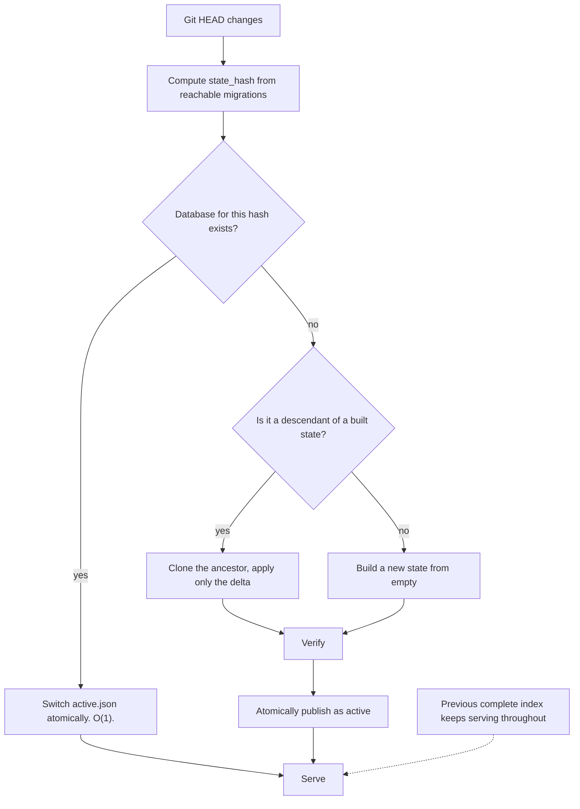

# ADR-0007: State-hash-partitioned databases for Git branches and worktrees

- Status: accepted
- Date: 2026-08-01
- Deciders: Theurian maintainers
- Requirements: FR-P5, FR-R7, NFR-4, NFR-5, NFR-6, §16 of the brief

## Context

Developers switch branches constantly, and knowledge differs per branch: a
feature branch adds a specification, a revert removes an ADR, a long-lived branch
has an entirely different approved state.

A single database would have to mutate on every checkout. That produces:

- a slow, destructive rebuild on every branch switch;
- a window during which search returns results from neither branch;
- worktrees of the same repository silently sharing and corrupting each other's state;
- non-reproducible agent tasks, because the knowledge base changed mid-task.

## Decision

**Content-address the entire canonical state, and keep one database per distinct
state.**

```text
state_hash = SHA256(
    sorted migration IDs
  + migration checksums
  + source content checksums
  + schema version
  + migration engine version
)
```

```text
.theurian/state/
├── theurian-state-a1b2c3.sqlite
├── theurian-state-d4e5f6.sqlite
└── active.json
```

Determinism rules — every one of these has been a real bug in similar systems:

- Inputs are sorted by ULID with a byte-wise comparison, never by locale collation.
- No absolute paths, no mtimes, no hostnames, no environment enter the hash.
- Content checksums are over raw bytes; no newline or encoding normalization.
- `schema version` and `migration engine version` are included so that an engine
  change invalidates cached state instead of silently reinterpreting it.

Branch-switch behaviour:



- While a new state builds, the previously published state answers every query
  (NFR-4). A partially built state is never reachable.
- `active.json` is replaced by write-to-temp + `os.replace`, which is atomic on
  POSIX.
- A caller may pin `snapshotId` — a state hash — so an agent task sees one
  unchanging knowledge base even if the developer switches branches mid-task
  (FR-R7).
- Each Git worktree resolves its own Project context. Worktrees of one repository
  never share a `.theurian/state/` directory.
- Garbage collection of unreferenced state databases is explicit
  (`theurian index gc`), never automatic. Automatic deletion of a state a pinned
  task still references is a data-loss bug.

## Consequences

### Positive

- Branch switching between previously visited states is instant.
- Search never goes dark and never returns a half-built index.
- `snapshotId` gives reproducible agent runs — the property that makes an agent's
  conclusions auditable after the fact.
- The hash is a cache key, an equality test, and a bug report identifier at once.

### Negative

- Disk usage grows with the number of distinct states visited. Mitigated by
  explicit GC, delta builds, and the fact that these are text-derived indexes.
- Delta application requires knowing whether one migration set is a superset of
  another. Straightforward with ULID sets, but it is real logic to get right.

### Neutral

- The same partitioning generalizes to a hosted service, where the key becomes
  (tenant, project, state hash).

## Alternatives considered

| Alternative | Why rejected |
| :-- | :-- |
| One database, rebuilt on checkout | Search goes dark on every branch switch; concurrent worktrees corrupt each other. |
| Branch-name-keyed databases | Branch names are not content. Rebase, amend, and force-push all silently invalidate the key. |
| Git commit SHA as the key | Overly sensitive — a code-only commit that touches no knowledge would invalidate a perfectly valid index. |
| Row-level branch tagging in one database | Every query needs a branch predicate; a missed predicate is a cross-branch data leak. |

## Compliance

- `tests/unit/test_state_hash.py::test_golden_vector_is_stable` and
  `test_hash_is_stable_across_processes` — the hash of a fixture set is a fixed,
  committed value, held across three interpreters under differing
  `PYTHONHASHSEED` values. `test_database_filename_is_derived_from_the_hash` and
  `test_two_distinct_states_get_distinct_filenames` hold the partitioning
  itself.

Still owed, with the milestone that will satisfy it:

- **Nothing asserts O(1) reuse across states.** This section claimed an
  integration test switching between three states and asserting reuse and
  correct content. No test switches states. The tests above hold that two states
  get two filenames, which is the mechanism; the property the ADR sells —
  switching back to a state you have already built costs nothing — is untested.
  Milestone 6, with the incremental-rebuild work.
- **Nothing asserts a query during an in-progress build sees the previous
  complete state.** This section claimed a test. There is none, and the claim is
  worse than untested: [ADR-0022](0022-index-lives-in-its-own-database.md)
  records under Still owed that "a search concurrent with a rebuild is not
  protected", and [ADR-0018](0018-single-writer-synchronous-in-m1.md) records
  that NFR-4 is not discharged. This bullet asserted as tested exactly what two
  other ADRs record as missing. It belongs with the blue/green work (Milestone
  6).

  > **Corrected on 2026-09-01
  > ([#140](https://github.com/theurian/theurian/issues/140) member 1): this
  > bullet's own claim survives and is now the *whole* residue, while the two
  > records it cites as agreeing with it no longer do.** Verified at `fe2925c`:
  > no test in the suite issues a query while a build is running, so nothing
  > still asserts the composite. What moved underneath it is the support —
  > [ADR-0024](0024-a-purge-is-a-build.md) points 6 and 7 shipped the blue/green
  > work, and ADR-0022's Still-owed opener and ADR-0018's NFR-4 bullet each now
  > carry a dated correction saying so. **What is left is a missing test rather
  > than a missing mechanism.** Every element the composite rests on is pinned: a
  > build writes to a `.building` name `theurian index gc` will not reap
  > (`test_a_build_is_written_under_a_name_gc_will_not_reclaim`,
  > `tests/integration/test_index_gc_cli.py`), a build over an existing index
  > file is refused (`test_building_over_an_existing_file_is_refused`,
  > `tests/integration/test_index_store.py`), publishing retains the build it
  > replaced (`test_publishing_a_build_no_longer_reclaims_the_one_it_replaced`),
  > and the pointer swap is a write-to-temp plus `os.replace`. So a query during
  > a build resolves the pointer to a file the build never opens — an argument
  > from pinned elements, which is not a measurement, and saying so is what this
  > bullet has been for since it was written.
  >
  > **The sweep behind "no test" is two-stage, because one key cannot answer
  > it** — the first form of it, `Thread|ThreadPool|ProcessPool|fork()`, could
  > not see `asyncio` at all and so could not see the one suite in the
  > repository that really runs things concurrently. Widened, and re-taken at
  > `1a37c86` because the count is a dated measurement and the first paste of it
  > reproduced under no run form. **Stage 1, whole and runnable:**
  >
  > ```sh
  > git grep -lP '\bThread\b|ThreadPool|ProcessPool|\bfork\(\)|\basyncio\b|run_in_executor|create_task|\bgather\b|\bexecutor\b|multiprocessing|\bPopen\b' -- packages/theurian-core/tests tests | wc -l
  > ```
  >
  > **29 files.** **`-P` is mandatory and the dialect is the whole point**:
  > POSIX ERE has no `\b`, so the same key under `git grep -lE` returns **3**
  > — `test_search_concurrency_cap.py`, `test_connection_claims.py` and
  > `tests/e2e/test_daemon_single_instance.py`, the three files whose matches
  > happen to need no boundary. A reader who runs it with `-E` gets an order of
  > magnitude too few and no error. The earlier paste of this bullet quoted 33
  > from a Python `re` run of the same alternation, wrapped it across lines so it
  > could not be pasted at all, and named no dialect; the number moved because
  > the tool did, which is exactly the failure the key is supposed to prevent.
  >
  > **Stage 2 — of those, the files that also drive an index build:**
  >
  > ```sh
  > git grep -lP '\bThread\b|ThreadPool|ProcessPool|\bfork\(\)|\basyncio\b|run_in_executor|create_task|\bgather\b|\bexecutor\b|multiprocessing|\bPopen\b' -- packages/theurian-core/tests tests | xargs git grep -lP 'IndexBuilder|index_build\b|index build' -- | wc -l
  > ```
  >
  > **15 files**, and that figure and the zero below were reproduced
  > independently by two reviewers. All fifteen were read. **Fourteen use
  > `asyncio.run` or `@pytest.mark.asyncio` to await a single MCP call
  > synchronously**, which interleaves nothing; the fifteenth,
  > `packages/theurian-core/tests/integration/test_search_concurrency_cap.py`,
  > is the one suite with real concurrency and it caps concurrent *searches*
  > against an already published build, running no build of its own. So the
  > index-side result is still **zero**, now against a key that can see the
  > asyncio forms.
  >
  > **The zero is a zero because the key works.** A synthetic test that starts
  > `IndexBuilder.build` on a `threading.Thread` and searches while it runs was
  > planted, swept, and found — stage 2 returned 16 with the plant present and 15
  > without it — then deleted. A sweep for an absence that has never been shown
  > to hit a known positive is not evidence.
  >
  > **Milestone 6 has passed, and the missing test is owned
  > by [#497](https://github.com/theurian/theurian/issues/497)** — whose
  > definition of done requires every record stating this gap to move in the same
  > pull request the test lands in, because each becomes false the moment it
  > exists. ADR-0024's Compliance section carries the reconciliation and names
  > this bullet as where the residue lives.
- **Nothing asserts two worktrees keep independent active states.** This section
  claimed a test; the string `worktree` does not appear anywhere under
  `tests/`. This is the case ADR-0016's amendment makes load-bearing — the state
  hash covers the working tree, so two worktrees of one repository at different
  commits must not share an active state — and it is the one with no coverage.
  Milestone 6.
