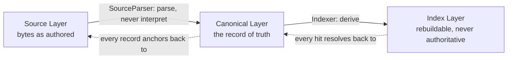

# ADR-0010: Source, Canonical, and Index are three distinct layers

- Status: accepted
- Date: 2026-08-01
- Deciders: Theurian maintainers
- Requirements: FR-S1, FR-S2, FR-S3, FR-T1, §13 of the brief

## Context

The tempting simplification is "convert everything to Markdown and search it".
It is wrong in three separate ways:

- **It destroys structure.** An OpenAPI document has typed parameters and response
  schemas. A specification has preconditions, rules, and outcomes. Flattening
  those to prose means `spec.getCoverage` can no longer ask "which outcomes have
  tests?" — the outcomes are gone.
- **It fabricates a record of truth.** A GitHub review thread rendered to Markdown
  is a *projection*. Treating it as canonical means the resolution state, the
  fix commit, and the thread structure exist only as prose an LLM must re-parse.
- **It conflates authority with convenience.** Once a generated Markdown file is
  treated as the source, someone edits it, and the edit is silently destroyed by
  the next regeneration.

## Decision

Three layers, with an explicit and non-negotiable authority rule.



**Source Layer** — the bytes as their author wrote them: Markdown, YAML, JSON,
JSON Schema, OpenAPI, AsyncAPI, Git commits and diffs, GitHub PRs, reviews, and
issues; later PDF, DOCX, PPTX, HTML, wikis, tickets, chat. Theurian reads, hashes,
and anchors this layer. It never rewrites it.

**Canonical Layer** — one internal model every source normalizes into:

```json
{
  "itemId": "architecture.auth-policy",
  "revisionId": "01K...",
  "projectId": "backend-service",
  "title": "Authentication and authorization policy",
  "body": "normalized body",
  "contentType": "text/markdown",
  "metadata": {},
  "relations": [],
  "sourceAnchors": []
}
```

Critically, normalization is *not* conversion. `contentType` is preserved, and a
structured source keeps its structured fields alongside a derived text projection
used for lexical search. A specification stays queryable as
`preconditions`/`rules`/`outcomes`; it also gains a text rendering, and both are
searchable (FR-T1).

**Index Layer** — chunks, FTS5 rows, embeddings, RAPTOR nodes, graph edges,
reranking features. Disposable by definition.

The authority rules:

1. Only the Canonical Layer may be cited as team knowledge.
2. The Index Layer is never a record of truth. Deleting it must lose nothing.
3. Source is never overwritten by Theurian.
4. Every canonical record carries at least one `SourceAnchor` — provider,
   repository, commit SHA, blob SHA, path, line range, URI, external ID — so
   every retrieval result reaches the original commit, file, and line (FR-R5).
5. Markdown is the *recommended authoring format for human prose knowledge*
   (ADRs, design rationale, runbooks, incident write-ups, rejected approaches,
   generalized review knowledge). It is not a required storage format, and it is
   never the canonical form of something that was born structured.
6. Body content and state metadata are separated (ADR-0005): Markdown holds the
   body, the migration YAML holds status, revision, ownership, and sensitivity.
   The same metadata is never duplicated in front matter and a migration — one of
   them would go stale, and there would be no rule for which one wins.
7. Generated Markdown views (`.theurian/generated/reviews/pr-431.md`) are
   derived artifacts, git-ignored, and never the only home for anything worth
   keeping.

## Consequences

### Positive

- Structured queries over specifications remain possible, which is what makes
  coverage and drift detection work at all.
- Review history stays queryable as structured evidence: thread state, resolution,
  fix commit, CI outcome.
- New formats are new parsers. The canonical model does not change.
- The provenance chain index → canonical → source is complete and testable.

### Negative

- Three models to maintain and map between, rather than one.
- Parsers must preserve structure faithfully, which is more work than extracting
  text.

### Neutral

- The layering matches how the storage is partitioned: Source in Git and external
  systems, Canonical in the store, Index in derived state.

## Alternatives considered

| Alternative | Why rejected |
| :-- | :-- |
| Markdown as the single canonical format | Destroys structure; makes generated views editable-but-overwritten; the failure this ADR exists to prevent. |
| Store only the source and parse at query time | Query latency becomes parse latency; no stable revision identity; no cross-source relations. |
| Skip the canonical layer; index sources directly | Every retrieval feature would need per-format handling, and provenance would be per-format too. |
| Two layers (source + index) | The index is disposable; without a canonical layer, deleting it loses approvals and relations. |

## Compliance

- `tests/integration/test_ingestion.py::test_every_supported_format_is_ingested`
  and `test_structured_documents_gain_a_projection` — parse → canonical, with
  structured fields kept rather than flattened to text.
- `tests/integration/test_ingestion.py::test_every_document_carries_an_anchor`
  and `tests/unit/test_domain_invariants.py::test_revision_authored_in_theurian_needs_no_anchor`
  — INV-8, both branches.
- `tests/unit/test_project_and_traceability.py::test_gitignore_block_covers_every_derived_location`
  — every derived location, `.theurian/generated/` included, is covered by the
  block `theurian init` writes.

Still owed, with the milestone that will satisfy it:

- **Nothing asserts a key cannot appear in both front matter and a migration for
  one revision.** This section claimed a test. What exists is one direction of
  it: `tests/integration/test_ingestion.py::test_warnings_reach_the_report` and
  `tests/integration/test_cli_commands.py::test_ingest_reports_a_governed_front_matter_key`
  raise `front-matter-governed-field` when front matter carries a governed key,
  which is ADR-0019's rule that front matter is data rather than governance.
  Collision on a *non-governed* key — where both sources set it and one silently
  wins — is unchecked, and the ADR does not say which should. Milestone 6, and
  it needs the precedence decision before it can have a test.
