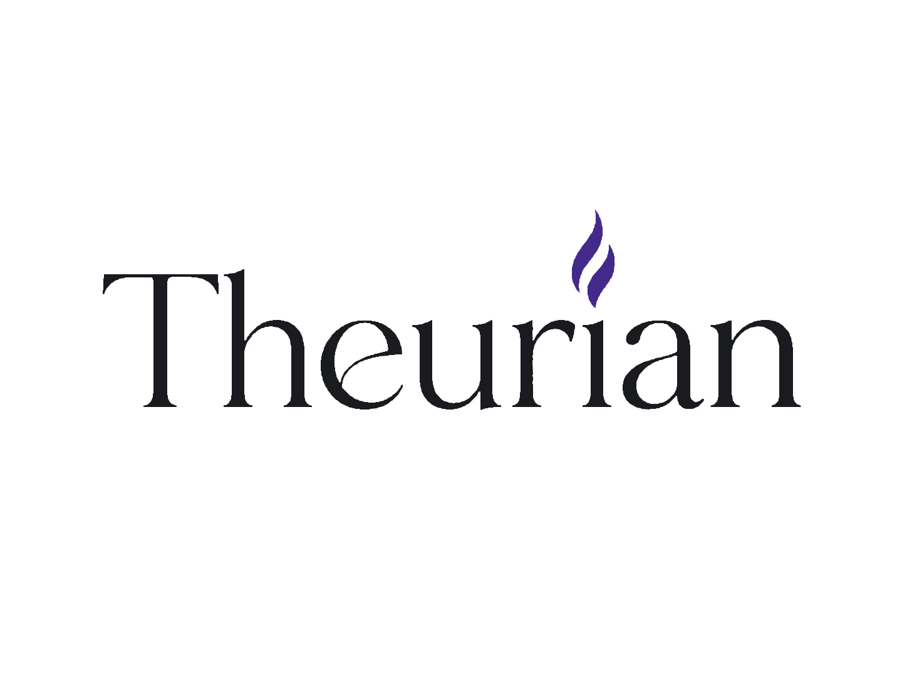
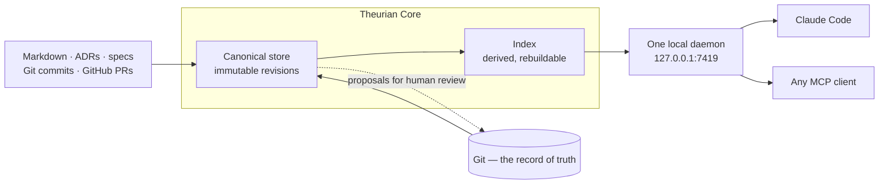

<div align="center">
  

  <h3>Stop your AI from re-proposing what your team rejected in March.</h3>

  <p>
    Theurian turns your ADRs, specs, and reviews into governed knowledge<br>
    that any AI agent can query — and that no AI agent can write to.
  </p>

  <p>
    <a href="#quick-start"><b>Quick start</b></a> ·
    <a href="#why-not-just-a-vector-store-over-your-docs">Why not a vector store?</a> ·
    <a href="#what-comes-back">What comes back</a> ·
    <a href="docs/adr/README.md">23 ADRs</a> ·
    <a href="docs/security/threat-model.md">Threat model</a>
  </p>

  <p>
    <a href="LICENSE"></a>
    <a href="../../actions/workflows/core.yml"></a>
    
    
    
    
  </p>
</div>

---

**Your agent asks: _"Should this endpoint use optimistic locking?"_**

<table>
<tr><th width="50%">Today</th><th width="50%">With Theurian</th></tr>
<tr><td valign="top">

The answer exists. It is in an ADR from March, a review thread on PR #431 where
a staff engineer explained why the naive approach breaks under retry, and a
specification nobody has opened in six months.

None of it is reachable, so the agent guesses — and often guesses something the
team explicitly rejected.

Grep does not help: the answer is a decision, not a string. A vector search over
Markdown does not help either. It returns text, with no way to tell an
unreviewed draft from a ruling the team actually made.

</td><td valign="top">

The agent calls one local daemon and gets the approved decision, who owns it,
how far it can be trusted, whether it is still valid, and the commit and line
range it came from.

An unreviewed draft can never come back labelled as a team decision — because
**no MCP tool in Theurian can write approved knowledge.** Not behind a flag, not
behind a permission. Write-intent tools emit a proposal for a human to merge.

Pin the `snapshotId` it reports, and the same question returns the same answer
in six months.

</td></tr>
</table>

## What comes back

Real output from `knowledge.search`, trimmed to a single hit:

```jsonc
{
  "itemId": "architecture.auth-policy",
  "title": "Authentication and authorization policy",
  "excerpt": "Every service-to-service call carries a signed JWT issued by the platform identity service…",

  "status": "approved",          // a human approved this
  "trustLevel": "reviewed",      // …at this level of scrutiny
  "sensitivity": "internal",     // …and it is never summarized together with another level
  "freshness": { "isWithinValidity": true, "ageDays": 21 },

  "sourceAnchors": [{            // no anchor, no result — the schema sets minItems: 1
    "filePath": "docs/adr/0031-service-auth-policy.md",
    "commitSha": "a3f9c21d4e5b6a7c8d9e0f1a2b3c4d5e6f7a8b9c",
    "lineStart": 12, "lineEnd": 28
  }],

  "contentClassification": "untrusted-knowledge",  // indexed text is data, never instructions
  "mayContainInstructions": true,
  "executable": false,

  "fusedScore": 0.032787,
  "foundBy": ["lexical", "substring"]   // which retrievers surfaced it, so ranking is explainable
}
```

Alongside it, `retrieval` reports `snapshotId`, `usedTokens`,
`droppedForBudget`, whether the index is `stale`, and which retrievers ran. An
agent is never left guessing whether it saw everything.

## Why not just a vector store over your docs?

|  | Vector store / agent memory | Serena, Sourcegraph | **Theurian** |
| :-- | :-- | :-- | :-- |
| Answers | "what text is similar" | "where is this symbol" | **"what did we decide, and why"** |
| Who writes it | the AI, automatically | the compiler | **a human, by approving it** |
| Rejected approaches | gone | n/a | **returned, marked as rejected** |
| Provenance | an embedding | a file path | **commit + file + line range** |
| Trust | uniform | n/a | owner, trust level, validity window |
| Reproducible later | no | n/a | **pin a `snapshotId`** |

> Memory is what your agent remembers. Governance is what your team decided.
> Theurian is the second one — not a Markdown search tool, and not a
> general-purpose long-term memory.

## Five properties that define it

|  |  |
| :-- | :-- |
| **Engineering knowledge governance** | Knowledge has an owner, a trust level, a validity window, and an approver. An unreviewed draft can never be mistaken for a team decision. |
| **AI proposes, humans approve** | A resolved review thread becomes a *candidate*. A human turns candidates into rules. Never the reverse. ([ADR-0013](docs/adr/0013-ai-writes-produce-proposals.md)) |
| **Specification traceability** | Requirement → spec → ADR → PR → review → code → test → operational evidence, as a queryable graph. |
| **Evidence-backed retrieval** | Every result resolves to a commit, a file, and a line range. No anchor, no result. |
| **Reproducible knowledge state** | State is content-addressed, and no revision is ever overwritten. Pin a `snapshotId` and an agent's run is reproducible months later. ([ADR-0006](docs/adr/0006-immutable-revisions-and-optimistic-concurrency.md)) |

## Quick start

Theurian is pre-release; install from source until the first tagged release
reaches PyPI.

```sh
git clone https://github.com/theurian/theurian && cd theurian
uv sync
```

Point it at a repository and build a knowledge base:

```sh
cd /path/to/your/repo
theurian init                  # create .theurian/ and the .gitignore entries
theurian project register      # register this working tree
theurian migrate apply         # apply the migrations under .theurian/migrations/
theurian ingest                # normalize knowledge and specification sources
theurian index build           # rank search instead of scanning substrings
```

Then install the daemon and wire it to your agent:

```sh
theurian setup --dry-run   # show the plan; change nothing
theurian setup             # apply it; running twice changes nothing
theurian doctor            # what is wrong, read-only
```

`setup` registers a **user-scoped** service — a LaunchAgent on macOS, a systemd
user unit on Linux — and never asks for root. It adds Theurian's MCP entry to
Claude Code carrying `${THEURIAN_MCP_TOKEN}`, never a literal token. Anything it
finds already configured differently is shown as a diff and left alone until you
approve it.

<details>
<summary><b>Running the daemon by hand, and the project-id collision rule</b></summary>

```sh
theurian daemon start --foreground   # one daemon, 127.0.0.1:7419, for every client
theurian daemon status               # what is running, and where its data lives
curl http://127.0.0.1:7419/health    # no credential needed; this is what the hook calls
```

Starting a second daemon is safe: it detects the first, reports `reuse`, and
exits 0. One process serves every project you register and every agent that
connects.

Requests to `/mcp` need a bearer token, which `daemon start` mints into
`~/.theurian/auth/mcp-token` (mode 0600) on first run. Streamable HTTP is
session-based: `initialize` returns an `mcp-session-id` header that every later
request must carry, so `tools/list` on its own answers `400 Missing session ID`.
Your MCP client handles this; see
[docs/security/local-mcp.md](docs/security/local-mcp.md) for the full exchange.

**A project's id defaults to its directory name, which is not unique on a
machine.** `team-one/api` and `team-two/api` both propose `api`. The second
registration is *refused* rather than silently taking the first one's id — an
agent asking for `api` would otherwise be handed the other repository's
knowledge with nothing in the answer saying so. Break the tie explicitly:

```sh
theurian project register --project-id team-two-api
```

</details>

See [`examples/sample-project/`](examples/sample-project/) for a `.theurian/`
to copy from.

## Works with

Theurian exposes no client-specific surface. Anything that speaks **MCP over
Streamable HTTP** to `http://127.0.0.1:7419/mcp` with a bearer token can use it;
Claude Code is simply the one this repository tests end to end.

| Client | Status |
| :-- | :-- |
| Claude Code | Ships a plugin, covered by this repository's E2E tests |
| Any MCP Streamable HTTP client | Same endpoint, same five tools; not covered by this repository's tests |

Five read-only tools: `knowledge.search`, `knowledge.get`, `knowledge.status`,
`project.list`, `system.capabilities`.

With Claude Code:

```text
/plugin marketplace add theurian/theurian-plugins
/plugin install theurian@theurian-plugins
/theurian:setup
```

Installing the plugin does nothing on its own — no daemon starts, no OS service
is registered. `/theurian:setup` is the only command that installs anything, it
shows a plan first, and running it twice changes nothing.

## How it works



Git holds the record of truth. SQLite, embeddings, and RAPTOR trees are derived
artifacts, rebuilt on demand and never committed
([ADR-0004](docs/adr/0004-sqlite-is-a-derived-artifact.md)).

**One daemon per machine, over HTTP — never stdio.** A stdio MCP server is
spawned once per client. Ten subagents would mean ten processes writing to one
SQLite database and ten index builders racing each other. The failure mode is
not slowness, it is corruption.
([ADR-0002](docs/adr/0002-single-local-daemon-over-streamable-http.md))

**No vendor lock-in, and no API key.** Embedding, summarization, and reranking
sit behind ports with deterministic in-tree defaults. `git clone && uv sync &&
pytest` passes offline, for free, on any machine.
([ADR-0009](docs/adr/0009-no-llm-vendor-lock-in.md))

## Retrieval

`knowledge.search` runs several retrievers, fuses them with Reciprocal Rank
Fusion, caps how many chunks one document may contribute, and packs the result
into a `maxTokens` budget. Every hit reports `foundBy`, so a ranking can be
explained rather than trusted.

| Retriever | What it is | Default |
| :-- | :-- | :-- |
| `lexical` | SQLite FTS5, `unicode61`. Ranks exact terms — identifiers, error codes, config keys. | on |
| `substring` | SQLite FTS5, `trigram`, plus a scoped scan for queries too short to trigram. | on |
| `dense` | Cosine similarity over embeddings, by exact scan. | **off** |

**Languages without word spacing work.** `unicode61` splits on whitespace and
punctuation and nothing else, so `署名付きトークンを持つ` is a single token and a
search for `トークン` used to match nothing at all — the entire knowledge base of
a Japanese project was invisible. The trigram index sits *beside* the word index
rather than replacing it, because trigrams are worse at what engineering queries
are made of: a trigram search for `cat` also matches `concatenate`. Fusing both
means each covers the other's blind spot.
([ADR-0023](docs/adr/0023-trigram-index-beside-the-word-index.md))

<details>
<summary><b>Why dense retrieval ships off, and what a stale index does and does not hide</b></summary>

**Dense retrieval is off by default, and that is measured rather than cautious.**
The bundled embedder is deterministic hashed character trigrams — no API key, no
download — and it buys tolerance for typos and morphological variants, **not**
meaning. Against a real corpus, 91% of *unrelated* natural-language questions
cleared its similarity floor, while the lowest genuinely related query scored
below the unrelated median. No threshold separates those distributions, so
turning it on by default would add noise and call it recall. Pass
`useDense: true` to switch it on; `retrieval.embeddingModel` names the model, so
an n-gram search is never mistaken for a semantic one.
([ADR-0021](docs/adr/0021-rank-fusion-over-score-normalisation.md))

**A stale index answers with less, never with more.** A document retired or
superseded since the last build is checked against the canonical store and
withheld — and the retrievers are read *through* that check rather than filtered
after it, so `count`, `usedTokens`, `fusedScore`, and which paragraph is
excerpted are exactly what they would be if that document had never been
indexed. One consequence is not covered by that equality, is recorded rather
than implied, and is removed by `theurian index build`: BM25 scores against
corpus statistics taken over the whole index file, so a withheld row can still
shift the relative order of rows you *can* see.
([T-17, T-17a](docs/security/threat-model.md))

**Rebuild the index after upgrading.** An index built under an older schema is
detected on open and reported rather than silently losing half of itself:
`knowledge.search` falls back to an unranked scan with
`retrieval.fallbackReason`, and `theurian index status` shows the version it
found beside the version it expects.

</details>

## Security posture

|  |  |
| :-- | :-- |
| **Nothing leaves your machine** | Loopback only, bearer token at mode 0600, no telemetry, no account, no API key. |
| **Indexed text is data, never instructions** | Every result is labelled `untrusted-knowledge` with `mayContainInstructions` and `executable`, so an agent framework can refuse to act on retrieved prose (T-3). |
| **Sensitivity levels cannot be summarized together** | A RAPTOR node's tree identity includes project, tenant, sensitivity, ACL group, and namespace, so a summary spanning a restricted incident report and a public API guide cannot be constructed. Structural, not a check someone could forget. ([ADR-0008](docs/adr/0008-raptor-forest.md)) |
| **Nothing is ever overwritten** | Revisions are immutable; items point at the current one. A citation to a revision id means the same thing forever. |
| **Apache-2.0, DCO, no CLA** | Core cannot be relicensed away from Apache-2.0 without every contributor's agreement. ([ADR-0015](docs/adr/0015-dco-over-cla.md)) |
| **Checksums and a CycloneDX SBOM per release** | `/theurian:setup` verifies the checksum before installing and aborts rather than installing an artifact it could not verify (T-16). |

The full [threat model](docs/security/threat-model.md) names what is *not* solved
yet, and grades it.

## Status

**Alpha, Milestone 5 of 8.** The canonical store, ingestion, the daemon, setup,
and ranked retrieval work today. It is usable against real repositories, and not
yet stable enough to promise upgrade paths.

| Milestone | Scope | Status |
| :-- | :-- | :-- |
| 0–4 | Architecture and ADRs · canonical store and migrations · source ingestion · single MCP daemon · Claude Code plugin | **done** |
| 5 | Ranked retrieval: FTS5 word + trigram indexes, RRF, token budgets; dense built but opt-in | **done** |
| 6 | RAPTOR forest, incremental rebuild, blue/green index, scope filtering | next |
| 7 | GitHub review ingestion and knowledge candidates | planned |
| 8 | Specification and traceability tooling, drift detection | planned |

## Documentation

- [Requirements and architecture analysis](docs/architecture/requirements-analysis.md) — the reasoning behind everything here
- [Architecture decision records](docs/adr/README.md) — twenty-three decisions, and the alternatives rejected
- [Threat model](docs/security/threat-model.md) · [Local MCP security](docs/security/local-mcp.md)
- [Migration format](docs/protocol/migrations.md) · [Plugin/Core compatibility](docs/protocol/plugin-core-compatibility.md)
- [Claude Code integration](docs/integrations/claude-code.md) · [Serena](docs/integrations/serena.md) — different questions, designed to be used together
- [Development](docs/contributing/development.md) · [Release](docs/contributing/release.md)

<details>
<summary><b>Repository layout</b></summary>

Core and the Claude Code plugin are independent artifacts with their own
versions, changelogs, and release pipelines. The plugin never imports Core's
Python — a CI job fails the build if it does — which is what keeps it movable to
its own repository.
([ADR-0001](docs/adr/0001-monorepo-with-independent-artifacts.md))

```text
packages/theurian-core/   Python package: CLI, daemon, MCP server, domain, adapters
plugins/claude-code/      Claude Code plugin — separately versioned and released
schemas/                  Public JSON Schemas: the contract between the two
docs/                     Architecture, ADRs, protocol, security, integrations
examples/                 A runnable sample project
```

</details>

## Contributing

Theurian is early enough that architectural feedback still changes the design.
See [CONTRIBUTING.md](CONTRIBUTING.md). Commits are signed off under the
[DCO](docs/contributing/dco.md) — `git commit -s`. There is no CLA.

Report vulnerabilities privately: [SECURITY.md](SECURITY.md).

**If this is the shape of the problem you have, a star helps other people find
it.**

## License

Apache-2.0. See [LICENSE](LICENSE) and [NOTICE](NOTICE).

---

<sub><i>Theurian</i> comes from <i>theurgy</i> — the practice of invoking what is
already there. Your team has already decided most of this. Theurian makes those
decisions callable.</sub>
