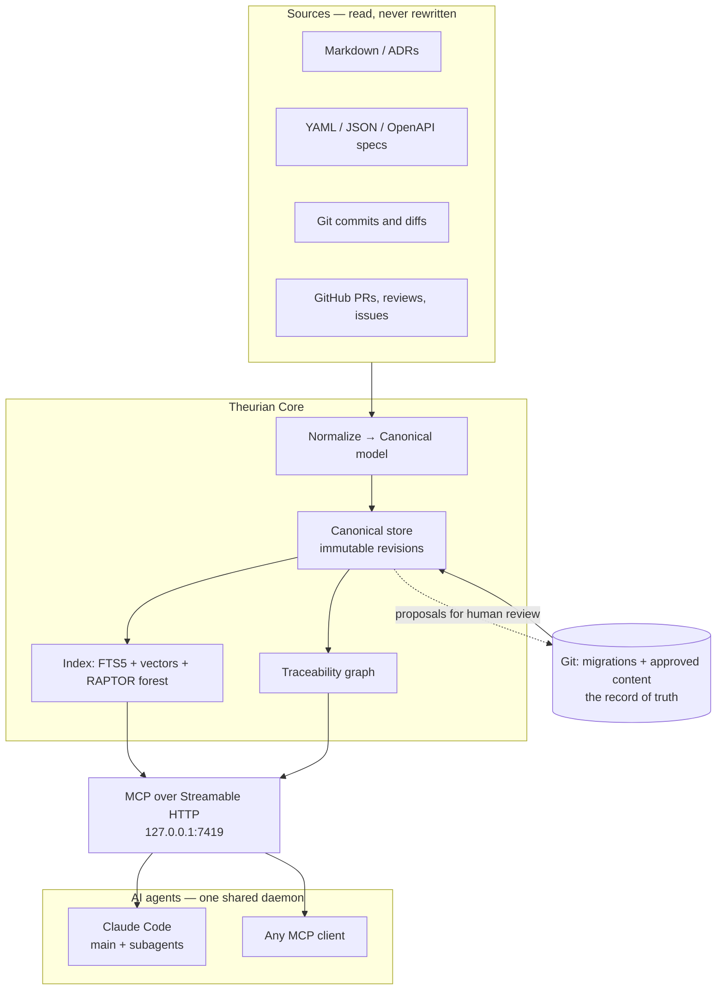

<div align="center">
  

  <h1>Theurian</h1>

  <strong>Invoke your engineering knowledge.</strong>

  <p>Traceable engineering knowledge for AI agents.</p>

  <p>
    <a href="LICENSE"></a>
    
    
  </p>
</div>

---

Theurian is a Git-native engineering knowledge platform that turns
specifications, architecture decisions, pull-request reviews, tests, and
operational knowledge into versioned, traceable context for AI agents.

The name comes from *theurgy* — the practice of invoking what is already there.
Your team has already decided most of this. Theurian makes those decisions
callable.

> **Status: Milestone 5.** The canonical store works, sources are ingested, a
> single local MCP daemon serves that knowledge over authenticated loopback
> HTTP, `theurian setup` installs the whole thing idempotently, and search is
> ranked retrieval — two lexical indexes fused with RRF, diversified, and packed
> to a token budget. Japanese, Chinese, and Thai knowledge is searchable, which
> needed a trigram index to work at all. Dense retrieval is built and
> **off by default**, for a measured reason given [below](#retrieval). See the
> [roadmap](#roadmap).

---

## The problem

An agent asks: *"Should this endpoint use optimistic locking?"*

The answer exists. It is in an ADR from March, a review thread on PR #431 where
a staff engineer explained why the naive approach breaks under retry, and a
specification nobody has opened in six months. None of it is reachable, so the
agent guesses — and often guesses something the team explicitly rejected.

Grep does not help: the answer is a decision, not a string. A vector search over
Markdown does not help either: it returns text with no indication of whether the
decision is current, who approved it, or what it superseded.

## What Theurian does differently

It is not a Markdown search tool and not a general-purpose long-term memory.
Five properties define it:

| | |
| :-- | :-- |
| **Engineering knowledge governance** | Knowledge has an owner, a trust level, a validity window, and an approver. An unreviewed draft can never be mistaken for a team decision. |
| **Review-to-knowledge promotion** | A resolved review thread becomes a *candidate*. A human turns candidates into rules. Never the reverse. |
| **Specification traceability** | Requirement → spec → ADR → PR → review → code → test → operational evidence, as a queryable graph. |
| **Evidence-backed retrieval** | Every result resolves to a commit, a file, and a line range. No anchor, no result. |
| **Reproducible knowledge state** | State is content-addressed. Pin a `snapshotId` and an agent's run is reproducible months later. |

## How it works



Git holds the record of truth. SQLite, embeddings, and RAPTOR trees are derived
artifacts, rebuilt on demand and never committed.

## Design decisions worth knowing up front

**One daemon per machine, over HTTP — never stdio.** A stdio MCP server is
spawned once per client. Ten subagents would mean ten processes writing to one
SQLite database and ten index builders racing each other. The failure mode is not
slowness, it is corruption. Every agent connects to `http://127.0.0.1:7419/mcp`.
([ADR-0002](docs/adr/0002-single-local-daemon-over-streamable-http.md))

**AI proposes; humans approve.** No MCP tool can write approved knowledge — not
behind a flag, not behind a permission. Write-intent tools emit a proposal that a
person reviews and merges. Approved knowledge is what an agent will cite tomorrow
as a team decision, so a human has to have said yes.
([ADR-0013](docs/adr/0013-ai-writes-produce-proposals.md))

**No knowledge is ever overwritten.** Revisions are immutable; items point at the
current one. A citation to a revision id means the same thing forever.
([ADR-0006](docs/adr/0006-immutable-revisions-and-optimistic-concurrency.md))

**Summaries never mix sensitivity levels.** A RAPTOR node's tree identity
includes project, tenant, sensitivity, ACL group, and namespace, so a summary
spanning a restricted incident report and a public API guide cannot be
constructed. This is structural, not a check someone could forget.
([ADR-0008](docs/adr/0008-raptor-forest.md))

**No vendor lock-in, and no API key required.** Embedding, summarization, and
reranking sit behind ports with deterministic in-tree defaults. `git clone && uv
sync && pytest` passes offline, for free, on any machine.
([ADR-0009](docs/adr/0009-no-llm-vendor-lock-in.md))

## Quick start

```sh
git clone https://github.com/theurian/theurian
cd theurian
uv sync
uv run pytest
```

Build a knowledge base from a repository:

```sh
cd /path/to/your/repo
theurian init                  # create .theurian/ and the .gitignore entries
theurian project register      # register this working tree
# author a migration under .theurian/migrations/, then:
theurian migrate validate
theurian migrate apply
theurian ingest                # normalize knowledge and specification sources
theurian project status
```

A project's id defaults to its directory name, which is not unique on a machine:
`team-one/api` and `team-two/api` both propose `api`. The second registration is
**refused** rather than silently taking the id from the first — an agent asking
for `api` would otherwise be handed the other repository's knowledge with nothing
in the answer saying so. Break the tie explicitly:

```sh
theurian project register --project-id team-two-api
```

Or let setup do all of it:

```sh
theurian setup --dry-run   # show the plan; change nothing
theurian setup             # apply it; running twice changes nothing
theurian doctor            # what is wrong, read-only
```

`setup` registers a **user-scoped** service — a LaunchAgent on macOS, a systemd
user unit on Linux — and never asks for root. It adds Theurian's MCP entry to
Claude Code at user scope carrying `${THEURIAN_MCP_TOKEN}`, never a literal
token. Anything it finds already configured differently is shown as a diff and
left alone until you approve it.

To run the daemon by hand instead:

```sh
theurian daemon start --foreground   # one daemon, 127.0.0.1:7419, for every client
theurian daemon status               # what is running, and where its data lives
```

The daemon exposes five read-only MCP tools at `http://127.0.0.1:7419/mcp`:
`knowledge.search`, `knowledge.get`, `knowledge.status`, `project.list`, and
`system.capabilities`. Requests need a bearer token, which `daemon start` mints
into `~/.theurian/auth/mcp-token` (mode 0600) on first run:

```sh
curl http://127.0.0.1:7419/health     # no credential needed; this is what the hook calls

curl -H "Authorization: Bearer $(cat ~/.theurian/auth/mcp-token)" \
     -H 'Content-Type: application/json' \
     -H 'Accept: application/json, text/event-stream' \
     -d '{"jsonrpc":"2.0","id":1,"method":"initialize",
          "params":{"protocolVersion":"2025-06-18","capabilities":{},
                    "clientInfo":{"name":"curl","version":"1"}}}' \
     http://127.0.0.1:7419/mcp
```

Streamable HTTP is session-based: `initialize` returns an `mcp-session-id`
header that every later request must carry, so `tools/list` on its own answers
`400 Missing session ID`. In practice your MCP client handles this — the curl
above is a check that the endpoint is up and your token works, not a way to
drive the daemon by hand.

Starting a second daemon is safe: it detects the first, reports `reuse`, and
exits 0. One process serves every project you register and every agent that
connects.

Underneath it all is the part everything depends on: a canonical store
reproducible from Git that refuses to let an applied migration change and
reports conflicting edits instead of merging them, served to agents with
provenance and trust labels attached to every result.

See [`examples/sample-project/`](examples/sample-project/) for a complete
`.theurian/` to copy from.

With Claude Code:

```text
/plugin marketplace add theurian/theurian-plugins
/plugin install theurian@theurian-plugins
/theurian:setup
```

Installing the plugin does nothing on its own — no daemon starts, no OS service
is registered. `/theurian:setup` is the only command that installs anything, it
shows a plan first, and running it twice changes nothing.

## Retrieval

Build a retrieval index so search is ranked rather than a substring scan:

```sh
theurian index build    # written to its own file, separate from canonical state
theurian index status   # is the index still current with your knowledge?
```

`knowledge.search` runs several retrievers and fuses them with Reciprocal Rank
Fusion, caps how many chunks any one document may contribute, and packs results
into a `maxTokens` budget. Every hit reports `foundBy` — which retrievers
surfaced it — so a ranking can be explained rather than just trusted.

| Retriever | What it is | Default |
| :-- | :-- | :-- |
| `lexical` | SQLite FTS5, `unicode61` tokenizer. Ranks exact terms — identifiers, error codes, config keys. | on |
| `substring` | SQLite FTS5, `trigram` tokenizer, plus a scoped scan for queries too short to form a trigram. Matches inside words, which is the only way a script without word spacing is searchable. | on |
| `dense` | Cosine similarity over embeddings, by exact scan. | **off** |

**Languages without word spacing work.** `unicode61` splits on whitespace and
punctuation and nothing else, so `署名付きトークンを持つ` is a single token and a
search for `トークン` used to match nothing at all — the entire knowledge base of
a Japanese project was invisible. The trigram index sits beside the word index
rather than replacing it, because trigrams are worse at exactly what engineering
queries are made of: a trigram search for `cat` also matches `concatenate`.
Fusing both means each covers the other's blind spot.

A trigram index has no gram for a term shorter than three characters, which
would leave out 認証, 決済 and 監査 — two characters is the most common noun
length in Japanese. A query whose terms are *all* that short is answered by a
scoped scan over the same rows instead, ranked by how much of the query each
chunk accounts for. Three things it is not: a query mixing a short term with a
long one still searches only for the long one on this retriever; a query that is
a single punctuation character is declined rather than answered; and a query with
more than eight short terms searches only the first eight it was given, because
each term costs a pass over every row and a search that takes seconds is one
every other project sharing the daemon waits for.
([ADR-0023](docs/adr/0023-trigram-index-beside-the-word-index.md))

**Dense retrieval is off by default, and that is measured rather than cautious.**
The bundled embedder is deterministic hashed character trigrams — no API key, no
download — and it buys tolerance for morphological variants and typos, **not**
meaning. Tested against a real corpus, 91% of *unrelated* natural-language
questions cleared its similarity floor, while the lowest genuinely related query
scored below the unrelated median. There is no threshold that separates those
distributions, so turning it on by default would add noise and call it recall.

Pass `useDense: true` to switch it on anyway; the code path is kept and tested
so that configuring a real model through the `EmbeddingProvider` port is a
configuration change and not a first run of untested code. `retrieval.mode` says
which retrievers actually ran and `retrieval.embeddingModel` names the model, so
an n-gram-backed search is never mistaken for a semantic one.
([ADR-0021](docs/adr/0021-rank-fusion-over-score-normalisation.md))

**Rebuild the index after upgrading.** The trigram index made the index schema
version 2. An index built under version 1 is detected on open and reported
rather than silently losing its trigram half: `knowledge.search` falls back to
an unranked scan with `retrieval.fallbackReason: "index-schema-mismatch"`, and
`theurian index status` shows the version it found beside the version it
expects. `theurian index build` is the whole remedy; the index is derived, so
nothing is lost.

**An index older than your knowledge answers with less, never with more, and
does not say what it left out.** A document retired or superseded since the last
build is checked against the canonical store and withheld — and the retrievers
are read *through* that check rather than filtered after it, so `count`,
`usedTokens`, `fusedScore` and which paragraph is excerpted are all exactly what
they would be if that document had never been indexed. That equality is the
point: anything that moved when a query happened to match withheld text would
spell it out one character at a time, since the substring retriever matches any
three characters. `retrieval.stale` tells you the index is behind, which is a
fact about the index and not about your query.
([T-17](docs/security/threat-model.md))

**One thing that equality does not cover, and it is not fixed in this
milestone.** BM25 scores a row against corpus statistics taken over the whole
index file, and while the index is stale the withheld rows are still in that file
being counted. So a withheld document can change the *relative* order of two
documents you can see, which reaches `fusedScore`, the hit order and which
paragraph is excerpted. Two different things move, and they are not the same
size:

- **The order you get moves for any withheld content, whatever it says.** One of
  those statistics is the average document length, so a withheld document that
  shares not one word with your query still changes each visible row's score, by
  a different amount for each. Measured against SQLite FTS5, not argued.
- **Reading content back out of the ranking is narrower.** That needs a term
  which also occurs in content you *can* read, so it can confirm whether a
  withheld document contains a term already in your vocabulary and cannot spell
  out one that is not.

`theurian index build` removes both, along with every other consequence of a
stale index; eliminating the stale window itself is Milestone 6's blue/green
builds. **If your ranking must not depend on retired content at all, rebuild the
index as part of retiring it rather than on a schedule.** Accepted deliberately,
with the argument and the measurements recorded.
([T-17a](docs/security/threat-model.md))

## Theurian and Serena

They answer different questions and are designed to be used together. Theurian
never calls Serena, and Serena never calls Theurian.

| Question | Tool |
| :-- | :-- |
| What did we decide about auth, and why? | **Theurian** |
| Was this approach rejected before? | **Theurian** |
| Which tests verify this specification? | **Theurian** |
| Where is `validateOrder` defined? | **Serena** |
| Who calls this function? | **Serena** |

A workflow using both: `spec.get` → `knowledge.search` → `review.findSimilar` →
Serena symbol search → Serena reference search → implement → `trace.findTests` →
`spec.getCoverage`.

Details: [docs/integrations/serena.md](docs/integrations/serena.md).

## Repository layout

```text
packages/theurian-core/   Python package: CLI, daemon, MCP server, domain, adapters
plugins/claude-code/      Claude Code plugin — separately versioned and released
schemas/                  Public JSON Schemas: the contract between the two
tests/                    Cross-artifact contract and E2E tests
docs/                     Architecture, ADRs, protocol, security, integrations
examples/                 A runnable sample project
packaging/                macOS, Linux, and Windows packaging
```

Core and the plugin are independent artifacts with their own versions,
changelogs, and release pipelines. The plugin never imports Core's Python — a CI
job fails the build if it does — which is what keeps it movable to its own
repository. ([ADR-0001](docs/adr/0001-monorepo-with-independent-artifacts.md))

## Roadmap

| Milestone | Scope | Status |
| :-- | :-- | :-- |
| 0 | Architecture, ADRs, domain model, ports, schemas, plugin skeleton, CI | **done** |
| 1 | Local canonical store, YAML migrations, state hashing, project CLI | **done** |
| 2 | Source ingestion: Markdown, YAML, JSON, OpenAPI | **done** |
| 3 | Single MCP daemon: Streamable HTTP, auth, multi-project | **done** |
| 4 | Claude Code plugin: setup, doctor, service adapters | **done** |
| 5 | Ranked retrieval: FTS5 word + trigram indexes, RRF, token budgets; dense built but opt-in | **done** |
| 6 | RAPTOR forest, incremental rebuild, blue/green index, scope filtering | next |
| 7 | GitHub review ingestion and knowledge candidates | planned |
| 8 | Specification and traceability tooling, drift detection | planned |

## Documentation

- [Requirements and architecture analysis](docs/architecture/requirements-analysis.md) — the reasoning behind everything here
- [Architecture decision records](docs/adr/README.md) — twenty-three decisions and the alternatives rejected
- [Threat model](docs/security/threat-model.md)
- [Local MCP security](docs/security/local-mcp.md)
- [Migration format](docs/protocol/migrations.md)
- [Plugin/Core compatibility](docs/protocol/plugin-core-compatibility.md)
- [Claude Code integration](docs/integrations/claude-code.md) · [Serena](docs/integrations/serena.md)
- [Development](docs/contributing/development.md) · [Release](docs/contributing/release.md)

## Contributing

See [CONTRIBUTING.md](CONTRIBUTING.md). Commits are signed off under the
[DCO](docs/contributing/dco.md) — `git commit -s`. There is no CLA, which means
Core cannot be relicensed away from Apache-2.0 without every contributor's
agreement. ([ADR-0015](docs/adr/0015-dco-over-cla.md))

## Security

Please report vulnerabilities privately. See [SECURITY.md](SECURITY.md).

## License

Apache-2.0. See [LICENSE](LICENSE) and [NOTICE](NOTICE).
