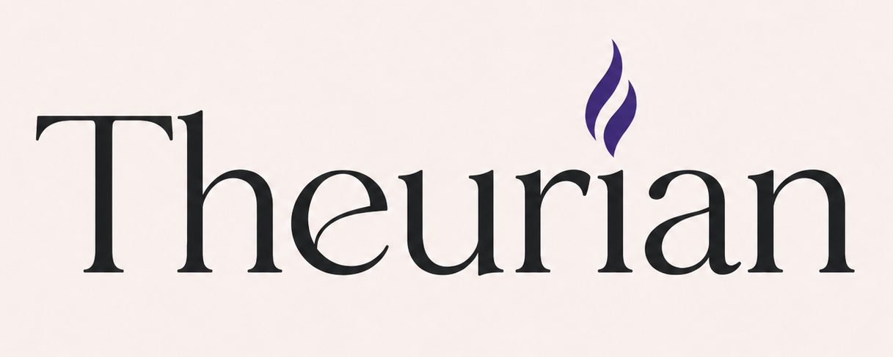
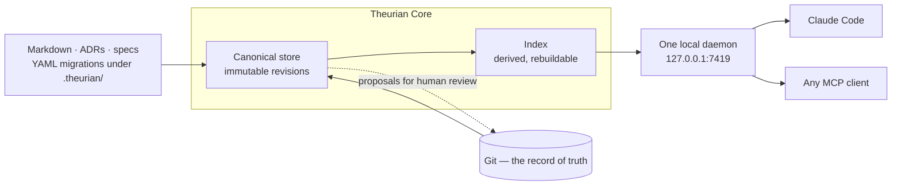

<div align="center">
  

  <h1>Theurian — the engineering record your AI agents consult</h1>

  <h3>Stop your AI from re-proposing what your team rejected in March.</h3>

  <p>
    Decisions, rejected alternatives, constraints — and the evidence behind them —<br>
    under human governance, reachable by any MCP client.<br>
    <b>Agents read. Agents propose. Agents never approve.</b>
  </p>

  <p>
    <a href="#quick-start"><b>Quick start</b></a> ·
    <a href="#why-not-just-a-vector-store-over-your-docs">Why not a vector store?</a> ·
    <a href="#what-comes-back">What comes back</a> ·
    <a href="docs/roadmap.md">Roadmap</a> ·
    <a href="docs/adr/README.md">24 ADRs</a> ·
    <a href="docs/security/threat-model.md">Threat model</a>
  </p>

  <p>
    <a href="LICENSE"></a>
    <a href="../../actions/workflows/core.yml"></a>
    
    
    
    
  </p>
</div>

---

**Your agent asks: _"Should this endpoint use optimistic locking?"_**

<table>
<tr><th width="50%">Today</th><th width="50%">With Theurian</th></tr>
<tr><td valign="top">

The answer exists. It is in an ADR from March, a review thread on PR #431 where
a staff engineer explained why the naive approach breaks under retry, and a
specification nobody has opened in six months.

None of it is reachable, so the agent guesses — and often guesses something the
team explicitly rejected.

Grep does not help: the answer is a decision, not a string. Nor does a vector
search over Markdown, which returns text with no way to tell an unreviewed
draft from a ruling the team actually made.

</td><td valign="top">

The agent calls one local daemon and gets the approved decision, how far it can
be trusted, whether it is still inside its validity window, and the source
anchor to check the claim against.

An unreviewed draft can never come back labelled as a team decision — because
**no MCP tool in Theurian can write approved knowledge.** Not behind a flag, not
behind a permission.

</td></tr>
</table>

## What Theurian is, and what it is not

Theurian is the **evidence plane**: the record of what your team decided that
agents, CI, and people all *consult*. It is deliberately not a control point.

> **Theurian does not orchestrate, does not approve, does not enforce.**

Those are the jobs of your agent runtime, of Git, and of CI, and Theurian is
built to leave them there. Approval is the act of merging a pull request —
there is no approval command and no approver field anywhere in this codebase.
CI is welcome to read Theurian and block a pull request on what it finds; the
thing that blocked is CI.

That boundary is what the rest of the design falls out of:

- **Agents read, propose, and never approve.** The five MCP tools are read-only,
  and `system.capabilities` reports `writeTools: false`. Proposing happens at the
  CLI today — `theurian propose` writes a proposal file for a human to review and
  merge. Write-intent MCP tools are designed and not built; when they land they
  emit the same proposal file, never approved state.
- **Vendor-neutral by construction, not by intention.** Anything that speaks MCP
  over Streamable HTTP gets the same tools and the same schemas. Core needs no
  API key and no account, and a CI job named *Full suite with no network* runs
  the whole test suite with the network blocked on every commit that touches
  Core.
- **Every answer carries its evidence.** Status, trust level, validity window,
  and a source anchor travel with the result, so a claim can be checked rather
  than believed.

The adopted plan for where this goes next is [the
roadmap](docs/roadmap.md) — which is direction, not a description of what ships
today. Anything below that reads as a current capability agrees with
`system.capabilities`.

## What comes back

One hit from a `knowledge.search` response. Every value below came off the wire;
the `//` comments did not.

```jsonc
{
  "itemId": "architecture.auth-policy",
  "revisionId": "01K1ABCREV01234567890ABCDE",
  "title": "Authentication and authorization policy",
  "excerpt": "Authentication and authorization policy  # Authentication and authorization policy  ## Decision  Every service-to-service call carries a signed JWT issued by the platform identity service. Services verify the signature and the `aud` claim on every request. No service accepts an u...",
  "contentType": "text/markdown",

  "status": "approved",          // a human approved this
  "trustLevel": "reviewed",      // …at this level of scrutiny
  "sensitivity": "internal",
  "freshness": {
    "revisionCreatedAt": "2026-07-15T10:00:00+09:00",
    "isWithinValidity": true,    // false means it is outside its declared validity window
    "ageDays": 21                // counted at query time, so this one keeps rising
  },

  "sourceAnchors": [{            // all seven keys always; unpinned ones carry null
    "provider": "git",
    "sourceUri": "git://local/docs/adr/0031-service-auth-policy.md",
    "repository": "local",
    "commitSha": "a3f9c21d4e5b6a7c8d9e0f1a2b3c4d5e6f7a8b9c",
    "filePath": "docs/adr/0031-service-auth-policy.md",
    "lineStart": 12,
    "lineEnd": 28
  }],

  "contentClassification": "untrusted-knowledge",  // your agent framework decides what to do with this
  "mayContainInstructions": true,
  "executable": false,

  "fusedScore": 0.032787,
  "foundBy": ["lexical", "substring"]   // which retrievers surfaced it, so ranking is explainable
}
```

The excerpt is one flattened line cut at 280 characters. On the ranked path it
is the passage that matched — this hit is the document's first chunk, so it
opens with the title, which the indexer prepends to the body once before
chunking so that a title-only query still matches. Any later chunk opens where
its own passage starts, at a section heading or mid-section; and the unranked
fallback path, having no passage at all, excerpts the head of the document
whatever matched.

Alongside the hits, `retrieval` reports `snapshotId`, `mode`, `usedTokens`,
`droppedForBudget`, whether the index is `stale`, and a `fallbackReason` when
the ranked path stood aside. So a degraded answer is distinguishable from an
empty one.

**It deliberately does not say what it left out.** `droppedForBudget` counts
only results this caller was entitled to see. A per-query count of withheld
matches was published once and then removed: the trigram retriever matches any
substring of three characters, so such a count does not detect, it extracts —
257 ordinary searches recovered a twenty-character credential from a document
whose superseding revision had redacted it ([SEC-13,
T-15](docs/security/threat-model.md)). Nor is every recall limit reported: when
a query's terms are all under three characters, the substring retriever scans
for the first eight of them and drops the rest, and no field says so.

## Why not just a vector store over your docs?

|  | Vector store / agent memory | Serena, Sourcegraph | **Theurian** |
| :-- | :-- | :-- | :-- |
| Answers | "what text is similar" | "where is this symbol" | **"what did we decide, and why"** |
| Who writes it | the AI, automatically | the compiler | **a human, by approving it** |
| Rejected approaches | gone | n/a | **inside the approved decision that rejected them** |
| Provenance | an embedding | a file path | **provider + URI, with commit and line range when the source pins them** |
| Trust | uniform | n/a | status, trust level, validity window |
| Did the answer change? | no way to tell | n/a | **`knowledge.search` names the state that answered** |

An item whose own status is `rejected` is not returned, under any flag: a
rejected revision is where the secret that caused the rejection still lives.
The approved decision that rejected it is what comes back.

> Memory is what your agent remembers. Governance is what your team decided.
> Theurian is the second one — not a Markdown search tool, and not a
> general-purpose long-term memory.

## Four properties that define it

|  |  |
| :-- | :-- |
| **Engineering knowledge governance** | Knowledge has an owner, a trust level, a sensitivity, and a validity window, and its status reaches `approved` only through a migration a human authored and signed off. |
| **AI proposes, humans approve** | Nothing an AI writes becomes approved knowledge. `system.capabilities` reports `writeTools: false` — no write-intent *MCP* tool exists, so proposing is the `theurian propose` CLI's job today, and a write-intent tool will emit the same proposal file a human reviews and merges. Resolved review threads become *candidates* when review ingestion lands ([Phase B](docs/roadmap.md)); `system.capabilities` reports `reviewIngestion: false` until it does. The direction never reverses. ([ADR-0013](docs/adr/0013-ai-writes-produce-proposals.md)) |
| **Evidence-backed retrieval** | Every result carries its revision's provenance: provider and URI, plus repository, commit, file and line range where the source pins them. A revision with no anchor at all has to declare that it originates in Theurian rather than in a repository; a revision satisfying neither cannot be stored (INV-8). |
| **Reproducible knowledge state** | State is content-addressed and no revision is ever overwritten, so a citation to a revision id means the same thing forever. `knowledge.search` names the `snapshotId` that answered it, and `knowledge.status` publishes that same string as `stateHash`, so two answers can be compared. *Passing one back* to query that state is not implemented (FR-R7). ([ADR-0006](docs/adr/0006-immutable-revisions-and-optimistic-concurrency.md), [ADR-0016](docs/adr/0016-state-hash-covers-the-working-tree.md)) |

Specification traceability — requirement → spec → ADR → PR → review → code →
test → evidence, as a queryable graph — is the design this is built toward and
**is not built**. `system.capabilities` reports `traceability: false`, no
`knowledge.trace` or `knowledge.impact` tool exists, and the
`traceability_edges` table ships empty. It is [Phase C](docs/roadmap.md) of the
adopted roadmap.

## Quick start

Core is on PyPI as [`theurian`](https://pypi.org/project/theurian/), and every
version published so far is a pre-release. That page is what says which ones
exist; this file does not track it.

```sh
uv tool install --python 3.13 'theurian[daemon]'   # puts `theurian` on your PATH
# or: pipx install --python 3.13 'theurian[daemon]'
```

**Nothing checks what that just downloaded, including Theurian.** Each release
carries a `SHA256SUMS`, and comparing your download against
[the one on its release](https://github.com/theurian/theurian/releases) is a
manual step you have to choose to take. It is also narrower than it looks — the
posture table below says what it catches and what it does not (T-16,
[#39](https://github.com/theurian/theurian/issues/39)).

**Both additions earn their place.** `[daemon]` is what carries the MCP daemon:
`uvicorn` and the MCP SDK live in that extra, so a plain install gives you the
CLI and the migration engine and nothing that can serve
([ADR-0014](docs/adr/0014-dependency-pinning-and-pre-1-0-isolation.md) explains
why the split is deliberate). `[all]` also works and is what a contributor
checkout installs; measured, it adds 12 distributions — `sqlite_vec`, the
OpenTelemetry stack and their dependencies — that no module under `src/` imports,
so it buys nothing here yet. `--python 3.13` makes the interpreter explicit: Core
requires 3.13, and `uv tool install 'theurian[all]'` was observed failing on a
machine whose default `python3` is 3.9, under a `pre-releases weren't enabled`
hint that is not the cause. Passing the version is the way past it.
`--prerelease=allow` is not, and it would widen what uv accepts across every
dependency rather than fixing this.

**If you install without the extra, Theurian says so.** `theurian daemon start`
exits 1 naming `daemon` and the command that adds it, and `theurian setup` stops
at `core-present` with `state: aborted` rather than registering a service that
cannot start ([#78](https://github.com/theurian/theurian/issues/78)). Before
that, the install reached a traceback and setup reported `core-present:
satisfied`.

Building from a checkout instead is the contributor path, and it is
[docs/contributing/development.md](docs/contributing/development.md).

`uv sync` builds the development environment but leaves `theurian` off `PATH`,
and the service unit invokes it by absolute path — launchd and systemd start
with a PATH that is not your shell's. That is what `uv tool install` is for.

Build a knowledge base inside a repository:

```sh
cd /path/to/your/repo          # a Git working tree; init exits 1 anywhere else
theurian init                  # create .theurian/ and the .gitignore entries
theurian project register      # register this working tree
# author a migration under .theurian/migrations/, then:
theurian migrate validate      # what can be checked without touching state
theurian migrate apply         # apply it
theurian ingest                # normalize the sources under .theurian/
theurian index build           # rank search instead of scanning substrings
```

**`init` creates the directories, not the content.** `.theurian/migrations/`
starts empty, and the rest of that sequence does not object: run verbatim
against a fresh repository, it reports `operationsApplied: 0` and `ingested: 0`,
then publishes an index of `chunks: 0`. `ingest` reads `.theurian/knowledge` and
`.theurian/specifications` only — it does not walk the repository's own `docs/`.

<details>
<summary><b>Authoring a migration, and the field the shipped example is missing</b></summary>

The format is [docs/protocol/migrations.md](docs/protocol/migrations.md), and
[`examples/sample-project/`](examples/sample-project/) has two migrations with
their content files to copy the layout from. Every revision needs at least one
entry under `metadata.sourceAnchors`, or the label `authored-in-theurian`;
`migrate apply` refuses a revision with neither.

**The first of the two omits that field, so the example does not satisfy its own
rule** — it validates, then fails to apply with `has no source anchor` and exit
4, leaving `applied: 0` and never reaching the second, which does carry anchors
([#36](https://github.com/theurian/theurian/issues/36)). Copy the layout and
add:

```yaml
    metadata:
      title: Authentication and authorization policy
      sourceAnchors:                 # or the label `authored-in-theurian`
        - provider: git
          sourceUri: git://local/docs/adr/0031-service-auth-policy.md
```

</details>

Then install the daemon and wire it to your agent:

```sh
theurian setup --dry-run   # show the plan; change nothing
theurian setup             # apply it; running twice changes nothing
theurian doctor            # what is wrong, read-only
```

`setup` registers a **user-scoped** service — a LaunchAgent on macOS, a systemd
user unit on Linux — and never asks for root. It adds Theurian's MCP entry to
Claude Code carrying `${THEURIAN_MCP_TOKEN}`, never a literal token. Anything
already configured differently is shown as a diff and left alone until you
approve it.

<details>
<summary><b>Running the daemon by hand, and the project-id collision rule</b></summary>

```sh
theurian daemon start --foreground   # one daemon, 127.0.0.1:7419, for every client
theurian daemon status               # what is running, and where its data lives
curl http://127.0.0.1:7419/health    # no credential needed; this is what the hook calls
```

Starting a second daemon against the same data directory is safe: it detects the
first, reports `reuse`, and exits 0. One process serves every project you
register and every agent that connects.

Point one at a *different* data directory and only `--foreground` catches it. It
exits 1 with `serves a different data directory`, rather than answering queries
from the wrong knowledge base. Plain `daemon start`, which hands the work to
launchd or systemd, does not make that comparison: anything healthy on the port
is reported as `reuse`.

Requests to `/mcp` need a bearer token, which `daemon start` mints into
`~/.theurian/auth/mcp-token` (mode 0600) on first run. Streamable HTTP is
session-based: `initialize` returns an `mcp-session-id` header that every later
request must carry, so `tools/list` on its own answers `400 Missing session ID`.
Your MCP client handles this.
[docs/security/local-mcp.md](docs/security/local-mcp.md) covers the controls
around that endpoint — binding, `Origin` and `Host` validation, where the token
lives, and how to get it to a client without writing it down — not the JSON-RPC
exchange itself.

**A project's id defaults to its directory name, which is not unique on a
machine.** `team-one/api` and `team-two/api` both propose `api`. The second
registration is *refused* rather than silently taking the first one's id — an
agent asking for `api` would otherwise be handed the other repository's
knowledge with nothing in the answer saying so. Break the tie explicitly:

```sh
theurian project register --project-id team-two-api
```

</details>

## Works with

Theurian exposes no client-specific surface: anything that speaks **MCP over
Streamable HTTP** to `http://127.0.0.1:7419/mcp` can use it, and gets the same
five read-only tools — `knowledge.search`, `knowledge.get`, `knowledge.status`,
`project.list`, `system.capabilities`. The daemon does put four conditions on
the request — one of them authentication, the other three because a loopback
port is reachable from any page your browser opens (SEC-2, T-2):

| Your client must | Or the request gets |
| :-- | :-- |
| carry the bearer token | `401 unauthorized` |
| send `Host:` as `127.0.0.1:7419`, `localhost:7419`, or `[::1]:7419` | `421 Invalid Host header` |
| send no `Origin`, or one of those three as `http://…` | `403 Invalid Origin header` |
| send `Content-Type: application/json` on POST | `400 Invalid Content-Type header` |

Read the token at connect time from `~/.theurian/auth/mcp-token` (mode 0600) or
from `${THEURIAN_MCP_TOKEN}`. **Never paste it into a client's config file** — a
config file gets copied between machines, committed, and pasted into issues; the
token should not follow it (SEC-5, T-8,
[ADR-0011](docs/adr/0011-local-mcp-authentication.md)).

With Claude Code:

```text
/plugin marketplace add theurian/theurian-plugins
/plugin install theurian@theurian-plugins
/theurian:setup
```

Installing the plugin does nothing on its own — no daemon starts, no OS service
is registered. `/theurian:setup` runs the `theurian setup` from the quick start
above. **It does not install Theurian**: Core has to be on the machine before
that third line, which checks for the `theurian` binary and stops if it is
absent (T-16).

`tests/e2e/` drives the real daemon over the real endpoint, but no test in this
repository starts the plugin inside Claude Code. That side is held by four
static CI checks — the plugin must contain no Python, import no Core, declare no
MCP server, and template the token as `${THEURIAN_MCP_TOKEN}`. `claude plugin
validate` runs too, but its job is `continue-on-error: true`, so it gates
nothing.

## How it works



Git holds the record of truth. SQLite, embeddings and RAPTOR trees are derived
artifacts, rebuilt on demand and never committed
([ADR-0004](docs/adr/0004-sqlite-is-a-derived-artifact.md)).

**An applied migration cannot change.** Its checksum is recorded when it is
applied; a file that no longer hashes to it is fatal and never auto-repaired,
because the recorded history and the file on disk make different claims about
what was applied. Conflicting edits are reported rather than merged: a revision
names the revision it expects to replace, and a mismatch stops the migration
([ADR-0006](docs/adr/0006-immutable-revisions-and-optimistic-concurrency.md)).

**One daemon per machine, over HTTP — never stdio.** A stdio MCP server is
spawned once per client. Ten subagents would mean ten processes writing to one
SQLite database and ten index builders racing each other. The failure mode is
not slowness, it is corruption.
([ADR-0002](docs/adr/0002-single-local-daemon-over-streamable-http.md))

**No vendor lock-in, and no API key.** Embedding, summarization, and reranking
sit behind ports with deterministic in-tree defaults. `git clone && uv sync &&
uv run pytest` passes offline, for free, on any machine.
([ADR-0009](docs/adr/0009-no-llm-vendor-lock-in.md))

## Retrieval

`knowledge.search` runs several retrievers, fuses them with Reciprocal Rank
Fusion, publishes at most one chunk per document, and packs the result into a
`maxTokens` budget. Every hit reports `foundBy`, so a ranking can be explained
rather than trusted.

| Retriever | What it is | Default |
| :-- | :-- | :-- |
| `lexical` | SQLite FTS5, `unicode61`. Ranks exact terms — identifiers, error codes, config keys. | on |
| `substring` | SQLite FTS5, `trigram`, plus a scoped scan for queries too short to trigram. | on |
| `dense` | Cosine similarity over embeddings, by exact scan. | **off** |

**Languages without word spacing work.** `unicode61` splits on whitespace and
punctuation and nothing else, so `署名付きトークンを持つ` is a single token and a
search for `トークン` used to match nothing at all — the entire knowledge base of
a Japanese project was invisible. The trigram index sits *beside* the word index
rather than replacing it, because trigrams are worse at what engineering queries
are made of: a trigram search for `cat` also matches `concatenate`. Fusing both
means each covers the other's blind spot.

**Not solved: a short term mixed with a long one.** `認証 トークン` searches the
substring retriever for `トークン` alone. The two-character term is dropped from
the trigram expression, and the floor that would fall back to a scan does not
fire because the expression is not empty. The long term still answers, so this
is a recall loss rather than the blackout the all-short case was. Milestone 6
completed without closing it; under the adopted [roadmap](docs/roadmap.md) it
gets measured in Phase A before it gets fixed, so the fix has a baseline to be
judged against.
([ADR-0023](docs/adr/0023-trigram-index-beside-the-word-index.md))

<details>
<summary><b>Why dense retrieval ships off, and what a stale index does and does not hide</b></summary>

**Dense retrieval is off by default, and that is measured rather than cautious.**
The bundled embedder is deterministic hashed character trigrams — no API key, no
download — and it buys tolerance for typos and morphological variants, **not**
meaning. Against a real corpus, 91% of *unrelated* natural-language questions
cleared its similarity floor, while the lowest genuinely related query scored
below the unrelated median. No threshold separates those distributions, so
turning it on by default would add noise and call it recall. Pass
`useDense: true` to switch it on. `retrieval.embeddingModel` then names the
model, so an n-gram search is never mistaken for a semantic one; it is `""` on
every request that did not ask for dense.
([ADR-0021](docs/adr/0021-rank-fusion-over-score-normalisation.md))

**A stale index answers with less, never with more, and does not say what it
left out.** A document retired or superseded since the last build is checked
against the canonical store and withheld — and the retrievers are read *through*
that check rather than filtered after it, so no withheld row occupies a result
slot, a rank, or a published number. The property that holds: one query against
an index that still holds the withheld documents and one that never did returns
the same results, in the same slots, with the same counts. `retrieval.stale`
says the index is behind, which is a fact about the index and not about your
query. ([T-17](docs/security/threat-model.md))

**Search ranking was where that equality stopped holding — now closed for the
status axis by the withdrawal→purge trigger
([#15](https://github.com/theurian/theurian/issues/15)).** BM25 scores a row
against corpus statistics computed over the whole index file, so while a retired,
superseded or rejected document's rows stayed in that file they were still
counted. What that reached was narrower than it sounds:

- **Every visible row's BM25 score moved, for any withheld content whatever it
  said.** One of those statistics is the average document length, so a withheld
  document sharing not one word with your query still changed them. BM25 scores
  are not themselves published.
- **The order moved for a minority of corpora, and the published values moved
  with it.** Across 2,000 random corpora, every visible score moved in 99.9%
  and the order in 13.8%; rows symmetric enough to take an identical delta do
  not reorder at all. Fusion is reciprocal rank fusion, which reads rank
  positions rather than scores, so a moved score reaches `fusedScore` — and the
  excerpt, which is the best-ranked chunk of its document — only by moving a
  rank first. What a caller saw tracked the 13.8%, not the 99.9%. Measured
  against SQLite FTS5, not argued — this section has claimed *never* and then
  *always* before now.
- **Reading content back out of the ranking was narrower still.** It needed a
  term which also occurs in content you *can* read, so what it could answer is
  whether a withheld document contains a term you have already seen somewhere —
  not a term you do not already have.

`theurian migrate apply` now publishes a purged build in the same command as any
withdrawal, so a search after the apply is scored against a file that no longer
holds the withdrawn rows — no manual rebuild, no schedule. Two residuals remain,
both bounded and content-independent: a request in flight when the new build is
swapped in finishes against the pre-purge one, and a purge that fails leaves the
stale build serving until you rebuild (reported, not silent). This covers the
**status** axis; the argument, the measurements and the residuals are
[T-17a](docs/security/threat-model.md).

**Rebuild the index after upgrading.** An index built under an older schema is
detected on open and reported rather than silently losing half of itself:
`knowledge.search` falls back to an unranked scan with
`retrieval.fallbackReason`, and `theurian index status` shows the version it
found beside the version it expects.

</details>

## Security posture

|  |  |
| :-- | :-- |
| **Nothing leaves your machine** | Loopback only, bearer token at mode 0600, no telemetry, no account, no API key. |
| **Indexed text is labelled as data, not as instructions** | Every result carries `untrusted-knowledge`, `mayContainInstructions`, and `executable`. **Theurian labels; it does not enforce.** Acting on the label is the calling agent's responsibility, and no MCP server can take it over (T-3). |
| **Nothing is ever overwritten** | Revisions are immutable; items point at the current one. |
| **Apache-2.0, DCO, no CLA** | Core cannot be relicensed away from Apache-2.0 without every contributor's agreement. ([ADR-0015](docs/adr/0015-dco-over-cla.md)) |
| **Artifact verification is not implemented** | `SHA256SUMS` and a CycloneDX SBOM are published with every release, so the record a verifier would check against exists on every release — and **nothing in Theurian checks it**. Setup has no artifact to hash and no point in its flow where a check would run: it does not obtain Core, and cannot even report Core missing, because setup *is* Core. `artifact-integrity` reports `not-applicable` rather than claiming a check it did not make — `theurian setup --dry-run` prints it, and installs nothing. Checking a download against the `SHA256SUMS` on [its release](https://github.com/theurian/theurian/releases) is a manual step, and a narrow one: the checksums are unsigned and published by the pipeline that built the artifact, so they catch a substituted download, not a compromised release. ([#39](https://github.com/theurian/theurian/issues/39), T-16) |
| **Cross-sensitivity summaries are prevented by construction** | A RAPTOR node's tree identity includes project, tenant, sensitivity, ACL group, namespace, and status, so a node combining two levels has no tree to belong to — structural rather than a check someone could forget. The sensitivity there is the item's current label, captured when the forest is built, so a reclassification moves it on the next build; it is a build-time boundary, not a live access control. `theurian index build --raptor` builds that forest, off unless you ask for it. A hit reached through the forest now carries a `raptorPath` — its summary ancestry, one title per node — and `system.capabilities` reports `raptor: true`; a title ships only above a leaf that cleared the gate and whose ancestors share its scope, so it carries nothing from a scope you cannot read, and sensitivity itself stays a label rather than a serving control ([#119](https://github.com/theurian/theurian/issues/119)). ([ADR-0008](docs/adr/0008-raptor-forest.md)) |

The full [threat model](docs/security/threat-model.md) names what is *not* solved
yet, and grades it.

## Status

**Alpha.** Usable against real repositories, and not yet stable enough to
promise upgrade paths.

### What has shipped

Milestones 0 through 6, which are history rather than a plan:

| Milestone | Scope | Status |
| :-- | :-- | :-- |
| 0–4 | Architecture and ADRs · canonical store and migrations · source ingestion · single MCP daemon · Claude Code plugin | **done** |
| 5 | Ranked retrieval: FTS5 word + trigram indexes, RRF, token budgets; dense built but opt-in | **done** |
| 6 | Incremental rebuild (purge is a build, transitive withdrawal, `index gc`) and blue/green index switchover, landed · index states exhaustion explicitly, landed · scope filtering: project + status enforced, tenant/ACL refused at write time, validity window pinned by caller-chosen `asOf`, sensitivity and full axis enforcement deferred to [#119](https://github.com/theurian/theurian/issues/119) · RAPTOR forest end to end (opt-in): `index build --raptor` derives and stores it (three tiers; the Catalog tier is not fanned out, so a build wall remains far above the one removed, [#144](https://github.com/theurian/theurian/issues/144)); a withdrawal re-derives each affected scope so a purged forest equals one that never held the withdrawn rows (ADR-0008 decision 9's two-corpus equality); retrieval routes through summaries to leaves and a hit carries its `raptorPath`, gated so a title crosses no scope the caller's leaf is not in | **done** |

### What comes next

**Forward planning moved from milestone numbers to phases on 2026-08-20, and
[`docs/roadmap.md`](docs/roadmap.md) is the plan of record.** The numbers had
stopped being trustworthy: `theurian propose` is recorded in
[ADR-0013](docs/adr/0013-ai-writes-produce-proposals.md) as landing in Milestone
7, while this file listed Milestone 7 as `planned` until the change that added
this section — and the definition of that milestone differed between documents.
Rather than renumber, the roadmap phases what is left and says what each phase
does *not* claim:

| Phase | Scope |
| :-- | :-- |
| 0 | Stabilize: take the `pre-1.0` label to zero and ship 0.1.0 stable, with sensitivity/tenant/ACL enforcement ([#119](https://github.com/theurian/theurian/issues/119)) mandatory before it |
| A | A reproducible retrieval-evaluation baseline, so ranking changes stop shipping against no measurement |
| B | The agent write path over MCP, and GitHub review ingestion |
| C | Traceability: collecting the graph and querying it |
| D | Enforced status transitions, and history that can be asked about |
| E | Impact analysis and drift detection |
| F | Ecosystem: a second client adapter, context export, and experimental work |

Phases ship independently, and only dependencies constrain the order. **None of
the above describes a shipped capability** — for that, `system.capabilities` is
the authority, and this file agrees with it.

## Documentation

- [Roadmap](docs/roadmap.md) — the adopted plan, what each phase does not claim, and the documentation contradictions Phase 0 owes
- [Requirements and architecture analysis](docs/architecture/requirements-analysis.md) — the reasoning behind everything here
- [Architecture decision records](docs/adr/README.md) — every decision, and the alternatives rejected
- [Threat model](docs/security/threat-model.md) · [Local MCP security](docs/security/local-mcp.md)
- [Migration format](docs/protocol/migrations.md) · [Plugin/Core compatibility](docs/protocol/plugin-core-compatibility.md)
- [Claude Code integration](docs/integrations/claude-code.md) · [Serena](docs/integrations/serena.md) — different questions, designed to be used together
- [Development](docs/contributing/development.md) · [Release](docs/contributing/release.md)

<details>
<summary><b>Repository layout</b></summary>

Core and the Claude Code plugin are independent artifacts with their own
versions, changelogs, and release pipelines. The plugin never imports Core's
Python — a CI job fails the build if it does — which is what keeps it movable to
its own repository.
([ADR-0001](docs/adr/0001-monorepo-with-independent-artifacts.md))

```text
packages/theurian-core/   Python package: CLI, daemon, MCP server, domain, adapters
plugins/claude-code/      Claude Code plugin — separately versioned and released
schemas/                  Public JSON Schemas: the contract between the two
tests/                    Cross-artifact contract and E2E tests
docs/                     Architecture, ADRs, protocol, security, integrations
examples/                 A sample `.theurian/` to copy the shape from
packaging/                macOS, Linux, and Windows packaging
```

</details>

## Contributing

Theurian is early enough that architectural feedback still changes the design.
See [CONTRIBUTING.md](CONTRIBUTING.md). Commits are signed off under the
[DCO](docs/contributing/dco.md) — `git commit -s`. There is no CLA.

Report vulnerabilities privately: [SECURITY.md](SECURITY.md).

**If this is the shape of the problem you have, a star helps other people find
it.**

## License

Apache-2.0. See [LICENSE](LICENSE) and [NOTICE](NOTICE).

---

<sub><i>Theurian</i> comes from <i>theurgy</i> — the practice of invoking what is
already there. Your team has already decided most of this. Theurian makes those
decisions callable.</sub>
