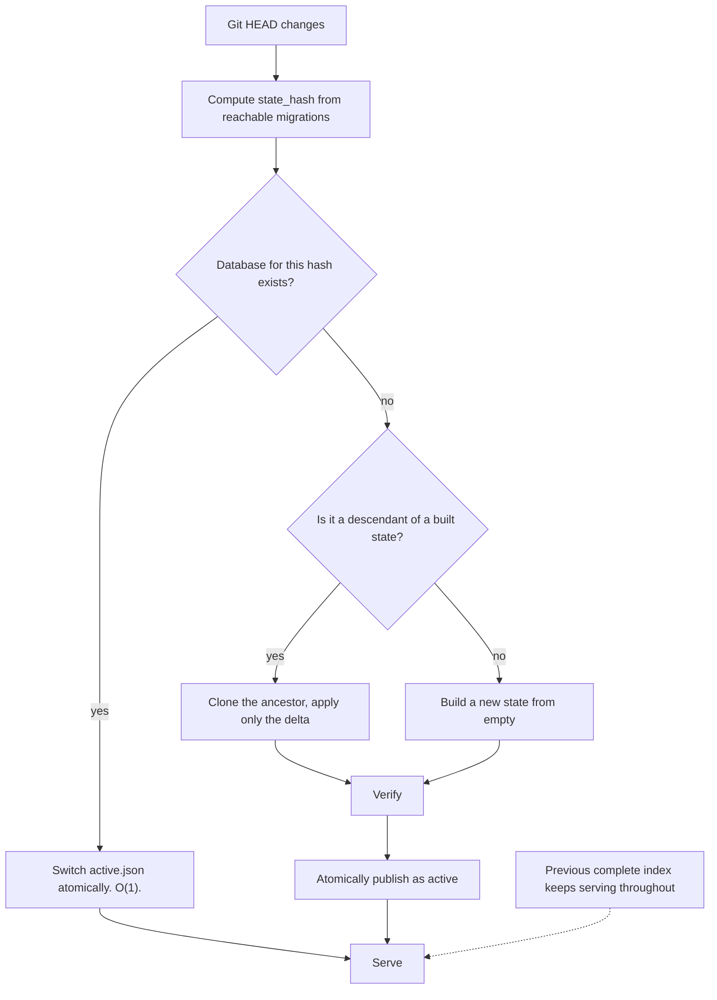

# ADR-0007: State-hash-partitioned databases for Git branches and worktrees

- Status: accepted
- Date: 2026-08-01
- Deciders: Theurian maintainers
- Requirements: FR-P5, FR-R7, NFR-4, NFR-5, NFR-6, §16 of the brief

## Context

Developers switch branches constantly, and knowledge differs per branch: a
feature branch adds a specification, a revert removes an ADR, a long-lived branch
has an entirely different approved state.

A single database would have to mutate on every checkout. That produces:

- a slow, destructive rebuild on every branch switch;
- a window during which search returns results from neither branch;
- worktrees of the same repository silently sharing and corrupting each other's state;
- non-reproducible agent tasks, because the knowledge base changed mid-task.

## Decision

**Content-address the entire canonical state, and keep one database per distinct
state.**

```text
state_hash = SHA256(
    sorted migration IDs
  + migration checksums
  + source content checksums
  + schema version
  + migration engine version
)
```

```text
.theurian/state/
├── theurian-state-a1b2c3.sqlite
├── theurian-state-d4e5f6.sqlite
└── active.json
```

Determinism rules — every one of these has been a real bug in similar systems:

- Inputs are sorted by ULID with a byte-wise comparison, never by locale collation.
- No absolute paths, no mtimes, no hostnames, no environment enter the hash.
- Content checksums are over raw bytes; no newline or encoding normalization.
- `schema version` and `migration engine version` are included so that an engine
  change invalidates cached state instead of silently reinterpreting it.

Branch-switch behaviour:



- While a new state builds, the previously published state answers every query
  (NFR-4). A partially built state is never reachable.
- `active.json` is replaced by write-to-temp + `os.replace`, which is atomic on
  POSIX.
- A caller may pin `snapshotId` — a state hash — so an agent task sees one
  unchanging knowledge base even if the developer switches branches mid-task
  (FR-R7).
- Each Git worktree resolves its own Project context. Worktrees of one repository
  never share a `.theurian/state/` directory.
- Garbage collection of unreferenced state databases is explicit
  (`theurian index gc`), never automatic. Automatic deletion of a state a pinned
  task still references is a data-loss bug.

## Consequences

### Positive

- Branch switching between previously visited states is instant.
- Search never goes dark and never returns a half-built index.
- `snapshotId` gives reproducible agent runs — the property that makes an agent's
  conclusions auditable after the fact.
- The hash is a cache key, an equality test, and a bug report identifier at once.

### Negative

- Disk usage grows with the number of distinct states visited. Mitigated by
  explicit GC, delta builds, and the fact that these are text-derived indexes.
- Delta application requires knowing whether one migration set is a superset of
  another. Straightforward with ULID sets, but it is real logic to get right.

### Neutral

- The same partitioning generalizes to a hosted service, where the key becomes
  (tenant, project, state hash).

## Alternatives considered

| Alternative | Why rejected |
| :-- | :-- |
| One database, rebuilt on checkout | Search goes dark on every branch switch; concurrent worktrees corrupt each other. |
| Branch-name-keyed databases | Branch names are not content. Rebase, amend, and force-push all silently invalidate the key. |
| Git commit SHA as the key | Overly sensitive — a code-only commit that touches no knowledge would invalidate a perfectly valid index. |
| Row-level branch tagging in one database | Every query needs a branch predicate; a missed predicate is a cross-branch data leak. |

## Compliance

- A golden-vector test asserts the state hash of a fixture set is a fixed,
  committed value across machines and Python runs (`PYTHONHASHSEED` independence).
- An integration test switches between three states and asserts O(1) reuse and
  correct content.
- A test asserts a query during an in-progress build returns the previous
  complete state and never a partial one.
- A test asserts two worktrees of one repository maintain independent active states.
