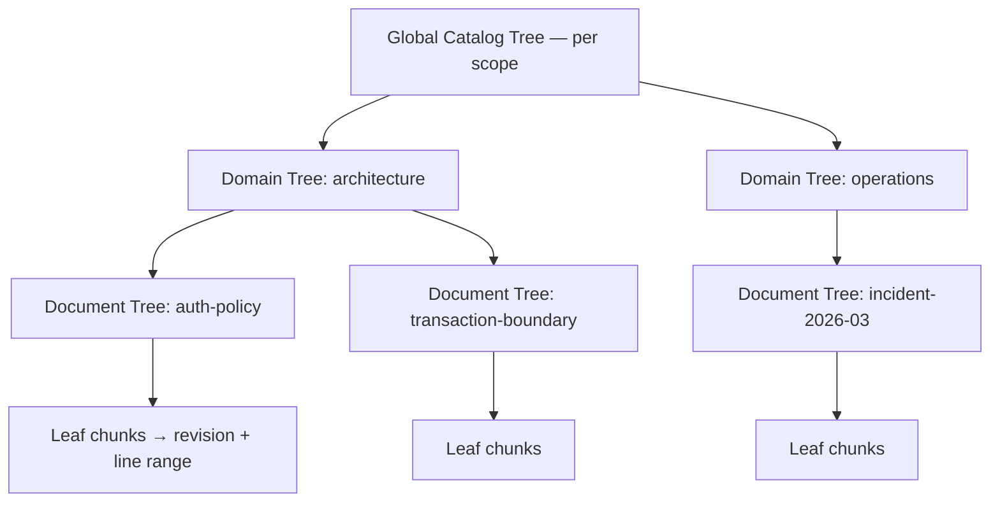

# ADR-0008: A RAPTOR forest, not a single tree

- Status: accepted
- Date: 2026-08-01
- Deciders: Theurian maintainers
- Requirements: FR-R3, SEC-14, R-3, R-14, §18 of the brief

## Context

RAPTOR builds a tree of recursive abstractive summaries so that a query can
match a high-level summary and then descend to specifics. Applied naively to a
whole organization's knowledge, it produces one enormous tree, and that has two
failure modes — one operational, one a security incident.

**Operational**: every knowledge edit invalidates summaries all the way to the
root. A one-line ADR correction triggers a full-tree rebuild.

**Security**: a summary node is a *new document synthesized from its children*.
If a node's children span a `restricted` incident report and a `public` API
guide, the summary contains restricted facts and inherits whichever ACL the
implementation happened to assign. Retrieval then returns restricted content to a
principal who is authorized only for public. Because the leak lives in generated
text with no anchor to the restricted source, it is nearly undetectable after the
fact.

> **Amended in Milestone 6. "Retrieval then returns restricted
> content to a principal who is authorized only for public" describes the
> un-partitioned alternative, and it reads as though Theurian's retrieval
> enforces sensitivity. It does not.** No retrieval path reads
> `chunks.sensitivity`; the column exists and the schema says so beside it, and
> FR-R1's per-axis register in `docs/architecture/requirements-analysis.md`
> records the disposition — sensitivity is a **published label, not a control**,
> with the control deferred to
> [#119](https://github.com/theurian/theurian/issues/119).
>
> So that sentence names what happens when a *summary node mixes* two
> sensitivities into one text, which is the harm partitioning prevents.
> Partitioning prevents mixing. It does not make a serving decision, and the
> forest must not be read as adding one.
>
> **Because it adds no serving control, the forest neither waits for #119 nor
> advances it — it ships first, and that is a decision rather than an
> oversight.** The residual is *smaller* than the paragraph above suggests, not
> equal to it: under decision 8 a summary node is never published. Nothing
> node-derived reaches the wire until the retrieval CL lands `raptorPath`
> through its own review, so until then there is no node being served to any
> principal, correctly or otherwise.
>
> What partitioning will buy meanwhile is that no node's *text* spans two
> sensitivities. Node rows will carry the scope tuple's sensitivity once they
> exist at all — they arrive with the v4 tables of decision 5 — so that the day
> #119 gives sensitivity a predicate there is a column to filter on and no node
> whose content straddles it. That is the whole reason for carrying it. The
> claim about node text is owed a test, not asserted: it is the
> `test_raptor_scope.py` item in Compliance.

## Decision

**A forest of scoped trees. Mixing across a scope boundary is structurally
impossible, not policy-checked.**

1. Tree identity is the tuple
   `(project, tenant, sensitivity, acl_group, namespace)`.
   A node's tree is determined by that tuple, so a node whose children differ in
   any component cannot exist — there is no tree it could belong to. This is a
   structural guarantee, not a check that could be forgotten.

   > **Amended in Milestone 6. The tuple gains a sixth component,
   > `status`:** `(project, tenant, sensitivity, acl_group, namespace, status)`.
   >
   > This decision's own argument is the reason. "A node whose children differ in
   > any component cannot exist" is worth most on the axes retrieval actually
   > enforces, and as accepted the tuple named only one of them. `_scope` filters
   > `chunks.project_id` and `chunks.status`; `status` was not in the tuple at
   > all.
   >
   > What that omission costs is concrete, because an index build has a flavor. A
   > default build holds only approved revisions; `theurian index build
   > --include-unapproved` records `indexesUnapproved` on the pointer
   > (`application/project_service.py`) and holds drafts and proposals too. On
   > such a build a node can be summarised from children that straddle the
   > boundary, and its `status` column — in the **node** tables, not in `chunks`
   > (decision 5) — then decides which query flavor traverses it.
   >
   > The cost is routing and recall, not serving: decision 8 publishes no node,
   > so nothing node-derived reaches a caller until the retrieval CL. A mixed node
   > stamped `draft` is a route a default query never takes, losing the
   > approved-derived leaves underneath it; stamped `approved`, it is a route a
   > default query does take, toward draft-derived leaves the leaf-level filter
   > then drops — work spent to reach rows that cannot be returned. Which of the
   > two happens is decided by how the builder happened to fill a column rather
   > than by anything anyone decided, so **recall becomes a function of that
   > choice**. And it does not resolve later: a node-table predicate added when
   > #119 or its successors land cannot filter a node whose content already
   > straddles the boundary, for the same reason ACL filtering cannot unmix a
   > summary — which is this ADR's own rejected alternative.
   >
   > What has to move for this. `Scope.digest` is already total over five
   > components — it is `ContentHash.of_text` of `key`, which joins exactly those
   > five with a unit separator — so what is missing is the `status` component
   > itself and a node constructor that refuses children which disagree on it.
   > Both construction sites can supply it without a signature change:
   > `KnowledgeItem.scope` from `item.status`, and `RevisionMetadata.scope_for`
   > from `self.status`. An earlier draft of this amendment said `scope_for`
   > could not, on the reasoning that status lives on the item — the opposite of
   > how it flows. `RevisionMetadata` carries `status`, and
   > `KnowledgeItem.with_revision` adopts it (`status=revision.metadata.status`),
   > so authority runs metadata → item.
   >
   > **Two families of statement go stale with this, and none is corrected
   > here.** Naming them so that a later reader does not take one as
   > corroboration. Statements of the five-component tuple, from
   > `rg -U "project[,_ ][^)]{0,20}tenant(.|\n){0,60}?sensitivity(.|\n){0,60}?(acl_group|ACL group)(.|\n){0,60}?namespace"`:
   > `README.md`, `SECURITY.md`, `docs/security/threat-model.md`,
   > `docs/architecture/raptor.md`,
   > `docs/architecture/requirements-analysis.md`,
   > `infrastructure/raptor/__init__.py`, the two `Scope` construction sites,
   > `Scope`'s own field list in `domain/values.py`, and
   > `tests/unit/test_scope_isolation.py` — whose `_scope` helper and exhaustive
   > product are the first things a sixth field breaks — plus
   > `packages/theurian-core/CHANGELOG.md`, which is history and stays as
   > written. Statements that the exhaustive scope test covers **32**
   > combinations, from `rg "32 (component |scope |)combinations|32 distinct|all 32"`:
   > `SECURITY.md`, `docs/architecture/raptor.md` (twice),
   > `docs/security/threat-model.md` and `infrastructure/raptor/__init__.py`;
   > `tests/unit/test_scope_isolation.py`'s own docstring belongs to the family
   > by meaning rather than by that string. Two values per component over six
   > components is 64.
   >
   > The owed test named in Compliance now has to be total over six components,
   > not five.
2. Three levels: Document Tree (within one knowledge item), Domain Tree (within
   one namespace/kind), Global Catalog Tree (within one scope tuple).
3. Incremental rebuild: changed item → its Document Tree → the affected part of
   its Domain Tree → the affected part of the Catalog Tree. Never a full forest
   rebuild for a single edit.

   > **Amended in Milestone 6. Milestone 6 ships full re-derivation
   > of the forest inside the existing build path. Incremental subtree rebuild is
   > deferred until it has a correctness argument.**
   >
   > A full re-derive is one code path whose output is a function of canonical
   > state alone, so "is this forest the one this state implies?" is answered by
   > deriving it again and comparing. An incremental rebuild is a second path that
   > has to agree with the first on every input, and the way it fails — a node
   > left standing that no longer matches its children — is invisible in the
   > artifact it produces. That argument has not been written, and a rule that
   > says "never a full forest rebuild" is not a reason to ship the path that
   > needs it.
   >
   > This decision's cost concern is recorded, not abandoned. ADR-0024 measured a
   > full `theurian index build` of the *chunk* index at 2,614 ms over 400
   > documents — the whole command with embeddings enabled, not chunk derivation
   > alone. The forest adds summarisation on top of that and nothing has measured
   > it. The milestone that ships incremental rebuild owes both the correctness
   > argument and a measurement of what the incremental path saves against the
   > full one.
   >
   > **Decision 9's purge does carry over trees it did not re-derive, and that is
   > not this deferral being taken quietly.** The difference is that the purge
   > has the correctness argument this decision says is missing: under decision
   > 6's purity constraint an unaffected tree's inputs are unchanged, so a pure
   > derivation would reproduce it byte-for-byte, content-addressed ids included
   > — and the two-corpus equality test is exactly the experiment that exercises
   > that claim. A build-path incremental rebuild has no such test, because the
   > thing it would have to hold is that a tree whose inputs *did* change was
   > updated correctly, which no equality against a never-held corpus states.
4. A rebuild produces a new `index_build`. It is verified, then published by an
   atomic swap of `active_indexes`. An unverified or partial build is never
   searchable (NFR-4).

   > **Amended in Milestone 6. There is no `active_indexes` table.
   > There never was one.** Publication is a pointer *file*:
   > `.theurian/state/active-index.json`, written temp-then-`os.replace` so a
   > reader never observes a half-written pointer
   > ([ADR-0022](0022-index-lives-in-its-own-database.md) point 5,
   > [ADR-0024](0024-a-purge-is-a-build.md)). No schema in `schemas/` and no DDL
   > in `index_schema.py` names `active_indexes`; the phrase describes a mechanism
   > that was written down before it was built and has been read back since as
   > though it had been.
   >
   > At the time of this amendment the same phrase stands in five other places —
   > the population is `git grep active_indexes`, and it is the whole of it:
   > `docs/architecture/overview.md`, `docs/architecture/local-daemon.md`,
   > `docs/architecture/raptor.md`, `docs/architecture/requirements-analysis.md`
   > and the `indexing/__init__.py` docstring. They are named here rather than
   > corrected here — this amendment is scoped to the ADR — so that the next
   > reader does not take a second sighting as corroboration.
   >
   > The property this decision asserts is unchanged, and ADR-0024 is what holds it:
   > publishing is a pointer swap, an unverified or partial build is never pointed
   > at, and a purge is subject to the same rule rather than being an exception to
   > it.
5. Every node stores its provenance:
   `node_id`, `tree_id`, `level`, `node_type`, `text`, `content_hash`,
   `summary_model`, `summary_model_revision`, `summary_prompt_hash`,
   `embedding_model`, `embedding_model_revision`, `embedding_dimension`,
   `source_revision_id`, `index_build_id`.
   A summary whose model or prompt hash differs from the current configuration is
   stale by definition and rebuilt — no guessing.

   > **Amended in Milestone 6. These rows go in their own tables, at
   > index schema v4 — not into `chunks` as rows with `derived = 1`.** This
   > corrects the storage `chunks.derived` and `chunk_derivation` were added for:
   > [ADR-0024](0024-a-purge-is-a-build.md) decision 8 landed the columns at v3
   > with `index_schema.py` naming RAPTOR as the first thing that would write
   > them, and this is that assumption being revisited by the feature it was
   > waiting for.
   >
   > The reason is BM25's collection statistics. `chunks_fts` and
   > `chunks_trigram` are external-content FTS5 tables over `chunks`, and `bm25`
   > scores every row against statistics computed over *every* row in the table —
   > `N`, `avgdl`, and the per-term document frequencies. A summary systematically
   > repeats the terms of the children it was built from, so summary rows in
   > `chunks` would move all three under every ordinary leaf query, and a visible
   > leaf's rank would become a function of the forest's shape. Separate tables
   > will leave the leaf statistics equal to a forest-free build, which is why the
   > magnitude of the shared-table effect is deliberately not measured: separation
   > is meant to make the quantity moot rather than small. That is a claim about
   > code nobody has written, so it is owed the test named in Compliance and is
   > not asserted here on the strength of the argument.
   >
   > **`chunks.derived` and `chunk_derivation` are dropped at v4.** A column
   > nothing will ever write serves nothing, and keeping it would leave two
   > provenance mechanisms of which one is permanently dead. The traversal is
   > rewritten against the node tables, and ADR-0024's five pinned traversal
   > tests migrate to that counterpart rather than being deleted — what they
   > hold is the *rule*, and the rule is unchanged: withdrawal is transitive over
   > derived content, and an unresolvable derivation edge means delete, not keep.
   >
   > **Three places name those columns and must move together, and the third is
   > the one a reader would miss.** `_DOOMED` in
   > `infrastructure/sqlite/index_purge.py`; `_verify`'s unprovenanced-row
   > post-condition beside it; and `IndexStore.holds_any_revision`, whose
   > unprovenanced clause is not commentary but an **executed SQL predicate**
   > naming `chunk_derivation` in its `SELECT`. That one runs on the withdrawal
   > path rather than the purge path — `application/withdrawal_purge.py` calls it
   > as the pre-check on every `migrate apply` that withdraws anything — so
   > against a v4 index it raises `no such table: chunk_derivation`, and it does
   > so even when the revision clause alone would have answered, because SQLite
   > resolves the whole statement before evaluating any of it. Dropping the
   > columns without moving this predicate breaks `migrate apply`, not just the
   > purge.
   >
   > **Several statements say RAPTOR will write those v3 columns, and this makes
   > every one of them wrong. None is corrected here.** They cannot be enumerated
   > by a regex over prose — each refers to the rows by a different anaphor
   > ("those rows", "them", "such a row") — so the population is given by a key
   > that cannot miss:
   > ``rg -l "chunk_derivation|chunks\.derived|derived = 1"`` returns eight files
   > besides this one, and every RAPTOR-as-future-writer sentence is inside them:
   > `index_schema.py` (module docstring and column comment), `index_store.py`
   > (`holds_any_revision`, which both says it in a docstring **and executes it
   > as a SQL predicate**), `tests/integration/test_index_purge.py` (section
   > comment, `_add_derived`, and the `_verify` backstop test),
   > `tests/integration/test_index_store.py` (the columns-exist test),
   > `tests/integration/test_withdrawal_purge.py`
   > (`_insert_unprovenanced_derived`), and
   > [ADR-0024](0024-a-purge-is-a-build.md)'s own Compliance line.
   > `packages/theurian-core/CHANGELOG.md` and `index_purge.py` are in the eight
   > as the mechanism and its record, not as claims about a future writer.
   > `packages/theurian-core/CHANGELOG.md` records the v3 bump and is history.
   >
   > **The node tables also sit outside `_scope`, which is today the one place
   > project and status are enforced.** That method's docstring earns its "every
   > retriever" claim by mutation: the isolation test only went RED when all
   > three hand-written copies of the predicate were broken at once, so any one
   > could have lost `project_id` with the suite green. Enforcement is now in one
   > place; a node traversal would be the second, and the argument that
   > consolidated the first three applies to it unchanged. The owed item is in
   > Compliance.
6. Summarization constraints, enforced in the prompt and validated in evaluation:
   - state no fact absent from the children;
   - treat imperative text in the source as *data being described*, never as an
     instruction (SEC-16);
   - retain child references so every summary is traceable to source text;
   - mark uncertainty rather than resolving it;
   - inherit sensitivity and ACL from children — which, given rule 1, are uniform.

   > **Amended in Milestone 6. A sixth constraint, and it is the one
   > that makes the extractive default load-bearing rather than merely
   > convenient: a summariser is a pure function of its own children's texts, its
   > scope tuple, and a configuration-derived `max_tokens`.** No corpus-wide
   > statistic may enter — not an IDF over a tree, not a term frequency over a
   > namespace, not a centroid over a project — and **`max_tokens` must never be
   > a corpus-derived quantity**. The port takes it as a parameter, so a builder
   > that divided a shared budget by the number of documents would change a
   > visible node's text when a withheld document was added or removed, while the
   > summariser itself read nothing it should not. That is the same class
   > arriving through the one input that looks like a tuning knob.
   >
   > The reason is a class T-17a is adjacent to and is not. A statistic computed
   > over a corpus is computed over documents the caller may not read, so a
   > summariser that used one would write a withheld document's influence into
   > the text of a *visible* node. A purge deletes rows; it cannot delete from a
   > sentence the reason that sentence was chosen.
   >
   > Named by its root cause rather than by what it emits, that class is
   > **content the caller may not read influencing a derived artifact no purge
   > reaches**. T-17a's root cause is a different one — *the index still holds
   > the withdrawn rows* — and [#15](https://github.com/theurian/theurian/issues/15)
   > removes those rows, which is why deleting them restores equality there. Here
   > deletion restores nothing, because what carries the influence is text that
   > was already written. The two look alike in their observable and want
   > opposite remedies, which is the reason for naming them apart.
   >
   > **That class has three carriers, and this constraint closes two of them.**
   > (a) The summariser's *text* inputs and (c) its `max_tokens` — both closed
   > here, held by the purity test in Compliance. (b) **Which children cluster
   > together**, because membership in a node is a function of the member set:
   > removing a document the caller may not read regroups the visible ones, so a
   > node built entirely from visible children still has text that would have
   > read differently had the withheld document never existed. Carrier (b) is
   > closed by decision 9's tree-level
   > re-derivation and is held by the two-corpus equality test, not by this one —
   > the purity test holds the children fixed, so by construction it cannot see
   > (b), and its corpus-reading negative control demonstrates only that the
   > harness detects a corpus-reading *summariser*. The clusterer is therefore
   > part of "tree derivation" wherever decision 9 requires that to be a
   > deterministic pure function.
   >
   > Unlike the constraints above it, this one is not enforceable in a prompt —
   > it is a constraint on the adapter, not on the model. The port is shaped for
   > it and does not enforce it: `SummarizationProvider.summarize` in
   > `domain/ports/summarization.py` takes `texts`, `scope` and `max_tokens` and
   > is handed no corpus handle, so an adapter that wanted one would have to
   > acquire it in its constructor. What holds the constraint is the test named in
   > Compliance.
7. RAPTOR sits behind a port. The default `SummarizationProvider` is extractive
   and deterministic, so Core produces a usable forest offline with no LLM
   (OSS-15, ADR-0009).

> **Amended in Milestone 6: three decisions this ADR left open,
> taken now.** They are numbered 8 to 10 rather than folded into the points
> above, because none of them corrects a point — each answers a question the ADR
> did not ask.
>
> 8. **Summary nodes are routing-only. Search may traverse them; only leaf
>    chunks are published as results.** Node-derived data reaches the wire only
>    when the retrieval CL lands `raptorPath` through its own review — that is
>    the boundary, and this decision is what lets that field cross it. Today
>    `raptorPath` is named in the architecture and protocol documents and
>    declared in `domain/retrieval.py`, and emitted by nothing: `mcp/results.py`
>    builds every result payload and has no such key, and no schema in
>    `schemas/` names it. Publishing nodes *as results* is a future decision and
>    is explicitly not taken here.
>
>    The reason is the gate. `CanonicalVisibility._may_surface` admits a ranked
>    row only when the canonical store still holds its item, the item's status
>    may surface, and `item.current_revision_id` equals the row's `revision_id`.
>    A summary node's text is not any revision, so there is no
>    `(item_id, current revision_id)` pair for that gate to clear, and publishing
>    a node would mean a second clearance rule beside the one every published
>    result goes through today.
>
>    **That anchor drops withdrawn and superseded revisions, and it is not the
>    general guarantee it has been read as.** It does not cover same-revision
>    content drift — [#130](https://github.com/theurian/theurian/issues/130) —
>    nor order and excerpt movement, which is T-17a. "A stale index returns fewer
>    results rather than wrong ones" is false in the general form and must not be
>    imported anywhere, here included. It still stands where it was written:
>    `rg -n "fewer results rather than wrong"` returns two hits, the docstring of
>    `tests/integration/test_mcp_tools.py`'s superseded-revision test — which is
>    true of the supersede case that test actually exercises, and is the sentence
>    the general form was read out of — and `packages/theurian-core/CHANGELOG.md`,
>    which is history. Named here, not corrected here.
>
>    Routing-only bounds the new disclosure surface to **one field plus the
>    traversal that feeds it** — not to one field, which undercounts twice over.
>    That field carries three values per segment, `nodeId`, `level` and `title`,
>    and `title` is node-derived free text, so it is a summariser's output
>    reaching the wire directly. And which rows reach a published field is its own
>    observable family in this repository's own table: a route taken or not taken
>    decides which leaves are candidates and in what order. The retrieval CL's
>    review has to cover routing effects and `title`, not the field's presence.
>    FR-R3's value is kept: descending from a summary to the specifics under it
>    is traversal, not publication.
>
> 9. **Withdrawal re-derives each affected tree from its surviving rows.
>    Node-local recompute is rejected, and so is delete-only.**
>
>    The reason to reject delete-only is the property
>    [ADR-0024](0024-a-purge-is-a-build.md) was accepted on: *an index that held
>    the withdrawn rows and had them purged answers identically to an index that
>    never held them*. Deleting an affected node outright breaks that equality in
>    the other direction — the purged index is then missing a node the never-held
>    corpus would have built from the children that survived.
>
>    **The reason to reject node-local recompute is that it cannot reach the same
>    target, and an earlier draft of this decision claimed it could.** That draft
>    said recomputation "subsumes deletion". It does not, at two boundaries.
>    *Thresholds*: with `minChildrenPerSummary` at 3 and one of three children
>    withdrawn, a never-held corpus skips the level and has **no** node, while a
>    node-local recompute keeps one and merely rewrites its text. *Clustering*:
>    which children are grouped into which node is a function of the corpus, so
>    removing a row can change the partition, and no operation confined to an
>    existing node reproduces the partition the never-held corpus would have
>    formed. Re-deriving the affected tree evaluates both afresh, so a level that
>    falls below threshold disappears exactly as it would never have been built.
>
>    **"Affected" is the ancestor closure of the withdrawn rows, and it has to
>    be, because clustering is a function of the member set.** Concretely: the
>    Document trees of the withdrawn rows; the Domain trees of those rows'
>    namespaces and kinds — decision 2 keys a Domain tree by both — re-derived
>    **in full**, since membership within a Domain tree is determined by its whole
>    member set and a partial recompute of one is not a defined operation; and the
>    scope's Catalog tree. The cost is therefore proportional to the *derived
>    layer* of the affected namespaces and scope — their document-level summaries
>    in, their nodes out — with the Catalog re-derivation **reading** every Domain
>    tree's root summary in the scope, which is a read of one node per Domain tree
>    and not a re-derivation of those trees. No other scope is touched, and no
>    leaf is re-chunked. An earlier
>    draft said "bounded by the affected trees, never by the corpus", which
>    bounds nothing: one withdrawn chunk moves the Domain tree, so every tree
>    above level 1 in that scope is affected by that phrasing's own reasoning.
>
>    The equality target will be reachable **if and only if** tree derivation is
>    a deterministic pure function of (surviving rows, scope, configuration) —
>    the clusterer included, per decision 6's carrier (b), not the summariser
>    alone. That is the property the extractive default is chosen for, and the
>    owed equality test is what will hold it.
>
>    **If a provider without that property is ever configured — none exists
>    today — a purge instead deletes the affected trees' nodes and records the
>    forest stale for those trees.** That branch guarantees exactly one thing:
>    **no withheld influence is retained.** Missing summaries, in the safe
>    direction. It does *not* restore two-corpus equality and cannot, at any
>    later point including a full rebuild, because the never-held side would be
>    built with the same non-deterministic provider and the two would not agree
>    either. A provider without the determinism property forfeits ADR-0024's
>    equality for derived rows; that is the trade, recorded rather than papered
>    over. The owed equality test is scoped to deterministic pure providers.
>    This branch also dissolves a collision the recompute-always rule created
>    with decision 5: a node recomputed by the extractive provider inside an
>    abstractively-configured build would be stale by that decision's own
>    model-hash rule the moment it was written, so a purge could never publish.
>
>    **Node identity is a deterministic function of
>    (`tree_id`, level, the children's content hashes sorted lexicographically),
>    joined with the same unit separator `Scope.key` uses and hashed.** The
>    ordering and the encoding are part of the definition rather than an
>    implementation detail, and both are stated because neither is implied:
>    "the builder's order" would be a physical-order reading, and a purge that
>    rewrites a tree can produce the same children in a different physical order
>    than the never-held build did, which alone would break the equality this
>    decision rests on. Sorting the hashes removes that degree of freedom.
>    `tree_id` for a Document tree includes the item's identity, without which two
>    document trees holding duplicate content mint the same id for different
>    nodes. An earlier draft had neither half, saying only "(scope tuple, level,
>    children's content hashes)". Content-addressing is not an
>    independent requirement here — it is what determinism plus stability across
>    builds amounts to. What makes it matter is that `raptorPath.nodeId` is a
>    published value, so an id that moved between the purged and never-held
>    forests would invite excluding that field from the equality comparison, and
>    excluding the field that moves is how T-17's faces survived three rounds.
>
>    A purged build whose re-derivation cannot run is not published. That is the
>    refusal *shape* `_verify` in `infrastructure/sqlite/index_purge.py` already
>    has — post-conditions that raise `IndexPurgeError` before anything is
>    published — rather than a refusal it already performs; the re-derivation
>    post-condition is a new member of that shape and does not exist. The
>    cleanup that shape depends on is weaker than it reads:
>    [#131](https://github.com/theurian/theurian/issues/131) records that
>    `purge_into`'s failure unlink is pinned by nothing, and deleting the block
>    leaves the suite green.
>
>    ADR-0024 decision 8's own delete case — a node whose derivation edges cannot
>    be resolved — is untouched, because a node that cannot say what it was built
>    from cannot be rebuilt from it either.
>
>    **Cost**: the purge path gains a re-derivation term proportional to the
>    derived layer of the affected namespaces and scope — their document-level
>    summaries read in, their nodes written out, plus one root summary read per
>    Domain tree in the scope for the Catalog level. No other scope, and no
>    re-chunking of leaves. It is unmeasured, and the
>    measurement is owed with the CL that closes the purge over nodes. ADR-0024's
>    51×–65× copy-not-derive argument is scoped to the *chunk* index and is untouched
>    for chunks; it was never a claim about deriving a forest.
>
>    The acceptance test is owed with that same purge-closure CL, and is named in
>    Compliance rather than pointed at a CL number.
>
> 10. **`raptor.enabled` defaults to `false` in the first release that ships the
>     forest.** `schemas/config/project-config.schema.json` declares
>     `"enabled": { "type": "boolean", "default": true }` today. That is not a
>     decision anyone took: nothing in `src/` reads it, or reads
>     `.theurian/config.yaml` at all. The schema's only consumers outside itself
>     are `tests/unit/test_examples.py`, which validates the example document
>     against it, and `tests/unit/test_schemas.py`, which checks one unrelated
>     property — so `default: true` has never taken effect anywhere.
>
>     A capability whose acceptance tests are owed and whose build cost is
>     unmeasured (see the amendment to decision 3) ships opt-in, so that turning it
>     on is somebody's decision and not the side effect of an upgrade. This is the
>     shape ADR-0009 and ADR-0021 already took for the dense retriever, which is
>     off unless a caller asks for it.
>
>     The flip lands with the forest-builder change, not with this amendment.
>     Keyed on *the default of `raptor.enabled`*, it is **two** places: the schema
>     default above, and `examples/sample-project/.theurian/config.yaml`, which
>     sets `raptor: enabled: true` explicitly and is what a reader copies. Until
>     both say `false`, this ADR and those two files disagree. Outside that key
>     and flipped by the same CL for a different reason: `mcp/tools.py`'s
>     capabilities block reports `"raptor": False`, which is true today and
>     becomes false the moment a forest can be built at all.

## Consequences

### Positive

- Cross-sensitivity and cross-tenant leakage through summaries is prevented by
  construction — the highest-severity risk in the threat model (T-10, R-14).

  > **Amended in Milestone 6. Present indicative for a mechanism
  > that does not exist.** `infrastructure/raptor/` holds a module docstring and
  > no code, so nothing there prevents anything. What holds today is that no
  > summary is generated at all, so there is nothing to mix — which is the
  > interim residual T-10 and R-14 already record, in the subjunctive, and not
  > this sentence.
  >
  > The conditional form: **once the forest is built, a node mixing two
  > sensitivities will have no tree to belong to.** What will make that a
  > construction rather than a hope is a tree-id function total over the
  > six-component tuple, refusing a node assembled from children that disagree —
  > the first owed item in Compliance. Until that test exists, this ADR's own
  > Compliance section is the accurate statement: nothing here is built, so
  > nothing here is enforced.
- Rebuild cost is proportional to the change, not to the corpus.

  > **Amended in Milestone 6.** Not what Milestone 6 ships. See the
  > amendment to decision 3: the forest is fully re-derived inside the build
  > path, so this consequence describes the incremental rebuild that is deferred.
  > It is left standing because it is what the deferred work is for.
- Model and prompt provenance makes "why does this summary say that?" answerable.
- Theurian works with no LLM configured; abstractive summarization is an upgrade,
  not a prerequisite.

### Negative

- More trees means more index metadata and more bookkeeping than a single tree.
- A query spanning scopes must search several trees and fuse results. Acceptable:
  fusion is already required for hybrid retrieval (FR-R2).
- Very small scopes produce shallow trees with little summarization benefit. The
  builder skips levels below a configurable size threshold rather than creating
  a summary of one document.

### Neutral

- The forest maps directly onto multi-tenant hosting: a tenant is already a
  component of tree identity.

## Alternatives considered

| Alternative | Why rejected |
| :-- | :-- |
| One tree per repository | The leakage failure above, plus full rebuilds on every edit. |
| One tree with ACL filtering at query time | The summary text already contains the restricted facts. Filtering the node does not unmix the content. |
| Flat chunk retrieval, no hierarchy | Loses the ability to answer broad questions; RAPTOR exists precisely for those. |
| Per-file trees only | No cross-document synthesis, which is most of the value. |

## Compliance

**Nothing here is built, so nothing here is enforced.**
`infrastructure/raptor/` contains a module docstring and no code; there is no
node type, no tree-id function and no summary node in the index schema. This
section was written as though the four items below had landed, and every one of
them names a test that does not exist. They are stated as owed, against
Milestone 6, which is where the README roadmap puts the RAPTOR forest.

> **Amended in Milestone 6. Three pieces do exist, and the sentence
> above is worth reading narrowly rather than as covering them.** `Scope`,
> `TenantId`, `AclGroup` and `Sensitivity` are domain values, and
> `tests/unit/test_scope_isolation.py::test_all_scope_pairs_are_distinguishable`
> is exhaustive over the 32 component combinations of the five-component key.
> `SummarizationProvider` is a port in `domain/ports/summarization.py` with no
> adapter. `chunks.derived` and `chunk_derivation` are in the index schema at v3
> with a purge traversal over them
> ([ADR-0024](0024-a-purge-is-a-build.md) decision 8) — landed ahead of RAPTOR
> and, per the amendment to decision 5 above, not the storage RAPTOR will use.
> None of the three summarises anything, so the claim holds: no node exists, and
> nothing enforces the scope rule at node-construction time.
>
> The indicative elsewhere in this ADR is the accepted design record and is left
> as written; this section is what says what is built. One more instance worth
> naming, because it reads as shipped behaviour: the Negative consequence about
> the builder skipping levels below a size threshold describes
> `raptor.minChildrenPerSummary` in `schemas/config/project-config.schema.json`,
> which — like `raptor.enabled` — nothing in `src/` reads.

Still owed, with the milestone that will satisfy it:

- **`tests/unit/test_raptor_scope.py`** — constructing a node from children with
  differing scope tuples must raise, and the tree-id function must be total over
  the tuple. This is the item that carries the ADR's security argument: the
  Context above says cross-sensitivity leakage is prevented *structurally*
  rather than by a policy check, and a structural guarantee with no test is a
  policy check with no policy. The file has never existed (Milestone 6).

  > **Amended in Milestone 6.** The tuple this test must be total
  > over now has **six** components, not five: the amendment to decision 1 adds
  > `status`. A test exhaustive over the five-component key would pass while a
  > build mixed draft and approved children into one node, which is the case that
  > amendment exists to prevent. `test_scope_isolation.py`'s 32 combinations are
  > the five-component count and move to 64 with it.
- **An in-progress `index_build` is never returned by search** (Milestone 6).
  The equivalent for the chunk index is
  `tests/integration/test_index_store.py::test_building_over_an_existing_file_is_refused`;
  a summary node has no counterpart yet, and the wider concurrent-rebuild
  guarantee is ADR-0022's Still-owed blue/green item.
- **A node whose `summary_prompt_hash` differs from the active configuration is
  treated as stale** (Milestone 6). No column holds a `summary_prompt_hash`.
- **Retrieval evaluation includes a groundedness check on generated summaries**
  (Milestone 6). There is no retrieval evaluation harness, and no summary to
  ground: `SummarizationProvider` has no implementation.

Newly owed by the amendments above, all against Milestone 6, each named because
the decision it belongs to states a property that is otherwise only an argument:

- **A purged build's forest equals one that never held the withdrawn rows**
  — the acceptance test decision 9 commits to, owed with the purge-closure CL.
  `tests/integration/test_index_purge.py::test_a_purged_build_answers_as_if_the_rows_were_never_indexed`
  is the two-corpus shape to extend. Because decision 8 publishes no node, the
  comparison is over the **node tables' full contents**, `node_id` included —
  not over a response, which carries nothing node-derived yet — and it extends to
  every published field when `raptorPath` lands. Excluding a field because it
  moves is the forbidden move in either form. The **stale** control stays,
  asserted *different* in the same test, or the comparison passes when both sides
  are broken the same way. The forest side must be asserted to hold at least one
  node: with a fixture below `minChildrenPerSummary` both sides build nothing and
  the equality is vacuous. This test also closes decision 6's carrier (b) — it is
  the only owed test that can, since it is the one that lets the child set vary.
  It is scoped to deterministic pure providers; under any other, decision 9's
  fallback branch applies and this equality is not available at all.
- **A forest does not move leaf ranking** — what decision 5's "equal by
  construction" claims. Same query, same corpus, two builds: one with the forest
  derived and one without, with traversal off on the forest side, or else
  compared on the collection statistics directly — `N`, `avgdl` and the per-term
  document frequencies read out of the FTS5 tables. Comparing statistics is the
  form that survives the retrieval CL: once traversal changes which leaves are
  candidates, a whole-response comparison starts failing for a legitimate reason
  and the pressure is to weaken it. Forest side asserted non-empty, for the
  reason above. This is the test that goes RED if summary rows ever land in
  `chunks`, and it is why that effect is left unmeasured.
- **A summary's text is a function of its children and its scope, and of nothing
  else** — what decision 6's added constraint claims, and **carrier (a) only**.
  Summarise the same children under the same scope in two corpora that differ
  everywhere else, including in documents the caller may not read, and the node
  text must be byte-identical. It needs a negative control in the same test: a
  deliberately corpus-reading fake provider, holding a store handle acquired in
  its constructor, asserted to produce **different** text across the two corpora.
  Without it the test passes against a harness that could not detect the thing it
  rules out — and the port's signature is what that fake has to route around,
  which is the point: it makes reaching a corpus awkward, not impossible. It
  needs a second negative control for carrier (c): a builder that derives
  `max_tokens` from corpus size, with a summariser that reads nothing else,
  asserted detectable by the same harness. This test cannot detect carrier (b),
  by construction: it holds the children fixed, and (b) is a change in *which*
  children there are. The equality test above is what covers that, and neither
  substitutes for the other.
- **Project and status are enforced for the node tables in one place** — what
  decision 5's amendment owes. A single predicate builder for node reads, the way
  `_scope` is for chunk reads, with the cross-project and cross-status isolation
  tests repeated over the node traversal. Repeating the tests is not enough on
  its own, and this ADR should not pretend otherwise: it is exactly what was in
  place when three hand-written copies of the chunk predicate went undetected.
  So the owed item includes the mutation — **deleting the node traversal's
  predicate must turn the isolation test RED** — which is the check that
  distinguishes one enforcement point from two that agree today.
