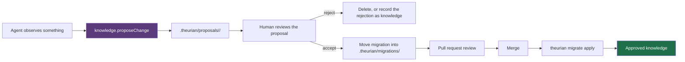

# ADR-0013: AI writes produce proposals, never approved state

- Status: accepted
- Date: 2026-08-01
- Deciders: Theurian maintainers
- Requirements: FR-I3, FR-V4, SEC-17, T-12, INV-7, §20 of the brief

## Context

Theurian's value rests on one claim: what it returns is what the team actually
decided. That claim survives exactly as long as approved knowledge can only be
changed by a human decision.

If an MCP tool can write approved knowledge, then:

- an agent that misreads a review comment can enshrine the misreading as an
  architecture rule, and every future agent will cite it;
- prompt injection through ingested content becomes a knowledge-base write
  primitive (T-3 escalating to T-12);
- the audit trail records "an agent did it", which answers nothing about why;
- knowledge governance — the product — is gone.

Meanwhile agents genuinely do produce valuable knowledge: generalizing a review
thread into a rule, noticing a spec/implementation contradiction, drafting an ADR
from a design discussion. Blocking that entirely wastes the main opportunity.

## Decision

**AI proposes. Git reviews. Humans approve.**

1. No MCP tool mutates approved canonical state. There is no such code path — not
   a permission flag, not a configuration option.
2. Write-intent tools (`knowledge.proposeChange`,
   `knowledge.generateMigrationDraft`, `review.generateKnowledgeCandidate`) emit
   a proposal directory:

   ```text
   .theurian/proposals/<proposal-id>/
   ├── migration.yaml     # a valid, unapplied knowledge migration
   ├── content.md         # or .yaml / .json — the body, in its native format
   └── evidence.json      # source anchors and the reasoning trail
   ```

3. `migration.yaml` is schema-valid and directly applicable. The gap between
   proposal and approval is human review, not format conversion.
4. Approval is: a human reviews the proposal, moves the migration into
   `.theurian/migrations/`, and merges the pull request. `theurian propose accept`
   automates the file moves; it does not automate the judgement.
5. Every proposal records its origin: `agentId`, `taskId`, model identity, and
   the evidence it used. A proposal with no evidence is rejected at generation.
6. A `KnowledgeCandidate` derived from a review thread is never auto-approved,
   however strong the promotion signals (FR-V4). The gate — merged PR, resolved
   thread, fix commit present, not dismissed or outdated, CI green, generalizable,
   evidenced — decides whether a candidate is *worth a human's attention*, never
   whether it is true.
7. Proposal directories may be committed. They are review input, and they are the
   one thing under `.theurian/` that is written by an agent and read by a person.



A rejected proposal is itself worth keeping: "we considered this and did not do
it" is precisely the knowledge that gets lost otherwise. Recording it uses the
`rejects` relation.

## Consequences

### Positive

- Approved knowledge always has a human approver and a reviewable diff.
- Prompt injection can, at worst, create a file a human will read — not a rule an
  agent will cite.
- Review happens in the tool teams already use for review.
- Agent contribution is enabled rather than blocked; only the authority is withheld.

### Negative

- A human is in the loop for every knowledge change, which bounds throughput.
  This is the product, not a limitation of it.
- Proposals can accumulate unreviewed. `knowledge.status` reports proposal age,
  and `doctor` warns past a threshold.

### Neutral

- A future Theurian Cloud approval workflow replaces the pull request as the
  approval *venue*; it does not remove the human approver.

## Alternatives considered

| Alternative | Why rejected |
| :-- | :-- |
| Let AI write directly, with an audit log | The audit records the fact, not the judgement. Bad knowledge is cited before anyone reads the log. |
| AI writes to a `draft` status readable by default | Drafts would be retrieved and cited as team knowledge — the same failure with extra steps. |
| Confidence-threshold auto-approval | Model confidence is not correctness, and the threshold becomes the attack surface. |
| Require a signed human token per write | Approval theatre: mechanically satisfiable without anyone reading anything. |

## Compliance

Landed in Milestone 3:

- `tests/integration/test_mcp_tools.py::test_no_registered_tool_can_reach_a_canonical_write`
  walks the bytecode of every registered MCP tool and asserts none reaches
  `SqliteWriter`, `write_transaction`, or any writer-only method. Structural, not
  a naming convention: a tool called `knowledge.get` that called
  `append_revision` would fail it.
- `test_the_write_gateway_still_guards_the_write_surface` guards that check, so
  moving a write method onto the read-only store cannot silently defeat it.
- `tests/e2e/test_daemon_single_instance.py::test_the_tool_set_is_read_only`
  pins the tool list a real client sees over the wire.

Still owed, with the milestone that brings the feature under test:

- Proposal generation writes only under `.theurian/proposals/<id>/` (M6).
- A generated `migration.yaml` validates against
  `schemas/migrations/migration.schema.json` (M6).
- A proposal with empty evidence is rejected at generation (M6).
- An E2E test asserting approved knowledge is unchanged after a full agent
  session that calls every write-intent tool (M6). Milestone 3 registers no
  write-intent tool at all, so the property holds vacuously today.
