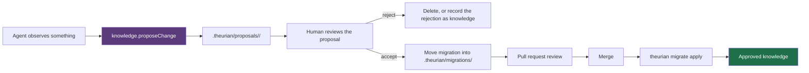

# ADR-0013: AI writes produce proposals, never approved state

- Status: accepted
- Date: 2026-08-01
- Deciders: Theurian maintainers
- Requirements: FR-I3, FR-V4, SEC-17, T-12, INV-7, §20 of the brief

## Context

Theurian's value rests on one claim: what it returns is what the team actually
decided. That claim survives exactly as long as approved knowledge can only be
changed by a human decision.

If an MCP tool can write approved knowledge, then:

- an agent that misreads a review comment can enshrine the misreading as an
  architecture rule, and every future agent will cite it;
- prompt injection through ingested content becomes a knowledge-base write
  primitive (T-3 escalating to T-12);
- the audit trail records "an agent did it", which answers nothing about why;
- knowledge governance — the product — is gone.

Meanwhile agents genuinely do produce valuable knowledge: generalizing a review
thread into a rule, noticing a spec/implementation contradiction, drafting an ADR
from a design discussion. Blocking that entirely wastes the main opportunity.

## Decision

**AI proposes. Git reviews. Humans approve.**

1. No MCP tool mutates approved canonical state. There is no such code path — not
   a permission flag, not a configuration option.
2. Write-intent tools (`knowledge.proposeChange`,
   `knowledge.generateMigrationDraft`, `review.generateKnowledgeCandidate`) emit
   a proposal directory:

   ```text
   .theurian/proposals/<proposal-id>/
   ├── migration.yaml     # a valid, unapplied knowledge migration
   ├── content.md         # or .yaml / .json — the body, in its native format
   └── evidence.json      # source anchors and the reasoning trail
   ```

3. `migration.yaml` is schema-valid and directly applicable. The gap between
   proposal and approval is human review, not format conversion.
4. Approval is: a human reviews the proposal, moves the migration into
   `.theurian/migrations/`, and merges the pull request. `theurian propose accept`
   automates the file moves; it does not automate the judgement.
5. Every proposal records its origin: `agentId`, `taskId`, model identity, and
   the evidence it used. A proposal with no evidence is rejected at generation.
6. A `KnowledgeCandidate` derived from a review thread is never auto-approved,
   however strong the promotion signals (FR-V4). The gate — merged PR, resolved
   thread, fix commit present, not dismissed or outdated, CI green, generalizable,
   evidenced — decides whether a candidate is *worth a human's attention*, never
   whether it is true.
7. Proposal directories may be committed. They are review input, and they are the
   one thing under `.theurian/` that is written by an agent and read by a person.



A rejected proposal is itself worth keeping: "we considered this and did not do
it" is precisely the knowledge that gets lost otherwise. Recording it uses the
`rejects` relation.

> **Amended in Milestone 7, by the `theurian propose` CL. The layout in point 2
> is illustrative; the generator's real filenames diverge from it in two measured
> places, and both divergences are load-bearing.**
>
> **The migration file is named `<migration-ulid>-<slug>.yaml`, not the literal
> `migration.yaml` the tree shows** (`<slug>` is derived from the revision title).
> A fixed name collides: two proposals both called `migration.yaml` would land on
> one path under `.theurian/migrations/`, and the second acceptance overwrites the
> first with nothing reported. Measured on #89's manual `mv` flow — after the
> second move, validation reported one migration and applying it applied only that
> one, with the first change gone from the set and its body left in
> `.theurian/knowledge/` with nothing pointing at it. Naming the file for its own
> migration id from the moment it is generated makes two proposals two distinct
> files, so acceptance never reaches that collision — and `propose accept` on this
> branch refuses one outright rather than overwriting: it writes the migration with
> `O_EXCL` and checks the destination name first, raising `MigrationNameTakenError`.
> The name matches `.theurian/migrations/`'s own `<ulid>-<kebab-slug>.yaml`
> convention ([migrations.md](../protocol/migrations.md#naming-and-layout)).
>
> **The body is written to `<namespace>/<item-leaf>.<revisionId>.<ext>`, one file
> per revision, not the single `content.md` per item the tree shows.** `<item-leaf>`
> is the item id's last dotted segment — not the title-derived `<slug>` of the
> migration filename above; the two coincide when a title slugifies to the item
> leaf and diverge otherwise. The reason for the per-revision path is
> the digest pin. Every generated revision pins `contentSha256`
> ([#210](https://github.com/theurian/theurian/issues/210)), and the loader
> re-reads a referenced body on every load and compares it against that pin, so a
> body a migration references is immutable. With one body path per item, replacing
> that body to record a new revision permanently invalidates the *earlier*
> migration's pin, and the whole set stops validating. Measured on two proposals
> for one item accepted in turn: `theurian migrate validate` exited 4 for the
> whole project — *"…retry-policy.md hashes to abc7cdb70713 but the migration pins
> 4f9c5503e198"* — and no migration could be applied afterward. Unpinning the
> digest would hide the failure, not fix it: replaying the first migration would
> then read the *second* revision's body under the first revision's id. A fresh
> revision id in the body's own name is what makes the file a migration named stay
> the file it named, so applying the whole set to an empty database still
> reproduces the exact canonical state (FR-K4).
>
> **The Consequences guarantee below — "prompt injection can, at worst, create a
> file a human will read" — holds for what merges, and `propose accept` is where
> it is kept.** A committed proposal directory is PR-delivered input (point 7), so
> its migration's `contentFile` and its body are untrusted. `accept` rejects a
> proposal directory that is or contains a symlink anywhere in its read chain,
> reads through the same size-capped, containment-checked path `migrate apply`
> uses (SEC-7, T-5), and writes every file with `O_NOFOLLOW` and an explicit
> `0644` mode — so no source symlink, and no symlink planted at a destination,
> turns a file a human will read into a read or a write outside the project. This
> was proved before merge, not in production: the one *class* of defect that would
> have broken the guarantee — three reproduced faces, one of which read an
> out-of-project secret (`~/.claude.json`, `~/.kube/config`) into a git-tracked
> file, an exfiltration channel — was caught in review and never shipped in a
> release.
>
> **`propose accept`'s "has this proposal been accepted?" diagnosis reads
> `evidence.json`, and that file is point-7 input like any other in the
> directory — so the diagnosis is best-effort, not authenticated.** `draft`
> records the `migrationId` and `itemId` it minted there; on re-accept, the
> command confirms a migration with that id *and* that item is in
> `.theurian/migrations/`. The item cross-check is what a bare id lookup lacked:
> without it, a never-accepted proposal could name another proposal's landed
> migration and be told "already accepted / no action" (#253). It is not
> tamper-proof — a record forged to match a genuinely landed migration's id and
> item is indistinguishable from a real acceptance, which is the reduction the
> cross-check buys — and it does not need to be, because the guarantee it upholds
> is by *remedy*: a present-but-unreadable `evidence.json` is answered
> indeterminate rather than guessed, and no branch discards work or duplicates a
> landed change, so a wrong guess costs a reread and never a lost or doubled
> migration.

## Consequences

### Positive

- Approved knowledge always has a human approver and a reviewable diff.
- Prompt injection can, at worst, create a file a human will read — not a rule an
  agent will cite.
- Review happens in the tool teams already use for review.
- Agent contribution is enabled rather than blocked; only the authority is withheld.

### Negative

- A human is in the loop for every knowledge change, which bounds throughput.
  This is the product, not a limitation of it.
- Proposals can accumulate unreviewed. `knowledge.status` reports proposal age,
  and `doctor` warns past a threshold.

### Neutral

- A future Theurian Cloud approval workflow replaces the pull request as the
  approval *venue*; it does not remove the human approver.

## Alternatives considered

| Alternative | Why rejected |
| :-- | :-- |
| Let AI write directly, with an audit log | The audit records the fact, not the judgement. Bad knowledge is cited before anyone reads the log. |
| AI writes to a `draft` status readable by default | Drafts would be retrieved and cited as team knowledge — the same failure with extra steps. |
| Confidence-threshold auto-approval | Model confidence is not correctness, and the threshold becomes the attack surface. |
| Require a signed human token per write | Approval theatre: mechanically satisfiable without anyone reading anything. |

## Compliance

Landed in Milestone 3:

- `tests/integration/test_mcp_tools.py::test_no_registered_tool_can_reach_a_canonical_write`
  walks the bytecode of every registered MCP tool and asserts none reaches
  `SqliteWriter`, `write_transaction`, or any writer-only method. Structural, not
  a naming convention: a tool called `knowledge.get` that called
  `append_revision` would fail it.
- `test_the_write_gateway_still_guards_the_write_surface` guards that check, so
  moving a write method onto the read-only store cannot silently defeat it.
- `tests/e2e/test_daemon_single_instance.py::test_the_tool_set_is_read_only`
  pins the tool list a real client sees over the wire.

Landed in Milestone 7, by the `theurian propose` CL:

- Proposal generation writes only under `.theurian/proposals/<id>/`.
  `tests/integration/test_proposal_service.py::test_generation_writes_only_under_the_proposal_directory`
  diffs the whole tree, and
  `::test_generation_modifies_no_file_outside_the_proposal_directory` snapshots
  the content of every file outside the proposal directory, so an overwrite that
  adds no new path is caught too.
- A generated migration validates against the published migration schema.
  `::test_a_generated_migration_validates_against_the_published_schema` checks the
  written file, and `::test_a_migration_that_would_not_validate_is_never_written`
  drives the generator with schema-rejected input and asserts nothing is written —
  the test that goes RED if the generator's own validation call is deleted. (The
  file is named `<migration-ulid>-<slug>.yaml`, not `migration.yaml`; see the
  amendment above.)
- A proposal with empty evidence is rejected at generation.
  `::test_a_proposal_with_no_evidence_is_rejected_at_generation`, with
  `tests/unit/test_proposal.py::test_a_proposal_with_no_reasoning_is_rejected_at_construction`
  and `::test_a_proposal_with_no_model_identity_is_rejected_at_construction`
  pinning the two halves of "evidences nothing."
- The accepted-vs-interrupted diagnosis is best-effort over untrusted input
  (#253). `test_proposal_service.py::test_a_migration_id_pointing_at_another_proposals_migration_is_not_confirmed`
  drives the forge the `itemId` cross-check closes;
  `::test_a_present_but_unreadable_evidence_file_is_indeterminate` and its
  siblings pin that a read failure is answered indeterminate, never guessed;
  `::test_an_accepted_proposal_whose_evidence_was_removed_points_at_migrations_first`
  pins the safe-by-remedy invariant that no branch discards work; and
  `::test_a_landed_migration_renamed_off_its_ulid_prefix_is_still_landed` with
  `::test_a_symlinked_landed_migration_is_recognised_as_landed` pin that "in
  place" is read from the loaded `MigrationSet` (inner-id keyed), so `propose
  accept` cannot disagree with `migrate validate`/`apply` about what has landed.
  `::test_accept_refuses_a_migration_id_the_loaded_set_holds_under_another_name`
  extends that agreement to the accept-time "already in place" refusal: a
  hand-authored proposal named `<landed-id>-other-slug.yaml` collided on the
  loader's inner id while its destination filename was free, so `accept` landed a
  duplicate id the whole set then failed to validate on. The id is now checked
  against that same loaded `MigrationSet`, making this the third and last
  accept-path procedure moved off a filesystem enumeration and onto the loaded set
  (#234/#253/#254 converted the sibling two). The terminal-injection channel these
  messages could open is closed at the CLI's
  output sink, tested in `test_propose_cli.py::test_the_render_sink_escapes_every_control_and_keeps_printable_unicode`.
- Every accept-path filesystem or path fault is translated to a `ProposalError`,
  so `--json` always publishes an `{error, remedy}` document rather than escaping
  a raw traceback (#227). The point-7 guarantee above only holds if the untrusted
  proposal directory cannot crash the command that reads it. At the service layer,
  `test_proposal_service.py::test_a_proposal_directory_that_cannot_be_read_is_answered_rather_than_crashing`,
  `::test_a_proposal_directory_whose_entries_cannot_be_examined_is_answered`,
  `::test_a_migration_file_that_cannot_be_opened_is_answered_rather_than_crashing`,
  `::test_a_directory_that_lists_but_does_not_stat_is_examined_not_declared_absent`,
  `::test_accept_translates_a_nul_in_the_content_file_path` and
  `::test_accept_translates_a_lone_surrogate_in_the_content_file_path` cover the
  directory, file and `resolve()` faults; the message names the offending path
  relative to the project root, never the absolute path (SEC-7). At the CLI,
  `test_propose_cli.py::test_accept_publishes_a_json_document_for_a_proposal_it_cannot_read`,
  `::test_accept_publishes_a_json_document_when_the_migrations_dir_cannot_be_made`,
  `::test_accept_publishes_a_json_document_for_a_nul_in_the_content_file` and
  `::test_accept_publishes_a_json_document_for_a_surrogate_in_the_content_file`
  assert the error document reaches stderr — the machine-readable `--json` error
  stream a caller parses (the tests read `result.stderr or result.stdout`); a
  success payload with its `remedy` is written to stdout instead.
  `::test_accept_reports_a_completed_move_whose_source_cleanup_could_not_finish`
  pins the one fault that must *not* fail: a landed move whose trailing cleanup
  could not run degrades to success with a leftover-note remedy, because exit 1
  would send the caller to re-draft and mint a duplicate migration (#89). The
  remedy each read failure carries is chosen by `errno`, never a blanket `chmod` —
  the over-claim [#233](https://github.com/theurian/theurian/issues/233) corrected
  for `PathEscapeError`, reopened at this site.
  `::test_the_unreadable_remedy_does_not_prescribe_chmod_for_a_non_permission_fault`
  pins that an `EISDIR` (a `contentFile` naming a directory) earns a remedy naming
  the input to correct and no `chmod`;
  `::test_the_unreadable_remedy_names_the_directory_when_the_parent_is_unsearchable`
  pins that a child's `EACCES` points `chmod u+x` at the unsearchable parent, not
  `chmod u+rX` at the child the reader cannot yet name; and
  `::test_the_unreadable_remedy_points_at_migrations_before_re_drafting` keeps
  every branch pointing at `.theurian/migrations/` before any re-draft (#89).
- The replacement guard reads the project's loaded `MigrationSet` and keys on the
  body's filesystem identity `(st_dev, st_ino)`, so it cannot disagree with the
  loader about which body a landed revision reads (#234). This is what keeps the
  amendment's per-revision-body reasoning true against a hand-authored proposal:
  `test_proposal_service.py::test_the_pin_guard_sees_a_pin_held_by_a_symlinked_landed_migration`
  drives the reproduction — a pin held by a relocated migration the old
  `glob`-and-skip guard could not see, which let `accept` overwrite the body the
  set validates against — and
  `::test_accept_refuses_a_case_variant_of_a_landed_body` pins the inode key
  against a *case* variant (`/architecture/` against `/Architecture/`) that
  resolved to a different string on the same file. The NFC/NFD face is closed by
  the same `(st_dev, st_ino)` key in principle — `resolve()` folds neither case
  nor Unicode normalisation — but no test exercises it. The skip for the one
  legitimate replacement — this proposal's own revision re-declared byte-for-byte
  **on the same item**, the in-place status change of ADR-0024 decision 5 — is a
  conjunction of equal item id, equal revision id *and* equal bytes:
  `::test_accept_allows_the_same_revision_re_declared_against_its_own_body` keeps
  it — re-declaring the first proposal's own item id, revision id and body — while
  `::test_accept_refuses_a_cross_item_byte_identical_redeclare_of_a_landed_revision`
  refuses a byte-identical body re-declared under a *different* item's id (a
  cross-item revision reuse `migrate apply` refuses, INV-1/SEC-13),
  `::test_accept_refuses_a_byte_different_redeclare_of_a_pinned_landed_revision`
  and `::test_accept_refuses_a_byte_different_redeclare_of_an_unpinned_landed_revision`
  refuse a re-declare that reuses the id with different bytes, and
  `::test_accept_refuses_a_byte_identical_replacement_of_a_pinned_body` with
  `::test_accept_refuses_replacing_an_unpinned_landed_body` refuse a *different*
  revision landing on the same body.
  `::test_accept_allows_a_replacement_over_a_body_no_landed_revision_reads` is the
  control that an ordinary replacement is untouched.

Still owed, with the milestone that brings the feature under test:

- An E2E test asserting approved knowledge is unchanged after a full agent session
  that calls every write-intent tool (M7). The CLI's `propose` shares the
  `ProposalService` those tools will use, but no write-intent MCP tool is
  registered yet, so the property still holds vacuously today.
