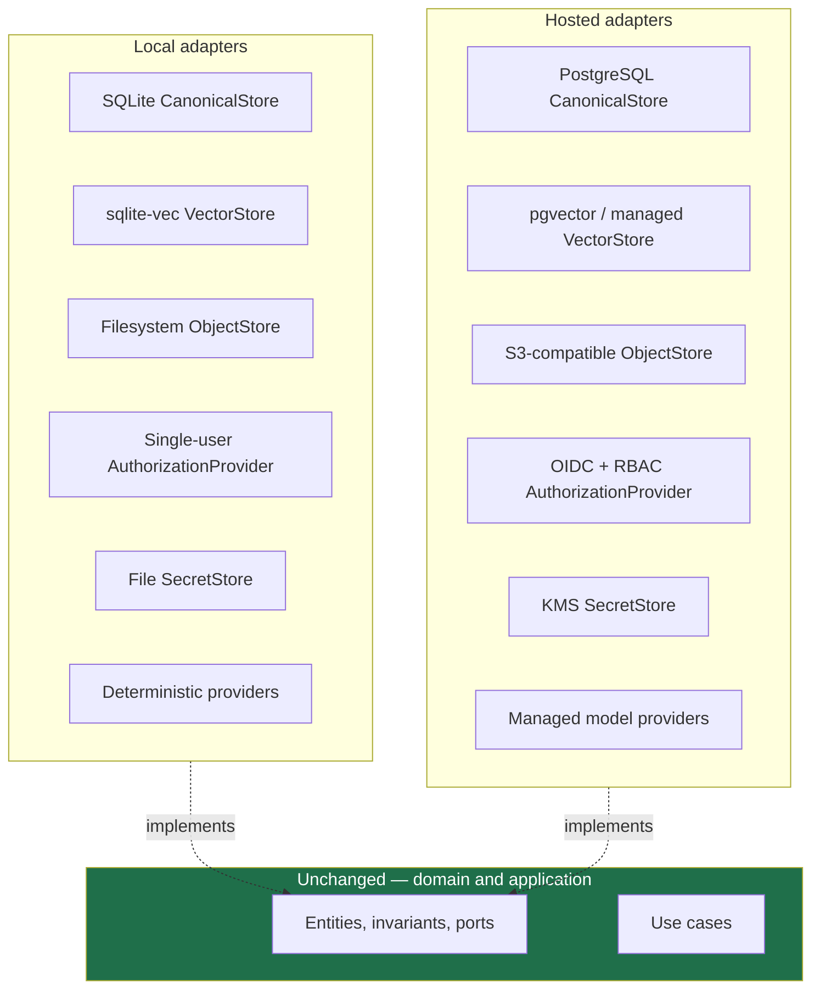
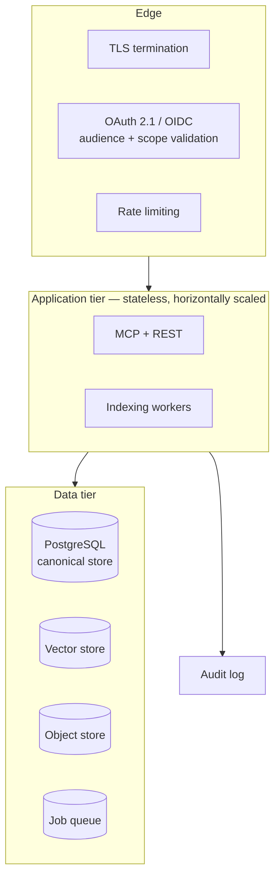
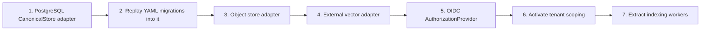

# Cloud-ready design

Theurian Core is a local tool. It is built so that a hosted deployment is a
change of adapters rather than a rewrite — and so that the OSS Core never needs
one.

## The commitment first

**Theurian Core will always work completely offline**, with no account, no
network call, and no API key. No feature will be removed from Core to sell it
back. That is stated in [GOVERNANCE.md](../../GOVERNANCE.md) as a commitment, not
an intention.

Everything below is about *making a hosted deployment possible*, never about
making it necessary.

## What changes, and what does not

## The decisions that make this possible

Each was made in Milestone 0, before any code depended on the opposite.

| Decision | Local benefit | What it enables later |
| :-- | :-- | :-- |
| Ports and adapters ([ADR-0003](../adr/0003-ports-and-adapters.md)) | testable offline | storage and provider substitution |
| YAML migrations, not SQL ([ADR-0005](../adr/0005-yaml-knowledge-migrations.md)) | reviewable diffs | replay into PostgreSQL or a document store |
| Explicit per-request context ([ADR-0002](../adr/0002-single-local-daemon-over-streamable-http.md)) | no cross-agent leakage | the model a multi-tenant server needs anyway |
| `TenantId` in every scope | always `local` | tenant isolation with no schema change |
| `AclGroup` in every scope | always `default` | per-group authorization |
| Scope-partitioned RAPTOR ([ADR-0008](../adr/0008-raptor-forest.md)) | no sensitivity mixing | no cross-tenant mixing, structurally |
| Bearer-token auth ([ADR-0011](../adr/0011-local-mcp-authentication.md)) | loopback security | upgrades to OAuth 2.1 in shape |
| Streamable HTTP | observable with `curl` | already the right transport |

`TenantId` and `AclGroup` are the clearest example of paying a small cost now to
avoid an impossible one later. Locally they are constants. But they are
components of RAPTOR tree identity — and retrofitting a scope component after
trees exist means rebuilding every tree in every deployment.

## What a hosted deployment adds

- **Multi-tenancy** — `TenantId` becomes real; every query is tenant-scoped
- **AuthN/AuthZ** — OIDC, RBAC, per-project ACLs
- **Managed indexing** — workers instead of an in-process queue
- **Cross-repository search** — many projects in one tenant, already modelled
- **Audit log** — every access recorded
- **Enterprise policy** — organization-wide traceability requirements

## What must not happen

| Anti-pattern | Why |
| :-- | :-- |
| A cloud SDK in `domain/` or `application/` | Breaks the layering; makes local operation impossible |
| A required hosted service in Core | Breaks OSS-13 and NFR-10 |
| A feature removed from Core to sell it | Breaks the governance commitment |
| A local-only shortcut that a hosted build cannot honour | Creates two divergent codebases |
| Tenant checks added later | Authorization retrofitted after the call sites exist is always incomplete |

A CI job greps `domain/` and `application/` for vendor names. It is a crude
check, and it catches the exact drift that would make this document a lie.

## Migration path

Step 2 is the one that matters: because the migration log is YAML domain
operations rather than SQL, replaying an organization's entire knowledge history
into a different database is an adapter exercise, not a data-migration project.
That property was bought in [ADR-0005](../adr/0005-yaml-knowledge-migrations.md),
before any storage code existed.

## Local-first stays a real mode

Even with a hosted Theurian available, the local daemon remains fully functional
— which matters for air-gapped environments, contributors without an account,
offline work, and evaluating the project before trusting it with anything.
