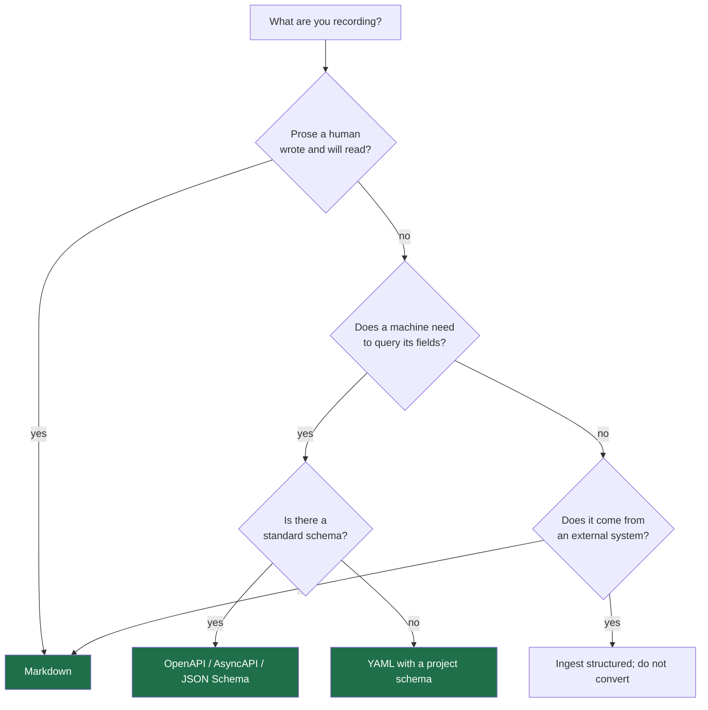

# Knowledge formats

Decision record: [ADR-0010](../adr/0010-three-layer-knowledge-model.md).

## Markdown is recommended, not required

Theurian recommends Markdown for **human prose knowledge** — ADRs, design
rationale, domain explanations, runbooks, incident write-ups, rejected
approaches, generalized review knowledge. It is diffable, reviewable, and
readable without tooling.

It is emphatically **not** the required storage format, and it is never the
canonical form of something that was born structured.

## Supported today

| Format | Media type | Structure preserved |
| :-- | :-- | :-- |
| Markdown | `text/markdown` | headings, code fences |
| YAML | `application/yaml` | full document tree |
| JSON | `application/json` | full document tree |
| JSON Schema | `application/schema+json` | definitions, properties |
| OpenAPI | `application/vnd.oai.openapi` | paths, operations, parameters, schemas |
| AsyncAPI | `application/vnd.aai.asyncapi` | channels, messages |
| Git diff | `text/x-diff` | hunks, file paths, line ranges |
| Git commit | structured | author, message, tree, parents |
| GitHub PR / review / issue | structured | threads, resolution, target lines |

Planned: PDF, DOCX, PPTX, HTML, wikis, ticket systems, chat. Each is a
`SourceParser` adapter and needs no domain or application change (FR-S4).

## Why not convert everything to Markdown

Three separate failures, and all three are real:

**It destroys structure.** An OpenAPI document has typed parameters and response
schemas. A specification has preconditions, rules, and outcomes. Flattened to
prose, `spec.getCoverage` cannot ask "which outcomes have tests?" — the outcomes
no longer exist as data.

**It fabricates a record of truth.** A GitHub review thread rendered to Markdown
is a *projection*. Treating it as canonical means the resolution state, the fix
commit, and the thread structure survive only as prose an LLM must re-parse — and
re-parse differently each time.

**It conflates authority with convenience.** Once a generated Markdown file is
treated as the source, someone edits it, and the edit is silently destroyed by
the next regeneration.

## Structured specifications keep their structure

```yaml
id: spec.order-cancellation
title: Order cancellation
preconditions:
  - order.status == pending
rules:
  - cancellationDeadline > now
outcomes:
  success:
    status: cancelled
  failure:
    code: CANCELLATION_NOT_ALLOWED
```

This is stored as-is *and* gets a text projection for lexical search. Retrieval
can query either:

| Query | Uses |
| :-- | :-- |
| "what happens when cancellation is too late?" | text projection |
| `outcomes.failure.code == "CANCELLATION_NOT_ALLOWED"` | structured fields |
| "which outcomes have no test?" | structured fields + traceability |

Coverage and contradiction detection are only possible because the second and
third exist.

## Body and state metadata are separate

```text
Markdown / YAML / JSON  →  the knowledge body
Migration YAML          →  status, revision, ownership, sensitivity, validity
```

The same metadata is never duplicated in front matter *and* a migration. One
would go stale, and there would be no rule for which wins. The migration is
authoritative for state; the file is authoritative for content.

This also makes the review ergonomics right: approving an ADR is a migration diff
that literally says `status: approved`, not a front-matter edit a reviewer has to
notice.

## Generated views are derived

```text
.theurian/generated/reviews/pr-431.md
```

Useful for reading. Git-ignored, regenerated freely, and **never the only home
for anything worth keeping**. If a generated review summary is worth preserving,
it is promoted into approved knowledge through a migration — not rescued from a
git-ignored directory.

## Choosing a format



## Adding a format

1. Implement `SourceParser` in `infrastructure/filesystem/parsers/`.
2. Enforce the input limits from `theurian.security` — parsers never trust input.
3. Use a safe loader.
4. Never fetch an external `$ref`; record it unresolved (SSRF).
5. Populate `NormalizedDocument.structured`. Extracting text only is the mistake
   this whole document exists to prevent.
6. Register it in the composition root.

No domain change. No application change. That is what the port is for.
