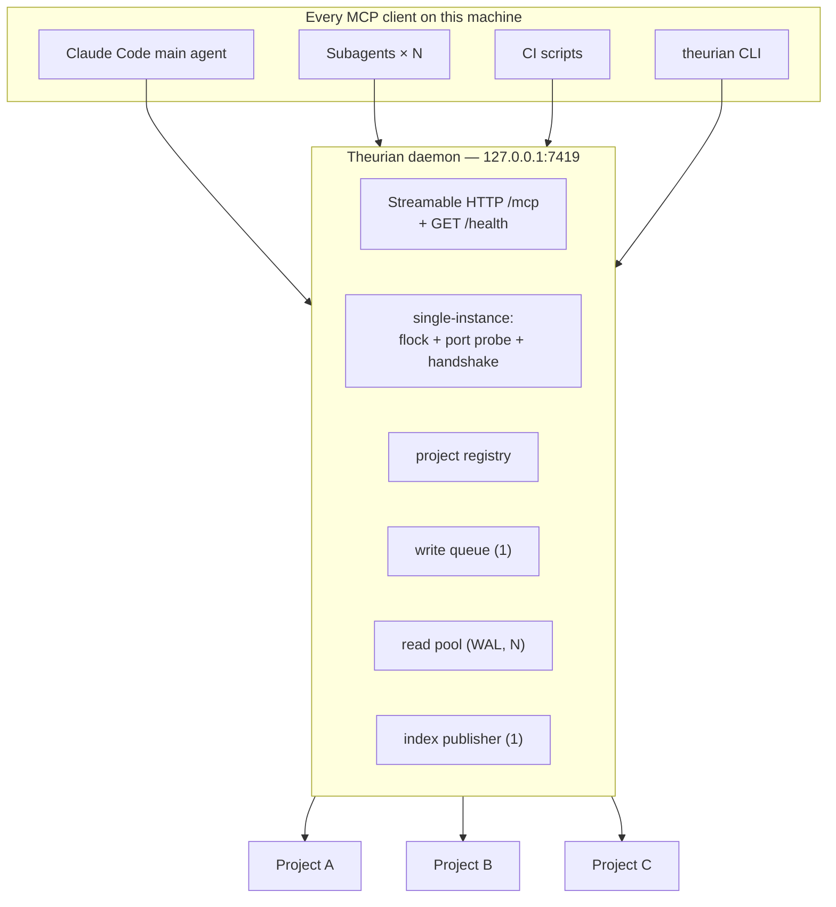
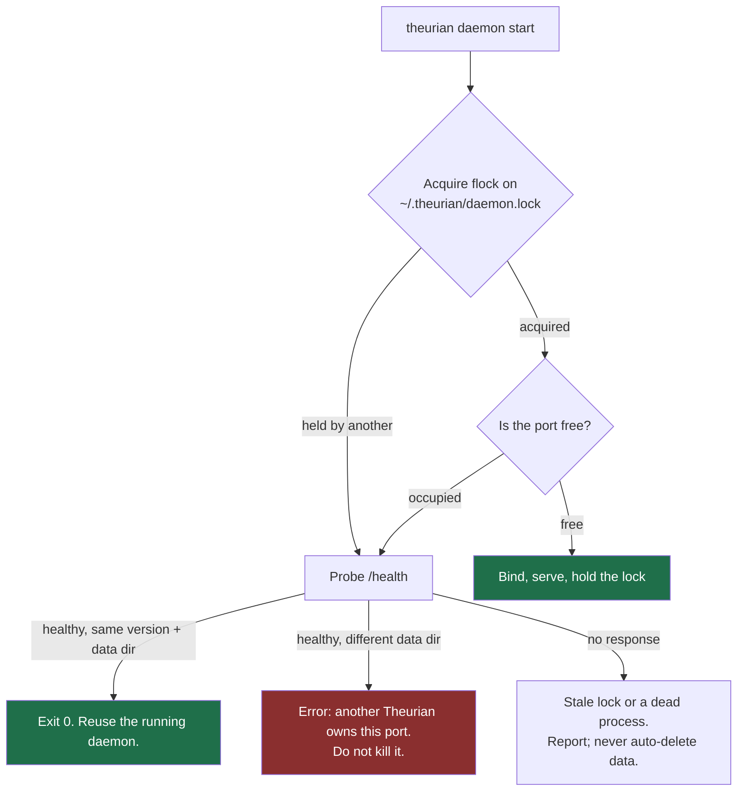
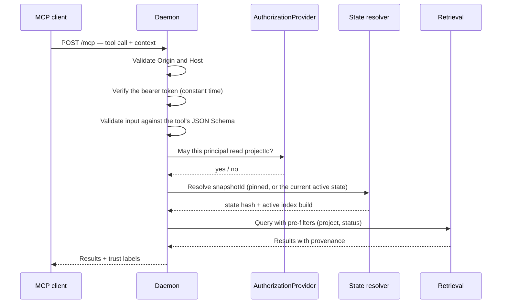

# The local daemon

Decision record: [ADR-0002](../adr/0002-single-local-daemon-over-streamable-http.md).
Security: [local-mcp.md](../security/local-mcp.md).

## One process, per user, per machine



## Why not stdio

A stdio MCP server is spawned once per client. In Claude Code that means one per
session and, in practice, one per subagent. For Theurian:

| Consequence | Why it is fatal, not merely wasteful |
| :-- | :-- |
| N write connections to one SQLite file | Concurrent writers on a file-backed database corrupt it |
| N index builders | Racing builds publish partial trees |
| N caches | No shared warmth; the tenth agent is as slow as the first |
| No single publisher | The atomic index swap has no owner |

The cost of HTTP is that something must start the daemon. That is the entire
reason `/theurian:setup` exists.

## Single-instance enforcement

Three mechanisms, because each alone has a known failure mode:



- **A PID file alone is insufficient.** PIDs are recycled; a stale file can name
  a live unrelated process.
- **A lock alone is insufficient.** Advisory locks behave inconsistently on some
  network filesystems, and a deleted lock file loses the guarantee silently.
- **A port probe alone is insufficient.** Something else may hold the port, which
  is why the handshake reports version and data directory.

A losing starter exits 0 after confirming the winner is healthy. It never kills
the winner, and it never repairs data automatically — an automatic repair of a
suspected corruption is how data gets lost.

## Concurrency

| Concern | Model |
| :-- | :-- |
| Reads | N independent connections, `journal_mode=WAL`, `busy_timeout=5000`, `synchronous=NORMAL`, `foreign_keys=ON` |
| Writes | One asyncio task owning one connection, fed by a queue |
| Index publication | One publisher; `active_indexes` swapped atomically |
| External I/O | Always outside a write transaction |

The external-I/O rule matters more than it looks. Summarizing a document can take
seconds. Holding a write transaction across that call blocks every other write
for the duration and turns a slow model into a stalled daemon. The pattern is
always: read → release → call → re-acquire → write.

## Request lifecycle



Every step before retrieval is a gate. None of them consult ambient state: the
project, the snapshot, and the principal all come from the request.

The pre-filter step said "(tenant, ACL, sensitivity, validity)" until this pass,
which is FR-R1's list of axes rather than the two `SqliteIndexStore._scope`
emits. Filtering happens before ranking, which is the property FR-R1 exists for
and which does hold; enforcing the other three axes (tenant, ACL, sensitivity)
is [#119](https://github.com/theurian/theurian/issues/119), the successor to #63.

## Health endpoint

`GET /health` is unauthenticated and returns only:

```json
{ "status": "ok", "version": "0.4.0", "protocolVersion": "theurian/v1", "uptimeSeconds": 3421 }
```

Deliberately uninformative. This is what the `SessionStart` hook calls, and a
health check that needed a credential would push credential handling into a hook
that runs on every session.

## OS service registration

Per user. Never root, never `sudo`.

| Platform | Mechanism | Location |
| :-- | :-- | :-- |
| macOS | LaunchAgent | `~/Library/LaunchAgents/dev.theurian.daemon.plist` |
| Linux | systemd user unit | `~/.config/systemd/user/theurian.service` |
| Windows | Task Scheduler | interface defined; not a 1.0 gate |
| Container | Docker Compose | interface defined |

Behind the `DaemonManager` port, with two hard rules: installation happens only
from an explicit user action, and `status()` is cheap and side-effect-free
because `SessionStart` calls it.

## Failure modes

| Situation | Behaviour |
| :-- | :-- |
| Port occupied by another Theurian | Reuse if the data directory matches; otherwise error without killing it |
| Port occupied by something else | Clear error naming the port and the occupant |
| Stale lock, no listener | Report it; suggest `theurian doctor`. Never auto-delete state |
| Daemon crashes mid-index-build | The build is abandoned; the previous active index still serves; the partial build is garbage-collected explicitly |
| Two `setup` invocations race | One wins; the other converges. Tested |
| Database corrupted | Refuse to serve; report; suggest a rebuild from Git-tracked migrations — which is always possible (ADR-0004) |
