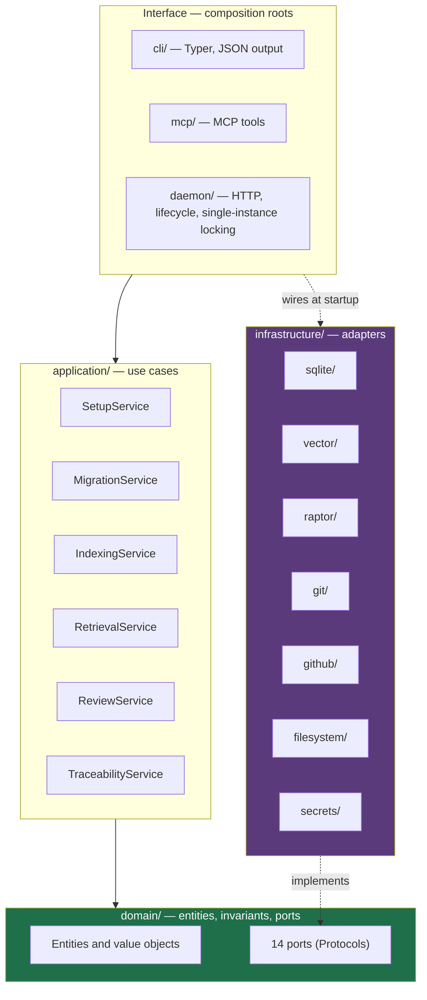
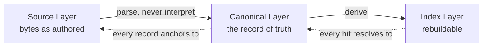
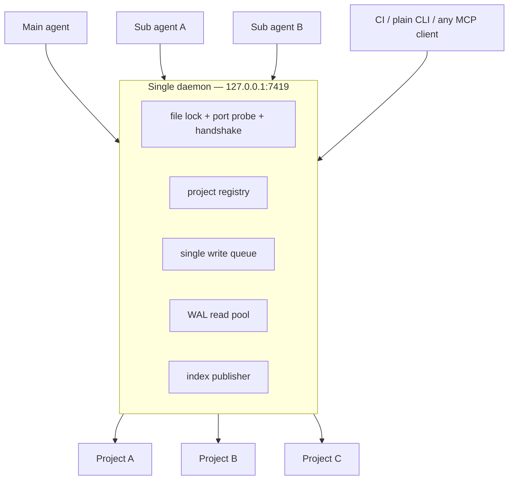
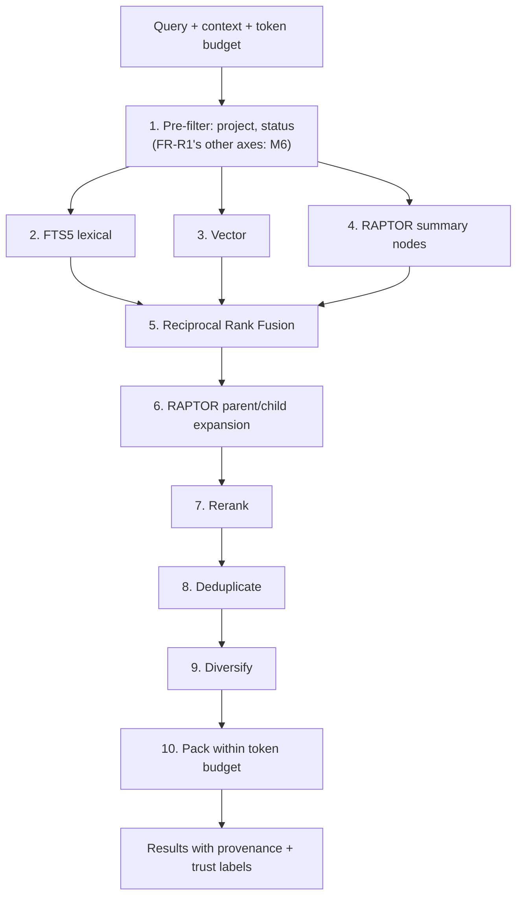
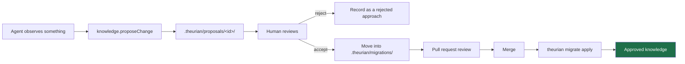

# Architecture overview

Start here. Detail lives in the [ADRs](../adr/README.md) and the
[requirements analysis](requirements-analysis.md).

## The shape of the system



The dependency rule: **`domain/` imports nothing from `application/` or
`infrastructure/`**. It is checked by a lint rule and by
`tests/unit/test_layering.py`, which walks the real import graph. An
architecture rule that lives only in a document gets violated within a quarter.

## The three layers of knowledge



- **Source** is never rewritten by Theurian — only read, hashed, and anchored.
- **Canonical** is the only layer citable as team knowledge.
- **Index** is disposable. Deleting it must lose nothing.

A structured source stays structured in the Canonical layer. An OpenAPI document
keeps its operations and schemas; the text rendering is a projection alongside
them, not a replacement. Flattening everything to prose would remove exactly the
fields that coverage and drift detection read.
([ADR-0010](../adr/0010-three-layer-knowledge-model.md))

## Where state lives

| | Location | Git-tracked | Rebuildable |
| :-- | :-- | :-- | :-- |
| Knowledge migrations | `.theurian/migrations/` | ✅ | — |
| Approved bodies | `.theurian/knowledge/` | ✅ | — |
| Specifications | `.theurian/specifications/` | ✅ | — |
| Proposals | `.theurian/proposals/` | ✅ (optional) | — |
| Canonical store | `.theurian/state/*.sqlite` | ❌ | ✅ |
| Index, embeddings, RAPTOR | `.theurian/state/` | ❌ | ✅ |
| Review cache | `.theurian/cache/` | ❌ | ✅ |
| Generated Markdown views | `.theurian/generated/` | ❌ | ✅ |
| Daemon runtime files | `.theurian/runtime/` | ❌ | ✅ |
| Token, registry, service | `~/.theurian/` | ❌ | partly |

The controlling rule: applying every migration to an empty database must
reproduce the complete canonical state from Git-tracked inputs alone. Anything
that cannot be rebuilt that way is either a bug or belongs in Git.
([ADR-0004](../adr/0004-sqlite-is-a-derived-artifact.md))

## One daemon, many projects, many agents



Every call carries its own context — `projectId`, optional `snapshotId`,
`agentId`, `taskId`. There is no process-global and no connection-scoped current
project, because with many agents sharing one daemon an implicit default resolves
one agent's query against another agent's project.
([ADR-0002](../adr/0002-single-local-daemon-over-streamable-http.md))

Concurrency:

- **reads** — N independent WAL connections, `busy_timeout=5000`
- **writes** — one asyncio task owning one connection, fed by a queue
- **index publication** — one publisher, atomic swap of `active_indexes`
- **external I/O** — always outside a write transaction: read → release → call →
  re-acquire → write

## Branch handling

State is content-addressed:

```text
state_hash = SHA256(sorted migration IDs + migration checksums
                  + source checksums + schema version + engine version)
```

One database per distinct state. Switching to a previously built state is O(1); a
descendant state applies only the delta; a divergent branch builds separately
while the previous complete index keeps answering every query. A caller can pin a
`snapshotId` so an agent's task sees one unchanging knowledge base even if the
developer switches branches mid-run.
([ADR-0007](../adr/0007-state-hash-partitioned-databases.md))

## Retrieval



Filtering happens **before** ranking. Filtering afterwards returns fewer results
than requested and leaks the existence of hidden content through result-count
differences.

Box 1 named all five of FR-R1's axes until this pass. `SqliteIndexStore._scope`
emits two — project, and status when the caller has not opted into unapproved
rows. Tenant and ACL groups exist as domain values (`Scope`, `TenantId`,
`AclGroup`, pinned by `tests/unit/test_scope_isolation.py`) and default to the
single-tenant case; the index carries `sensitivity`, `trust_level` and
`namespace` as columns no query reads. Steps 3, 4 and 6 are likewise Milestone 6
— dense retrieval is built but off by default, and RAPTOR is not built at all.
The remaining pre-filter gap — enforcing tenant, ACL and sensitivity — is
[#119](https://github.com/theurian/theurian/issues/119); #63 phase 0 recorded
the per-axis disposition and closed.

Every result carries `itemId`, `revisionId`, `snapshotId`, `indexBuildId`,
`sourceAnchors`, `raptorPath`, `trustLevel`, `freshness`, and the safety triple
`contentClassification` / `mayContainInstructions` / `executable`. A result with
no anchor is not returned — an unverifiable claim is worse than no answer.

## The knowledge lifecycle



AI proposes. Git reviews. Humans approve. There is no MCP path that mutates
approved state. ([ADR-0013](../adr/0013-ai-writes-produce-proposals.md))

## Further reading

| Topic | Document |
| :-- | :-- |
| Requirements, risks, threat model, setup state machine | [requirements-analysis.md](requirements-analysis.md) |
| Every architecture decision and its rejected alternatives | [../adr/README.md](../adr/README.md) |
| Trust boundaries and enumerated threats | [../security/threat-model.md](../security/threat-model.md) |
| Migration format | [../protocol/migrations.md](../protocol/migrations.md) |
| Plugin/Core compatibility | [../protocol/plugin-core-compatibility.md](../protocol/plugin-core-compatibility.md) |
| Using Theurian with Serena | [../integrations/serena.md](../integrations/serena.md) |
