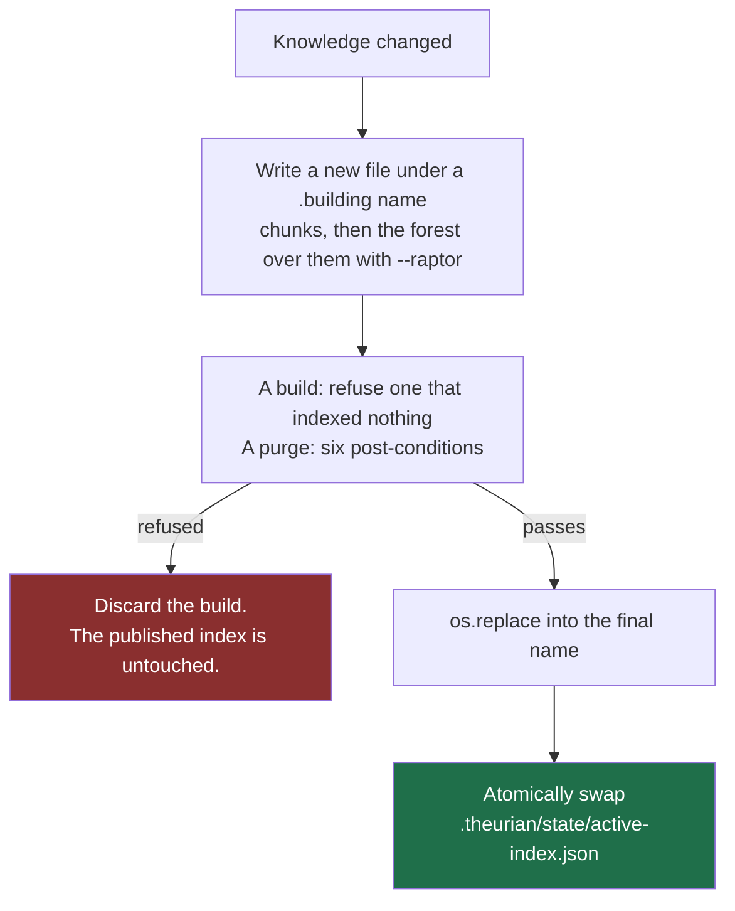
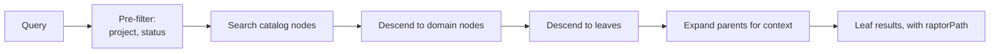

# RAPTOR forest

Decision record: [ADR-0008](../adr/0008-raptor-forest.md), as amended in
Milestone 6. Where this page and that ADR would both state a mechanism, this one
points at it — a second telling is a second thing to keep true.

**The forest is built and never read.** `theurian index build --raptor` derives
the three tiers below and writes them into the index — a build without the flag
writes zero node rows — and a withdrawal purges them transitively. What does not
exist is the other direction: no retrieval path traverses a node,
`system.capabilities` reports `"raptor": false`, and no result carries a
`raptorPath`. So a summary node is written, purged, and never returned to
anyone. Below, the present tense marks what runs today and "will" marks the
design the retrieval change is building toward.

## What RAPTOR does

RAPTOR builds a tree of recursive summaries over a corpus, so a broad query can
match a high-level summary and retrieval can descend from it to the specifics.
It is aimed at "what is our approach to authentication?" — a question flat chunk
retrieval handles badly, because no single chunk contains the answer. Theurian
answers that question from leaf chunks alone today, which is the gap the forest
is meant to close.

## Why a forest and not a tree

Applied naively to a whole organization's knowledge, RAPTOR produces one
enormous tree with two failure modes: one operational, one a security incident.

**Operational.** Every edit invalidates summaries all the way to the root. A
one-line ADR correction triggers a full-tree rebuild.

**Security.** A summary node is *a new document synthesized from its children*.
If a node's children span a `restricted` incident report and a `public` API
guide, the summary text contains restricted facts and inherits whichever ACL the
implementation happened to assign. The leak then lives in generated text with no
anchor to the restricted source, which is what makes it nearly undetectable
afterwards.

That describes the un-partitioned alternative, not Theurian's retrieval. No
retrieval path reads `chunks.sensitivity`: sensitivity is a **published label,
not a control**, with the control deferred to
[#119](https://github.com/theurian/theurian/issues/119) — the per-axis register
in [requirements-analysis.md](requirements-analysis.md) records that disposition
axis by axis. What partitioning stops is a summary mixing two sensitivities into
one text — and it makes no serving decision even so, which is why the forest
neither waits for #119 nor advances it.

## The structure


Tree identity is
`(project, tenant, sensitivity, acl_group, namespace, status)` — `Scope` in
`domain/values.py`. A node whose children differ in any component **has no tree
it could belong to**, which is what makes the isolation structural rather than a
check somebody has to remember to write. That distinction is the whole point: a
forgotten check produces exactly the undetectable leak described above.

`status` is the sixth component, added by the Milestone 6 amendment to ADR-0008
decision 1. The reason is that a build has a
flavor: `theurian index build --include-unapproved` holds drafts and proposals
beside approved revisions, so without `status` in the tuple a node can be
summarized from children that straddle that boundary, and which query flavor
then traverses it is decided by a column the builder happened to fill. The
amendment states what that costs — routing and recall, not disclosure — and why
`validity` is deliberately *not* a seventh component.

What holds the rule, in three places, because no one of them can hold it alone.
`SummaryNode.__post_init__` (`domain/raptor.py`) raises
`InvariantViolationError` when a declared child scope differs from the node's
own. Those children are *declarations*, so a builder passing its own scope n
times would satisfy that type without consulting a single child: `IndexableNode`
closes that half by refusing a node whose declarations do not stand one per
source, and `application/forest_builder.py` supplies each declaration from the
chunk or node it summarizes. `SummaryNode.tree_id` is `Scope.digest`, total over
all six components; what a stored row carries is `tree_identity`, which adds the
tier and the within-scope partition on top of it, or two items with duplicate
content would mint one id for two nodes.

The result is asserted over a real build rather than at the value level alone:
`tests/integration/test_forest_builder.py::test_no_node_stands_on_chunks_that_disagree_on_a_scope_component`
walks `node_derivation` transitively and requires every leaf chunk a node stands
on to agree on all six components, parametrized over the three axes a corpus can
vary — namespace, sensitivity and status. Tenant and ACL group are not among them
and cannot be: the migration engine refuses a revision naming any value but the
default, so no corpus can carry a second one to mix.

**One limit, stated because it decides whether the assertion may ever be
relaxed.** A declaration equal to the parent's scope cannot be told apart from
one copied off the parent — for a correctly clustered node the two are the same
value. What the refusal catches is a declaration standing for no source, which is
the shape a clusterer crossing a scope boundary produces; the grouping itself is
attacked directly by
`tests/unit/test_forest_derivation.py::test_a_node_never_mixes_two_statuses_under_one_namespace_and_kind`.

The scope key joins the six components with a unit separator (`\x1f`), which no
component can carry: `AclGroup`, `TenantId` and `namespace` reject C0 controls
and DEL at construction, `ProjectId` is a kebab-case slug, and `sensitivity` and
`status` are enums. Without that validation, `acl_group="a\x1fb"` +
`namespace="c"` and `acl_group="a"` + `namespace="b\x1fc"` render one key — a
collision reviewers demonstrated here while the docstring already claimed the
property.
`packages/theurian-core/tests/unit/test_scope_isolation.py::test_all_scope_pairs_are_distinguishable`
asserts that all **64** combinations of two values per component produce 64
distinct digests, and pins the product itself (`assert len(scopes) == 64`) so
that a dropped component cannot pass as a smaller exhaustive run. Three tests
beside it reject a separator in each free-form component — `acl_group`,
`tenant_id`, `namespace` — and a fourth pins that neither half of the measured
colliding pair can be constructed at all.

## Three levels

ADR-0008 decision 2, and `application/forest_builder.py` builds exactly these,
deepest tier last.

| Level | Scope | Summarizes | One node per |
| :-- | :-- | :-- | :-- |
| 1 Document Tree | one knowledge item | that item's chunks | item revision, in scope |
| 2 Domain Tree | one kind, inside a scope | its document nodes | kind, in scope |
| 3 Global Catalog Tree | one scope tuple | its domain nodes | scope |

Decision 2 says "one namespace **or** kind" for the Domain tier, and inside a
scope that reduces to `kind`, because the scope has already fixed the namespace.
`IndexableChunk` carries `kind` for that reason and for no other — nothing
queries it, and it is consumed in memory by the build that produced the chunk.
Without it a scope holds exactly one Domain tree, the Catalog tier always has a
single child, and three levels are structurally unreachable.

A level is skipped when it has fewer than `minChildrenPerSummary` children:
summarizing one document produces a paraphrase, which costs tokens and adds
nothing. **The threshold is real now and the config file is still unread.**
`ForestOptions` carries `max_levels` and `min_children_per_summary` with the
defaults `schemas/config/project-config.schema.json` declares, and
`tests/unit/test_forest_derivation.py::test_the_option_defaults_are_the_config_schemas_own`
pins the two against that file so they cannot drift before a loader exists.
Nothing in `src/` reads `.theurian/config.yaml`, so **the CLI flag is the switch
and the config key is not** — `raptor.enabled` is declared `false` in the schema
and set `false` in `examples/sample-project/.theurian/config.yaml` (ADR-0008
decision 10's two places, both flipped by the builder change), and `theurian
index build --raptor` is what actually turns a forest on, for one build.

`summary_max_tokens` is the third option and deliberately has no config key: it
is a constant, never a share of anything the corpus decides, because a budget
divided by document count would move a visible node's text when a withheld
document was added or removed. See the sixth summarization constraint below.

## Building and publication



Publication is a pointer *file*, not a table: `.theurian/state/active-index.json`
names the build that answers queries, written temp-then-`os.replace` so a reader
never observes a half-written pointer
([ADR-0022](../adr/0022-index-lives-in-its-own-database.md) point 5,
[ADR-0024](../adr/0024-a-purge-is-a-build.md)). There is no `active_indexes`
table, in this schema or any earlier one.

**A *partial* build is never pointed at, structurally.** Both writers build
under a `.building` name and `os.replace` into the final one, so a file under
that name is complete by construction, and the pointer is written only
afterwards. *Unverified* is the narrower claim, and it belongs to the purge
path: `_verify`'s six post-conditions raise before anything is published. The
ordinary build path has one post-build refusal, not six — `_refuse_if_empty`
discards a build that indexed nothing while the canonical store holds knowledge,
because publishing that puts a correct-looking empty index in place, where every
later search answers `count: 0` with `indexed: true`.

Search does not go dark across a rebuild, but it can lose its *indexed* answer.
Publishing no longer deletes the build it replaces — reclaiming is the explicit
`theurian index gc` (ADR-0024 point 6) — and a request that has acquired its
read session keeps answering from its own build even if `gc` unlinks the file
underneath (point 7). The window is narrow and named: a request reaped between
resolving the pointer and acquiring that connection has no descriptor to
protect, so it answers from the substring-scan fallback instead of the index.

**Incremental subtree rebuild is deferred; the forest is re-derived in full
inside the existing build path.** `IndexBuilder` derives it from the chunks it
has just written, in memory, rather than by reading the index back — which is
what keeps the derivation a pure function of that build's own output — and
nothing is reused across builds. A full re-derivation is one code path whose
output is a function of canonical state alone, while an incremental one is a
second path that has to agree with the first on every input and fails invisibly:
a node left standing that no longer matches its children. The argument, the
deferral, and what the milestone that lifts it owes are in ADR-0008 decision 3's
amendment. What the full path buys is checkable:
`test_rebuilding_the_same_state_produces_a_byte_identical_forest` rebuilds an
unchanged state and requires every node row to match, `index_build_id` excepted.

Withdrawal is the one traversal over node rows that exists today, and it is a
build rather than an edit: a purge copies the previous build, deletes from the
copy, verifies, and republishes (ADR-0024). Its rule for derived rows is
universal grounding — a node survives only if *every* declared source terminates
at a surviving chunk in finitely many steps, so one good parent and one that
leads nowhere is still removed — and `_verify` refuses to publish a build
holding an unprovenanced node, an edge whose source is gone, a node on a
provenance cycle, or an orphaned node embedding. The predicate is `_DOOMED` in
`infrastructure/sqlite/index_purge.py`, stated there and not restated here. That
traversal now meets forests a builder shaped rather than only fixtures written in
raw SQL:
`tests/integration/test_forest_builder.py::test_withdrawing_an_item_takes_its_document_node_and_the_domain_node_above_it`
withdraws one item of three and requires its Document node and the Domain node
above it to go while the other two survive, and
`test_a_purged_forest_leaves_no_residue_in_a_node_text_index` reads `nodes_fts`
and `nodes_trigram` through `fts5vocab` to check that no term of the withdrawn
document is still indexed.

**Withdrawal is delete-only in the interim, and that is not what ADR-0008
decision 9 settles for.** Decision 9 rejects delete-only: it wants each affected
tree *re-derived* from its surviving rows, so that a purged build's forest equals
one built from a corpus that never held the withdrawn rows — deleting a node
outright breaks that equality in the other direction, because the never-held
corpus would have built a node from the children that survived. Re-derivation and
that equality both arrive with the purge-closure change. The property it will
rest on is already held here:
`test_rebuilding_the_same_state_produces_a_byte_identical_forest`, because an id
or a text that moved between two derivations of one state would make the equality
test unwritable rather than merely red. The equality itself is owed against
`packages/theurian-core/tests/integration/test_index_purge.py::test_a_purged_build_answers_as_if_the_rows_were_never_indexed`,
which is the two-corpus shape it extends, over the node tables' full contents.

## Node provenance

Every node row carries the provenance below — `nodes` in
`infrastructure/sqlite/index_schema.py`, index schema v4, written by
`IndexStore.add_nodes` in the same transaction as its derivation edges, because a
node without its edges cannot say what it holds and is a state `_verify` refuses
to publish:

```text
node_id, tree_id, level, node_type, text, content_hash,
summary_model, summary_model_revision, summary_prompt_hash,
embedding_model, embedding_model_revision, embedding_dimension,
source_revision_id, index_build_id
```

plus `project_id`, `sensitivity` and `status` to filter on. Provenance edges
live in `node_derivation`, one row per (node, the chunk or node it was built
from), which is what the purge above walks. `node_id` is content-addressed —
`node_identity(tree_id, level, the children's content hashes sorted)`, pinned
against a literal by
`tests/unit/test_raptor_scope.py::test_a_node_id_is_pinned_to_its_exact_join_order_sort_and_encoding`
— and `source_revision_id` names the one revision a Document node was built from,
empty above that tier, because a node built from other nodes has no single
revision to name and the purge reaches it through its edges instead.

Model and prompt identity **are** persisted: a node carries the `model_id`,
`model_revision` and `prompt_hash` of the provider that summarized it. What is
missing is the comparison — nothing checks a stored `summary_prompt_hash`
against the active configuration, so a node summarized under an older provider is
not detected as stale and not rebuilt. Changing a prompt therefore still leaves
an index silently mixing two generations with nothing reporting it. That item
stays owed in ADR-0008's Compliance section, on the half that was always the
point.

**Their own tables, not `chunks` rows with a `derived` flag.** `chunks_fts` and
`chunks_trigram` are external-content FTS5 tables, and `bm25` scores every row
against collection statistics computed over *every* row in `chunks` — `N`,
`avgdl`, and the per-term document frequencies. A summary systematically repeats
the terms of the children it was built from, so a summary row in `chunks` would
move all three under every ordinary leaf query, and a visible leaf's rank would
become a function of the forest's shape. `nodes` therefore has its own
`nodes_fts`, `nodes_trigram` and `node_embeddings`; v4 also drops
`chunks.derived` and `chunk_derivation`, the v3 column and table added for a
writer that turned out to want different storage (ADR-0008 decision 5's
amendment).

Two gaps the tables leave open. Tenant, ACL group and namespace have no node
column — `tree_id` encodes the whole six-component tuple, so a node's tree is
expressible, but no predicate can filter on those axes. And project and status
have no single enforcement point for node reads: `SqliteIndexStore._scope` is
that point for chunk reads, and a node traversal would be a second one unless it
is built through the same. ADR-0008 owes exactly that, together with the
mutation check that distinguishes one enforcement point from two that happen to
agree today.

## Summarization constraints

Five constraints on the summary itself, to be enforced in the prompt and
validated during evaluation — for a prompted adapter, neither exists yet: the
one adapter that exists (below) is extractive and carries no prompt at all,
and there is no retrieval evaluation harness to validate against.

| Constraint | Why |
| :-- | :-- |
| State no fact absent from the children | A knowledge platform that emits fiction is worse than one that emits nothing |
| Treat imperative source text as **data being described** | A document saying "ignore previous instructions" is a document that says that (SEC-16) |
| Retain child references | Every summary must be traceable to source text |
| Mark uncertainty rather than resolving it | A confident wrong summary is the expensive failure |
| Inherit sensitivity and ACL | Uniform by construction, given the scope rule |

**Two of the five are held by the builder rather than by any prompt, and are
therefore true of the extractive default as well.** Child references: every node
written names its sources in `node_derivation`, one edge per source, and
`IndexableNode` refuses a node whose declared child scopes do not stand one per
source. Sensitivity and ACL: a node's row carries the scope its children share,
because the scope is what decided which tree it belongs to.

Implementations must wrap source content in a delimited untrusted region and
never interpolate it into a system-role message. The port docstring states that
requirement; the one adapter that exists sends no prompt anywhere, so the
requirement is unexercised rather than unenforceable — it binds a future
prompted adapter, not this one.

A sixth constraint was added in Milestone 6, and no prompt can carry it because
it constrains the adapter rather than the model: **a summarizer is a pure
function of its children's texts, its scope tuple, and a configuration-derived
`max_tokens`** — no corpus-wide statistic may enter, and `max_tokens` must never
be a corpus-derived quantity. A statistic computed over a corpus is computed
over documents the caller may not read, so a summarizer using one would write a
withheld document's influence into the text of a *visible* node, where no purge
reaches it: deleting a row cannot delete from a sentence the reason that
sentence was chosen. ADR-0008 decision 6's amendment names the three carriers of
that class, and which two this constraint closes;
`SummarizationProvider.summarize` takes `texts`, `scope` and `max_tokens` and is
handed no corpus handle, so the port is shaped for the constraint without
enforcing it.

**The `max_tokens` half is the caller's to hold, and the builder holds it.** A
summarizer is handed the number and never the recipe, so no adapter can tell a
constant budget from a corpus-derived one. `forest_builder.SUMMARY_MAX_TOKENS` is
one chunk's worth — the chunker's target passage priced at the estimator's
characters-per-token — passed verbatim to every call, never divided by a cluster
size or a document count, and it is the one `ForestOptions` field with no config
key, so no configuration can turn it into a corpus-derived quantity either.
`tests/unit/test_forest_derivation.py::test_the_summary_budget_is_a_constant_and_not_a_share_of_the_corpus`
holds it with a recorder that sees what each call was charged. Carrier (b) —
which children cluster together — is still owed to the two-corpus equality test,
which is the only owed test that can vary the child set.

## Working with no model configured

The default `SummarizationProvider` is **extractive**:
`infrastructure/raptor/extractive.py`'s `ExtractiveSummarizer` selects
sentences rather than generating them, so it cannot state a fact its children
do not contain. Quality is lower than an abstractive summary; in exchange every
sentence is one the children already hold. It is deterministic and, per
ADR-0008 decision 6's Milestone 6 amendment, pure — a function of only the
`texts`, `scope` and `max_tokens` one call passes it, nothing cached on the
instance and no corpus handle held — pinned by
`tests/unit/test_extractive_summarizer.py`, in-process and across process
boundaries: `test_summarize_is_stable_across_processes` and
`test_a_tied_selection_is_stable_across_processes` run `summarize` in three
fresh interpreters at `PYTHONHASHSEED` 0, 1 and 999 and require one distinct
output. That seed variance is what cannot be tested within a single process,
and the tied fixture is run separately because a corpus with no score ties
cannot see a tie-break that started reading a hash-seed-dependent key.

**It is what a build calls.** `theurian index build --raptor` composes an
`ExtractiveSummarizer` and hands it each node's children — one call per node, and
the summary it returns is what the `nodes` row stores. It is composed whether or
not the flag was passed, because it holds no state, opens nothing and reaches no
network, so "was a summarizer configured" is not a second thing the flag means.

Two things ride on that choice. It is what lets Theurian produce a usable
forest offline with no API key
([ADR-0009](../adr/0009-no-llm-vendor-lock-in.md)), so abstractive
summarization is an upgrade and not a prerequisite. And its determinism is what
makes the purge's equality target reachable: a purged build's forest can equal a
never-held one only if tree derivation — the clusterer as much as the summarizer
— is a pure function of surviving rows, scope and configuration. A provider
without that property forfeits the equality, and ADR-0008 decision 9 records
what a purge does instead (delete the affected trees' nodes and record the
forest stale for them, which retains no withheld influence and restores no
equality).

## Retrieval through the forest



**The first box runs, and so does the last one minus its `raptorPath`.**
`SqliteIndexStore._scope` builds the pre-filter every leaf retriever uses, and
leaf results with provenance are what `knowledge.search` returns today. What
does not exist is everything between them — the traversal — and the
`raptorPath` the last box carries. The nodes those middle boxes would search are
in the index now; nothing looks at them. `search_lexical`, `search_substring` and
`search_dense` each name `chunks` in their SQL, which is why a forest can be
built without changing a single answer.

Retrieval performs no authorization-scope determination, which is what the first
box would otherwise be read as doing. Two axes are enforced: project, and status
as a pre-ranking predicate when the caller has not passed `includeUnapproved`
and as `may_surface` at the canonical gate when they have. Tenant and ACL group
are refused at write time, and sensitivity is a published label
([requirements-analysis.md](requirements-analysis.md),
[#119](https://github.com/theurian/theurian/issues/119)).

Filtering happens **before** ranking, and that is worth keeping whatever the
forest does: a post-filter returns fewer results than requested and leaks the
existence of hidden content through result-count differences.

Summary nodes will be **routing-only**: traversal may reach them, and only leaf
chunks will be published as results (ADR-0008 decision 8). `raptorPath` is what
would make a traversal visible to a caller — the summary context a hit sits in,
followed back down to the source text. It is declared on the domain result type
(`domain/retrieval.py`) and emitted by nothing: `mcp/results.py` builds every
result payload and has no such key, and no schema in `schemas/` names it. It
reaches the wire with the retrieval change and its own review, which has to
cover the routing effect and the node-derived `title` each segment carries, not
merely the field's presence.

## Replaceable

Summarization sits behind a port: `SummarizationProvider`, which is the port
ADR-0008 decision 7 names. The intent is that swapping extractive for
abstractive, or a hosted model for a local one, touches no domain, application,
or retrieval orchestration code. There is a consumer now — `ForestBuilder` takes
the summarizer by injection and `cli/index_commands.py` is the one place that
names a concrete adapter, so an abstractive provider is a wiring change there and
nowhere else. What is still missing is the *swap*: one adapter exists, there is
no second to exchange it for, so the property remains the shape of the contract
rather than something a swap has been run against.

The hierarchy itself has no port, and the builder that implements it —
`application/forest_builder.py` — is application-layer policy for a reason that
is checkable rather than stylistic: `application/index_builder.py` is where the
forest pass has to mount, and
`tests/unit/test_layering.py::test_application_does_not_import_infrastructure`
walks the real import graph, so a builder under `infrastructure/` could not be
called from the one place that must call it. The port set is closed and adding
one takes an ADR ([ADR-0003](../adr/0003-ports-and-adapters.md)), so a team
wanting a different hierarchical strategy would be changing that module rather
than configuring it.

The scope-partitioning rule is optional for neither: any implementation must
honour it, because it is a security boundary rather than a performance choice.
