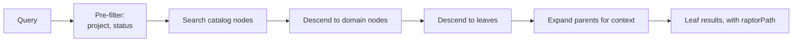

# RAPTOR forest

Decision record: [ADR-0008](../adr/0008-raptor-forest.md), as amended in
Milestone 6. Where this page and that ADR would both state a mechanism, this one
points at it — a second telling is a second thing to keep true.

**Nothing summarizes yet.** What exists today is the scope tuple, a
`SummaryNode` value type that refuses children whose scope disagrees with its
own, the index tables a node will live in (index schema v4), and a purge that
already walks them. No builder constructs a node, nothing maps a `SummaryNode`
onto a `nodes` row in either direction, and no retrieval path traverses one;
`system.capabilities` reports `"raptor": false`. Below, the present tense marks
what runs today and "will" marks the design Milestone 6 is building toward.

## What RAPTOR does

RAPTOR builds a tree of recursive summaries over a corpus, so a broad query can
match a high-level summary and retrieval can descend from it to the specifics.
It is aimed at "what is our approach to authentication?" — a question flat chunk
retrieval handles badly, because no single chunk contains the answer. Theurian
answers that question from leaf chunks alone today, which is the gap the forest
is meant to close.

## Why a forest and not a tree

Applied naively to a whole organization's knowledge, RAPTOR produces one
enormous tree with two failure modes: one operational, one a security incident.

**Operational.** Every edit invalidates summaries all the way to the root. A
one-line ADR correction triggers a full-tree rebuild.

**Security.** A summary node is *a new document synthesized from its children*.
If a node's children span a `restricted` incident report and a `public` API
guide, the summary text contains restricted facts and inherits whichever ACL the
implementation happened to assign. The leak then lives in generated text with no
anchor to the restricted source, which is what makes it nearly undetectable
afterwards.

That describes the un-partitioned alternative, not Theurian's retrieval. No
retrieval path reads `chunks.sensitivity`: sensitivity is a **published label,
not a control**, with the control deferred to
[#119](https://github.com/theurian/theurian/issues/119) — the per-axis register
in [requirements-analysis.md](requirements-analysis.md) records that disposition
axis by axis. What partitioning *would* stop is a summary mixing two
sensitivities into one text. Even then it would make no serving decision, so the
forest neither waits for #119 nor advances it.

## The structure


Tree identity is
`(project, tenant, sensitivity, acl_group, namespace, status)` — `Scope` in
`domain/values.py`. A node whose children differed in any component **would have
no tree it could belong to**, which is what would make the isolation structural
rather than a check somebody has to remember to write. That distinction is the
whole point: a forgotten check produces exactly the undetectable leak described
above.

`status` is the sixth component, added by the Milestone 6 amendment to ADR-0008
decision 1. The reason is that a build has a
flavor: `theurian index build --include-unapproved` holds drafts and proposals
beside approved revisions, so without `status` in the tuple a node can be
summarized from children that straddle that boundary, and which query flavor
then traverses it is decided by a column the builder happened to fill. The
amendment states what that costs — routing and recall, not disclosure — and why
`validity` is deliberately *not* a seventh component.

What holds the rule today, and what does not.
`SummaryNode.__post_init__` (`domain/raptor.py`) raises
`InvariantViolationError` when a child's scope differs from the node's own, and
`SummaryNode.tree_id` is `Scope.digest`, total over all six components. That is
the whole of the enforcement, because that value type is the only node anything
here can build. Its children are *declared* scopes: a builder passing its own
scope n times satisfies the type without consulting a single child, so the other
half of the guarantee — each declared scope derived from the child it summarizes
— is owed with the builder, and ADR-0008's Compliance section names it.

The scope key joins the six components with a unit separator (`\x1f`), which no
component can carry: `AclGroup`, `TenantId` and `namespace` reject C0 controls
and DEL at construction, `ProjectId` is a kebab-case slug, and `sensitivity` and
`status` are enums. Without that validation, `acl_group="a\x1fb"` +
`namespace="c"` and `acl_group="a"` + `namespace="b\x1fc"` render one key — a
collision reviewers demonstrated here while the docstring already claimed the
property.
`packages/theurian-core/tests/unit/test_scope_isolation.py::test_all_scope_pairs_are_distinguishable`
asserts that all **64** combinations of two values per component produce 64
distinct digests, and pins the product itself (`assert len(scopes) == 64`) so
that a dropped component cannot pass as a smaller exhaustive run. Three tests
beside it reject a separator in each free-form component — `acl_group`,
`tenant_id`, `namespace` — and a fourth pins that neither half of the measured
colliding pair can be constructed at all.

## Three levels

Design (ADR-0008 decision 2). Nothing builds these levels yet.

| Level | Scope | Summarizes |
| :-- | :-- | :-- |
| Document Tree | one knowledge item | that item's chunks |
| Domain Tree | one namespace or kind | its document trees |
| Global Catalog Tree | one scope tuple | its domain trees |

A level will be skipped when it has fewer than `minChildrenPerSummary`
children: summarizing one document produces a paraphrase, which costs tokens and
adds nothing. Today that threshold is a number in a schema and nothing else —
`raptor.minChildrenPerSummary` (default 3) is declared in
`schemas/config/project-config.schema.json`, and nothing in `src/` reads it, or
reads `.theurian/config.yaml` at all. The same holds for `raptor.enabled`, which
ADR-0008 decision 10 flips to `false` with the builder change so that turning
the forest on is somebody's decision rather than the side effect of an upgrade.
That flip is **two** places, both still saying `true`: the schema default, and
`examples/sample-project/.theurian/config.yaml`, which sets it explicitly and is
what a reader copies.

## Building and publication


Publication is a pointer *file*, not a table: `.theurian/state/active-index.json`
names the build that answers queries, written temp-then-`os.replace` so a reader
never observes a half-written pointer
([ADR-0022](../adr/0022-index-lives-in-its-own-database.md) point 5,
[ADR-0024](../adr/0024-a-purge-is-a-build.md)). There is no `active_indexes`
table, in this schema or any earlier one.

**A *partial* build is never pointed at, structurally.** Both writers build
under a `.building` name and `os.replace` into the final one, so a file under
that name is complete by construction, and the pointer is written only
afterwards. *Unverified* is the narrower claim, and it belongs to the purge
path: `_verify`'s six post-conditions raise before anything is published. The
ordinary build path has one post-build refusal, not six — `_refuse_if_empty`
discards a build that indexed nothing while the canonical store holds knowledge,
because publishing that puts a correct-looking empty index in place, where every
later search answers `count: 0` with `indexed: true`.

Search does not go dark across a rebuild, but it can lose its *indexed* answer.
Publishing no longer deletes the build it replaces — reclaiming is the explicit
`theurian index gc` (ADR-0024 point 6) — and a request that has acquired its
read session keeps answering from its own build even if `gc` unlinks the file
underneath (point 7). The window is narrow and named: a request reaped between
resolving the pointer and acquiring that connection has no descriptor to
protect, so it answers from the substring-scan fallback instead of the index.

**Incremental subtree rebuild is deferred; Milestone 6 will re-derive the forest
in full inside the existing build path.** A full re-derivation is one code path
whose output is a function of canonical state alone, while an incremental one is
a second path that has to agree with the first on every input and fails
invisibly — a node left standing that no longer matches its children. The
argument, the deferral, and what the milestone that lifts it owes are in
ADR-0008 decision 3's amendment.

Withdrawal is the one traversal over node rows that exists today, and it is a
build rather than an edit: a purge copies the previous build, deletes from the
copy, verifies, and republishes (ADR-0024). Its rule for derived rows is
universal grounding — a node survives only if *every* declared source terminates
at a surviving chunk in finitely many steps, so one good parent and one that
leads nowhere is still removed — and `_verify` refuses to publish a build
holding an unprovenanced node, an edge whose source is gone, a node on a
provenance cycle, or an orphaned node embedding. The predicate is `_DOOMED` in
`infrastructure/sqlite/index_purge.py`, stated there and not restated here. Once
nodes are actually built, withdrawal will *re-derive* each affected tree from
its surviving rows rather than delete or patch a node in place, so that a purged
build's forest equals one built from a corpus that never held the withdrawn rows
(ADR-0008 decision 9, which also records why node-local recompute cannot reach
that target). That equality is owed a test:
`packages/theurian-core/tests/integration/test_index_purge.py::test_a_purged_build_answers_as_if_the_rows_were_never_indexed`
is the two-corpus shape it extends, over the node tables' full contents.

## Node provenance

Every node row will carry the provenance below. The columns exist — `nodes` in
`infrastructure/sqlite/index_schema.py`, index schema v4 — and nothing writes
one:

```text
node_id, tree_id, level, node_type, text, content_hash,
summary_model, summary_model_revision, summary_prompt_hash,
embedding_model, embedding_model_revision, embedding_dimension,
source_revision_id, index_build_id
```

plus `project_id`, `sensitivity` and `status` to filter on. Provenance edges
live in `node_derivation`, one row per (node, the chunk or node it was built
from), which is what the purge above walks.

Model and prompt identity will be persisted so that staleness is exact rather
than heuristic: a node whose `summary_prompt_hash` differed from the active
configuration would be stale by definition and rebuilt. Without that, changing a
prompt would leave an index silently mixing two prompt generations with nothing
reporting it. The column exists; nothing compares it against a configuration,
because nothing writes a node and nothing reads one back (ADR-0008 Compliance,
Milestone 6).

**Their own tables, not `chunks` rows with a `derived` flag.** `chunks_fts` and
`chunks_trigram` are external-content FTS5 tables, and `bm25` scores every row
against collection statistics computed over *every* row in `chunks` — `N`,
`avgdl`, and the per-term document frequencies. A summary systematically repeats
the terms of the children it was built from, so a summary row in `chunks` would
move all three under every ordinary leaf query, and a visible leaf's rank would
become a function of the forest's shape. `nodes` therefore has its own
`nodes_fts`, `nodes_trigram` and `node_embeddings`; v4 also drops
`chunks.derived` and `chunk_derivation`, the v3 column and table added for a
writer that turned out to want different storage (ADR-0008 decision 5's
amendment).

Two gaps the tables leave open. Tenant, ACL group and namespace have no node
column — `tree_id` encodes the whole six-component tuple, so a node's tree is
expressible, but no predicate can filter on those axes. And project and status
have no single enforcement point for node reads: `SqliteIndexStore._scope` is
that point for chunk reads, and a node traversal would be a second one unless it
is built through the same. ADR-0008 owes exactly that, together with the
mutation check that distinguishes one enforcement point from two that happen to
agree today.

## Summarization constraints

Five constraints on the summary itself, to be enforced in the prompt and
validated during evaluation — neither of which exists yet: there is no
`SummarizationProvider` adapter to carry a prompt, and no retrieval evaluation
harness to validate against.

| Constraint | Why |
| :-- | :-- |
| State no fact absent from the children | A knowledge platform that emits fiction is worse than one that emits nothing |
| Treat imperative source text as **data being described** | A document saying "ignore previous instructions" is a document that says that (SEC-16) |
| Retain child references | Every summary must be traceable to source text |
| Mark uncertainty rather than resolving it | A confident wrong summary is the expensive failure |
| Inherit sensitivity and ACL | Uniform by construction, given the scope rule |

Implementations must wrap source content in a delimited untrusted region and
never interpolate it into a system-role message. The port docstring states that
requirement; no adapter exists to hold it.

A sixth constraint was added in Milestone 6, and no prompt can carry it because
it constrains the adapter rather than the model: **a summarizer is a pure
function of its children's texts, its scope tuple, and a configuration-derived
`max_tokens`** — no corpus-wide statistic may enter, and `max_tokens` must never
be a corpus-derived quantity. A statistic computed over a corpus is computed
over documents the caller may not read, so a summarizer using one would write a
withheld document's influence into the text of a *visible* node, where no purge
reaches it: deleting a row cannot delete from a sentence the reason that
sentence was chosen. ADR-0008 decision 6's amendment names the three carriers of
that class, which two this constraint closes, and the test owed for it;
`SummarizationProvider.summarize` takes `texts`, `scope` and `max_tokens` and is
handed no corpus handle, so the port is shaped for the constraint without
enforcing it.

## Working with no model configured

The default `SummarizationProvider` will be **extractive**: it would select
sentences rather than generate them, so it could not state a fact its children
do not contain. Quality would be lower than an abstractive summary; in exchange
every sentence would be one the children already hold.
The port is declared in `domain/ports/summarization.py` and has no
implementation — extractive or otherwise — so today there is nothing to
summarize with at all.

Two things ride on that choice. It is what will let Theurian produce a usable
forest offline with no API key
([ADR-0009](../adr/0009-no-llm-vendor-lock-in.md)), so abstractive
summarization is an upgrade and not a prerequisite. And its determinism is what
makes the purge's equality target reachable: a purged build's forest can equal a
never-held one only if tree derivation — the clusterer as much as the summarizer
— is a pure function of surviving rows, scope and configuration. A provider
without that property forfeits the equality, and ADR-0008 decision 9 records
what a purge does instead (delete the affected trees' nodes and record the
forest stale for them, which retains no withheld influence and restores no
equality).

## Retrieval through the forest



**The first box runs, and so does the last one minus its `raptorPath`.**
`SqliteIndexStore._scope` builds the pre-filter every leaf retriever uses, and
leaf results with provenance are what `knowledge.search` returns today. What
does not exist is everything between them — the traversal — and the
`raptorPath` the last box carries.

Retrieval performs no authorization-scope determination, which is what the first
box would otherwise be read as doing. Two axes are enforced: project, and status
as a pre-ranking predicate when the caller has not passed `includeUnapproved`
and as `may_surface` at the canonical gate when they have. Tenant and ACL group
are refused at write time, and sensitivity is a published label
([requirements-analysis.md](requirements-analysis.md),
[#119](https://github.com/theurian/theurian/issues/119)).

Filtering happens **before** ranking, and that is worth keeping whatever the
forest does: a post-filter returns fewer results than requested and leaks the
existence of hidden content through result-count differences.

Summary nodes will be **routing-only**: traversal may reach them, and only leaf
chunks will be published as results (ADR-0008 decision 8). `raptorPath` is what
would make a traversal visible to a caller — the summary context a hit sits in,
followed back down to the source text. It is declared on the domain result type
(`domain/retrieval.py`) and emitted by nothing: `mcp/results.py` builds every
result payload and has no such key, and no schema in `schemas/` names it. It
reaches the wire with the retrieval change and its own review, which has to
cover the routing effect and the node-derived `title` each segment carries, not
merely the field's presence.

## Replaceable

Summarization sits behind a port: `SummarizationProvider`, which is the port
ADR-0008 decision 7 names. The intent is that swapping extractive for
abstractive, or a hosted model for a local one, touches no domain, application,
or retrieval orchestration code. Nothing demonstrates that yet — the port has no
adapter and no consumer, so the property is the shape of the contract rather
than something a swap has been run against.

The hierarchy itself has no port. The port set is closed and adding one takes an
ADR ([ADR-0003](../adr/0003-ports-and-adapters.md)), so a team wanting a
different hierarchical strategy would be changing the builder rather than
configuring it.

The scope-partitioning rule is optional for neither: any implementation must
honour it, because it is a security boundary rather than a performance choice.
