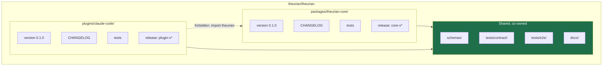
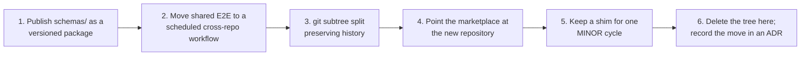

# Repository strategy

Decision record: [ADR-0001](../adr/0001-monorepo-with-independent-artifacts.md).

## One repository, two release trains



The two artifacts share a repository and a contract. They do not share a version,
a changelog, a release pipeline, or a set of maintainers.

## Why not two repositories on day one

Early on, the shared contract changes constantly. Splitting immediately means
every protocol change becomes a two-repository, ordering-sensitive, two-pull-request
operation — at exactly the moment the protocol is least stable.

## Why not one artifact

Because the boundary would rot within a month. Someone would import a Core module
from a plugin script — reasonably, because it is right there — and the split would
stop being possible. The enforcement exists from the first commit for that reason:

```text
plugins/claude-code/  →  theurian CLI (--json)
                      →  MCP over HTTP
                      →  GET /health, /capabilities
                      →  schemas/**.json
                      ✗  import theurian.*      ← CI failure
                      ✗  any .py file at all    ← CI failure
```

## Ownership

`.github/CODEOWNERS` splits review by expertise. Reviewing a daemon locking
strategy and reviewing a Claude Code hook are different skills.

| Path | Owners |
| :-- | :-- |
| `packages/theurian-core/` | Core maintainers |
| `plugins/claude-code/` | Plugin maintainers |
| `schemas/`, `tests/contract/`, `docs/protocol/` | **Both** |
| `docs/adr/`, `docs/architecture/` | Core maintainers |
| `GOVERNANCE.md`, `LICENSE`, `NOTICE` | Both |

Requiring both groups on `schemas/` is what makes the contract genuinely shared:
neither side can change what the other relies on unilaterally.

## CI is path-filtered

A plugin-only pull request should not pay for a Core test matrix.

| Changed | Runs |
| :-- | :-- |
| `packages/theurian-core/**` | Core quality, tests, offline run, packaging |
| `plugins/**` | Boundary checks, shellcheck, manifest validation |
| `schemas/**` | Schema validation **plus both** artifacts' suites |
| Both trees | Everything, plus cross-artifact compatibility |
| `docs/**`, `*.md` | Documentation link check |

Security workflows (CodeQL, dependency review, secret scan, SBOM, licence scan)
run on every change regardless.

## When to split

Written down in advance so the decision is a measurement rather than an argument.
Split when **any two** hold:

1. The protocol has been stable across two consecutive Core MINOR releases.
2. A second client plugin exists (Cursor, Zed, VS Code).
3. Plugin-only changes exceed 60% of pull requests over a quarter.
4. Plugin maintainers are a distinct group with no Core overlap.
5. Release coupling has caused an incident.
6. The marketplace requires a dedicated repository layout.

Full reasoning:
[requirements-analysis §21](requirements-analysis.md#21-conditions-for-splitting-the-plugin-into-its-own-repository).

## How the split would work



The preconditions are already satisfied by the Milestone 0 design, which is what
keeps the split cheap: zero source-level dependency, schemas consumable as an
artifact, contract tests running against an *installed* binary rather than a
source checkout, and independent changelogs and release workflows.

## Tag namespaces

Two release trains in one repository need unambiguous tags:

```text
core-v0.2.0      Theurian Core
plugin-v0.2.0    Claude Code plugin
```

Release procedure: [../contributing/release.md](../contributing/release.md).
