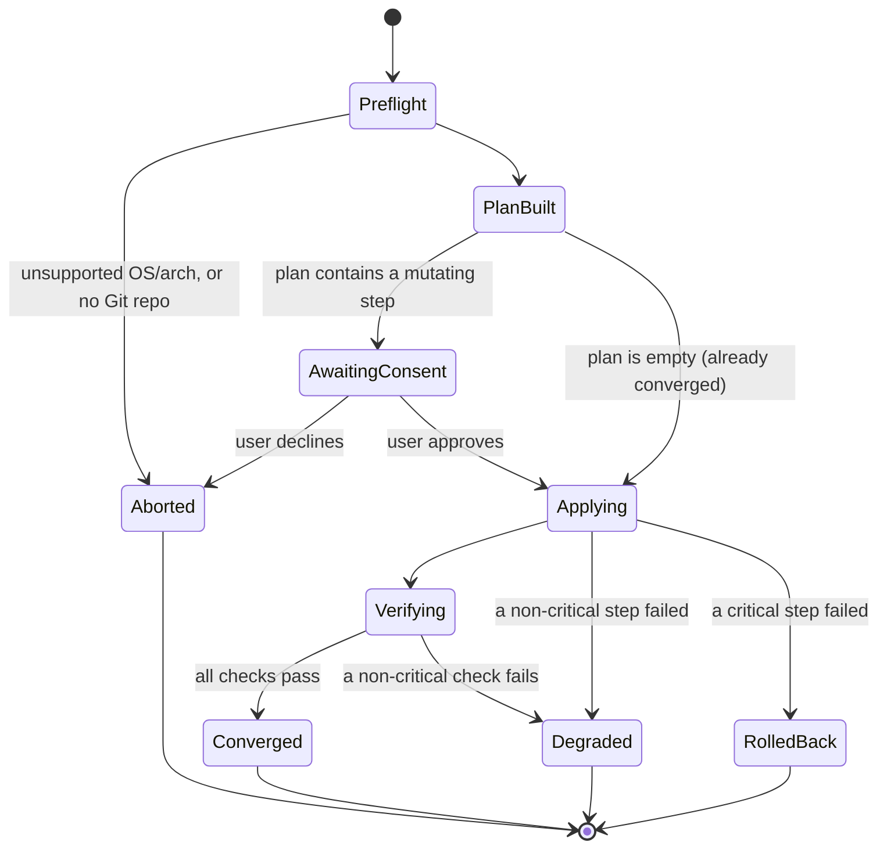
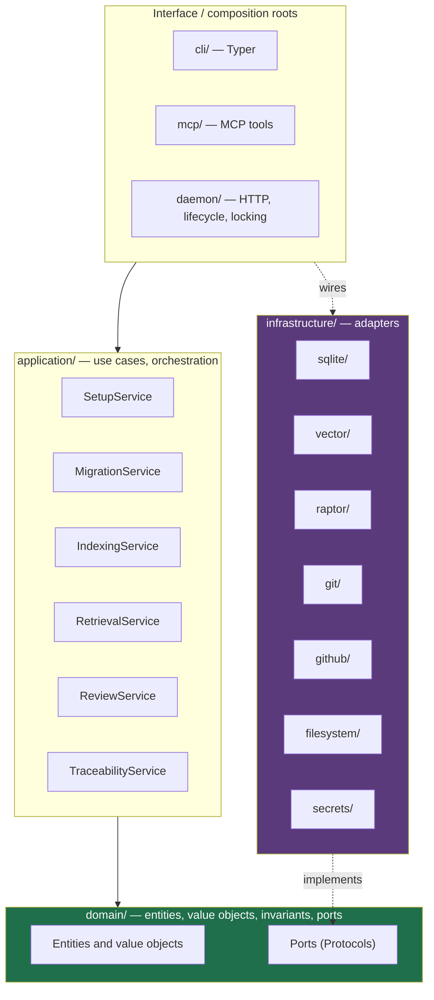
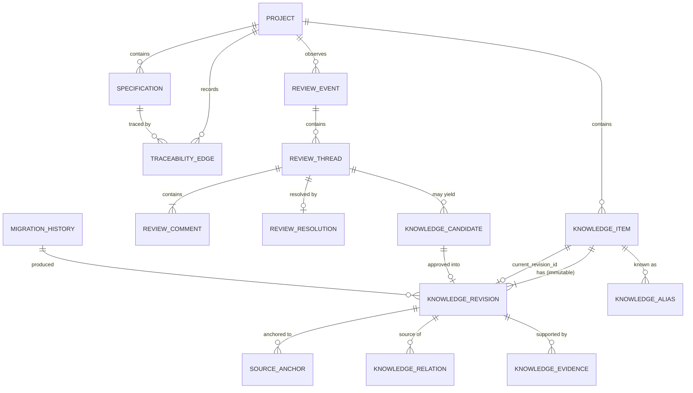
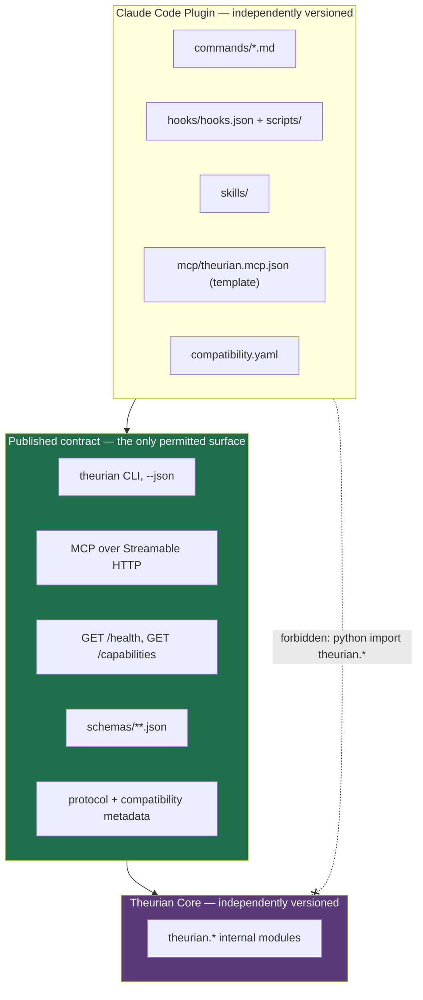
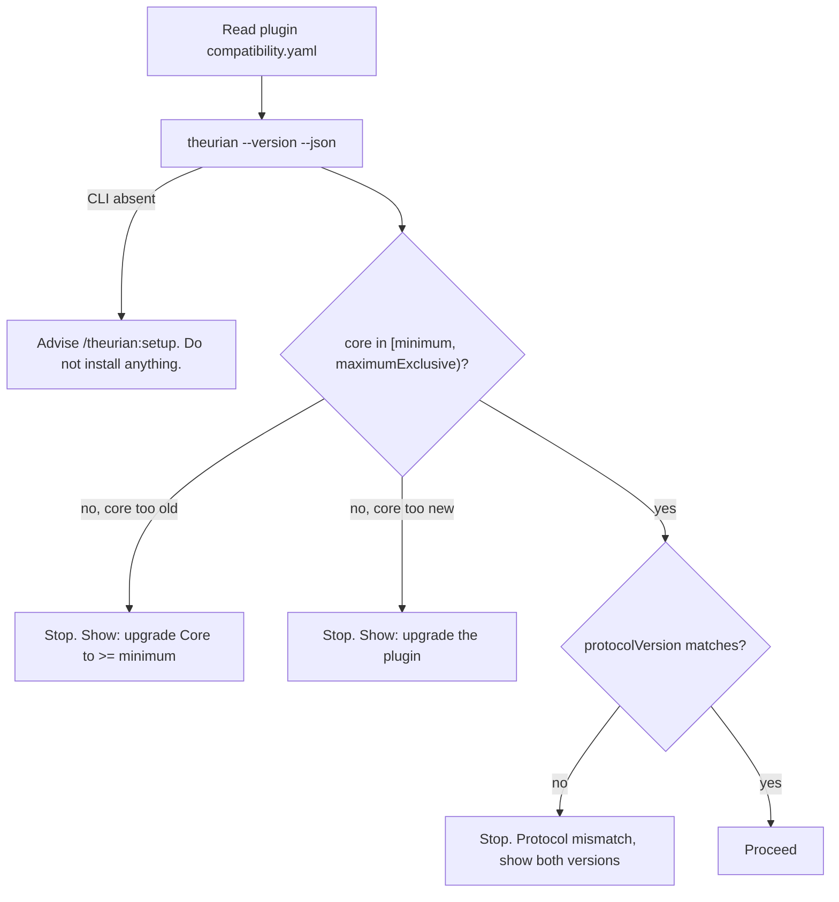
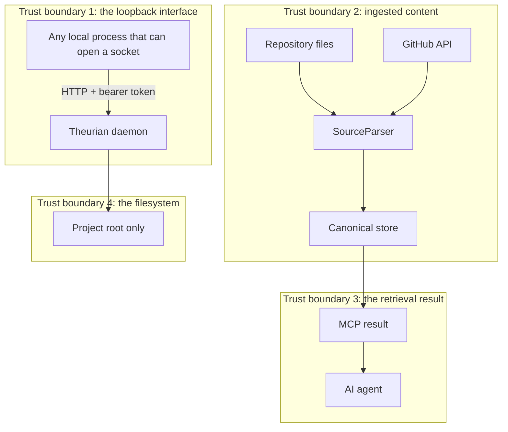

# Theurian — Requirements and Architecture Analysis

Status: **accepted for Milestone 0**
Last updated: 2026-08-01

This document is the answer to the twenty-one questions asked before implementation
started. It is the reference every ADR, schema, and package boundary in this repository
traces back to. When this document and an ADR disagree, the ADR wins and this document
must be corrected.

---

## 1. Functional requirements

Identifiers (`FR-*`) are stable and referenced from ADRs, tests, and issues.

### 1.1 Project management

| ID | Requirement |
| :-- | :-- |
| FR-P1 | Register a Git repository as a Project with a stable `projectId`, root path, repository URL, default branch, and knowledge directory. |
| FR-P2 | Unregister a Project without deleting Git-tracked knowledge. |
| FR-P3 | List registered Projects and report per-Project status (migration state, index state, last seen commit). |
| FR-P4 | Serve many Projects from one daemon process, with no process-global "current project". |
| FR-P5 | Treat each Git worktree of the same repository as a distinct Project context, never conflated. |

### 1.2 Knowledge lifecycle

| ID | Requirement |
| :-- | :-- |
| FR-K1 | Represent knowledge as an immutable `KnowledgeRevision` under a mutable `KnowledgeItem` pointer. |
| FR-K2 | Apply state changes exclusively through declarative YAML knowledge migrations. |
| FR-K3 | Support the operations: `createItem`, `upsertRevision`, `deprecateItem`, `restoreItem`, `addRelation`, `removeRelation`, `addAlias`, `removeAlias`, `changeSensitivity`, `changeOwner`, `registerSpecification`, `supersedeSpecification`, `addEvidence`, `removeEvidence`. |
| FR-K4 | Rebuild the entire canonical state from an empty database using only Git-tracked inputs. |
| FR-K5 | Detect a migration whose recorded checksum differs from its file checksum, and fail loudly. |
| FR-K6 | Enforce optimistic concurrency via `expectedRevision`. |
| FR-K7 | Order migrations by topological sort over `dependsOn`, and reject cycles. |
| FR-K8 | Re-applying an already-applied migration is a no-op, not an error. |
| FR-K9 | Carry per-revision provenance: source, author, revision, validity window, trust level, sensitivity. |
| FR-K10 | Model typed relations between knowledge, specs, reviews, code, and tests. |
| FR-K11 | Resolve aliases so a renamed item stays reachable by its old identifier. |

### 1.3 Source ingestion and normalization

| ID | Requirement |
| :-- | :-- |
| FR-S1 | Ingest Markdown, YAML, JSON, JSON Schema, OpenAPI, AsyncAPI, Git diffs, Git commit metadata, GitHub pull requests, reviews, and issues. |
| FR-S2 | Normalize every source format into one Canonical model without losing the structured fields of structured sources. |
| FR-S3 | Record a `SourceAnchor` (provider, repository, commit SHA, blob SHA, path, line range, URI, external ID) for every canonical document. |
| FR-S4 | Register new source formats by adding a `SourceParser` adapter, with no change to domain or application code. |
| FR-S5 | Verify the checksum of every source file referenced by a migration. |
| FR-S6 | Refuse to read any source file outside the Project root, including via symlink. |

### 1.4 Retrieval

| ID | Requirement |
| :-- | :-- |
| FR-R1 | Filter by Project, tenant, ACL, sensitivity, and validity window **before** ranking. |
| FR-R2 | Run lexical (SQLite FTS5) and dense (vector) retrieval and fuse with Reciprocal Rank Fusion. |
| FR-R3 | Search RAPTOR summary nodes and expand to parents and children. |
| FR-R4 | Rerank, deduplicate, diversify, and pack results within a caller-supplied token budget. |
| FR-R5 | Return provenance on every hit: `itemId`, `revisionId`, `snapshotId`, `indexBuildId`, `sourceAnchors`, `raptorPath`. |
| FR-R6 | Return safety metadata on every hit: `contentClassification`, `mayContainInstructions`, `executable`. |
| FR-R7 | Pin a `snapshotId` so results are reproducible for the lifetime of a task. |
| FR-R8 | Search across several registered Projects in one call when the caller is authorized for all of them. |

**FR-R1 is one of five axes as of Milestone 5.** `SqliteIndexStore._scope`
builds the WHERE clause every retriever uses, and it filters on Project and on
status — a check FR-R1 does not name. Tenant and ACL have no column; the
`chunks` table carries `sensitivity`, `trust_level` and `namespace` and no query
reads them. Routing does not change today for those, because the axes hold no
content yet, which is why this remains a deferral and not a defect.

**Per-axis disposition — the register that closes
[#63](https://github.com/theurian/theurian/issues/63).** Each of FR-R1's five
named axes, plus the `status` check `_scope` adds that FR-R1 does not name, with
what the pre-1.0 product actually does about it and the PR that established that
disposition. The maintainer's recorded decision: sensitivity-based access
control is deferred to the milestone that lands `AuthorizationProvider`; until
then sensitivity is a published label on every result, not a control. Only
Project, status and (on request) the validity window are enforced pre-1.0.

| Axis | Pre-1.0 disposition | Mechanism | Landed |
| :-- | :-- | :-- | :-- |
| Project | **Enforced** — a pre-ranking WHERE predicate every retriever builds from | `chunks.project_id = ?` in `SqliteIndexStore._scope` | [#32](https://github.com/theurian/theurian/pull/32) |
| status | **Enforced** — a pre-ranking WHERE predicate, plus the canonical-read gate | `chunks.status = ?` in `_scope`; `may_surface` in `domain/enums.py` | [#32](https://github.com/theurian/theurian/pull/32) |
| tenant | **Refused at write time** — a migration naming a `tenantId` other than `local` is rejected; no index column | `migrate validate`/`migrate apply` | [#110](https://github.com/theurian/theurian/pull/110) (phase 1) |
| ACL group | **Refused at write time** — a migration naming an `aclGroup` other than `default` is rejected; no index column | `migrate validate`/`migrate apply` | [#110](https://github.com/theurian/theurian/pull/110) (phase 1) |
| sensitivity | **Published label, not a control** — carried on every result, read by no retrieval predicate | `results.py` emits `sensitivity`; the `chunks.sensitivity` column is unread | [#32](https://github.com/theurian/theurian/pull/32); control **deferred** to the `AuthorizationProvider` milestone |
| validity window | **Caller-chosen refinement, not a default filter** — omitting `asOf` filters on nothing | `knowledge.search`'s optional `asOf` → `ValidityPeriod.contains`, in Python, on both answer paths | [#112](https://github.com/theurian/theurian/pull/112) (phase 2) |

The two enforced predicates are exactly what `_scope` emits;
`tests/unit/test_gate_call_sites.py` pins that set against SECURITY.md's
published axis list so the two cannot drift, and enumerates every `may_surface`
call site so the `status` gate cannot silently gain one.

The validity-window axis is no longer wholly unenforced, and it is
deliberately not unconditional either
([#63](https://github.com/theurian/theurian/issues/63) phase 2).
`knowledge.search` takes an optional `asOf` timestamp; passing one applies
`ValidityPeriod.contains`, in Python, identically on both answer paths —
`CanonicalVisibility.at_moment` on the ranked path and a plain check inside
`mcp.search._scan` on the unranked fallback. `SqliteCanonicalStore` never
compares a timestamp: an earlier version gave `list_items` a `current_at`
parameter that filtered in SQL, and it is deleted rather than kept, because it
compared the stored `validFrom`/`validTo` against `asOf` as SQLite TEXT and so
silently disagreed with the Python comparison whenever the two were authored
in different UTC offsets — a HIGH finding in review round 1 of PR #112.
`CanonicalVisibility.at_moment` also runs strictly *after* the depth-doubling
loop that decides how many times a retriever is asked for more, never inside
the check that loop's own exit condition watches — folding it in there was a
second, CRITICAL finding in the same round: a caller-chosen moment would have
let that loop's retriever-call count move with `asOf`, reviving the
single-withheld-row timing oracle `FIRST_PASS_DEPTH` exists to blunt (see
`theurian.application.visibility.Visibility.at_moment`'s docstring). Omitting
`asOf` filters on nothing more than before this parameter existed — a default
validity filter was rejected, because it would make `freshness.isWithinValidity`
constant-`true` on every published result and give the ranked path a
stale-index statistics residual with no way to turn off, rather than only
while an index build is behind. Tenant, ACL and sensitivity remain wholly
unenforced; that part of Milestone 6's scope filtering is still open.

FR-R5's `snapshotId` and `indexBuildId` are realized once per response, on the
`retrieval` block, not repeated on every hit in `results`. One
`knowledge.search` response is answered from exactly one canonical state, and,
when ranked, from exactly one index build; a per-hit copy would repeat one
string per result and could never differ between hits. Verified:
`retrieval.snapshotId` is byte-identical to `knowledge.status.stateHash`,
because both are read from the same `ActiveState` within one request, so
provenance can be cross-checked without a second call. What stays per hit is
the part that makes an individual claim checkable — `itemId`, `revisionId`,
`sourceAnchors` — which is what a citation actually needs. See
`schemas/mcp/retrieval-metadata.schema.json` and
`schemas/knowledge/retrieval-result.schema.json` for the normative shape.

### 1.5 Review knowledge

| ID | Requirement |
| :-- | :-- |
| FR-V1 | Ingest pull requests, reviews, threads, inline comments, resolution state, target files/lines/commits, fix commits, merge commits, CI results, and linked issues as **structured** records. |
| FR-V2 | Classify review comments into the eleven categories in §21 of the brief. |
| FR-V3 | Generate a `KnowledgeCandidate` from a review thread that meets the promotion gate. |
| FR-V4 | Never auto-approve a candidate; approval is a human act recorded as a migration. |
| FR-V5 | Ingest raw reviews successfully even when LLM-based candidate generation fails. |
| FR-V6 | Emit human-readable Markdown views of reviews as derived artifacts only. |

### 1.6 Specification and traceability

| ID | Requirement |
| :-- | :-- |
| FR-T1 | Register structured specifications in their native format (YAML/JSON/OpenAPI) without forcing Markdown. |
| FR-T2 | Store typed traceability edges with evidence and confidence. |
| FR-T3 | Answer: implementations of a spec, tests verifying a spec, unimplemented specs, unverified specs, code without a spec. |
| FR-T4 | Detect the seven drift conditions in §22 of the brief. |
| FR-T5 | Evaluate a configurable per-change-type `traceabilityPolicy`. |
| FR-T6 | Report contradictions between specifications, and between review knowledge and current specs. |

### 1.7 Interfaces

| ID | Requirement |
| :-- | :-- |
| FR-I1 | Expose the full feature set through the `theurian` CLI with machine-readable JSON output. |
| FR-I2 | Expose read and propose operations through MCP over Streamable HTTP. |
| FR-I3 | Route AI writes to proposal files under `.theurian/proposals/`, never into approved state. |
| FR-I4 | Run usefully with no Claude Code installed. |
| FR-I5 | Provide a Claude Code plugin that consumes only the CLI, MCP, health API, public schemas, and compatibility metadata. |

### 1.8 Setup and lifecycle

| ID | Requirement |
| :-- | :-- |
| FR-L1 | `/theurian:setup` and `theurian setup` share one application service. |
| FR-L2 | Setup is idempotent and repairs only what is missing. |
| FR-L3 | Installing the plugin alone registers no OS service and starts no daemon. |
| FR-L4 | `SessionStart` performs a bounded health check only. |
| FR-L5 | Uninstall offers independent choices per artifact class and never deletes approved knowledge without explicit confirmation. |
| FR-L6 | Exactly one daemon process per user per machine. |

---

## 2. Non-functional requirements

| ID | Requirement | Target |
| :-- | :-- | :-- |
| NFR-1 | Single daemon | Exactly 1 process for ≥10 concurrent MCP clients. Enforced by an OS file lock plus a port health probe, not a PID file alone. |
| NFR-2 | `SessionStart` latency | p95 ≤ 300 ms, hard cap 2 s, then degrade to a warning. |
| NFR-3 | Search latency | p95 ≤ 500 ms for a 10k-revision Project, warm index, excluding external reranking. |
| NFR-4 | Index availability | The previously published index answers every query while a new build runs. Zero read downtime. |
| NFR-5 | Reproducibility | Same migrations + same content + same schema/engine version ⇒ same `state_hash` ⇒ byte-identical canonical state. |
| NFR-6 | Branch switch | Switching to a previously built `state_hash` is O(1). A descendant state applies only the delta. |
| NFR-7 | Write model | One serialized write queue; reads use independent WAL connections. |
| NFR-8 | Transaction duration | No external I/O (LLM, network, subprocess) inside a write transaction. Target < 50 ms per write txn. |
| NFR-9 | Portability | macOS (arm64, x86_64) and Linux (x86_64, arm64) at 1.0; Windows behind the same `DaemonManager` port. |
| NFR-10 | Offline | All features except GitHub ingestion work with no network. All tests pass with no network. |
| NFR-11 | Observability | OpenTelemetry traces and metrics, off by default, never emitting knowledge bodies or tokens. |
| NFR-12 | Uninstallability | Every file Theurian creates is enumerable by `theurian uninstall --dry-run` before deletion. |
| NFR-13 | Test coverage | ≥ 80% line and branch coverage on `theurian-core`. |
| NFR-14 | Resource ceiling | Idle daemon < 150 MB RSS with 5 registered Projects. |
| NFR-15 | Cold start | `theurian daemon start` to first healthy `/health` ≤ 3 s. |

---

## 3. Security requirements

| ID | Requirement |
| :-- | :-- |
| SEC-1 | Bind the daemon to `127.0.0.1` only. Never `0.0.0.0`, never a non-loopback interface, in the OSS Core. |
| SEC-2 | Validate `Origin` and `Host` on every MCP request (DNS-rebinding protection). |
| SEC-3 | Require a bearer token with ≥ 256 bits of entropy from a CSPRNG on every MCP and management request. |
| SEC-4 | Store the token in a 0600 file inside a 0700 directory, and prefer macOS Keychain / Linux Secret Service when available. |
| SEC-5 | Never write the literal token into a Claude Code config file. Configs carry an environment-variable reference only. |
| SEC-6 | Never log, trace, or error-message a token. Redaction is applied at the logging sink, not at each call site. |
| SEC-7 | Resolve every path with `realpath` and assert containment in the Project root; reject symlinks that escape. |
| SEC-8 | Bound parser input: max file size, max archive expansion ratio, max nesting depth, wall-clock timeout. |
| SEC-9 | Never build a shell command by string concatenation. `git` and `gh` are invoked as argument vectors with `shell=False`. |
| SEC-10 | Validate Git and external URLs against an allowlist of schemes and reject private-network destinations (SSRF). |
| SEC-11 | Scan content for secrets before it becomes an approved revision; block or warn per policy. |
| SEC-12 | Validate every MCP tool input against its published JSON Schema before it reaches application code. |
| SEC-13 | Authorize `projectId` on every call. A client authorized for Project A must never read Project B. |
| SEC-14 | Never mix content across sensitivity levels, ACL groups, tenants, namespaces, or Projects into one RAPTOR summary. |
| SEC-15 | Tag every retrieval result `contentClassification: untrusted-knowledge`, `mayContainInstructions: true`, `executable: false`. |
| SEC-16 | Treat imperative text inside knowledge bodies as data. Summarization prompts wrap source content in a delimited, explicitly-untrusted region. |
| SEC-17 | AI-originated writes produce proposal files only. There is no MCP path to mutate approved state. |
| SEC-18 | Setup never overwrites an existing file destructively; it backs up or shows a diff and asks. |
| SEC-19 | Every external I/O call carries an explicit timeout. |
| SEC-20 | The cloud port assumes TLS, OAuth 2.1 / OIDC, audience and scope validation, tenant isolation, rate limits, and an audit log — but the OSS Core must not require any of them. |

### 3.1 Explicit non-goals

- Theurian is not a secrets manager and never stores third-party credentials on behalf of a user beyond its own local token.
- Theurian does not sandbox the knowledge it serves. It labels content as untrusted; enforcing that label is the calling agent's responsibility.

---

## 4. OSS requirements

| ID | Requirement |
| :-- | :-- |
| OSS-1 | Apache-2.0, with `LICENSE` at the repo root and in each published artifact. |
| OSS-2 | README, CONTRIBUTING, SECURITY, CODE_OF_CONDUCT, GOVERNANCE, CHANGELOG. |
| OSS-3 | Issue templates and a pull-request template. |
| OSS-4 | Semantic Versioning per artifact; Conventional Commits enforced in CI. |
| OSS-5 | The DCO-versus-CLA decision is recorded in an ADR (ADR-0015: DCO, enforced by a sign-off check). |
| OSS-6 | Dependency license scanning in CI, with an allowlist. |
| OSS-7 | SBOM (CycloneDX) generated and attached to every release. |
| OSS-8 | Automated dependency updates (Dependabot). |
| OSS-9 | CodeQL, secret scanning, SAST, and dependency review in CI. |
| OSS-10 | Publish a Python package, a Docker image, and a Claude Code plugin. |
| OSS-11 | Release artifacts carry SHA-256 checksums. |
| OSS-12 | Installers for macOS and Linux. |
| OSS-13 | A third party can clone, install, run, and test the project from a clean machine with no paid API key. |
| OSS-14 | Reproducible build instructions with a committed `uv.lock`. |
| OSS-15 | No hard dependency on any specific LLM, embedding, or cloud vendor. Every such capability sits behind a port with a deterministic fake. |

---

## 5. Claude Code plugin requirements

| ID | Requirement |
| :-- | :-- |
| CP-1 | The plugin is a separate release artifact with its own version, CHANGELOG, tests, CI job, CODEOWNERS, and docs. |
| CP-2 | The plugin contains no Python import of `theurian.*`. Its only channels are the CLI, MCP, the health API, public schemas, and compatibility metadata. |
| CP-3 | The plugin ships the twelve commands in §9 of the brief. |
| CP-4 | The plugin ships a `SessionStart` hook that is a bounded health check and nothing more. |
| CP-5 | The plugin does **not** declare an `mcpServers` entry in its manifest. Claude Code auto-connects plugin MCP servers at enable time, which would contradict "install alone does nothing". The plugin carries the connection as a *template*; `/theurian:setup` installs it. See ADR-0012. |
| CP-6 | The plugin declares `coreCompatibility` (`minimum`, `maximumExclusive`) and `protocolVersion`, and refuses to operate — safely, with upgrade instructions — outside that range. |
| CP-7 | No setup logic lives in the plugin. Every command is a thin adapter over `theurian <verb> --json`. |
| CP-8 | Uninstall is granular and never removes approved knowledge without explicit confirmation. |
| CP-9 | The plugin must remain movable to its own repository without changing Core. |

---

## 6. `/theurian:setup` state machine

`/theurian:setup` and `theurian setup` are the same application service
(`SetupService.run(SetupRequest) -> SetupReport`). The plugin command is a
presentation shell over `theurian setup --json`.

### 6.1 States



`Degraded` is a success-with-warnings terminal state, not a failure: a missing
`gh` token must not prevent local knowledge from working.

### 6.2 Step-level state, in order

Every step is a `SetupStep` with an independent tri-state probe result:
`Satisfied` (skip), `Missing` (create), `Conflicting` (back up or ask).

| # | Step | Probe | Action when `Missing` | Action when `Conflicting` |
| :-- | :-- | :-- | :-- | :-- |
| 1 | Platform check | `uname` / `platform` | — | abort with a clear message |
| 2 | Core present | `theurian --version` on `PATH` | install (explicit user action) — **not implemented, see below** | version mismatch → offer `upgrade` |
| 3 | Artifact integrity — **not implemented, see below** | SHA-256 vs the release manifest | verify before install | abort; never install an unverified artifact |
| 4 | Data directory | `~/.theurian` exists, mode 0700 | `mkdir -p`, `chmod 700` | tighten mode, report the change |
| 5 | Token | token exists and is ≥ 32 bytes | generate via CSPRNG | reuse; never regenerate silently |
| 6 | Token storage | file mode 0600, or Keychain entry | write | `chmod`, report |
| 7 | Env reference | `~/.theurian/env` exports `THEURIAN_MCP_TOKEN` | write | rewrite the Theurian-owned block only |
| 8 | Daemon service | LaunchAgent / systemd user unit present | install a user-scoped unit | show a diff, back up, ask |
| 9 | Daemon running | `GET /health` returns 200 | start the service | reuse the existing daemon |
| 10 | Single instance | lock held by exactly one PID | acquire | reuse; never kill a live daemon |
| 11 | Project registered | `projectId` present in the registry | register the current repo | reuse; update the root path if the repo moved |
| 12 | `.theurian/` layout | required directories exist | create | leave existing files untouched |
| 13 | `.gitignore` entries | derived paths ignored | append a marked block | leave the user's rules; append only what is missing |
| 14 | MCP connection | a `theurian` entry with the right URL | write via a merge-not-replace update | back up, show a diff, ask |
| 15 | MCP health | initialize handshake succeeds | — | report and continue in `Degraded` |
| 16 | Migrations valid | `migrate validate` is clean | — | report; never auto-repair data |
| 17 | Initial index | an `active_index` exists for the current `state_hash` | build | reuse |
| 18 | Serena detection | a `serena` MCP entry exists | — | report coexistence, change nothing |
| 19 | Report | — | print the changed-files list | — |

**Rows 2 and 3 are required, not implemented.** Setup neither installs Core nor
verifies an artifact.

- **Row 2 has no `Missing` branch and no install.** `probe_core` reports
  `Satisfied` or `Conflicting`, and in practice reports `Satisfied`: the
  executable it checks comes from `_executable()` in `cli/setup_commands.py`,
  which falls back to `sys.argv[0]` — the program currently running — so
  `Conflicting` needs an `argv[0]` that does not resolve. Setup cannot report
  that Core is missing, because setup is Core.
- **Row 3 performs no check.** `probe_artifact_integrity` returns
  `NotApplicable` unconditionally rather than claiming one it cannot make, and
  there is no download for it to check against: the user installs Core with
  `uv tool install` or `pipx` before setup runs at all.

Both rows stand as requirements. Row 3 is the setup-step half of T-16, which
§19's threat table maps to OSS-7, OSS-11 and this row; OSS-11 itself — artifacts
carry checksums — ships. The gap is filed as
[#39](https://github.com/theurian/theurian/issues/39), and why closing it is a
change to how Theurian is obtained rather than a probe added here is recorded
under [T-16](../security/threat-model.md).

### 6.3 Idempotence contract

Running setup twice must produce a second report where every step is
`Satisfied` and the changed-files list is empty.

This said the contract "is asserted directly in
`tests/e2e/test_setup_idempotence.py`". That file has never existed. What holds
part of it is `tests/integration/test_setup_service.py`, against fake service and
MCP-config adapters — `test_a_second_run_never_regenerates_the_token` and
`test_a_step_setup_does_not_perform_is_never_reported_as_changed`. The end-to-end
statement, against a real LaunchAgent in a disposable profile, is owed with the
rest of the E2E suite: [#65](https://github.com/theurian/theurian/issues/65),
and see `tests/e2e/README.md` for which acceptance criteria have no test at all.

### 6.4 Rollback

Steps 4–14 are journaled to `~/.theurian/setup-journal.jsonl` with an inverse
action. A critical failure replays the inverses in reverse order. Steps 16–17
are not rolled back — they are derived state and are rebuilt, never restored.

---

## 7. Open questions

Each carries a chosen default so implementation is not blocked. Defaults marked
**(ADR)** are recorded as accepted decisions and can be revisited by superseding
the ADR.

| # | Question | Default chosen |
| :-- | :-- | :-- |
| OQ-1 | Does the plugin ship an `mcpServers` manifest entry? | No — setup installs it, so plugin install alone is inert. **(ADR-0012)** |
| OQ-2 | How does the token reach Claude Code without landing in a config file? | `${THEURIAN_MCP_TOKEN}` expansion in the MCP `headers` block, exported from `~/.theurian/env`. Verified supported. **(ADR-0011)** |
| OQ-3 | Default embedding provider? | A deterministic hashing embedder ships in-tree so Core works offline; real providers are opt-in adapters. **(ADR-0009)** |
| OQ-4 | Which vector store at 1.0? | `sqlite-vec` behind the `VectorStore` port, with a pure-SQLite brute-force fallback. **(ADR-0014)** |
| OQ-5 | Is `snapshotId` per-request or per-session? | Per-request and explicit. There is no server-side session state. **(ADR-0002)** |
| OQ-6 | Multi-project search authorization model, locally? | The local token grants all registered Projects; per-Project ACL is a cloud-port concern with the interface defined now. |
| OQ-7 | Do we support Git submodules as Project boundaries? | Not at 1.0. A submodule is registered as its own Project if wanted. |
| OQ-8 | Where does the review cache live? | `.theurian/cache/reviews/`, git-ignored, rebuildable from the GitHub API. |
| OQ-9 | Conventional-commit scope names? | `core`, `plugin`, `schemas`, `docs`, `ci`, `packaging`. |
| OQ-10 | DCO or CLA? | DCO, enforced by a sign-off check. **(ADR-0015)** |
| OQ-11 | Do knowledge bodies support transclusion/includes? | No at 1.0. Composition is a relation, not a text include — includes would break content hashing. |
| OQ-12 | Migration file naming? | `<ulid>-<kebab-slug>.yaml`; the ULID is authoritative, the slug is cosmetic. |
| OQ-13 | How are proposals reviewed? | As a normal pull request. Theurian generates the files; Git and GitHub do the review. |
| OQ-14 | Windows at 1.0? | Interface only. `DaemonManager` has a Windows implementation slot; it is not a release gate. |
| OQ-15 | Does Core ever call an LLM by default? | No. Summarization and reranking are opt-in; without them RAPTOR degrades to extractive summaries. |

---

## 8. Recommended architecture

### 8.1 Layering



The dependency rule: **`domain/` imports nothing from `application/` or
`infrastructure/`; `application/` imports `domain/` only.** Adapters are
injected at a composition root. This is enforced mechanically by a banned-import
lint rule in `pyproject.toml` and by a test that walks the import graph.

### 8.2 Process architecture

```mermaid
flowchart TB
    subgraph Terminal["One user, one machine"]
        subgraph CC["Claude Code"]
            MA["Main agent"]
            SA1["Sub agent A"]
            SA2["Sub agent B"]
            SA3["Sub agent C"]
        end
        OTHER["Other MCP clients / CI / plain CLI"]
    end

    MA -->|Streamable HTTP| D
    SA1 -->|Streamable HTTP| D
    SA2 -->|Streamable HTTP| D
    SA3 -->|Streamable HTTP| D
    OTHER --> D

    subgraph D["Single Theurian daemon — 127.0.0.1:7419"]
        LOCK["OS file lock + port probe"]
        REG["Project registry"]
        WQ["Single write queue"]
        RP["Read pool (WAL)"]
        PUB["Index publisher"]
    end

    D --> PA["Project A — .theurian/"]
    D --> PB["Project B — .theurian/"]
    D --> PC["Project C — .theurian/"]
```



Every request carries its own context. There is no connection-scoped or
process-global `currentProject`.

```json
{ "projectId": "backend-service", "snapshotId": null, "agentId": null, "taskId": null }
```

### 8.3 Concurrency model

- **Reads**: N independent SQLite connections in WAL mode, `busy_timeout=5000`.
- **Writes**: one asyncio task owning one write connection, fed by a queue. No
  other component may open a write connection.
- **Index publication**: a single publisher performs the atomic swap of
  `active_indexes`. Builds happen off to the side and become visible only on swap.
- **External I/O** (LLM, GitHub, subprocess) happens strictly outside write
  transactions. The pattern is: read → release → call → re-acquire → write.

---

## 9. Domain model



### 9.1 Core invariants

| ID | Invariant |
| :-- | :-- |
| INV-1 | A `KnowledgeRevision` is immutable once written. Corrections create a new revision. |
| INV-2 | `KnowledgeItem.current_revision_id` must reference a revision of that same item. |
| INV-3 | `content_sha256` must equal SHA-256 of the revision body as stored. |
| INV-4 | `valid_from < valid_to` when `valid_to` is set. |
| INV-5 | A relation's source and target must belong to the same Project unless the relation type is explicitly cross-project. |
| INV-6 | `supersedes` must be acyclic. |
| INV-7 | A `KnowledgeCandidate` may only become approved knowledge through a migration authored by a human identity. |
| INV-8 | Every approved revision has at least one `SourceAnchor` or an explicit `authored-in-theurian` marker. |
| INV-9 | A revision's `sensitivity` may only be changed by `changeSensitivity`, which creates an audit record — never by editing a body. |
| INV-10 | Migration IDs and revision IDs are ULIDs; lexical order equals creation order. |

### 9.2 Statuses

- `KnowledgeItem.status` ∈ `draft | proposed | approved | deprecated | superseded | rejected`
- `trust_level` ∈ `unverified | inferred | reviewed | authoritative`
- `sensitivity` ∈ `public | internal | confidential | restricted`
- `Specification.status` ∈ `draft | active | superseded | retired`

Only `approved` items are returned by default retrieval; other statuses require
an explicit opt-in filter, so an unreviewed proposal can never masquerade as a
team decision.

---

## 10. Ports and adapters

| Port | Responsibility | Milestone-0 adapter | Later adapters |
| :-- | :-- | :-- | :-- |
| `CanonicalStore` | Persist and query canonical entities | `sqlite/` | PostgreSQL, document DB |
| `VectorStore` | Store and ANN-search embeddings | brute-force SQLite | `sqlite-vec`, pgvector, external |
| `EmbeddingProvider` | Text → vector | deterministic hashing embedder | OpenAI-compatible, local ONNX |
| `SummarizationProvider` | RAPTOR node summaries | extractive fake | any chat model |
| `RerankingProvider` | Reorder candidates | identity | cross-encoder, hosted |
| `ReviewProvider` | Fetch PRs/reviews/threads | fixture-backed fake | GitHub, GitLab |
| `SpecificationProvider` | Discover and parse specs | filesystem | external spec registries |
| `SourceParser` | Bytes + media type → normalized doc | Markdown, YAML, JSON | OpenAPI, AsyncAPI, PDF, DOCX |
| `ObjectStore` | Large blobs | local filesystem | S3-compatible |
| `AuthorizationProvider` | May principal P do A on Project X | local single-user allow | OIDC/RBAC, tenant ACL |
| `SecretStore` | Store and read local secrets | 0600 file | macOS Keychain, Secret Service |
| `DaemonManager` | Install/start/stop/uninstall a user service | LaunchAgent, systemd user | Windows, Docker Compose |
| `Clock` | Time | system clock | frozen clock in tests |
| `IdGenerator` | ULIDs | ULID | seeded generator in tests |

`Clock` and `IdGenerator` are ports for a reason: without them, "same inputs ⇒
same `state_hash`" cannot be asserted in a test.

Every port ships a deterministic fake in `tests/fakes/`. **No test in this
repository may call an external network service.**

---

## 11. Source, Canonical, and Index layers

```mermaid
flowchart LR
    subgraph S["Source Layer — bytes as authored"]
        S1["Markdown"]
        S2["YAML / JSON"]
        S3["OpenAPI / AsyncAPI"]
        S4["Git commit / diff"]
        S5["GitHub PR / review / issue"]
        S6["PDF / DOCX (future)"]
    end

    subgraph C["Canonical Layer — the record of truth"]
        C1["KnowledgeRevision"]
        C2["Specification"]
        C3["ReviewEvent / Thread / Comment"]
        C4["SourceAnchor"]
        C5["Relation / TraceabilityEdge"]
    end

    subgraph I["Index Layer — rebuildable, never authoritative"]
        I1["Chunks"]
        I2["FTS5"]
        I3["Embeddings"]
        I4["RAPTOR nodes"]
        I5["Graph edges"]
        I6["Rerank features"]
    end

    S -->|SourceParser: parse, never interpret| C
    C -->|Indexer: derive| I
    I -.->|every hit resolves back to| C
    C -.->|every record anchors back to| S
```



Layer rules:

1. The Source Layer is never rewritten by Theurian. It is read, hashed, and anchored.
2. The Canonical Layer is the only layer that may be cited as team knowledge.
3. The Index Layer is disposable by definition. Deleting it must never lose information.
4. A structured source stays structured in the Canonical Layer. Markdown rendering
   is a projection, not a conversion.
5. Anything under `.theurian/generated/` is a projection of the Index or Canonical
   layer and is git-ignored.

---

## 12. Core / Plugin boundary



Enforcement, not convention:

1. The plugin directory contains no `.py` file that imports `theurian`. A CI
   check greps for it and fails the build.
2. The plugin's scripts are POSIX shell and invoke `theurian … --json`.
3. Contract tests in `tests/contract/` execute the real CLI and validate its
   output against `schemas/cli/*.json`. Both artifacts consume the schema; neither
   owns the other.
4. `schemas/` is co-owned in CODEOWNERS. A schema change requires both maintainer
   groups.

---

## 13. Plugin / Core compatibility model

Three versioned things, deliberately decoupled:

| Thing | Example | Changes when |
| :-- | :-- | :-- |
| Core version | `0.4.0` | any Core release |
| Plugin version | `0.2.1` | any plugin release |
| Protocol version | `theurian/v1` | the wire contract changes incompatibly |

`plugins/claude-code/compatibility.yaml`:

```yaml
pluginVersion: 0.2.1
coreCompatibility:
  minimum: 0.4.0
  maximumExclusive: 0.5.0
protocolVersion: theurian/v1
```

Resolution algorithm, run by `SessionStart` and by every command:



Rules:

- Pre-1.0, a MINOR bump of Core may break the protocol; `maximumExclusive`
  therefore pins to the next MINOR. Post-1.0 it pins to the next MAJOR.
- "Stop" means: print an actionable message and exit non-zero. It never means
  install, upgrade, downgrade, or delete anything.
- Core exposes `system.capabilities` so the plugin can degrade per-feature rather
  than all-or-nothing when only an optional capability is missing.

---

## 14. Milestone 0 implementation plan

Delivered in this change:

| # | Deliverable | Location |
| :-- | :-- | :-- |
| 1 | Monorepo skeleton, uv workspace, pinned toolchain | `pyproject.toml`, `packages/theurian-core/pyproject.toml` |
| 2 | This analysis | `docs/architecture/requirements-analysis.md` |
| 3 | ADRs 0001–0015 | `docs/adr/` |
| 4 | Architecture docs with Mermaid | `docs/architecture/*.md` |
| 5 | Domain entities, value objects, invariants | `packages/theurian-core/src/theurian/domain/` |
| 6 | Fourteen ports as `Protocol`s | `packages/theurian-core/src/theurian/domain/ports/` |
| 7 | Compatibility resolution logic + tests | `.../domain/compatibility.py` |
| 8 | Path-boundary security primitives + tests | `.../security/paths.py` |
| 9 | Public JSON Schemas | `schemas/` |
| 10 | Claude Code plugin skeleton, 12 commands, SessionStart hook | `plugins/claude-code/` |
| 11 | OSS governance documents | repo root |
| 12 | Threat model | `docs/security/threat-model.md` |
| 13 | Path-filtered CI | `.github/workflows/` |
| 14 | Unit tests, lint, strict type checking, all green | `packages/theurian-core/tests/` |

Explicitly **not** in Milestone 0: SQLite schema, the migration engine, the
daemon, MCP tools, ingestion, retrieval, RAPTOR, GitHub. Those are Milestones 1–8.

---

## 15. Key technical risks

| ID | Risk | Impact | Mitigation |
| :-- | :-- | :-- | :-- |
| R-1 | Single-daemon guarantee fails under a race (two `claude` launches at once) | Two writers on one SQLite file → corruption | OS-level `flock` on a lock file **plus** a port health probe **plus** a startup handshake; loser exits 0 after confirming the winner is healthy. Tested by launching N processes concurrently. |
| R-2 | `state_hash` is unstable across machines | Every branch switch rebuilds; caches never hit | Hash only normalized, ordered, content-derived inputs. Never absolute paths, mtimes, or locale-dependent ordering. Golden-vector test. |
| R-3 | RAPTOR summaries leak facts not present in the source | Knowledge platform emits fiction | Extractive-first default; abstractive summaries are opt-in, carry `summary_model` provenance, and are validated by an entailment check in evaluation. Every node keeps child references. |
| R-4 | Prompt injection through ingested knowledge | An agent executes instructions embedded in a document | Content is always labeled untrusted; summarization wraps source in a delimited untrusted region; MCP results carry `mayContainInstructions`. Documented as a shared responsibility with the calling agent. |
| R-5 | `sqlite-vec` is pre-1.0 and may break | Index layer breaks on upgrade | Reached only through `VectorStore`; a brute-force fallback ships in-tree; the version is pinned exactly. |
| R-6 | MCP Python SDK 2.x is young; the API changed from 1.x (`FastMCP` → `MCPServer`) | Daemon breaks on upgrade | Version pinned; the SDK is confined to `mcp/` and `daemon/`; a contract test asserts the wire protocol, not the SDK API. |
| R-7 | Index build blows up wall-clock and memory on a large monorepo | Setup appears hung | Incremental builds by default; the forest limits blast radius; builds are cancellable; progress is reported; the old index keeps serving. |
| R-8 | Write-queue serialization becomes a throughput bottleneck | Slow ingestion | Batch operations inside one transaction; keep transactions short; measure before optimizing. Correctness outranks throughput. |
| R-9 | Setup corrupts a hand-tuned Claude Code config | User loses their configuration | Merge, never replace; back up with a timestamp; show a diff; ship a `--dry-run`. |
| R-10 | Uninstall leaves orphaned OS services or files | Users cannot cleanly remove Theurian | Every created path is journaled; `uninstall --dry-run` enumerates before deleting; there is an E2E test for it. |
| R-11 | Optimistic concurrency is too coarse and blocks routine parallel work | Contributors fight the tool | `expectedRevision` is per item, not per store; conflicts produce a readable three-way report. |
| R-12 | Reviews are personal data (author identity, opinions) | Privacy and compliance exposure | Store author identity as the provider's stable ID plus display name; support redaction at ingestion; document retention in SECURITY.md. |
| R-13 | Deterministic fakes drift from real providers | Tests pass, production fails | Fakes implement the same Protocol; contract tests run against fakes in CI and against real adapters in an opt-in, credentialed job. |
| R-14 | Cross-tenant leakage through a shared RAPTOR node | The most severe correctness failure possible | Tree identity includes project + tenant + sensitivity + ACL group + namespace. Mixing is structurally impossible, not policy-checked. Asserted by a dedicated test. |

---

## 16. OSS publication risks

| ID | Risk | Mitigation |
| :-- | :-- | :-- |
| O-1 | "Theurian" collides with an existing trademark or PyPI/npm name | Check PyPI, npm, and trademark registries before the first public release; the name is a config value, not hardcoded in 400 places. **The deadline has passed: `theurian 0.1.0.dev0` was uploaded 2026-08-07.** PyPI is settled — the name is held by this project's own release workflow (`https://pypi.org/simple/theurian/` → 200, measured 2026-08-08). npm is free and unheld (`https://registry.npmjs.org/theurian` → 404). No trademark check is recorded anywhere in this repository, so that third is neither done nor owned. Near-miss PyPI names are covered under T-16 in the [threat model](../security/threat-model.md). |
| O-2 | Users commit a SQLite file or a secret into `.theurian/` | Ship `.gitignore` entries at init; add a pre-commit hook example; `doctor` warns when a derived artifact is tracked. |
| O-3 | An issue reporter pastes proprietary knowledge into a public issue | Issue templates warn explicitly; no knowledge body ever enters a `doctor` payload; `theurian doctor --report` substitutes the paths Theurian wrote and withholds the configuration values it only read. Plain `doctor --json` redacts nothing and is not for sharing. |
| O-4 | A dependency's license is incompatible with Apache-2.0 | License scan in CI with an allowlist; a copyleft dependency fails the build. |
| O-5 | The security-report channel is unclear, so a vulnerability is filed publicly | SECURITY.md with a private reporting path and a stated response SLA. |
| O-6 | Contributors are unclear whether this is community- or vendor-governed | GOVERNANCE.md states the model, the maintainer set, and how decisions are made, before external contributions start. |
| O-7 | A future managed offering is seen as a bait-and-switch | The OSS/commercial boundary is documented up front; Core must remain fully functional offline; no feature is removed from Core to sell it back. |
| O-8 | LLM-generated knowledge of uncertain provenance ends up in a public repo | Provenance is a first-class field; `trust_level` distinguishes `inferred` from `reviewed`; candidates are never auto-approved. |
| O-9 | An unmaintained pre-1.0 dependency becomes a supply-chain liability | Dependabot, SBOM, and an ADR-recorded exit path per pre-1.0 dependency. |

---

## 17. Initial ADRs

| ADR | Title | Decision |
| :-- | :-- | :-- |
| 0001 | Monorepo with independently released artifacts | One repo, two release trains, one shared contract directory. |
| 0002 | Single local daemon over Streamable HTTP | One process per user; explicit per-request context; no stdio. |
| 0003 | Ports and adapters as the top-level structure | Domain depends on ports; adapters are injected; lint-enforced. |
| 0004 | SQLite is a derived artifact, never a Git-tracked one | Git holds migrations and content; the database is rebuilt. |
| 0005 | Knowledge migrations are YAML, not SQL | Storage-independent; portable to PostgreSQL or a document DB. |
| 0006 | Immutable revisions with optimistic concurrency | Append-only history; `expectedRevision` guards conflicts. |
| 0007 | State-hash-partitioned databases for Git branches | One database per reachable migration set; atomic switching. |
| 0008 | RAPTOR forest, not a single tree | Trees are partitioned by project/tenant/sensitivity/ACL/namespace. |
| 0009 | No vendor lock-in for LLM and embedding providers | Deterministic in-tree defaults; real providers are opt-in adapters. |
| 0010 | Three-layer knowledge model | Source, Canonical, Index — with an explicit authority rule. |
| 0011 | Local MCP authentication and token handling | Loopback + Origin check + bearer token + env-var reference. |
| 0012 | The plugin does not auto-register the MCP server | Setup installs the connection so install alone stays inert. |
| 0013 | AI writes produce proposals, never approved state | The write path goes through Git review. |
| 0014 | Exact dependency pinning and pre-1.0 isolation | Pin everything; isolate pre-1.0 libraries behind ports. |
| 0015 | DCO over CLA | Sign-off enforced in CI; recorded per OSS-5. |

---

## 18. Initial directory structure

The tree in §11 of the brief is adopted with these deliberate changes:

| Change | Reason |
| :-- | :-- |
| `domain/ports/` added | Ports are domain contracts. Putting them under `domain/` is what makes the "domain never imports infrastructure" rule expressible as a lint rule. |
| `schemas/protocol/` added | Protocol and compatibility metadata is a contract in its own right, co-owned by both artifacts. |
| `plugins/claude-code/mcp/` added | Holds the MCP connection template that setup installs (ADR-0012). Deliberately not `.mcp.json` at the plugin root, which Claude Code would auto-load. |
| `tests/fakes/` added | Deterministic port fakes shared by unit, integration, and contract tests (OSS-15). |
| `examples/sample-project/` populated | A third party must be able to run a real `.theurian/` without writing one first (OSS-13). |
| `assets/` added | Logo and brand files, kept out of `docs/`. |

---

## 19. Threat model, v1

Full document: [`docs/security/threat-model.md`](../security/threat-model.md).
Summary of the trust boundaries and the top findings:



| ID | Threat | STRIDE | Severity | Control |
| :-- | :-- | :-- | :-- | :-- |
| T-1 | A local process without the token reads all knowledge | Information disclosure | High | SEC-3, SEC-4 |
| T-2 | A browser page reaches the daemon via DNS rebinding | Spoofing | High | SEC-1, SEC-2 |
| T-3 | Instructions embedded in knowledge steer an agent | Tampering / EoP | High | SEC-15, SEC-16, R-4 |
| T-4 | A crafted `contentFile` path reads `~/.ssh/id_ed25519` | Information disclosure | Critical | SEC-7, FR-S6 |
| T-5 | A symlink inside the repo points outside it | Information disclosure | Critical | SEC-7 |
| T-6 | A zip/YAML bomb at ingestion, or a search query that burns seconds of CPU | DoS | Medium | SEC-8 |
| T-7 | A hostile Git URL triggers an internal request | SSRF | Medium | SEC-10 |
| T-8 | The token is written into a config file that gets committed | Information disclosure | High | SEC-5, ADR-0011 |
| T-9 | The token appears in a log or a crash report | Information disclosure | High | SEC-6 |
| T-10 | Confidential and public knowledge merge into one summary | Information disclosure | High | SEC-14, R-14 |
| T-11 | A client authorized for Project A reads Project B | EoP | High | SEC-13 |
| T-12 | An agent silently rewrites an approved decision | Tampering | High | SEC-17, ADR-0013 |
| T-13 | Two daemons corrupt the same SQLite file | Tampering | High | NFR-1, R-1 |
| T-14 | Setup overwrites a user's MCP configuration | Tampering | Medium | SEC-18, R-9 |
| T-15 | A secret in a document becomes an approved, indexed revision | Information disclosure | High | SEC-11 |
| T-16 | A compromised release artifact is installed | Tampering | Critical | OSS-7, OSS-11, setup step 3 |

---

## 20. `/theurian:setup` test strategy

The single highest-risk surface: it touches the OS, the filesystem, the user's
config, and the network, and users will run it exactly once and judge the project
by it.

### Layer 1 — unit (no OS effects)

| Test | Asserts |
| :-- | :-- |
| Step probes are pure | Each probe maps an observed environment to `Satisfied`/`Missing`/`Conflicting` with no side effects. |
| Plan derivation | Environment → ordered plan. Table-driven over ~20 environment permutations. |
| Empty plan on converged input | A fully-set-up environment yields zero steps. |
| Config merge | Merging into an existing Claude Code config preserves unrelated servers, keys, and formatting. |
| Diff generation | The rendered diff exactly matches the change that would be applied. |
| `.gitignore` block | Appends only missing entries; re-running appends nothing. |
| Token masking | A token never appears in a `SetupReport` rendered to text or JSON. |
| Compatibility gate | The version matrix resolves to proceed/stop-old/stop-new/stop-protocol. |
| Rollback inverses | Every mutating step has an inverse; replaying it restores the prior state. |

### Layer 2 — integration (real filesystem, fake OS service)

Run against a temp `HOME` and a temp Git repository, with `DaemonManager`
replaced by a recording fake.

| Test | Asserts |
| :-- | :-- |
| Cold setup | All directories, token, and `.theurian/` created with correct modes. |
| Second run | Zero changed files; every step `Satisfied`. |
| Third run after deleting one artifact | Only that artifact is recreated. |
| Pre-existing MCP config | Backed up; the `serena` entry survives untouched. |
| Read-only `HOME` | Fails cleanly with an actionable message; leaves no partial state. |
| Existing token | Reused, never regenerated. |
| Wrong file mode | Corrected, and the correction is reported. |
| Critical failure mid-plan | Journal replay leaves the environment as it was. |
| Project already registered elsewhere | Detected; no duplicate registration. |

### Layer 3 — E2E (real CLI, real daemon, real service manager)

Runs on macOS and Linux runners inside a disposable user profile.

| Test | Asserts |
| :-- | :-- |
| First run from a clean machine | The success block in §7.2 is printed; MCP handshake succeeds. |
| Run three times | Idempotent; one daemon; one registered project. |
| Plugin installed but setup not run | No LaunchAgent/systemd unit; no listening socket; no data directory. |
| SessionStart on a fresh session | Completes under the latency budget; performs no install. |
| Ten concurrent clients | Exactly one daemon PID; ten successful handshakes. |
| Two concurrent `setup` invocations | One wins; the other converges without corruption. |
| Serena already configured | Both servers are listed; neither is modified. |
| Incompatible plugin/core versions | Setup stops with upgrade instructions and changes nothing. |
| Uninstall matrix | Each of the eight uninstall options removes exactly its own scope. |
| Approved knowledge survives plugin removal | Git-tracked files are byte-identical afterwards. |

### Layer 4 — properties

- **Idempotence**: for any environment E, `setup(setup(E)) == setup(E)`.
- **Non-destructiveness**: for any pre-existing file F not owned by Theurian,
  F is unchanged or backed up. Never silently modified.
- **Enumerability**: every path setup creates appears in `uninstall --dry-run`.

---

## 21. Conditions for splitting the plugin into its own repository

The monorepo is a starting point, not a commitment. Split when **any two** of
these hold:

| # | Condition | Why it matters |
| :-- | :-- | :-- |
| 1 | The protocol has been stable for two consecutive Core MINOR releases | The shared contract no longer needs lockstep edits. |
| 2 | A second client plugin exists (Cursor, Zed, VS Code) | `plugins/` becomes a crowd, and each client's release cadence diverges. |
| 3 | Plugin-only changes exceed 60% of pull requests over a quarter | Core CI is being paid for by changes that do not touch Core. |
| 4 | Plugin maintainers are a distinct group that does not overlap Core maintainers | CODEOWNERS is doing repository-boundary work. |
| 5 | Release coupling causes an incident | Plugin releases have blocked or broken a Core release. |
| 6 | The marketplace requires a dedicated repository layout | An external constraint. |

Preconditions that must already be true — they are all satisfied by the Milestone 0
design, which is what keeps the split cheap:

- The plugin has zero source-level dependency on Core (CP-2).
- `schemas/` is consumable as a versioned, published artifact.
- Contract tests run against an *installed* `theurian`, not a source checkout.
- The plugin has its own CHANGELOG, version, and release workflow.
- No CI job requires both trees in one checkout except the shared E2E suite.

Split procedure, when triggered:

1. Publish `schemas/` as a versioned package consumed by both repositories.
2. Move the shared E2E suite to a scheduled cross-repository workflow that
   installs both published artifacts.
3. `git subtree split` on `plugins/claude-code/` to preserve history.
4. Point the marketplace at the new repository; keep a deprecation shim for one
   MINOR cycle.
5. Delete the tree from this repository and record the move in an ADR.
