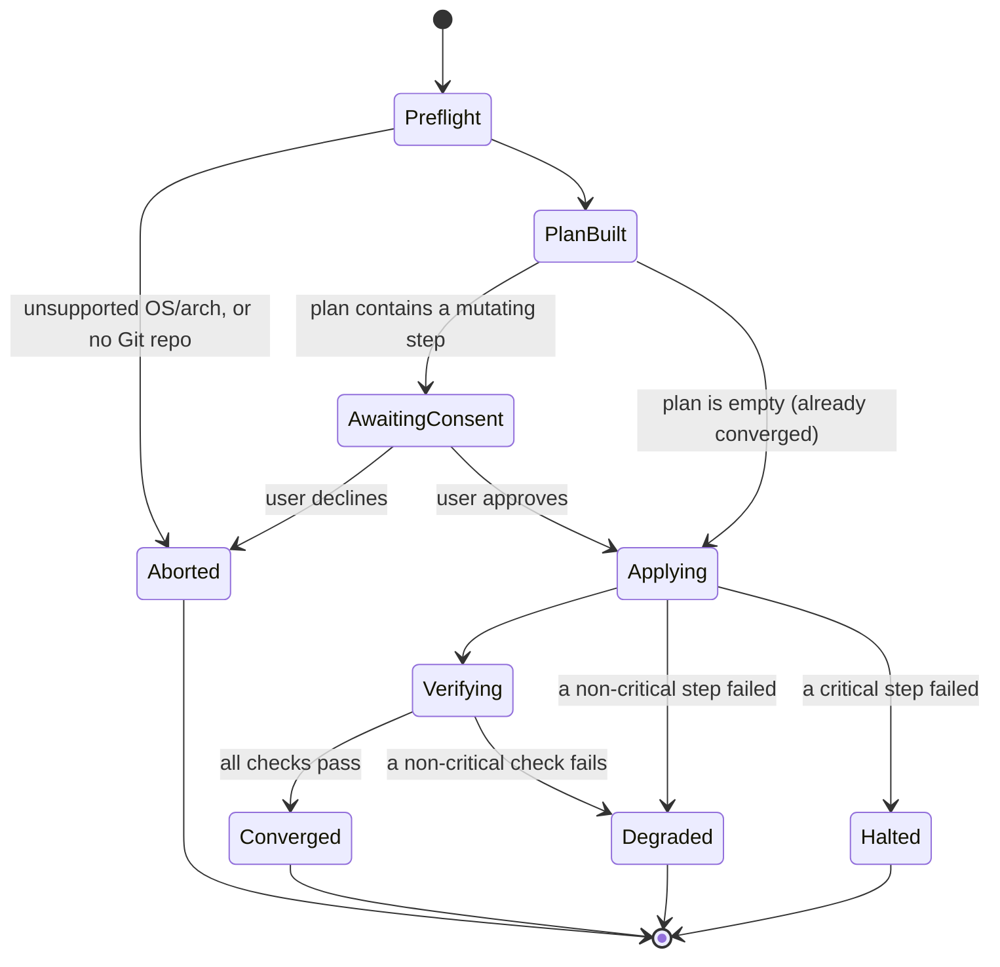
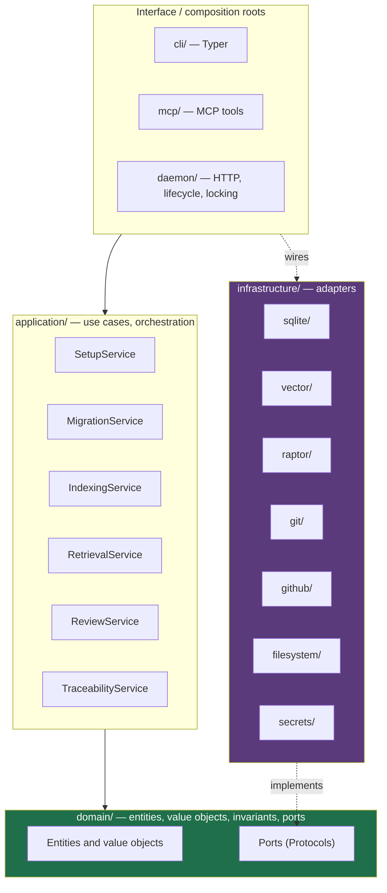
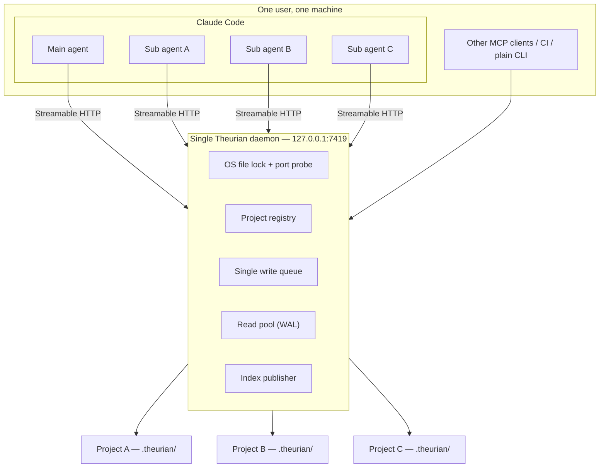
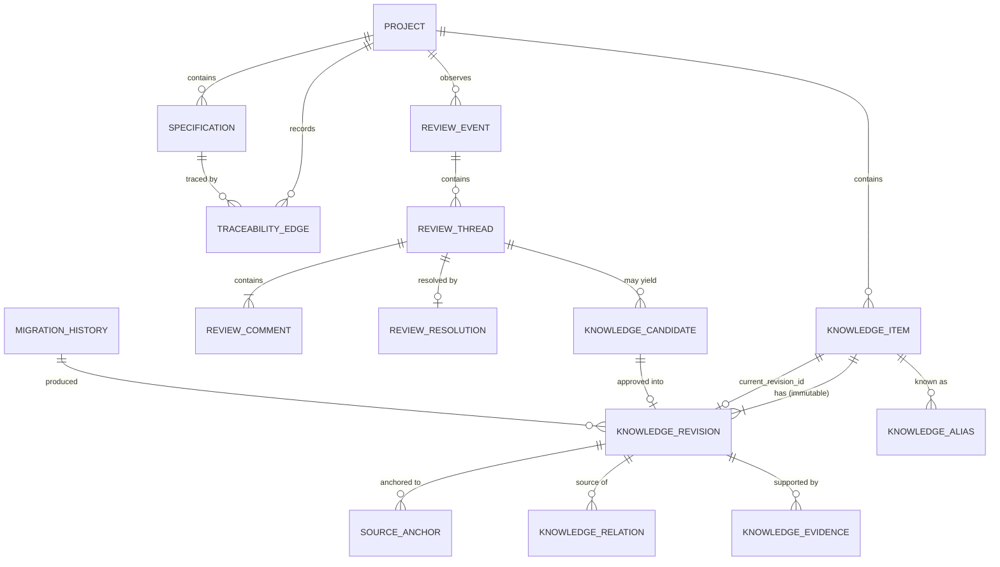
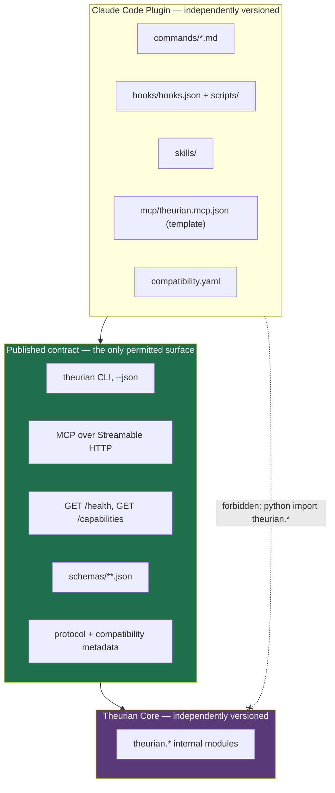
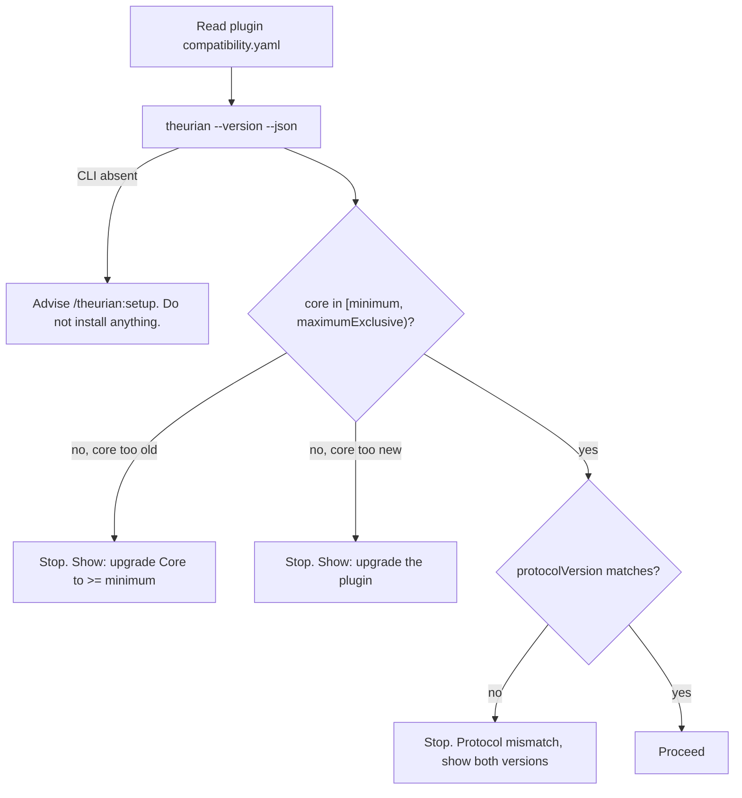
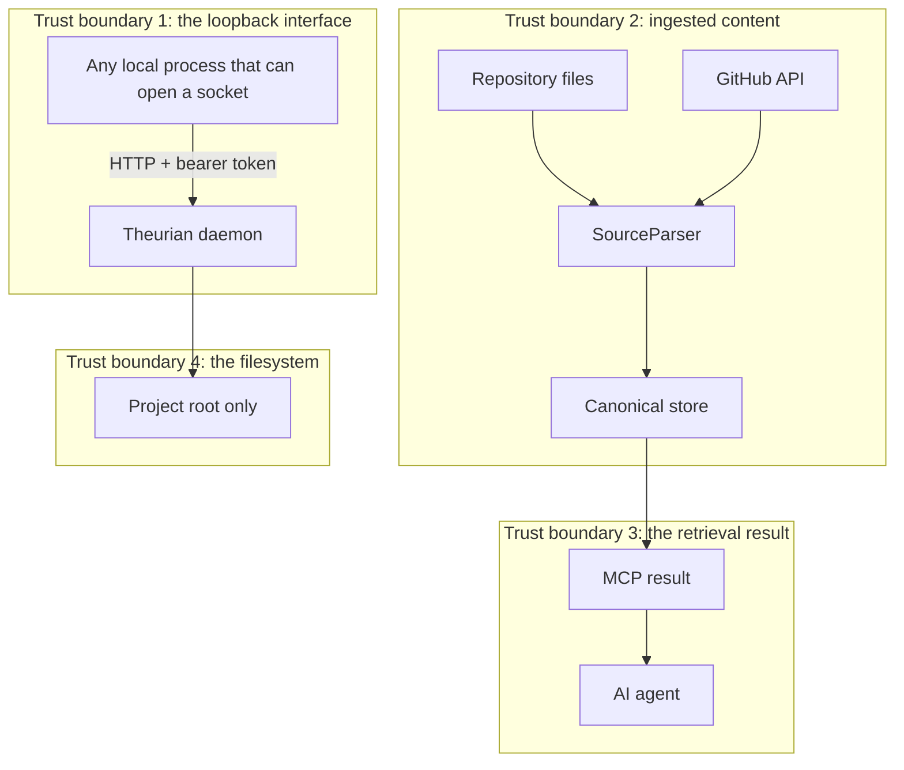

# Theurian — Requirements and Architecture Analysis

Status: **accepted for Milestone 0**
Last updated: 2026-08-01

This document is the answer to the twenty-one questions asked before implementation
started. It is the reference every ADR, schema, and package boundary in this repository
traces back to. When this document and an ADR disagree, the ADR wins and this document
must be corrected.

---

## 1. Functional requirements

Identifiers (`FR-*`) are stable and referenced from ADRs, tests, and issues.

### 1.1 Project management

| ID | Requirement |
| :-- | :-- |
| FR-P1 | Register a Git repository as a Project with a stable `projectId`, root path, repository URL, default branch, and knowledge directory. |
| FR-P2 | Unregister a Project without deleting Git-tracked knowledge. |
| FR-P3 | List registered Projects and report per-Project status (migration state, index state, last seen commit). |
| FR-P4 | Serve many Projects from one daemon process, with no process-global "current project". |
| FR-P5 | Treat each Git worktree of the same repository as a distinct Project context, never conflated. |

### 1.2 Knowledge lifecycle

| ID | Requirement |
| :-- | :-- |
| FR-K1 | Represent knowledge as an immutable `KnowledgeRevision` under a mutable `KnowledgeItem` pointer. |
| FR-K2 | Apply state changes exclusively through declarative YAML knowledge migrations. |
| FR-K3 | Support the operations: `createItem`, `upsertRevision`, `deprecateItem`, `restoreItem`, `addRelation`, `removeRelation`, `addAlias`, `removeAlias`, `changeSensitivity`, `changeOwner`, `registerSpecification`, `supersedeSpecification`, `addEvidence`, `removeEvidence`. |
| FR-K4 | Rebuild the entire canonical state from an empty database using only Git-tracked inputs. |
| FR-K5 | Detect a migration whose recorded checksum differs from its file checksum, and fail loudly. |
| FR-K6 | Enforce optimistic concurrency via `expectedRevision`. |
| FR-K7 | Order migrations by topological sort over `dependsOn`, and reject cycles. |
| FR-K8 | Re-applying an already-applied migration is a no-op, not an error. |
| FR-K9 | Carry per-revision provenance: source, author, revision, validity window, trust level, sensitivity. |
| FR-K10 | Model typed relations between knowledge, specs, reviews, code, and tests. |
| FR-K11 | Resolve aliases so a renamed item stays reachable by its old identifier. |

### 1.3 Source ingestion and normalization

| ID | Requirement |
| :-- | :-- |
| FR-S1 | Ingest Markdown, YAML, JSON, JSON Schema, OpenAPI, AsyncAPI, Git diffs, Git commit metadata, GitHub pull requests, reviews, and issues. |
| FR-S2 | Normalize every source format into one Canonical model without losing the structured fields of structured sources. |
| FR-S3 | Record a `SourceAnchor` (provider, repository, commit SHA, blob SHA, path, line range, URI, external ID) for every canonical document. |
| FR-S4 | Register new source formats by adding a `SourceParser` adapter, with no change to domain or application code. |
| FR-S5 | Verify the checksum of every source file referenced by a migration. |
| FR-S6 | Refuse to read any source file outside the Project root, including via symlink. |

### 1.4 Retrieval

| ID | Requirement |
| :-- | :-- |
| FR-R1 | Filter by Project, tenant, ACL, sensitivity, and validity window **before** ranking. |
| FR-R2 | Run lexical (SQLite FTS5) and dense (vector) retrieval and fuse with Reciprocal Rank Fusion. |
| FR-R3 | Search RAPTOR summary nodes and expand to parents and children. |
| FR-R4 | Rerank, deduplicate, diversify, and pack results within a caller-supplied token budget. |
| FR-R5 | Return provenance on every hit: `itemId`, `revisionId`, `snapshotId`, `indexBuildId`, `sourceAnchors`, `raptorPath`. |
| FR-R6 | Return safety metadata on every hit: `contentClassification`, `mayContainInstructions`, `executable`. |
| FR-R7 | Pin a `snapshotId` so results are reproducible for the lifetime of a task. |
| FR-R8 | Search across several registered Projects in one call when the caller is authorized for all of them. |

**FR-R1 is two of five axes as of #119 phase 4.** `SqliteIndexStore._scope`
builds the WHERE clause every retriever uses, and it filters on Project, on
sensitivity, and on status — a check FR-R1 does not name. Tenant and ACL have no
column and hold no content: a migration naming a non-default tenant or ACL group
is refused at write time (#110). The `chunks` table still carries `trust_level`
and `namespace`, which no query reads. `sensitivity` was in that list until #119:
its values *are* ingested — a `restricted` document is stored — and it is now
filtered on against the deployment's declared ceiling rather than merely returned
labelled. The per-axis register below states each disposition one by one
(#63, #119).

**Per-axis disposition — the register that closes
[#63](https://github.com/theurian/theurian/issues/63).** Each of FR-R1's five
named axes, plus the `status` check `_scope` adds that FR-R1 does not name, with
what the pre-1.0 product actually does about it and the PR that established that
disposition. The maintainer's recorded decision deferred tenant, ACL group and
sensitivity to [#119](https://github.com/theurian/theurian/issues/119), the
successor to this issue, and noted that landing `AuthorizationProvider` would be
necessary but not sufficient — its local adapter is "allow all" (the port table
above), so #119 also had to give sensitivity a retrieval predicate. It has: the
grant is resolved from the operator's serving profile, the build excludes what is
above it, and `_scope`/`_node_scope` emit it (phases 3–4). Tenant and ACL group
remain refused at write time rather than filtered. Project, status, sensitivity
and (on request) the validity window are what is enforced pre-1.0.

| Axis | Pre-1.0 disposition | Mechanism | Landed |
| :-- | :-- | :-- | :-- |
| Project | **Enforced** — a pre-ranking WHERE predicate every retriever builds from | `chunks.project_id = ?` in `SqliteIndexStore._scope` | [#32](https://github.com/theurian/theurian/pull/32) |
| status | **Enforced** — a pre-ranking WHERE predicate when the caller has not passed `includeUnapproved`; `may_surface` at the canonical gate otherwise | `chunks.status = ?` in `_scope` (added only when `include_unapproved` is false); `may_surface` in `domain/enums.py` | [#32](https://github.com/theurian/theurian/pull/32) |
| tenant | **Refused at write time** — a migration naming a `tenantId` other than `local` is rejected; no index column | `migrate validate`/`migrate apply` | [#110](https://github.com/theurian/theurian/pull/110) (phase 1) |
| ACL group | **Refused at write time** — a migration naming an `aclGroup` other than `default` is rejected; no index column | `migrate validate`/`migrate apply` | [#110](https://github.com/theurian/theurian/pull/110) (phase 1) |
| sensitivity | **Enforced** — against the deployment's declared ceiling, not the caller's request: the build writes no row above it, every retriever filters on it before ranking, the canonical gate re-checks the item's *current* class, and a `changeSensitivity` past the build's own ceiling purges the item out of the published index in the same `migrate apply` (a reclassification *into* the ceiling waits for the next build — ADR-0025's recorded residual) | `may_disclose` in `domain/enums.py`; `chunks.sensitivity IN (…)` and `nodes.sensitivity IN (…)` in `_scope`/`_node_scope`; exclusion in `IndexBuilder._build`; `revisions_to_purge` in `application/migration_engine.py` | [#119](https://github.com/theurian/theurian/issues/119) phases 3–6; ADR-0025 part 4 (two-corpora suite) discharged in phase 6 |
| validity window | **Caller-chosen refinement, not a default filter** — omitting `asOf` filters on nothing; applied after ranking, never inside the retriever depth loop | `knowledge.search`'s optional `asOf` → `ValidityPeriod.contains`, in Python, on both answer paths | [#112](https://github.com/theurian/theurian/pull/112) (phase 2) |

The enforced predicates are exactly what `_scope` emits, and this register is
pinned to that same source the way SECURITY.md is:
<!-- enforced-axes:begin — the enforced-axis set and its count, pinned to _scope by tests/unit/test_gate_call_sites.py -->
**three** enforced axes — `chunks.project_id`, `chunks.status` and
`chunks.sensitivity`.
<!-- enforced-axes:end -->
`tests/unit/test_gate_call_sites.py` checks both this block and SECURITY.md's
against what `_scope` emits — the axis tokens and the spelled count — so the
three copies cannot drift, and enumerates every `may_surface` call site (bare,
aliased, or module-attribute) so the `status` gate cannot silently gain one.

The validity-window axis is no longer wholly unenforced, and it is
deliberately not unconditional either
([#63](https://github.com/theurian/theurian/issues/63) phase 2).
`knowledge.search` takes an optional `asOf` timestamp; passing one applies
`ValidityPeriod.contains`, in Python, identically on both answer paths —
`CanonicalVisibility.at_moment` on the ranked path and a plain check inside
`mcp.search._scan` on the unranked fallback. `SqliteCanonicalStore` never
compares a timestamp: an earlier version gave `list_items` a `current_at`
parameter that filtered in SQL, and it is deleted rather than kept, because it
compared the stored `validFrom`/`validTo` against `asOf` as SQLite TEXT and so
silently disagreed with the Python comparison whenever the two were authored
in different UTC offsets — a HIGH finding in review round 1 of PR #112.
`CanonicalVisibility.at_moment` also runs strictly *after* the depth-doubling
loop that decides how many times a retriever is asked for more, never inside
the check that loop's own exit condition watches — folding it in there was a
second, CRITICAL finding in the same round: a caller-chosen moment would have
let that loop's retriever-call count move with `asOf`, reviving the
single-withheld-row timing oracle `FIRST_PASS_DEPTH` exists to blunt (see
`theurian.application.visibility.Visibility.at_moment`'s docstring). Omitting
`asOf` filters on nothing more than before this parameter existed — a default
validity filter was rejected, because it would make `freshness.isWithinValidity`
constant-`true` on every published result and give the ranked path a
stale-index statistics residual with no way to turn off, rather than only
while an index build is behind. Sensitivity is now enforced as a control
(build-side exclusion, the `_scope`/`_node_scope` predicate, and a
same-`migrate apply` purge on reclassification); tenant and ACL group are
discharged degenerately, refused at write time so that no stored row carries a
non-default value to filter — a deployment that ever stores a second tenant
needs a real control rather than this argument
([#119](https://github.com/theurian/theurian/issues/119) closed both halves;
ADR-0025).

FR-R5's `snapshotId` and `indexBuildId` are realized once per response, on the
`retrieval` block, not repeated on every hit in `results`. One
`knowledge.search` response is answered from exactly one canonical state, and,
when ranked, from exactly one index build; a per-hit copy would repeat one
string per result and could never differ between hits. Verified:
`retrieval.snapshotId` is byte-identical to `knowledge.status.stateHash`,
because both are read from the same `ActiveState` within one request, so
provenance can be cross-checked without a second call. What stays per hit is
the part that makes an individual claim checkable — `itemId`, `revisionId`,
`sourceAnchors` — which is what a citation actually needs. See
`schemas/mcp/retrieval-metadata.schema.json` and
`schemas/knowledge/retrieval-result.schema.json` for the normative shape.

### 1.5 Review knowledge

| ID | Requirement |
| :-- | :-- |
| FR-V1 | Ingest pull requests, reviews, threads, inline comments, resolution state, target files/lines/commits, fix commits, merge commits, CI results, and linked issues as **structured** records. |
| FR-V2 | Classify review comments into the eleven categories in §21 of the brief. |
| FR-V3 | Generate a `KnowledgeCandidate` from a review thread that meets the promotion gate. |
| FR-V4 | Never auto-approve a candidate; approval is a human act recorded as a migration. |
| FR-V5 | Ingest raw reviews successfully even when LLM-based candidate generation fails. |
| FR-V6 | Emit human-readable Markdown views of reviews as derived artifacts only. |

### 1.6 Specification and traceability

| ID | Requirement |
| :-- | :-- |
| FR-T1 | Register structured specifications in their native format (YAML/JSON/OpenAPI) without forcing Markdown. |
| FR-T2 | Store typed traceability edges with evidence and confidence. |
| FR-T3 | Answer: implementations of a spec, tests verifying a spec, unimplemented specs, unverified specs, code without a spec. |
| FR-T4 | Detect the seven drift conditions in §22 of the brief. |
| FR-T5 | Evaluate a configurable per-change-type `traceabilityPolicy`. |
| FR-T6 | Report contradictions between specifications, and between review knowledge and current specs. |

### 1.7 Interfaces

| ID | Requirement |
| :-- | :-- |
| FR-I1 | Expose the full feature set through the `theurian` CLI with machine-readable JSON output. |
| FR-I2 | Expose read and propose operations through MCP over Streamable HTTP. |
| FR-I3 | Route AI writes to proposal files under `.theurian/proposals/`, never into approved state. |
| FR-I4 | Run usefully with no Claude Code installed. |
| FR-I5 | Provide a Claude Code plugin that consumes only the CLI, MCP, health API, public schemas, and compatibility metadata. |

### 1.8 Setup and lifecycle

| ID | Requirement |
| :-- | :-- |
| FR-L1 | `/theurian:setup` and `theurian setup` share one application service. |
| FR-L2 | Setup is idempotent and repairs only what is missing. |
| FR-L3 | Installing the plugin alone registers no OS service and starts no daemon. |
| FR-L4 | `SessionStart` performs a bounded health check only. |
| FR-L5 | Uninstall offers independent choices per artifact class and never deletes approved knowledge without explicit confirmation. |
| FR-L6 | Exactly one daemon process per user per machine. |

---

## 2. Non-functional requirements

| ID | Requirement | Target |
| :-- | :-- | :-- |
| NFR-1 | Single daemon | Exactly 1 process for ≥10 concurrent MCP clients. Enforced by an OS file lock plus a port health probe, not a PID file alone. |
| NFR-2 | `SessionStart` latency | p95 ≤ 300 ms, hard cap 2 s, then degrade to a warning. |
| NFR-3 | Search latency | p95 ≤ 500 ms for a 10k-revision Project, warm index, excluding external reranking. |
| NFR-4 | Index availability | The previously published index answers every query while a new build runs. Zero read downtime. |
| NFR-5 | Reproducibility | Same migrations + same content + same schema/engine version ⇒ same `state_hash` ⇒ byte-identical canonical state. |
| NFR-6 | Branch switch | Switching to a previously built `state_hash` is O(1). A descendant state applies only the delta. |
| NFR-7 | Write model | One serialized write queue; reads use independent WAL connections. |
| NFR-8 | Transaction duration | No external I/O (LLM, network, subprocess) inside a write transaction. Target < 50 ms per write txn. |
| NFR-9 | Portability | macOS (arm64, x86_64) and Linux (x86_64, arm64) at 1.0; Windows behind the same `DaemonManager` port. |
| NFR-10 | Offline | All features except GitHub ingestion work with no network. All tests pass with no network. |
| NFR-11 | Observability | OpenTelemetry traces and metrics, off by default, never emitting knowledge bodies or tokens. |
| NFR-12 | Uninstallability | Every file Theurian creates is enumerable by `theurian uninstall --dry-run` before deletion. |
| NFR-13 | Test coverage | ≥ 80% line and branch coverage on `theurian-core`. |
| NFR-14 | Resource ceiling | Idle daemon < 150 MB RSS with 5 registered Projects. |
| NFR-15 | Cold start | `theurian daemon start` to first healthy `/health` ≤ 3 s. |

---

## 3. Security requirements

| ID | Requirement |
| :-- | :-- |
| SEC-1 | Bind the daemon to `127.0.0.1` only. Never `0.0.0.0`, never a non-loopback interface, in the OSS Core. |
| SEC-2 | Validate `Origin` and `Host` on every MCP request (DNS-rebinding protection). |
| SEC-3 | Require a bearer token with ≥ 256 bits of entropy from a CSPRNG on every MCP and management request. |
| SEC-4 | Store the token in a 0600 file inside a 0700 directory, and prefer macOS Keychain / Linux Secret Service when available. |
| SEC-5 | Never write the literal token into a Claude Code config file. Configs carry an environment-variable reference only. |
| SEC-6 | Never log, trace, or error-message a token. Redaction is applied at the logging sink, not at each call site. |
| SEC-7 | Resolve every path with `realpath` and assert containment in the Project root; reject symlinks that escape. |
| SEC-8 | Bound parser input: max file size, max archive expansion ratio, max nesting depth, wall-clock timeout. |
| SEC-9 | Never build a shell command by string concatenation. `git` and `gh` are invoked as argument vectors with `shell=False`. |
| SEC-10 | Validate Git and external URLs against an allowlist of schemes and reject private-network destinations (SSRF). |
| SEC-11 | Scan content for secrets before it becomes an approved revision; block or warn per policy. |
| SEC-12 | Validate every MCP tool input against its published JSON Schema before it reaches application code. |
| SEC-13 | Authorize `projectId` on every call. A client authorized for Project A must never read Project B. |
| SEC-14 | Never mix content across sensitivity levels, ACL groups, tenants, namespaces, or Projects into one RAPTOR summary. |
| SEC-15 | Tag every retrieval result `contentClassification: untrusted-knowledge`, `mayContainInstructions: true`, `executable: false`. |
| SEC-16 | Treat imperative text inside knowledge bodies as data. Summarization prompts wrap source content in a delimited, explicitly-untrusted region. |
| SEC-17 | AI-originated writes produce proposal files only. There is no MCP path to mutate approved state. |
| SEC-18 | Setup never overwrites an existing file destructively; it backs up or shows a diff and asks. |
| SEC-19 | Every external I/O call carries an explicit timeout. |
| SEC-20 | The cloud port assumes TLS, OAuth 2.1 / OIDC, audience and scope validation, tenant isolation, rate limits, and an audit log — but the OSS Core must not require any of them. |

### 3.1 Explicit non-goals

- Theurian is not a secrets manager and never stores third-party credentials on behalf of a user beyond its own local token.
- Theurian does not sandbox the knowledge it serves. It labels content as untrusted; enforcing that label is the calling agent's responsibility.

---

## 4. OSS requirements

| ID | Requirement |
| :-- | :-- |
| OSS-1 | Apache-2.0, with `LICENSE` at the repo root and in each published artifact. |
| OSS-2 | README, CONTRIBUTING, SECURITY, CODE_OF_CONDUCT, GOVERNANCE, CHANGELOG. |
| OSS-3 | Issue templates and a pull-request template. |
| OSS-4 | Semantic Versioning per artifact; Conventional Commits enforced in CI. |
| OSS-5 | The DCO-versus-CLA decision is recorded in an ADR (ADR-0015: DCO, enforced by a sign-off check). |
| OSS-6 | Dependency license scanning in CI, with an allowlist. |
| OSS-7 | SBOM (CycloneDX) generated and attached to every release. |
| OSS-8 | Automated dependency updates (Dependabot). |
| OSS-9 | CodeQL, secret scanning, SAST, and dependency review in CI. |
| OSS-10 | Publish a Python package, a Docker image, and a Claude Code plugin. |
| OSS-11 | Release artifacts carry SHA-256 checksums. |
| OSS-12 | Installers for macOS and Linux. |
| OSS-13 | A third party can clone, install, run, and test the project from a clean machine with no paid API key. |
| OSS-14 | Reproducible build instructions with a committed `uv.lock`. |
| OSS-15 | No hard dependency on any specific LLM, embedding, or cloud vendor. Every such capability sits behind a port with a deterministic fake. |

---

## 5. Claude Code plugin requirements

| ID | Requirement |
| :-- | :-- |
| CP-1 | The plugin is a separate release artifact with its own version, CHANGELOG, tests, CI job, CODEOWNERS, and docs. |
| CP-2 | The plugin contains no Python import of `theurian.*`. Its only channels are the CLI, MCP, the health API, public schemas, and compatibility metadata. |
| CP-3 | The plugin ships the twelve commands in §9 of the brief. |
| CP-4 | The plugin ships a `SessionStart` hook that is a bounded health check and nothing more. |
| CP-5 | The plugin does **not** declare an `mcpServers` entry in its manifest. Claude Code auto-connects plugin MCP servers at enable time, which would contradict "install alone does nothing". The plugin carries the connection as a *template*; `/theurian:setup` installs it. See ADR-0012. |
| CP-6 | The plugin declares `coreCompatibility` (`minimum`, `maximumExclusive`) and `protocolVersion`, and refuses to operate — safely, with upgrade instructions — outside that range. |
| CP-7 | No setup logic lives in the plugin. Every command is a thin adapter over `theurian <verb> --json`. |
| CP-8 | Uninstall is granular and never removes approved knowledge without explicit confirmation. |
| CP-9 | The plugin must remain movable to its own repository without changing Core. |

---

## 6. `/theurian:setup` state machine

`/theurian:setup` and `theurian setup` are the same application service
(`SetupService.run(SetupRequest) -> SetupReport`). The plugin command is a
presentation shell over `theurian setup --json`.

### 6.1 States



`Degraded` is a success-with-warnings terminal state, not a failure: a missing
`gh` token must not prevent local knowledge from working.

### 6.2 Step-level state, in order

Every step is a `SetupStep` with an independent probe result: `Satisfied`
(skip), `Missing` (create), `Conflicting` (back up or ask) — and `NotApplicable`,
which `StepStatus` carries so a report never claims to have checked something it
skipped. `Satisfied` may still carry a `detail` — a **reservation**: a finding
with no work attached. The block being correct and the shell exporting its value
are different claims, and row 7 is where they come apart.

`_reservations` turns each one into a report warning, and **both surfaces that
publish a plan call it**, because they had drifted. The verification pass carried
the sentence and ended a real run `Degraded`, while the `PlanBuilt` report that
`theurian doctor` and `theurian setup --dry-run` both return carried no warnings
at all: on one machine, `theurian setup` said `degraded` with the sentence and
`theurian doctor --json` said `"warnings": []` and exited 0, the caveat sitting
in the payload the whole time as the `detail` of a step whose status reads
`satisfied` — which is where a reader stops. Pinned in
`tests/integration/test_setup_cli.py`:
`test_doctor_calls_a_line_it_will_not_touch_a_warning_and_not_a_problem`,
`test_the_plan_setup_prints_carries_the_same_reservation_doctor_does`, and
`test_doctor_says_nothing_about_a_machine_with_nothing_below_the_block` as the
control that keeps the first two from passing on a command that warns
unconditionally.

A reservation is **not** a problem. `doctor`'s `healthy` and `problemCount` count
what setup would change and what it would ask consent for, and a reservation is
neither, so neither field moves and the exit code stays 0: a non-zero exit that
no command Theurian ships can clear is how a health check stops being read.
Measured on a real `theurian doctor --json` over one sandbox with and without a
shadowing line: `problemCount` is 4 both times, and the second run carries one
extra `env-reference: …` warning. The status half of `_reservations`' condition
is load-bearing and pinned, because every machine carries `NotApplicable` steps
that explain themselves — row 3's supply-chain note is one on every platform —
and matching on `detail` alone would turn each of them into a finding about this
install
(`tests/integration/test_setup_service.py::test_a_step_that_is_not_applicable_and_says_why_is_not_a_warning`;
the state a run with no findings at all reaches is
`::test_a_healthy_machine_ends_the_run_converged`).

| # | Step | Probe | Action when `Missing` | Action when `Conflicting` |
| :-- | :-- | :-- | :-- | :-- |
| 1 | Platform check | `uname` / `platform` | — | abort with a clear message |
| 2 | Core present | `theurian --version` on `PATH` | install (explicit user action) — **not implemented, see below** | version mismatch → offer `upgrade` |
| 3 | Artifact integrity — **not implemented, see below** | SHA-256 vs the release manifest | verify before install | abort; never install an unverified artifact |
| 4 | Data directory | `~/.theurian` exists, mode 0700 | `mkdir -p`, `chmod 700` | tighten mode, report the change |
| 5 | Token | token exists and is ≥ 32 bytes | generate via CSPRNG | reuse; never regenerate silently |
| 6 | Token storage | file mode 0600, or Keychain entry | write | `chmod`, report |
| 6a | Serving profile | `~/.theurian/auth/serving-profile` names a ceiling this build can honour | — never `Missing`: an undeclared ceiling is `NotApplicable`, and the summary names the default in force | report the refusal and its remedy; setup never writes or repairs that file |
| 7 | Env reference | `~/.theurian/env` holds a current Theurian-owned block | write the block, or rewrite a stale one, leaving every other line alone | markers that delimit no single block: report, never write |
| 8 | Daemon service | LaunchAgent / systemd user unit present | install a user-scoped unit | show a diff, back up, ask |
| 9 | Daemon running | `GET /health` returns 200 | start the service | reuse the existing daemon |
| 10 | Single instance | lock held by exactly one PID | acquire | reuse; never kill a live daemon |
| 11 | Project registered | `projectId` present in the registry | register the current repo | reuse; update the root path if the repo moved |
| 12 | `.theurian/` layout | required directories exist | create | leave existing files untouched |
| 13 | `.gitignore` entries | derived paths ignored | `theurian init` appends a marked block; setup only reports | — see below |
| 14 | MCP connection | a `theurian` entry with the right URL | write via a merge-not-replace update | back up, show a diff, ask |
| 15 | MCP health | initialize handshake succeeds | — | report and continue in `Degraded` |
| 16 | Migrations valid | `migrate validate` is clean | — | report; never auto-repair data |
| 17 | Initial index | an `active_index` exists for the current `state_hash` | build | reuse |
| 18 | Serena detection | a `serena` MCP entry exists | — | report coexistence, change nothing |
| 19 | Report | — | print the changed-files list | — |

**Row 6a is not numbered, and that is deliberate.** It arrived with the
deployment serving profile ([#119](https://github.com/theurian/theurian/issues/119),
ADR-0025) — long after this table was written — and it belongs beside the token,
because it is the other operator-owned file in `auth/`. Inserting it as a numbered
row would move every row below it, and "§6.2 row *N*" is cited across the tree,
the threat model included. `StepId` carries it as `SERVING_PROFILE`, `STEPS`
places it after `token-storage`, and `probe_serving_profile` states why none of
its three arms is `Missing`.

**Rows 2 and 3 are required, not implemented.** Setup neither installs Core nor
verifies an artifact.

- **Row 2 has no `Missing` branch and no install.** `probe_core` reports
  `Satisfied` or `Conflicting`, and in practice reports `Satisfied`: the
  executable it checks comes from `_executable()` in `cli/setup_commands.py`,
  which falls back to `sys.argv[0]` — the program currently running — so
  `Conflicting` needs an `argv[0]` that does not resolve. Setup cannot report
  that Core is missing, because setup is Core.
- **Row 3 performs no check.** `probe_artifact_integrity` returns
  `NotApplicable` unconditionally rather than claiming one it cannot make, and
  there is no download for it to check against: the user installs Core with
  `uv tool install` or `pipx` before setup runs at all.

Both rows stand as requirements. Row 3 is the setup-step half of T-16, which
§19's threat table maps to OSS-7, OSS-11 and this row; OSS-11 itself — artifacts
carry checksums — ships. The gap is filed as
[#39](https://github.com/theurian/theurian/issues/39), and why closing it is a
change to how Theurian is obtained rather than a probe added here is recorded
under [T-16](../security/threat-model.md).

**Row 7's "the Theurian-owned block only" ships, and its tri-state is not where
this table first put it.** `probe_env_reference` compares the marked block and
nothing else; `apply_env_reference` rewrites that span alone, and every byte
outside it survives byte for byte
([#128](https://github.com/theurian/theurian/issues/128)) — the span being the
marked block, or, on a machine `0.1.0.dev0`–`dev2` set up, the unmarked rendering
those versions wrote, which is replaced in place rather than appended beside. A
file that ended without a newline gains one; nothing else is added and nothing
outside is removed. What moved is which
state carries the requirement. A stale or absent block is `Missing` — `Missing`
means "not as setup wants it", not "absent" — so the block-only rewrite is the
`Missing` action, and this row used to name it under `Conflicting`. `Conflicting`
is now the narrower case no rewrite survives: markers that do not delimit one
block, where setup cannot tell which lines are its own. It then writes nothing at
all, `--approve-conflicts` included, and declares no path
(`tests/integration/test_setup_env_file.py::test_markers_that_do_not_delimit_one_block_are_a_conflict_and_not_a_rewrite`,
`::test_approving_the_conflict_buys_progress_and_never_an_overwrite`).

**Which markers delimit is decided on lines, and on a count taken first.** A
marker is a whole line — the file is split on `\n` alone, with a trailing `\r`
dropped from the line's text, so a CRLF file delimits while its `\r` bytes stay
outside every span — and `Conflicting` covers exactly two arrangements: two or
more start *lines* anywhere in the file, and a start line with no end line after
it. The starts are counted over the whole file before a span is chosen, which is
what makes the second one's position irrelevant. An end line with no start above
it, and a second end line, are ordinary lines the merge keeps. The rule is
asserted over the population rather than shape by shape, in
`tests/unit/test_env_file_merge.py::test_no_arrangement_of_the_markers_loses_a_line_outside_the_block`:
every file those three symbols build up to five lines long, 363 of them, 229
refused and 134 merged with every line outside the delimited block surviving in
order. The first cut of this work searched for substrings instead; measured
against it, 39 of the 363 took the wrong refusal decision and 16 of those
reported success while dropping 19 of the user's lines.

**Row 7 also has a `Satisfied` arm that does not mean converged.** A shell keeps
the last assignment it reads, so a line *below* the block assigning
`THEURIAN_MCP_TOKEN` again is what the machine exports. The probe stays
`Satisfied`, because the block is correct and applying the step would write the
same bytes, and it is not `Conflicting`, because a conflict asks for consent to
do something and there is nothing here setup wants to do — that line is not
Theurian's to edit (SEC-18). It is reported instead: the step carries a `detail`,
`_reservations` turns it into a warning on both surfaces above, and a real run
ends `Degraded`
(`tests/integration/test_setup_env_file.py::test_an_assignment_below_the_block_is_reported_rather_than_edited_away`).
The warning names the path, the variable and the start marker to move the line
above, exactly once, and never the line itself
(`::test_the_override_warning_names_the_variable_and_never_the_line_it_found`). A
bare `export THEURIAN_MCP_TOKEN` or a commented-out assignment is not an
override and leaves the run converged
(`::test_a_line_that_only_mentions_the_token_leaves_the_run_converged`). Currency
is asked *first*: a block that is stale **and** shadowed is `Missing`, rewritten,
and reported by the re-probe afterwards — one warning, not a report instead of
the fix
(`::test_a_stale_block_with_a_later_assignment_is_rewritten_rather_than_reported`).

**What finds that line is a heuristic over the direct assignment forms, and its
boundary is recorded rather than closed.** `contains_shadowing_assignment` reads
one line at a time and recognises a first word spelled `THEURIAN_MCP_TOKEN=…`, or
that word following `export`, `declare`, `typeset` or `readonly`. It is wrong in
both directions, measured with `/bin/bash` sourcing the block and then the line:

| A line below the block | The shell exports | The run says |
| :-- | :-- | :-- |
| `[ -n "$HOME" ] && THEURIAN_MCP_TOKEN=x` | `x` | nothing; `Converged` |
| `if [ -n "$HOME" ]; then THEURIAN_MCP_TOKEN=x; fi` | `x` | nothing; `Converged` |
| `{ THEURIAN_MCP_TOKEN=x; }` | `x` | nothing; `Converged` |
| `eval 'THEURIAN_MCP_TOKEN=x'` | `x` | nothing; `Converged` |
| an assignment inside a quoted heredoc *body* | the block's value | the warning |

The four misses are pinned **as** the recorded boundary, one case per shape and
each measured through a real `bash` rather than restated against the function
(`::test_a_shape_the_heuristic_does_not_recognise_leaves_the_run_silent`), so a
change that begins warning on one of them has to come here and to that list and
say so. On those four machines the step's summary still reads
"`<data_dir>/env` exports `THEURIAN_MCP_TOKEN` by reference" — true of the block,
and incomplete about the machine.

**Not extended, and that is the decision rather than a to-do.** What a line does
is settled by the shell at run time — `eval` takes a string that need not exist
until then, and a heredoc body is not shell at all — so no line-level rule
separates these, each shape added would move the boundary without closing it, and
a probe that runs somebody's shell profile is not a probe. The answer is in the
wording instead: both published sentences say the line *appears* to assign and
the block *appears* to be overridden, which is what keeps the last row honest —
that run warns about a file doing exactly what setup wanted, and the shell was
asked before the assertion was written
(`::test_the_sentence_about_a_line_it_cannot_read_claims_only_that_it_appears_to_assign`,
which holds the `summary` as well as the `detail`, because a reader who stops at
a status of `satisfied` sees only the first; dropping the hedge from the summary
alone survived all 2,442 tests while the detail's was held).

**Row 13 is a report in setup and a write in `theurian init`.**
`probe_gitignore` has no apply. It answers `Satisfied` when `.theurian/state`
appears anywhere in the file, `Missing` otherwise with "Run `theurian init`", and
`NotApplicable` outside a Git repository — so a `.gitignore` whose markers do not
delimit one block still probes `Satisfied` while that one string is in it. Setup
never opens that file for writing, so nothing is at risk in the meantime; what
the report does not do is say so. `ensure_gitignore`, which `init` calls, is the
writer, and #128's class was swept there too: markers matched as whole lines, the
start lines counted first, and both refusals raised as a `ProjectError` that
`init_command` renders as `error:` plus a remedy and exit 1 rather than the Typer
traceback it was
(`tests/integration/test_init_gitignore_block.py::test_the_refusal_reaches_a_person_as_an_error_line_and_not_a_traceback`,
`::test_markers_that_do_not_delimit_one_block_leave_the_file_exactly_as_it_was`).
A `.gitignore` is tracked, so a rule lost there shows in `git diff` — a
mitigation, not the fix, and worth nothing to somebody running `init` in a tree
that already has changes in it.

### 6.3 Idempotence contract

Running setup twice must produce a second report where every step is
`Satisfied` and the changed-files list is empty.

This said the contract "is asserted directly in
`tests/e2e/test_setup_idempotence.py`". That file has never existed. What holds
part of it is `tests/integration/test_setup_service.py`, against fake service and
MCP-config adapters — `test_a_second_run_never_regenerates_the_token` and
`test_a_step_setup_does_not_perform_is_never_reported_as_changed`. The end-to-end
statement, against a real LaunchAgent in a disposable profile, is owed with the
rest of the E2E suite: [#65](https://github.com/theurian/theurian/issues/65),
and see `tests/e2e/README.md` for which acceptance criteria have no test at all.

### 6.4 Halting, not rollback

Seven steps journal to `~/.theurian/setup-journal.jsonl`: the ones that carry an
apply — rows 4–9 and 14, that is data-directory, token, token-storage,
env-reference, daemon-service, daemon-running and mcp-connection. Each of them
appends one line when it *reaches* its apply: `"applied"` when the apply
returns, `"failed"` when it raises
(`test_the_step_that_stopped_the_run_is_journalled_as_failed`). Reaching the
apply is the condition, not being one of the seven — a step whose probe found it
`Satisfied` never reaches it, a `Conflicting` one never does either (approval
buys progress on the rest of the list, never an overwrite), and neither does any
step after a critical failure has halted the run. The other twelve steps — rows
1–3, 6a, 10–13 and 15–18; row 19 is the report itself and not a step — have no
apply and never journal, so the file records what setup *did* and not what it
looked at.

The journal is append-only and a record is `{"step", "event", "detail"}`. There
is no path *field* — but `detail` is prose written for a person, and it does name
paths: an applied record carries the step's own `action`, two of the seven of
which embed an absolute path (data-directory's "Create …/.theurian with mode
0700", and env-reference's "Write …/env, exporting …" for a file that is not
there or "Rewrite the Theurian-owned block in …/env" for one that is), and a
failed record carries the verbatim text of the exception that stopped the step,
which normally names the path that refused. So the file is a trace to read and
not a ledger to parse:
it holds no inverse action, `_apply` replays nothing, and no production code
reads it back — `uninstall_command` builds its list from the service path and the
MCP config alone. Enumerating created paths so `uninstall` can delete them is a
separate requirement, NFR-12, and it is not wired (R-10).

An append either **completes or answers `False`**, and never anything between the
two. The record is written through an `io.BufferedWriter`, which loops until the
buffer is empty and raises whatever the flush or the close hit; a bare `os.write`
is permitted to write fewer bytes than it was handed and return that count
without raising, which under a file-size limit or a full disk left a truncated
record and reported success. The bytes that did reach the disk stay there — the
file is `O_APPEND`, so truncating back to a remembered length would discard a
concurrent writer's record rather than this one's — but the run does not then
claim the journal among the files it wrote
(`test_an_append_that_could_not_complete_leaves_the_journal_undisclosed`). This
is per append and not per run: a line an earlier append landed stays on disk and
stays disclosed when a later one fails, on both the applied and the failed arm
(`test_a_step_that_applied_and_could_not_be_journalled_keeps_the_earlier_line_disclosed`,
`test_a_failure_that_could_not_be_journalled_keeps_the_earlier_line_disclosed`).

The file is created 0600 rather than at whatever the process umask allows,
because those lines are local absolute paths and raw exception text, and `changed_paths`
now points every reader of a halted report straight at them. The arm that fails
to tighten the data directory is precisely the arm that leaves this file's parent
0755 — a refused `chmod` is what put the run there — so the directory around it
is not what keeps it private
(`test_the_journal_is_created_private_inside_a_directory_that_is_not`). The mode
is re-asserted on every append too, by an `os.fchmod` on the open descriptor
before the write, which the creation mode cannot reach on its own in either
direction: a journal that `0.1.0.dev0` or `0.1.0.dev1` created through
`Path.open("a")` is 0644 under the usual umask and is **repaired** by the next
append rather than carried for the installation's life, and a umask that can only
take bits away — 0277 creates the file 0400 — would otherwise leave every later
run's `O_WRONLY` open failing EACCES and the journal silently never written
again. A refused `fchmod`, a journal owned by another account, skips the append
and answers `False`, which is the same trade the 0600 creation already makes. It
records the token *step* and never the token value
(`test_the_journal_never_records_the_token_it_watched_being_minted`; T-9 in
[the threat model](../security/threat-model.md)).

A critical step failing during apply **halts** the run at that step. The report's
`state` is `halted`, and `changed_paths` lists:

- the declared `paths` of every step whose apply **finished** — declared, not
  re-measured. A step that returned is taken at its word, and the rule that
  makes that safe is that every apply here writes or raises. **One shipped step
  is an exception to it.** `apply_token_storage` *is* `apply_token`, which mints
  only when there is no token, so on every fresh install the token step ahead of
  it has already written the file and this apply returns having done neither.
  Its declared path is truthful only because its predecessor wrote it, and the
  order is therefore pinned rather than incidental
  (`test_the_token_is_minted_before_the_step_that_stores_it`). What swapping the
  two moves was measured, and it is not `changed_paths`: both steps declare the
  same artefact and whichever runs first writes it, so `state`, `changed_paths`
  and both outcomes come back identical under either order. It is the **journal**
  that goes wrong — an applied record carries the step's own `action`, and under
  the swap the second entry reads "Generate a 256-bit token with the system
  CSPRNG." for a step that generated nothing, an event claim about work that did
  not happen in the file an operator reads to repair a machine. On a run that
  does not halt, `_verify` re-probes each step and degrades the run when one is
  still missing; a halted run returns before that pass, so nothing re-checks the
  trust there. The class an apply that finishes without writing belongs to —
  this one, and an *external* tool that exits successfully without writing what
  it said it would — is recorded as
  [#153](https://github.com/theurian/theurian/issues/153);
- for the step that failed partway, those of its declared `paths` that this run
  **moved** — provenance, not existence, described below;
- the setup journal, when this run appended to it and the append reached the
  disk (`test_a_halted_run_names_the_journal_among_the_files_it_wrote`,
  `test_a_halted_run_leaves_the_journal_it_wrote_on_disk`).

**A halted report's `warnings` are the failures that stopped the run, and carry
no reservations.** `_reservations` is called from the verification pass and from
the `PlanBuilt` report, and a halted run reaches neither; `Aborted` and
`AwaitingConsent` return earlier still, over a blocking conflict and over a plan
nobody has approved. So §6.2's "a later line appears to assign it again" caveat
is absent from exactly those three reports. That is recorded rather than closed,
in `_reservations`' own docstring: each of the three hands the reader a larger
question first, and the step's `detail` travels with the report in all of them —
what is missing is the promotion to a warning, not the sentence.

**Provenance, not existence.** Each of the failing step's declared paths is
reduced to `(st_ino, st_mode, st_size, st_mtime_ns)` by `os.stat` immediately
before the apply and again in the arm that assembles the halted report. Absent
before and present now, or present on both sides with a different signature, is
disclosed; the same signature on both sides is not. `st_mode` is in there because
the data-directory step's write *is* a mode change — tightening an existing 0755
directory to 0700 moves nothing else, so a signature blind to permissions could
not see that step happen at all. `os.stat` and not `os.lstat`, deliberately:
every apply here writes *through* a symlink rather than replacing one, and a
`~/.claude.json` that is a link into a dotfiles repository is an ordinary machine
(`test_a_write_through_a_symlinked_declaration_is_disclosed`). When the
observation itself fails on either side — EACCES on a parent, ELOOP, a name too
long — the path is disclosed anyway: "nothing was written" and "I could not look"
are different answers, and when the run cannot tell, it says so. Whether a
declared path predated the run does not change any of this, which is what the
earlier existence check got wrong.

Both directions are measured. The first five rows are driven by shipped steps;
the last two are driven by a synthetic one-step plan (`_step_over`) run through
the real `SetupService`, because no shipped apply can be driven into them —
`apply_data_directory`'s `chmod` is its last statement, no apply locks its own
parent, and the fixture's docstring records the rest:

| The failing step's declared path | Driven by | In `changed_paths` | Pinned by |
| :-- | :-- | :-- | :-- |
| a pre-existing 0755 `~/.theurian` whose `chmod` was refused — inode and mode unmoved | data-directory | no | `test_a_directory_the_run_could_not_tighten_is_not_reported_as_one_it_wrote` |
| `~/.claude.json`, left byte-identical by a failed `claude mcp add` — a file Theurian never writes itself | mcp-connection | no | `test_a_config_theurian_never_writes_is_not_claimed_when_claude_refuses` |
| a *directory* at `auth/mcp-token`, which makes the store raise before it writes | token | no | `test_a_credential_that_was_never_minted_is_not_offered_for_rotation` |
| a service definition the manager raised instead of writing | daemon-service | no | `test_a_step_that_failed_before_writing_does_not_claim_the_file_it_never_made` |
| a token file created and written, then a `chmod` that raised | token | yes | `test_a_step_that_wrote_its_artefact_before_failing_still_discloses_it` |
| an artefact whose mode moved and nothing else | `_step_over` | yes | `test_a_step_that_changed_only_a_mode_before_failing_still_discloses_its_artefact` |
| a path that stopped being statable mid-run | `_step_over` | yes, and the run still returns a halted report rather than a traceback | `test_a_path_that_stops_being_statable_is_disclosed_rather_than_assumed_untouched` |

Row two's "no" is about the failed arm only. `~/.claude.json` *does* appear in a
converged run's `changed_paths`: the mcp-connection step declares it, and
`claude mcp add` wrote it. "A file Theurian never writes" means Theurian's own
process never opens it — the write is delegated to the `claude` CLI — which is
exactly why a run where `claude` refused may not claim it and a run where
`claude` succeeded may.

The last row's pin holds the *disclosure*, not the mechanism behind it. The
apply locks the artefact's parent, so the second observation is unobservable and
its signature is `None` against a tuple — the row therefore passes on the
signature comparison alone, and would keep passing if the `known` flag that
distinguishes "absent" from "could not look" stopped being consulted. Isolating
pins for the two unknown arms, and for `st_ino`, `st_size` and `st_mtime_ns`
individually, are deferred to
[#155](https://github.com/theurian/theurian/issues/155).

The env file is the same "yes" as the token: `apply_env_reference` opens it for
writing, which truncates, so a write that raises after that has already moved
size and mtime and the path is disclosed. That row is **read off the open flags
rather than measured**: no test drives a truncation followed by a write that
raises, so it is an inference and not a pinned arm.

What the truncation replaces is now preserved by construction
([#128](https://github.com/theurian/theurian/issues/128)). The merge runs
*before* the open — the apply reads the file, computes the new contents with
`merge_env_file` (this data directory's block, every other byte as it was), and
only then opens — so a file whose markers it cannot delimit is never opened at
all, and what a completed write puts back includes the lines the run did not
author. Pinned in `tests/integration/test_setup_env_file.py`:
`test_an_undelimited_env_file_stops_the_run_before_anything_is_written` asserts
the bytes rather than the state, and
`test_lines_around_a_stale_block_survive_it_being_rewritten` and
`test_upgrading_a_pre_marker_file_keeps_the_lines_added_to_it` assert the whole
file after one.

What is left is the window between the truncation and the write's last byte,
where a device error leaves a prefix of the merged contents on disk. A *short*
write is not in that window — the write goes through an `io.BufferedWriter`, for
the reason given above for the journal — and the window is unpinned for the same
reason the disclosure row above is. Nothing is replayed either way: the journal
holds no inverse action, which is why a halted run says where it stopped rather
than offering to undo it.

Paths created implicitly on the way are not listed; a step discloses its declared
artefacts only. That category is wider than the data directory's `auth/`
subdirectory: the service adapters create `~/Library/LaunchAgents` on macOS and
`~/.config/systemd/user` on Linux the same way. An adapter's own temporary files
are outside it too — a `.plist.tmp` or `.service.tmp` can survive an install that
failed, and since it is nobody's declared artefact it is absent from
`changed_paths`. It is not absent from the report: the failed record's `detail`
and the report's `warnings` carry the same `reason` string, so an exception whose
text names the temporary path puts that path in both
([#152](https://github.com/theurian/theurian/issues/152), whose body carries the
same correction). One more file arrives
without setup writing it: the macOS service definition points launchd's
`StandardOutPath` and `StandardErrorPath` at `<data_dir>/daemon.log`, so that file
shows up after a successful setup, written by the service manager rather than by
setup, and belongs in no run's `changed_paths`. The systemd unit logs to journald
and creates no such file.

The list is de-duplicated in **first-seen order**, which is the order paths were
accumulated into the report rather than the order the filesystem saw them: each
applying step's paths as the run reaches that step, then the journal appended
last, although its first line reaches the disk as soon as the first applying step
is done and therefore ahead of everything after that step in the list. A
credential minted before the failure appears exactly once, and early, where an
operator will read it
(`test_the_changed_paths_keep_the_order_they_were_first_written_in`). A run that
wrote nothing names nothing: on a `HOME` that refuses writes the run halts at
data-directory — the first step that *writes*, rows 1–3 having no apply to reach
— creates nothing, journals nothing, and lists no path at all
(`test_a_home_it_cannot_write_to_halts_the_run_and_names_the_path_that_refused`).
Nothing is automatically undone.

That is a design decision, not a missing feature. Deleting a token another
session may already be holding is its own defect, so setup reports where it
stopped rather than reversing. The remedy Core names for an unwanted credential
is `theurian auth rotate`, in `probe_token`'s own conflict detail; what that
command does is replace the value in place, rewrite the Theurian-owned block in
the env file that points at it — through the same merge setup performs, so lines
somebody added around that block survive the rotation
(`tests/integration/test_auth_rotate.py::test_rotation_keeps_the_lines_the_user_added_to_the_env_file`)
— and restart the daemon **when it can**. Two things stop that rewrite and
neither stops the rotation: markers that delimit no single block, which leave the
file untouched, and an OS-level refusal — a read-only checkout, a file another
account owns, a full disk — which leaves it wherever the write reached. By then
the token has already been replaced, so refusing over a comment marker or a
permission bit would leave an exposed credential in place; the file to repair is
named in `nextSteps` instead, and the second arm names the exception's class and
not its message, which carries whatever the OS put in it
(`::test_rotation_leaves_an_env_file_it_cannot_delimit_alone_and_says_so` and
`::test_a_rotation_survives_an_env_file_the_os_will_not_let_it_write` each assert
all three together;
`::test_the_refusal_names_the_kind_of_failure_and_not_what_the_os_said` holds the
message out). `_restart_daemon` restarts only where
`detect_manager` finds a service manager and that manager reports the service as
something other than not-installed; otherwise the command answers
`daemonRestarted: false` and names the restart in `nextSteps`. A halted run has
usually stopped before daemon-service registered anything, so that is the arm an
operator acting on a halted report reaches.

No client is reconfigured by it, and none needs to be: what a client
*configuration* holds is a reference — `${THEURIAN_MCP_TOKEN}` in the MCP entry,
`THEURIAN_MCP_TOKEN="$(cat <token path>)"` in the env file — so the same
references keep working after the value behind them changes. What a *process*
holds is the expansion, taken once at its own startup, which is the third
participant `auth_commands`' module docstring names alongside the file and the
daemon: a shell that has already sourced `~/.theurian/env` ran its `$(cat …)`
then, and a running client session expanded `${THEURIAN_MCP_TOKEN}` then. Both
keep the old value until re-sourced or restarted, and `_restart_daemon` returns
that instruction on every path it can take — including the one where the restart
succeeded.

Steps 16–17 are not an exception to any of this: they have no apply either, so
setup neither builds nor restores an index or a migration state today. §6.2
records that build as a requirement, not as a description of what the step does.

---

## 7. Open questions

Each carries a chosen default so implementation is not blocked. Defaults marked
**(ADR)** are recorded as accepted decisions and can be revisited by superseding
the ADR.

| # | Question | Default chosen |
| :-- | :-- | :-- |
| OQ-1 | Does the plugin ship an `mcpServers` manifest entry? | No — setup installs it, so plugin install alone is inert. **(ADR-0012)** |
| OQ-2 | How does the token reach Claude Code without landing in a config file? | `${THEURIAN_MCP_TOKEN}` expansion in the MCP `headers` block, exported from `~/.theurian/env`. Verified supported. **(ADR-0011)** |
| OQ-3 | Default embedding provider? | A deterministic hashing embedder ships in-tree so Core works offline; real providers are opt-in adapters. **(ADR-0009)** |
| OQ-4 | Which vector store at 1.0? | `sqlite-vec` behind the `VectorStore` port, with a pure-SQLite brute-force fallback. **(ADR-0014)** |
| OQ-5 | Is `snapshotId` per-request or per-session? | Per-request and explicit. There is no server-side session state. **(ADR-0002)** |
| OQ-6 | Multi-project search authorization model, locally? | The local token grants all registered Projects; per-Project ACL is a cloud-port concern with the interface defined now. |
| OQ-7 | Do we support Git submodules as Project boundaries? | Not at 1.0. A submodule is registered as its own Project if wanted. |
| OQ-8 | Where does the review cache live? | `.theurian/cache/reviews/`, git-ignored, rebuildable from the GitHub API. |
| OQ-9 | Conventional-commit scope names? | `core`, `plugin`, `schemas`, `docs`, `ci`, `packaging`. |
| OQ-10 | DCO or CLA? | DCO, enforced by a sign-off check. **(ADR-0015)** |
| OQ-11 | Do knowledge bodies support transclusion/includes? | No at 1.0. Composition is a relation, not a text include — includes would break content hashing. |
| OQ-12 | Migration file naming? | `<ulid>-<kebab-slug>.yaml`; the ULID is authoritative, the slug is cosmetic. |
| OQ-13 | How are proposals reviewed? | As a normal pull request. Theurian generates the files; Git and GitHub do the review. |
| OQ-14 | Windows at 1.0? | Interface only. `DaemonManager` has a Windows implementation slot; it is not a release gate. |
| OQ-15 | Does Core ever call an LLM by default? | No. Summarization and reranking are opt-in; without them RAPTOR degrades to extractive summaries. |

---

## 8. Recommended architecture

### 8.1 Layering



The dependency rule: **`domain/` imports nothing from `application/` or
`infrastructure/`; `application/` imports `domain/` only.** Adapters are
injected at a composition root. This is enforced mechanically by a banned-import
lint rule in `pyproject.toml` and by a test that walks the import graph.

### 8.2 Process architecture



Every request carries its own context. There is no connection-scoped or
process-global `currentProject`.

```json
{ "projectId": "backend-service", "snapshotId": null, "agentId": null, "taskId": null }
```

### 8.3 Concurrency model

- **Reads**: N independent SQLite connections in WAL mode, `busy_timeout=5000`.
- **Writes**: one asyncio task owning one write connection, fed by a queue. No
  other component may open a write connection.
- **Index publication**: a single publisher performs the atomic swap of
  `active_indexes`. Builds happen off to the side and become visible only on swap.
- **External I/O** (LLM, GitHub, subprocess) happens strictly outside write
  transactions. The pattern is: read → release → call → re-acquire → write.

---

## 9. Domain model



### 9.1 Core invariants

| ID | Invariant |
| :-- | :-- |
| INV-1 | A `KnowledgeRevision` is immutable once written. Corrections create a new revision. |
| INV-2 | `KnowledgeItem.current_revision_id` must reference a revision of that same item. |
| INV-3 | `content_sha256` must equal SHA-256 of the revision body as stored. |
| INV-4 | `valid_from < valid_to` when `valid_to` is set. |
| INV-5 | A relation's source and target must belong to the same Project unless the relation type is explicitly cross-project. |
| INV-6 | `supersedes` must be acyclic. |
| INV-7 | A `KnowledgeCandidate` may only become approved knowledge through a migration authored by a human identity. |
| INV-8 | Every approved revision has at least one `SourceAnchor` or an explicit `authored-in-theurian` marker. |
| INV-9 | A revision's `sensitivity` may only be changed by `changeSensitivity`, which creates an audit record — never by editing a body. |
| INV-10 | Migration IDs and revision IDs are ULIDs; lexical order equals creation order. |

### 9.2 Statuses

- `KnowledgeItem.status` ∈ `draft | proposed | approved | deprecated | superseded | rejected`
- `trust_level` ∈ `unverified | inferred | reviewed | authoritative`
- `sensitivity` ∈ `public | internal | confidential | restricted`
- `Specification.status` ∈ `draft | active | superseded | retired`

Only `approved` items are returned by default retrieval; other statuses require
an explicit opt-in filter, so an unreviewed proposal can never masquerade as a
team decision.

---

## 10. Ports and adapters

| Port | Responsibility | Milestone-0 adapter | Later adapters |
| :-- | :-- | :-- | :-- |
| `CanonicalStore` | Persist and query canonical entities | `sqlite/` | PostgreSQL, document DB |
| `VectorStore` | Store and ANN-search embeddings | brute-force SQLite | `sqlite-vec`, pgvector, external |
| `EmbeddingProvider` | Text → vector | deterministic hashing embedder | OpenAI-compatible, local ONNX |
| `SummarizationProvider` | RAPTOR node summaries | `ExtractiveSummarizer` — real, not a fake: trigram-frequency sentence selection (Milestone 6) | any chat model |
| `RerankingProvider` | Reorder candidates | identity | cross-encoder, hosted |
| `ReviewProvider` | Fetch PRs/reviews/threads | fixture-backed fake | GitHub, GitLab |
| `SpecificationProvider` | Discover and parse specs | filesystem | external spec registries |
| `SourceParser` | Bytes + media type → normalized doc | Markdown, YAML, JSON | OpenAPI, AsyncAPI, PDF, DOCX |
| `ObjectStore` | Large blobs | local filesystem | S3-compatible |
| `AuthorizationProvider` | May principal P do A on Project X | local single-user allow | OIDC/RBAC, tenant ACL |
| `SecretStore` | Store and read local secrets | 0600 file | macOS Keychain, Secret Service |
| `DaemonManager` | Install/start/stop/uninstall a user service | LaunchAgent, systemd user | Windows, Docker Compose |
| `Clock` | Time | system clock | frozen clock in tests |
| `IdGenerator` | ULIDs | ULID | seeded generator in tests |

`Clock` and `IdGenerator` are ports for a reason: without them, "same inputs ⇒
same `state_hash`" cannot be asserted in a test.

Every port ships a deterministic fake in `tests/fakes/`. **No test in this
repository may call an external network service.**

---

## 11. Source, Canonical, and Index layers

```mermaid
flowchart LR
    subgraph S["Source Layer — bytes as authored"]
        S1["Markdown"]
        S2["YAML / JSON"]
        S3["OpenAPI / AsyncAPI"]
        S4["Git commit / diff"]
        S5["GitHub PR / review / issue"]
        S6["PDF / DOCX (future)"]
    end

    subgraph C["Canonical Layer — the record of truth"]
        C1["KnowledgeRevision"]
        C2["Specification"]
        C3["ReviewEvent / Thread / Comment"]
        C4["SourceAnchor"]
        C5["Relation / TraceabilityEdge"]
    end

    subgraph I["Index Layer — rebuildable, never authoritative"]
        I1["Chunks"]
        I2["FTS5"]
        I3["Embeddings"]
        I4["RAPTOR nodes"]
        I5["Graph edges"]
        I6["Rerank features"]
    end

    S -->|SourceParser: parse, never interpret| C
    C -->|Indexer: derive| I
    I -.->|every hit resolves back to| C
    C -.->|every record anchors back to| S
```



Layer rules:

1. The Source Layer is never rewritten by Theurian. It is read, hashed, and anchored.
2. The Canonical Layer is the only layer that may be cited as team knowledge.
3. The Index Layer is disposable by definition. Deleting it must never lose information.
4. A structured source stays structured in the Canonical Layer. Markdown rendering
   is a projection, not a conversion.
5. Anything under `.theurian/generated/` is a projection of the Index or Canonical
   layer and is git-ignored.

---

## 12. Core / Plugin boundary



Enforcement, not convention:

1. The plugin directory contains no `.py` file that imports `theurian`. A CI
   check greps for it and fails the build.
2. The plugin's scripts are POSIX shell and invoke `theurian … --json`.
3. Contract tests in `tests/contract/` execute the real CLI and validate its
   output against `schemas/cli/*.json`. Both artifacts consume the schema; neither
   owns the other.
4. `schemas/` is co-owned in CODEOWNERS. A schema change requires both maintainer
   groups.

---

## 13. Plugin / Core compatibility model

Three versioned things, deliberately decoupled:

| Thing | Example | Changes when |
| :-- | :-- | :-- |
| Core version | `0.4.0` | any Core release |
| Plugin version | `0.2.1` | any plugin release |
| Protocol version | `theurian/v1` | the wire contract changes incompatibly |

`plugins/claude-code/compatibility.yaml`:

```yaml
pluginVersion: 0.2.1
coreCompatibility:
  minimum: 0.4.0
  maximumExclusive: 0.5.0
protocolVersion: theurian/v1
```

Resolution algorithm, run by `SessionStart` and by every command:



Rules:

- Pre-1.0, a MINOR bump of Core may break the protocol; `maximumExclusive`
  therefore pins to the next MINOR. Post-1.0 it pins to the next MAJOR.
- "Stop" means: print an actionable message and exit non-zero. It never means
  install, upgrade, downgrade, or delete anything.
- Core exposes `system.capabilities` so the plugin can degrade per-feature rather
  than all-or-nothing when only an optional capability is missing.

---

## 14. Milestone 0 implementation plan

Delivered in this change:

| # | Deliverable | Location |
| :-- | :-- | :-- |
| 1 | Monorepo skeleton, uv workspace, pinned toolchain | `pyproject.toml`, `packages/theurian-core/pyproject.toml` |
| 2 | This analysis | `docs/architecture/requirements-analysis.md` |
| 3 | ADRs 0001–0015 | `docs/adr/` |
| 4 | Architecture docs with Mermaid | `docs/architecture/*.md` |
| 5 | Domain entities, value objects, invariants | `packages/theurian-core/src/theurian/domain/` |
| 6 | Fourteen ports as `Protocol`s | `packages/theurian-core/src/theurian/domain/ports/` |
| 7 | Compatibility resolution logic + tests | `.../domain/compatibility.py` |
| 8 | Path-boundary security primitives + tests | `.../security/paths.py` |
| 9 | Public JSON Schemas | `schemas/` |
| 10 | Claude Code plugin skeleton, 12 commands, SessionStart hook | `plugins/claude-code/` |
| 11 | OSS governance documents | repo root |
| 12 | Threat model | `docs/security/threat-model.md` |
| 13 | Path-filtered CI | `.github/workflows/` |
| 14 | Unit tests, lint, strict type checking, all green | `packages/theurian-core/tests/` |

Explicitly **not** in Milestone 0: SQLite schema, the migration engine, the
daemon, MCP tools, ingestion, retrieval, RAPTOR, GitHub. Those are Milestones 1–8.

---

## 15. Key technical risks

| ID | Risk | Impact | Mitigation |
| :-- | :-- | :-- | :-- |
| R-1 | Single-daemon guarantee fails under a race (two `claude` launches at once) | Two writers on one SQLite file → corruption | OS-level `flock` on a lock file **plus** a port health probe **plus** a startup handshake; loser exits 0 after confirming the winner is healthy. Tested by launching N processes concurrently. |
| R-2 | `state_hash` is unstable across machines | Every branch switch rebuilds; caches never hit | Hash only normalized, ordered, content-derived inputs. Never absolute paths, mtimes, or locale-dependent ordering. Golden-vector test. |
| R-3 | RAPTOR summaries leak facts not present in the source | Knowledge platform emits fiction | Partly shipped. The extractive half is built *and now called*: `theurian index build --raptor` runs `infrastructure/raptor/extractive.py` over every node, and it selects sentences verbatim, so it cannot state a fact its children do not contain. Every node written carries child references (`node_derivation`, one edge per source) and real provenance — `nodes.summary_model`, `summary_model_revision` and `summary_prompt_hash` are the configured provider's, asserted on rows a build wrote by `test_a_document_nodes_provenance_names_the_revision_it_was_built_from`. What is *not* shipped: opt-in abstractive summaries, and the entailment check that would validate them — there is none anywhere in the tree. Residual: the mitigation is the extractive default's verbatim selection, which is a property of the one adapter that exists rather than of the port; the first abstractive adapter needs the entailment check with it (#115). |
| R-4 | Prompt injection through ingested knowledge | An agent executes instructions embedded in a document | Content is always labeled untrusted and MCP results carry `mayContainInstructions` (both shipped — the safety triple on every hit, SEC-15/T-3). The summarization step that *would* additionally wrap source in a delimited untrusted region is still unbuilt, for a narrower reason than before: the one adapter that exists is extractive and builds no prompt, so there is nothing to delimit in. Summary text reaches an answer path now — the retrieval CL added a summary retriever and a surfaced leaf carries its summary ancestry as `raptorPath` — and because that adapter copies source sentences verbatim, an injected instruction survives summarization unchanged and can appear in a `title`. Node-derived text therefore carries the same safety triple as a leaf excerpt: it rides inside a result that carries `mayContainInstructions` and the rest, and `retrieval-result.schema.json` documents each `title` as untrusted content under that caveat. Documented as a shared responsibility with the calling agent (#115). |
| R-5 | `sqlite-vec` is pre-1.0 and may break | Index layer breaks on upgrade | Dense retrieval ships as an exact scan in `SqliteIndexStore.search_dense`, not through a `VectorStore` adapter: `infrastructure/vector/` is empty and `sqlite-vec` is imported nowhere in `src/`, so the pre-1.0 dependency cannot break a path that does not use it. If an ANN adapter ever lands it stays confined to that package (`test_layering.py::test_volatile_dependencies_are_confined` enforces it) and its version is pinned exactly (ADR-0014, #115). |
| R-6 | MCP Python SDK 2.x is young; the API changed from 1.x (`FastMCP` → `MCPServer`) | Daemon breaks on upgrade | Version pinned; the SDK is confined to `mcp/` and `daemon/`; a contract test asserts the wire protocol, not the SDK API. |
| R-7 | Index build blows up wall-clock and memory on a large monorepo | Setup appears hung | Incremental builds by default; builds are cancellable; progress is reported; the old index keeps serving. The RAPTOR forest is now build-time **cost** rather than a pending mitigation, which is why it ships opt-in: `index build --raptor` adds one `summarize` call per node over what the build just wrote, and nothing has measured that on a large repository (ADR-0008 decision 3's amendment records the gap). Two bounds are recorded against the extractive default's `MAX_TOTAL_INPUT_CHARS` (1,000,000 characters). A Document node is charged its item's whole body, so a single document past that limit fails the build rather than producing a summary nobody could read. A Domain node is charged one summary per document of its kind, so its input alone grows with the corpus; `MAX_CHILDREN_PER_DOMAIN` (500) fans a large kind out into batches of at most 500 × 250 × 4 = 500k characters — half the limit — so the `~1050`-document same-kind wall an earlier review found is gone. The Catalog tier is not itself fanned out, so a scope holding one kind at roughly half a million documents (a thousand Domain batches) would still meet the limit at the Catalog node — a ceiling raised about 500×, not removed (ADR-0008 decision 2's fan-out amendment). Incremental subtree rebuild — the part that *would* limit blast radius — is still deferred (#115). |
| R-8 | Write-queue serialization becomes a throughput bottleneck | Slow ingestion | Batch operations inside one transaction; keep transactions short; measure before optimizing. Correctness outranks throughput. |
| R-9 | Setup corrupts a hand-tuned Claude Code config | User loses their configuration | Merge, never replace; back up with a timestamp; show a diff; ship a `--dry-run`. |
| R-10 | Uninstall leaves orphaned OS services or files | Users cannot cleanly remove Theurian | Largely unmitigated, and this row claimed three mitigations that do not exist. The setup journal is not a path record: a line is `{"step", "event", "detail"}`, with no path field — `detail` is prose, naming a path in two of the seven applied actions and in whatever exception text a failed record carries — so it is a readable trace of what setup did and not a list anything can delete from (§6.4). Enumeration before deletion is NFR-12, and it is **not wired** — `uninstall_command` builds its list from the service path and the MCP config alone, and reads `SetupStep.paths` nowhere; that field's docstring records the gap. There is no E2E test either: `tests/e2e/` holds `test_daemon_single_instance.py` and `test_migration_workflow.py` and nothing about uninstall, which is owed with the rest of the suite ([#65](https://github.com/theurian/theurian/issues/65)). Which paths uninstall may claim to own at all is [#127](https://github.com/theurian/theurian/issues/127). What does hold today: `uninstall` takes `--dry-run`, and setup discloses what a run wrote in `changed_paths` (§6.4). |
| R-11 | Optimistic concurrency is too coarse and blocks routine parallel work | Contributors fight the tool | `expectedRevision` is per item, not per store; conflicts produce a readable three-way report. |
| R-12 | Reviews are personal data (author identity, opinions) | Privacy and compliance exposure | Store author identity as the provider's stable ID plus display name; support redaction at ingestion; document retention in SECURITY.md. |
| R-13 | Deterministic fakes drift from real providers | Tests pass, production fails | Fakes implement the same Protocol; contract tests run against fakes in CI and against real adapters in an opt-in, credentialed job. |
| R-14 | Cross-tenant leakage through a shared RAPTOR node | The most severe correctness failure possible | Live on the build path as of Milestone 6's forest builder. A tree identity of project + tenant + sensitivity + ACL group + namespace + status makes mixing structurally impossible rather than policy-checked, held by three refusals: `SummaryNode` rejects a declared child scope differing from the node's own, `IndexableNode` rejects a declaration standing for no source, and `application/forest_builder.py` derives each declaration from the source it summarises. The sensitivity in that tuple is the item's current classification, stamped at build time the way `status` is — a `changeSensitivity` moves it without writing a new revision — so a reclassified item is partitioned under its new label on the next build, never under the revision's authored one; this is uniformity at build time, not a serving control. Asserted over rows a real build wrote — `test_forest_builder.py::test_no_node_stands_on_chunks_that_disagree_on_a_scope_component`, transitively over `node_derivation`, on the three axes a corpus can vary (namespace, sensitivity, status) — with the scope key itself asserted exhaustively (`test_scope_isolation.py`). Tenant and ACL group cannot be varied by any corpus, because the write path refuses a revision naming a non-default value, so those two axes are structural rather than exercised. Residual: a node is read back into a response now — the retrieval CL serves a surfaced leaf's `raptorPath` title — so this control is load-bearing for serving at last, and it holds: a title ships only above a leaf that cleared the gate and whose ancestors share its six-component scope, so it carries nothing across a scope boundary. Per-axis enforcement of sensitivity is no longer deferred and is no longer this row's residual: since [#119](https://github.com/theurian/theurian/issues/119) it is a serving predicate on both halves of the derived index — `_scope` over `chunks` and `_node_scope` over `nodes` — a build writes no row above the deployment's declared ceiling, and a `changeSensitivity` moving an item past that ceiling purges the affected rows and re-derives the affected scopes' trees in the same `migrate apply` (ADR-0025 parts 1 to 3). That changes nothing above it: the scope tuple is still what makes mixing structurally impossible at build time, which is a different property from a deployment's ceiling and is the one this row is about (#115). |

---

## 16. OSS publication risks

| ID | Risk | Mitigation |
| :-- | :-- | :-- |
| O-1 | "Theurian" collides with an existing trademark or PyPI/npm name | Check PyPI, npm, and trademark registries before the first public release; the name is a config value, not hardcoded in 400 places. **The deadline has passed: `theurian 0.1.0.dev0` was uploaded 2026-08-07.** PyPI is settled — the name is held by this project's own release workflow (`https://pypi.org/simple/theurian/` → 200, measured 2026-08-08). npm is free and unheld (`https://registry.npmjs.org/theurian` → 404). No trademark check is recorded anywhere in this repository, so that third is neither done nor owned. Near-miss PyPI names are covered under T-16 in the [threat model](../security/threat-model.md). |
| O-2 | Users commit a SQLite file or a secret into `.theurian/` | Ship `.gitignore` entries at init; add a pre-commit hook example; `doctor` warns when a derived artifact is tracked. |
| O-3 | An issue reporter pastes proprietary knowledge into a public issue | Issue templates warn explicitly; no knowledge body ever enters a `doctor` payload; `theurian doctor --report` substitutes the paths Theurian wrote and withholds the configuration values it only read. Plain `doctor --json` redacts nothing and is not for sharing. |
| O-4 | A dependency's license is incompatible with Apache-2.0 | License scan in CI with an allowlist; a copyleft dependency fails the build. |
| O-5 | The security-report channel is unclear, so a vulnerability is filed publicly | SECURITY.md with a private reporting path and a stated response SLA. |
| O-6 | Contributors are unclear whether this is community- or vendor-governed | GOVERNANCE.md states the model, the maintainer set, and how decisions are made, before external contributions start. |
| O-7 | A future managed offering is seen as a bait-and-switch | The OSS/commercial boundary is documented up front; Core must remain fully functional offline; no feature is removed from Core to sell it back. |
| O-8 | LLM-generated knowledge of uncertain provenance ends up in a public repo | Provenance is a first-class field; `trust_level` distinguishes `inferred` from `reviewed`; candidates are never auto-approved. |
| O-9 | An unmaintained pre-1.0 dependency becomes a supply-chain liability | Dependabot, SBOM, and an ADR-recorded exit path per pre-1.0 dependency. |

---

## 17. Initial ADRs

| ADR | Title | Decision |
| :-- | :-- | :-- |
| 0001 | Monorepo with independently released artifacts | One repo, two release trains, one shared contract directory. |
| 0002 | Single local daemon over Streamable HTTP | One process per user; explicit per-request context; no stdio. |
| 0003 | Ports and adapters as the top-level structure | Domain depends on ports; adapters are injected; lint-enforced. |
| 0004 | SQLite is a derived artifact, never a Git-tracked one | Git holds migrations and content; the database is rebuilt. |
| 0005 | Knowledge migrations are YAML, not SQL | Storage-independent; portable to PostgreSQL or a document DB. |
| 0006 | Immutable revisions with optimistic concurrency | Append-only history; `expectedRevision` guards conflicts. |
| 0007 | State-hash-partitioned databases for Git branches | One database per reachable migration set; atomic switching. |
| 0008 | RAPTOR forest, not a single tree | Trees are partitioned by project/tenant/sensitivity/ACL/namespace. |
| 0009 | No vendor lock-in for LLM and embedding providers | Deterministic in-tree defaults; real providers are opt-in adapters. |
| 0010 | Three-layer knowledge model | Source, Canonical, Index — with an explicit authority rule. |
| 0011 | Local MCP authentication and token handling | Loopback + Origin check + bearer token + env-var reference. |
| 0012 | The plugin does not auto-register the MCP server | Setup installs the connection so install alone stays inert. |
| 0013 | AI writes produce proposals, never approved state | The write path goes through Git review. |
| 0014 | Exact dependency pinning and pre-1.0 isolation | Pin everything; isolate pre-1.0 libraries behind ports. |
| 0015 | DCO over CLA | Sign-off enforced in CI; recorded per OSS-5. |

---

## 18. Initial directory structure

The tree in §11 of the brief is adopted with these deliberate changes:

| Change | Reason |
| :-- | :-- |
| `domain/ports/` added | Ports are domain contracts. Putting them under `domain/` is what makes the "domain never imports infrastructure" rule expressible as a lint rule. |
| `schemas/protocol/` added | Protocol and compatibility metadata is a contract in its own right, co-owned by both artifacts. |
| `plugins/claude-code/mcp/` added | Holds the MCP connection template that setup installs (ADR-0012). Deliberately not `.mcp.json` at the plugin root, which Claude Code would auto-load. |
| `tests/fakes/` added | Deterministic port fakes shared by unit, integration, and contract tests (OSS-15). |
| `examples/sample-project/` populated | A third party must be able to run a real `.theurian/` without writing one first (OSS-13). |
| `assets/` added | Logo and brand files, kept out of `docs/`. |

---

## 19. Threat model, v1

Full document: [`docs/security/threat-model.md`](../security/threat-model.md).
Summary of the trust boundaries and the top findings:



| ID | Threat | STRIDE | Severity | Control |
| :-- | :-- | :-- | :-- | :-- |
| T-1 | A local process without the token reads all knowledge | Information disclosure | High | SEC-3, SEC-4 |
| T-2 | A browser page reaches the daemon via DNS rebinding | Spoofing | High | SEC-1, SEC-2 |
| T-3 | Instructions embedded in knowledge steer an agent | Tampering / EoP | High | SEC-15, SEC-16, R-4 |
| T-4 | A crafted `contentFile` path reads `~/.ssh/id_ed25519` | Information disclosure | Critical | SEC-7, FR-S6 |
| T-5 | A symlink inside the repo points outside it | Information disclosure | Critical | SEC-7 |
| T-6 | A zip/YAML bomb at ingestion, or a search query that burns seconds of CPU | DoS | Medium | SEC-8 |
| T-7 | A hostile Git URL triggers an internal request | SSRF | Medium | SEC-10 — `$ref` recorded-never-fetched only; the scheme allowlist, private-network rejection and repository allowlist are all owed with M7 ([#129](https://github.com/theurian/theurian/issues/129)) |
| T-8 | The token is written into a config file that gets committed | Information disclosure | High | SEC-5, ADR-0011 |
| T-9 | The token appears in a log or a crash report | Information disclosure | High | SEC-6 |
| T-10 | Confidential and public knowledge merge into one summary | Information disclosure | High | SEC-14, R-14 |
| T-11 | A client authorized for Project A reads Project B | EoP | High | SEC-13 |
| T-12 | An agent silently rewrites an approved decision | Tampering | High | SEC-17, ADR-0013 |
| T-13 | Two daemons corrupt the same SQLite file | Tampering | High | NFR-1, R-1 |
| T-14 | Setup overwrites a user's configuration — the MCP entry, and `~/.theurian/env` since #128 | Tampering | Medium | SEC-18, R-9 |
| T-15 | A secret in a document becomes an approved, indexed revision | Information disclosure | High | SEC-11 — `theurian propose accept` scans every body it would land, and the migration document's own author-written fields with it: the title, description, labels, scope paths, the parsed `contentFile`, `contentType` and the date fields, each operation's free text and chosen names, and every string of a source anchor (provider, sourceUri, filePath, repository, externalId, commitSha, blobSha) ([#336](https://github.com/theurian/theurian/issues/336)); and, with them, the artifacts an acceptance writes — the migration file's raw bytes (so a YAML comment and every field as written), the migration filename, and each landed body path ([#349](https://github.com/theurian/theurian/issues/349)). `block` by default per `security.secretScan`, with a best-effort in-house detector whose finding locations never reproduce the value; human review of the authored migration (ADR-0013) and supersede/retire with the withdrawal→purge trigger stand beside it. What it does not reach: the document's derived fields — the ULID- and hash-shaped identifiers and the fixed vocabularies, each barred by a mechanism rather than by choice; refusal messages elsewhere on the accept path, which still echo an author's filename, id or `contentFile` verbatim ([#360](https://github.com/theurian/theurian/issues/360)); and a proposal's `evidence.json`, which `accept` never lands ([#361](https://github.com/theurian/theurian/issues/361), with the draft-time advisory in [#330](https://github.com/theurian/theurian/issues/330)). Ingest-time and index-time scanning are separate controls and do not ship ([#198](https://github.com/theurian/theurian/issues/198)) |
| T-16 | A compromised release artifact is installed | Tampering | Critical | OSS-7, OSS-11, setup step 3 |

---

## 20. `/theurian:setup` test strategy

The single highest-risk surface: it touches the OS, the filesystem, the user's
config, and the network, and users will run it exactly once and judge the project
by it.

### Layer 1 — unit (no OS effects)

| Test | Asserts |
| :-- | :-- |
| Step probes are pure | Each probe maps an observed environment to `Satisfied`/`Missing`/`Conflicting` with no side effects. |
| Plan derivation | Environment → ordered plan. Table-driven over ~20 environment permutations. |
| Empty plan on converged input | A fully-set-up environment yields zero steps. |
| Config merge | Merging into an existing Claude Code config preserves unrelated servers, keys, and formatting. |
| Diff generation | The rendered diff exactly matches the change that would be applied. |
| `.gitignore` block | Appends only missing entries; re-running appends nothing. |
| Token masking | A token never appears in a `SetupReport` rendered to text or JSON. |
| Compatibility gate | The version matrix resolves to proceed/stop-old/stop-new/stop-protocol. |
| Halt is terminal, not success | `SetupState.HALTED` is a terminal state and `HALTED.is_success is False`; a halted run is a failure, not success-with-warnings. |

### Layer 2 — integration (real filesystem, fake OS service)

Run against a temp `HOME` and a temp Git repository, with `DaemonManager`
replaced by a recording fake.

| Test | Asserts |
| :-- | :-- |
| Cold setup | All directories, token, and `.theurian/` created with correct modes. |
| Second run | Zero changed files; every step `Satisfied`. |
| Third run after deleting one artifact | Only that artifact is recreated. |
| Pre-existing MCP config | Backed up; the `serena` entry survives untouched. |
| Read-only `HOME` | The run halts at data-directory — the first step that *writes*, the three probes ahead of it having passed — creates nothing under `HOME`, and names the directory that refused the write in `warnings`: the raw `PermissionError`, which carries the path and no remedy. `changed_paths` is empty (`test_a_home_it_cannot_write_to_halts_the_run_and_names_the_path_that_refused`). |
| Existing token | Reused, never regenerated. |
| Wrong file mode | Corrected and reported for the **data directory** only. A world-accessible `~/.theurian` probes `Missing` with "Tighten … to 0700" and the apply performs it. A 0644 token file or a 0755 `auth/` probes `Conflicting` by design — tightening is not enough once a credential has been exposed, so the detail names `theurian auth rotate` — and a `Conflicting` step is never applied, `--approve-conflicts` included. A 0644 `env` file is not seen at all: `probe_env_reference` asks only whether the Theurian-owned block is current, so a converged run never reaches the apply — the one place that mode is re-asserted — and leaves it as it found it. A run that *does* rewrite the block tightens it on the way through, which is the arm every machine set up by 0.1.0.dev0–dev2 takes on its first upgraded run (`tests/integration/test_setup_env_file.py::test_an_env_file_left_group_readable_by_an_older_version_is_tightened`). |
| Critical failure mid-plan | The run halts (`state = halted`); nothing is undone, and `changed_paths` discloses the finished steps' declared artefacts, whichever of the failing step's declared artefacts this run *moved*, and the setup journal this run appended to — de-duplicated, first-seen order, so a credential minted before the failure appears exactly once (§6.4). |
| Project already registered elsewhere | Detected; no duplicate registration. |

### Layer 3 — E2E (real CLI, real daemon, real service manager)

Runs on macOS and Linux runners inside a disposable user profile.

| Test | Asserts |
| :-- | :-- |
| First run from a clean machine | The success block in §7.2 is printed; MCP handshake succeeds. |
| Run three times | Idempotent; one daemon; one registered project. |
| Plugin installed but setup not run | No LaunchAgent/systemd unit; no listening socket; no data directory. |
| SessionStart on a fresh session | Completes under the latency budget; performs no install. |
| Ten concurrent clients | Exactly one daemon PID; ten successful handshakes. |
| Two concurrent `setup` invocations | One wins; the other converges without corruption. |
| Serena already configured | Both servers are listed; neither is modified. |
| Incompatible plugin/core versions | Setup stops with upgrade instructions and changes nothing. |
| Uninstall matrix | Each of the eight uninstall options removes exactly its own scope. |
| Approved knowledge survives plugin removal | Git-tracked files are byte-identical afterwards. |

### Layer 4 — properties

- **Idempotence**: for any environment E, `setup(setup(E)) == setup(E)`.
- **Non-destructiveness**: for any pre-existing file F not owned by Theurian,
  F is unchanged or backed up. Never silently modified.
- **Enumerability**: every path setup creates appears in `uninstall --dry-run`.
  Stated as a requirement (NFR-12), not as behaviour: uninstall enumerates the
  service path and the MCP entry only, and nothing reads `SetupStep.paths`
  (R-10).

---

## 21. Conditions for splitting the plugin into its own repository

The monorepo is a starting point, not a commitment. Split when **any two** of
these hold:

| # | Condition | Why it matters |
| :-- | :-- | :-- |
| 1 | The protocol has been stable for two consecutive Core MINOR releases | The shared contract no longer needs lockstep edits. |
| 2 | A second client plugin exists (Cursor, Zed, VS Code) | `plugins/` becomes a crowd, and each client's release cadence diverges. |
| 3 | Plugin-only changes exceed 60% of pull requests over a quarter | Core CI is being paid for by changes that do not touch Core. |
| 4 | Plugin maintainers are a distinct group that does not overlap Core maintainers | CODEOWNERS is doing repository-boundary work. |
| 5 | Release coupling causes an incident | Plugin releases have blocked or broken a Core release. |
| 6 | The marketplace requires a dedicated repository layout | An external constraint. |

Preconditions that must already be true — they are all satisfied by the Milestone 0
design, which is what keeps the split cheap:

- The plugin has zero source-level dependency on Core (CP-2).
- `schemas/` is consumable as a versioned, published artifact.
- Contract tests run against an *installed* `theurian`, not a source checkout.
- The plugin has its own CHANGELOG, version, and release workflow.
- No CI job requires both trees in one checkout except the shared E2E suite.

Split procedure, when triggered:

1. Publish `schemas/` as a versioned package consumed by both repositories.
2. Move the shared E2E suite to a scheduled cross-repository workflow that
   installs both published artifacts.
3. `git subtree split` on `plugins/claude-code/` to preserve history.
4. Point the marketplace at the new repository; keep a deprecation shim for one
   MINOR cycle.
5. Delete the tree from this repository and record the move in an ADR.
