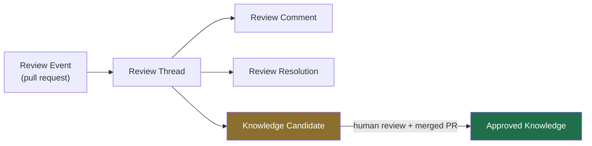
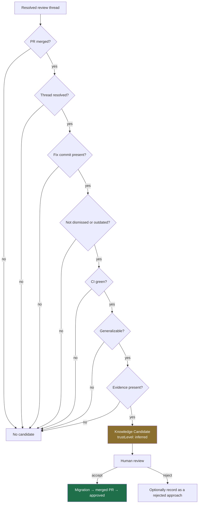
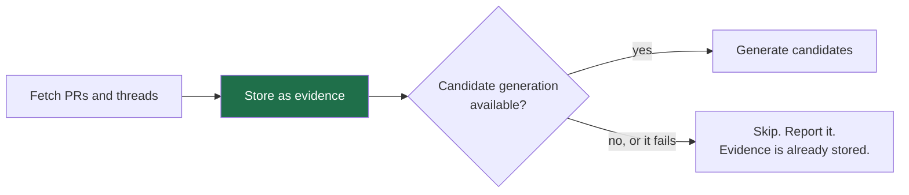

# Review knowledge

How Git review history becomes reusable team knowledge — and why the last step is
always a human's.

**The domain model is built; nothing collects into it yet.** `ReviewThread`,
`PromotionGate` and `KnowledgeCandidate` live in
[`domain/review.py`](https://github.com/theurian/theurian/blob/main/packages/theurian-core/src/theurian/domain/review.py),
and the promotion invariants below are held by three different mechanisms
(ADR-0013, INV-7):

- **Absence.** `KnowledgeCandidate` has no `approve`, `promote` or `publish`
  member, and `CandidateStatus` has no `AUTO_APPROVED`. Pinned by
  `test_candidate_has_no_self_approval_method`.
- **The signature.** `trust_level` is `field(init=False)`, so a candidate cannot
  be constructed claiming review-level trust at all — refused by the constructor
  rather than by a check, which makes one keyword load-bearing. Pinned by
  `test_a_candidate_cannot_be_constructed_with_a_trust_level`.
- **Construction.** `__post_init__` rejects a candidate with no evidence, an
  empty body, or an unmet promotion gate. Pinned by
  `test_candidate_without_evidence_is_rejected_at_generation` and its two
  siblings.

What is missing is everything that would fill that model. `infrastructure/github/`
holds no adapter, `theurian ingest` reads local files only, and no code path
generates a candidate; `system.capabilities` reports `reviewIngestion: false`,
pinned by `test_capabilities_report_what_is_and_is_not_built`. So the sections
below that describe *collection* — the stages, classification, candidate
generation, provider access and privacy handling — describe what Milestone 7
([#129](https://github.com/theurian/theurian/issues/129)) implements, not what
runs today.

## Evidence is not knowledge

A review comment says:

> This will deadlock under retry. We hit this in the payments service last year.
> Take the lock after the read, not before.

That is **evidence**: what someone said, on which line, in which pull request,
and whether it was acted on.

The reusable rule is something else:

> Acquire locks after reads, never before, in retry-eligible paths.
> Evidence: PR #431 thread PRRT-123; incident 2025-11-payments.

The step between them is generalization, and generalization is a judgement.
Theurian collects the first automatically and never performs the second
automatically ([ADR-0013](../adr/0013-ai-writes-produce-proposals.md)).

## Stages



| Stage | What it is | Automatic? |
| :-- | :-- | :-- |
| Review Event | a pull request and its outcome | yes |
| Review Thread | a conversation on a file and line range | yes |
| Review Comment | one message, optionally classified | yes |
| Review Resolution | how and when the thread closed | yes |
| Knowledge Candidate | a proposed generalization | yes, gated |
| Approved Knowledge | a reusable rule | **no — human only** |

## Ingested as structure, never as prose

```python
ReviewThread(
    external_id="PRRT-123",
    file_path="src/payments/lock.py",
    line_start=42, line_end=48,
    commit_sha="a1b2c3...",
    comments=(...),
    state=ReviewThreadState.RESOLVED,
    resolution=ReviewResolution(fix_commit="d4e5f6...", ...),
)
```

Rendering this to Markdown and calling the Markdown canonical would leave the
resolution state, the fix commit, and the thread structure as prose an LLM has to
re-parse — differently each time. A Markdown *view* is generated for reading, as
a derived artifact under `.theurian/generated/`.

## Classification

Comments are classified into the eleven categories from §21 of the brief:

`specification-gap`, `architecture-rule`, `security-rule`, `performance-rule`,
`reliability-rule`, `coding-convention`, `testing-rule`, `domain-rule`,
`rejected-approach`, `known-exception`, `incident-prevention`.

Classification is a hint that routes a candidate to the right knowledge kind and
namespace. It is not a truth claim, and a misclassification costs a reviewer one
correction — not a wrong rule in the knowledge base.

## The promotion gate

Seven observed facts decide whether a thread deserves a human's attention:



Every signal is an observed fact, not a model's opinion, so the decision is
auditable. Unmet signals are named individually — `("ci_successful",
"generalizable")` — so "why was no candidate generated?" has an answer.

Crucially, the gate answers **"should someone look at this?"** It never answers
"is this true?".

## A candidate cannot promote itself

```python
KnowledgeCandidate(
    trust_level=TrustLevel.INFERRED,  # not settable; always inferred
    status=CandidateStatus.GENERATED,  # no AUTO_APPROVED member exists
    evidence=(...),  # empty evidence raises at construction
    gate=PromotionGate(...),  # an unmet gate raises at construction
)
```

There is no `approve()` method, and `CandidateStatus` has no auto-approved
member. A test asserts both. `trust_level` is `init=False` and fixed to
`INFERRED`: a candidate cannot claim the trust that a human reviewer would be
granting it.

## Failure isolation

Candidate generation may need a model. Raw ingestion must not (FR-V5).



Evidence collection is reliable and cheap; interpretation is fragile and
optional. Keeping them separate means a model outage costs you candidates, not
your review history.

## Privacy

Review data contains author identity and opinions.

- Identity is the provider's stable ID plus a display name, so redacting the name
  does not break the identity graph.
- Redaction at ingestion is configurable.
- The review cache is a derived artifact under `.theurian/cache/`, git-ignored
  and rebuildable.
- The approved knowledge that results is a *rule*, not a quotation — attributed
  to evidence rather than to a person's opinion.

See [SECURITY.md](https://github.com/theurian/theurian/blob/main/SECURITY.md).

## Provider abstraction

GitHub first, behind `ReviewProvider`. GitLab and others are new adapters, no
domain change. The port returns evidence only: it never classifies, generalizes,
or calls a model, so a provider adapter stays a thin, testable mapping.

Repositories must be allowlisted in `.theurian/config.yaml` before one is
contacted (SEC-10). That is the design obligation on the adapter, not current
behaviour: `security/project_config.py` reads that file for `security.secretScan`
alone, nothing in `src/` reads `providers.review.repositories`, so building the
allowlist reader is the first thing the ingestion work owes
([#368](https://github.com/theurian/theurian/issues/368) carries it; #129 was
closed on the wording rather than the control).
