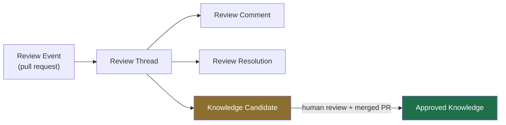
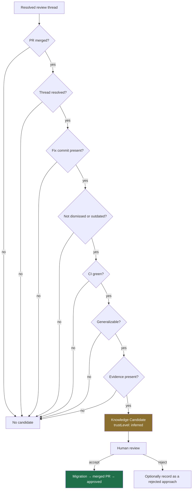
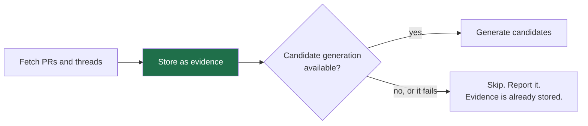

# Review knowledge

How Git review history becomes reusable team knowledge — and why the last step is
always a human's.

**The domain model is built, and since slice B5 one producer fills it.**
`ReviewThread`, `PromotionGate` and `KnowledgeCandidate` live in
[`domain/review.py`](https://github.com/theurian/theurian/blob/main/packages/theurian-core/src/theurian/domain/review.py),
and the promotion invariants below are held by three different mechanisms
(ADR-0013, INV-7):

- **Absence.** `KnowledgeCandidate` has no `approve`, `promote` or `publish`
  member, and `CandidateStatus` has no `AUTO_APPROVED`. Pinned by
  `test_candidate_has_no_self_approval_method`.
- **The signature.** `trust_level` is `field(init=False)`, so a candidate cannot
  be constructed claiming review-level trust at all — refused by the constructor
  rather than by a check, which makes one keyword load-bearing. Pinned by
  `test_a_candidate_cannot_be_constructed_with_a_trust_level`.
- **Construction.** `__post_init__` rejects a candidate with no evidence, an
  empty body, or an unmet promotion gate. Pinned by
  `test_candidate_without_evidence_is_rejected_at_generation` and its two
  siblings.

What fills that model has begun to arrive, and it is worth being exact about how
much. `infrastructure/github/` **holds the adapter now**
([ADR-0030](../adr/0030-github-review-ingestion-spawns-gh.md) slice 1): it
fetches pull requests, review threads, inline comments and resolution state by
spawning the operator's `gh`, over public repositories the project has
allowlisted. Slice 2 added the landing half: `theurian review ingest` screens
each fetched record and writes what the gate clears under `.theurian/review/`.
Slice 3 added the serving half: `theurian review build` projects the files under
`.theurian/review/` into a SQLite store — whatever put them there, since that
directory is source rather than derived state and a clone may carry one
([threat model T-24](../security/threat-model.md)) — and the `review.search` MCP
tool reads that store back under the untrusted-content safety triple. So `system.capabilities` reports
`reviewIngestion: true` beside `reviewIngestionScope: "public-allowlisted"`,
both pinned by `test_capabilities_report_what_is_and_is_not_built` — a statement
about the callable surface and nothing wider, since no MCP tool spawns `gh` and
a fetch stays an operator's act. Slice B5 added the producer
([ADR-0033](../adr/0033-knowledge-candidate-generation.md)):
`application/candidate_generation.py` recomputes the promotion gate from the
stored review record, verifies the caller's `fixCommit` against the local
repository, and hands the candidate to the draft-only proposal facade — so **the
only construction site is the candidate generator**, and what it produces is a
proposal a human reviews. The same slice registered the
`review.generateKnowledgeCandidate` MCP tool, so a wire call reaches it: it joins
`knowledge.proposeChange` and `knowledge.generateMigrationDraft` behind the same
`writeTools: true`, which answers whether a write-intent tool exists and not how
many. What is still missing is the rest of collection —
`theurian ingest` reads local files only. So the sections below that describe
*collection* — the landing stages, classification, candidate generation,
provider access and privacy handling — describe a **design**, not
what runs today. Four parts of it are the exception and are named as such where
they appear: the fetch half of the first stage, the landing half beside it, the
ingestion-time privacy control the landing gate applies, and candidate
generation. The fourth carries a bound: *Failure isolation* below describes a
design in which generation may call a model, and the shipped generator calls
none — ADR-0033 decision 1 puts the generalization in the calling agent's hands
instead. Collection is
[#479](https://github.com/theurian/theurian/issues/479)'s, designed in
[ADR-0030](../adr/0030-github-review-ingestion-spawns-gh.md) and sliced there;
[#368](https://github.com/theurian/theurian/issues/368) is the other arm of FR-V
and builds no fetch path at all — it reads `Review-Finding:` trailers out of
local git history ([ADR-0029](../adr/0029-review-findings-are-governed-knowledge.md)).
Candidate generation (FR-V2, FR-V3) was out of ADR-0030's scope and is
ADR-0033's; nothing else below is scheduled by this sentence alone.

## Evidence is not knowledge

A review comment says:

> This will deadlock under retry. We hit this in the payments service last year.
> Take the lock after the read, not before.

That is **evidence**: what someone said, on which line, in which pull request,
and whether it was acted on.

The reusable rule is something else:

> Acquire locks after reads, never before, in retry-eligible paths.
> Evidence: PR #431 thread PRRT-123; incident 2025-11-payments.

The step between them is generalization, and generalization is a judgement.
Theurian collects the first automatically and never performs the second
automatically ([ADR-0013](../adr/0013-ai-writes-produce-proposals.md)).

## Stages



| Stage | What it is | Automatic? |
| :-- | :-- | :-- |
| Review Event | a pull request and its outcome | yes |
| Review Thread | a conversation on a file and line range | yes |
| Review Comment | one message, optionally classified | yes |
| Review Resolution | how and when the thread closed | yes |
| Knowledge Candidate | a proposed generalization | yes, gated |
| Approved Knowledge | a reusable rule | **no — human only** |

## Ingested as structure, never as prose

```python
ReviewThread(
    external_id="PRRT-123",
    file_path="src/payments/lock.py",
    line_start=42, line_end=48,
    commit_sha="a1b2c3...",
    comments=(...),
    state=ReviewThreadState.RESOLVED,
    resolution=ReviewResolution(fix_commit="d4e5f6...", ...),
)
```

Rendering this to Markdown and calling the Markdown canonical would leave the
resolution state, the fix commit, and the thread structure as prose an LLM has to
re-parse — differently each time. A Markdown *view* is generated for reading, as
a derived artifact under `.theurian/generated/`.

## Classification

Comments are classified into the eleven categories from §21 of the brief:

`specification-gap`, `architecture-rule`, `security-rule`, `performance-rule`,
`reliability-rule`, `coding-convention`, `testing-rule`, `domain-rule`,
`rejected-approach`, `known-exception`, `incident-prevention`.

Classification is a caller-supplied hint recorded on the candidate, not a router:
it chooses neither the knowledge kind nor the namespace — those are the caller's
own wire fields — and today it is not carried into the drafted proposal at all
([#754](https://github.com/theurian/theurian/issues/754) tracks that). It is not
a truth claim, and a misclassification costs a reviewer one correction — not a
wrong rule in the knowledge base.

## The promotion gate

Seven observed facts decide whether a thread deserves a human's attention:



Every signal is an observed fact, not a model's opinion, so the decision is
auditable. Unmet signals are named individually — `("ci_successful",
"generalizable")` — so "why was no candidate generated?" has an answer.

Crucially, the gate answers **"should someone look at this?"** It never answers
"is this true?".

## A candidate cannot promote itself

```python
KnowledgeCandidate(
    trust_level=TrustLevel.INFERRED,  # not settable; always inferred
    status=CandidateStatus.GENERATED,  # no AUTO_APPROVED member exists
    evidence=(...),  # empty evidence raises at construction
    gate=PromotionGate(...),  # an unmet gate raises at construction
)
```

There is no `approve()` method, and `CandidateStatus` has no auto-approved
member. A test asserts both. `trust_level` is `init=False` and fixed to
`INFERRED`: a candidate cannot claim the trust that a human reviewer would be
granting it.

## Failure isolation

**This section is design context, and one of its premises did not survive
implementation.** It was written for a generation stage that may need a model;
the shipped generator calls none, because
[ADR-0033](../adr/0033-knowledge-candidate-generation.md) decision 1 put the
generalization in the calling agent's hands. The isolation argument below stands
as the reason the two stages are separate, and what the branch isolates today is
the *caller's* availability rather than a model's.

Raw ingestion must not need a model either way (FR-V5), and both halves are now
structural rather than argued:
`tests/integration/test_review_ingest_is_model_free.py` walks the built ingest
pipeline and
`tests/integration/test_candidate_generation_is_model_free.py` walks the
candidate one, through the shared instrument `tests/model_free_walk.py`, each
with planted-model controls and each carrying the same recorded bound — a
provider reached through `getattr`, a factory looked up in a table, or an import
one frame deeper than the walk descends is invisible to it.



Evidence collection is reliable and cheap; interpretation is fragile and
optional. Keeping them separate means a model outage costs you candidates, not
your review history.

**The rebuild that sits between them is wholesale, so its memory is linear in the
corpus.** `theurian review build` — and the same rebuild `theurian review ingest`
runs after it lands — reads every record under `.theurian/review/` and holds all
of them at once, so the only bound on one build's footprint is how much evidence
a project has. The measurement, its scope and what dominates it are recorded
where the build makes that trade, in `ReviewSearchBuilder.build`'s docstring
(`application/review_search_builder.py`). An incremental rebuild is the change
that would bound it, and it is not designed.

## Privacy

Review data contains author identity and opinions.

- Identity is the provider's stable ID plus a display name, so redacting the name
  does not break the identity graph.
- Redaction at ingestion is configurable, and **this half is shipped rather than
  designed** (R-12, ADR-0030 decision 3).
  `providers.review.redactParticipantNames` is a boolean, default `false`, read
  by `security/project_config.py::read_review_participant_redaction` and applied
  by `application/review_landing_gate.py` before a record becomes a file: every
  participant's `display_name` becomes the one fixed `REDACTED_DISPLAY_NAME`
  placeholder, and their `external_id` is kept where it is the provider's node id
  and replaced by a stable pseudonym where it is the author's own login.
  `tests/unit/test_review_landing_gate.py::test_no_participant_reachable_from_a_landed_record_keeps_its_name`
  walks every position a record can hold a participant in, so the claim is over
  the record rather than over the fields someone remembered.
  The login case is the adapter's fallback — `external_id` is *node id or login*,
  so an answer carrying no `id` puts author-chosen text there — and leaving it
  alone made *enabling* this setting publish the name it promised to remove
  (PR #596 round 1). `...::test_a_login_fallback_id_is_pseudonymised_before_it_can_land`
  is what fails if the raw login can land again.
- Ingested review evidence is the **source**, not a cache: upstream comments are
  editable and deletable, so a discarded local copy of a deleted comment is data
  loss and no refetch recovers it. [ADR-0030](../adr/0030-github-review-ingestion-spawns-gh.md)
  decision 3 lands it as durable files under `.theurian/review/` and makes the
  SQLite serving store the derived, deletable half. Slice 2 gave that path a
  fact-side constant: `ProjectPaths.review` composes it, so it joins the
  containment sweep in
  `tests/unit/test_project_paths_containment.py`, and it is deliberately not a
  member of `DERIVED_SUBDIRECTORIES` — the property this bullet asserts is the
  reason it must not be.
- The approved knowledge that results is a *rule*, not a quotation — attributed
  to evidence rather than to a person's opinion.

See [SECURITY.md](https://github.com/theurian/theurian/blob/main/SECURITY.md).

## Provider abstraction

GitHub first, behind `ReviewProvider`. GitLab and others are new adapters, no
domain change. The port returns evidence only: it never classifies, generalizes,
or calls a model, so a provider adapter stays a thin, testable mapping.

Repositories must be allowlisted in `.theurian/config.yaml` before one is
contacted (SEC-10). That is shipped behaviour on the `gh` path now, not a design
obligation on the adapter. `security/project_config.py` is the one module in
`src/` that opens that file, and it reads **three** keys out of it and nothing
else: `security.secretScan`, `providers.review.repositories` and
`providers.review.redactParticipantNames` (ADR-0027 decision 3, ADR-0030
decisions 2 and 3). `security/review_allowlist.py` is what the second key
reaches, and it refuses a repository the list does not name **before any process
is spawned** — an unallowlisted repository produces no spawn at all rather than a
filtered result, which
`tests/integration/test_gh_review_provider.py::test_an_unallowlisted_repository_starts_no_process`
asserts by requiring the spawn recorder to be *empty*.
[#129](https://github.com/theurian/theurian/issues/129) was closed on the
wording rather than on the control, so ADR-0030 decision 2 is what actually
built it.

**That reader population is a measurement, not a sentence in this file.** Its key
is

```console
$ git grep -n "read_secret_scan_policy\|read_review_repositories\|read_review_participant_redaction" -- packages/theurian-core/src
```

and what recomputes it are `tests/unit/test_config_key_call_sites.py`'s
`CONFIG_KEY_READER_SITES` and `WATCHED_SPELLINGS`, plus
`tools/audit/config_object_claims.py`'s `KEYS_WITH_A_READER`. A fourth key, or a
second module opening the file, reddens those rather than leaving this paragraph
quietly wrong.

What is still owed on the fetch side is the raw-URL controls — a scheme allowlist
and private-network rejection — against the OpenAPI `$ref` fetcher, which is a
different code path from `gh` and is not covered by anything above
([#429](https://github.com/theurian/theurian/issues/429) owns it).
