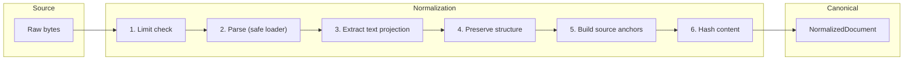
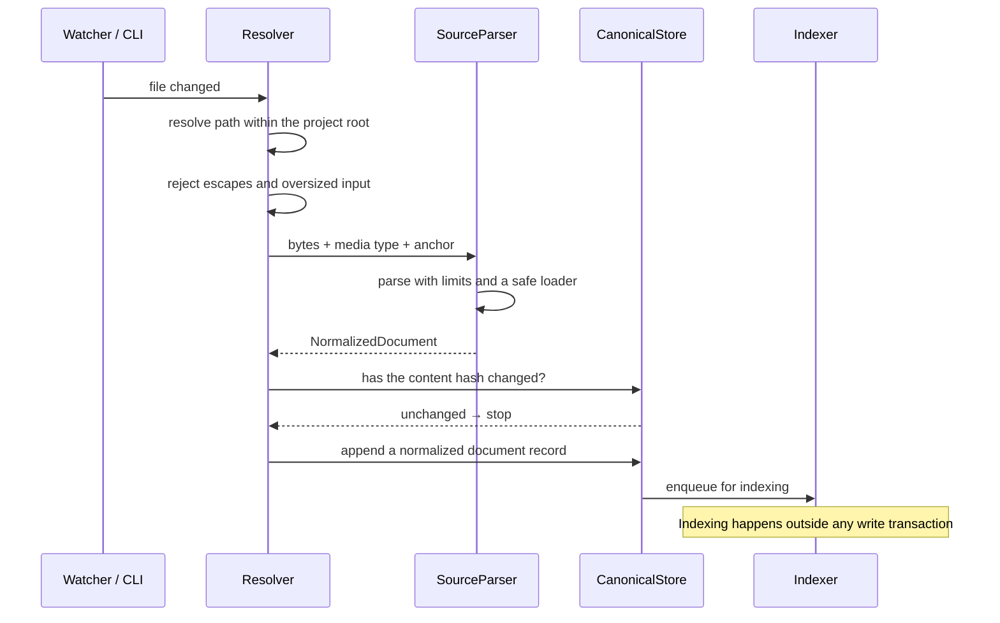

# Source normalization

How bytes become canonical knowledge. Decision record:
[ADR-0010](../adr/0010-three-layer-knowledge-model.md).

## Parse, never interpret



Normalization is a **mechanical transformation**. It never summarizes, never
infers, never resolves ambiguity, and never calls a model. Anything that requires
judgement happens later, explicitly, and leaves a record.

The reason is provenance: a normalized document must be reproducible from its
source bytes. If normalization involved a model, the same input would produce
different canonical records on different days, and the content hash — which every
downstream guarantee rests on — would mean nothing.

## The output

```python
NormalizedDocument(
    title="Authentication and authorization policy",
    body="...",                    # text projection, for lexical search
    content_type=MediaType("text/markdown"),
    content_hash=ContentHash(...),  # over the body bytes, exactly
    anchors=(SourceAnchor(...),),   # at least one
    structured={...},               # native fields, for structured queries
    metadata={"parser": "markdown", ...},
)
```

`structured` is what separates normalization from conversion. An OpenAPI document
yields both a searchable text rendering *and* its parsed operations, parameters,
and schemas. Discarding the latter is what makes coverage and drift detection
impossible later — and it is impossible to add back afterwards without
reprocessing everything.

## Anchors

Every document carries at least one:

```python
SourceAnchor(
    provider="git",
    repository="acme/backend-service",
    commit_sha="a1b2c3...",
    blob_sha="d4e5f6...",
    file_path=".theurian/knowledge/architecture/auth-policy.md",
    line_start=1,
    line_end=42,
    source_uri="git://...",
)
```

A `commit_sha` plus a `file_path` pins an immutable Git object: the anchor still
resolves after the file is edited, moved, or deleted. That is the difference
between provenance and a link that rots.

Knowledge authored inside Theurian carries the `authored-in-theurian` label
instead, so the invariant stays checkable without inventing a fake anchor.

## Content hashing

Bytes are hashed exactly as given. **No newline normalization, no Unicode
normalization, no whitespace trimming.**

Normalizing would make the same file hash differently depending on who checked it
out — different platforms, different Git `autocrlf` settings — and the state hash
would stop identifying a state. A test asserts `"a\r\nb"` and `"a\nb"` hash
differently.

## Parsers never trust input

Every parser enforces:

| Limit | Default | Threat |
| :-- | :-- | :-- |
| File size | 8 MB | T-6 memory exhaustion |
| Path depth | 32 | pathological trees |
| Archive expansion ratio | bounded | zip bomb |
| Parse wall clock | bounded | quadratic parser behaviour |
| Loader | `yaml.safe_load` only | arbitrary object construction |
| External `$ref` | recorded, never fetched | T-7 SSRF |

Size is re-checked after reading, because a file can grow between `stat` and
`read`.

## Per-format handling

| Format | Text projection | Structured fields |
| :-- | :-- | :-- |
| Markdown | the document | heading tree, code fences |
| YAML / JSON | rendered key paths and values | the full tree |
| JSON Schema | descriptions and titles | definitions, properties, required |
| OpenAPI | summaries and descriptions | paths, operations, parameters, responses |
| Git commit | subject and body | author, tree, parents, changed paths |
| Git diff | hunk content | file paths, line ranges, change type |
| GitHub review | comment bodies | thread structure, resolution, target lines, fix commit |

## Ingestion pipeline



Content-hash comparison is the cheap early exit: touching a file without changing
it costs one hash, not a reparse and a reindex.

## Failure isolation

A parser failure fails **one document**, not the ingestion run. A malformed YAML
file in a repository of two hundred knowledge documents should not prevent the
other 199 from being available. Failures are reported per document with the path
and the reason, and the run's exit status reflects that some documents were
skipped.

The same principle applies further up: if LLM-based candidate generation fails,
raw review ingestion still succeeds (FR-V5). Evidence collection and
interpretation are separate steps precisely so the fragile one cannot take down
the reliable one.
