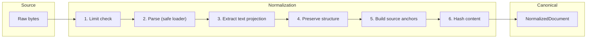
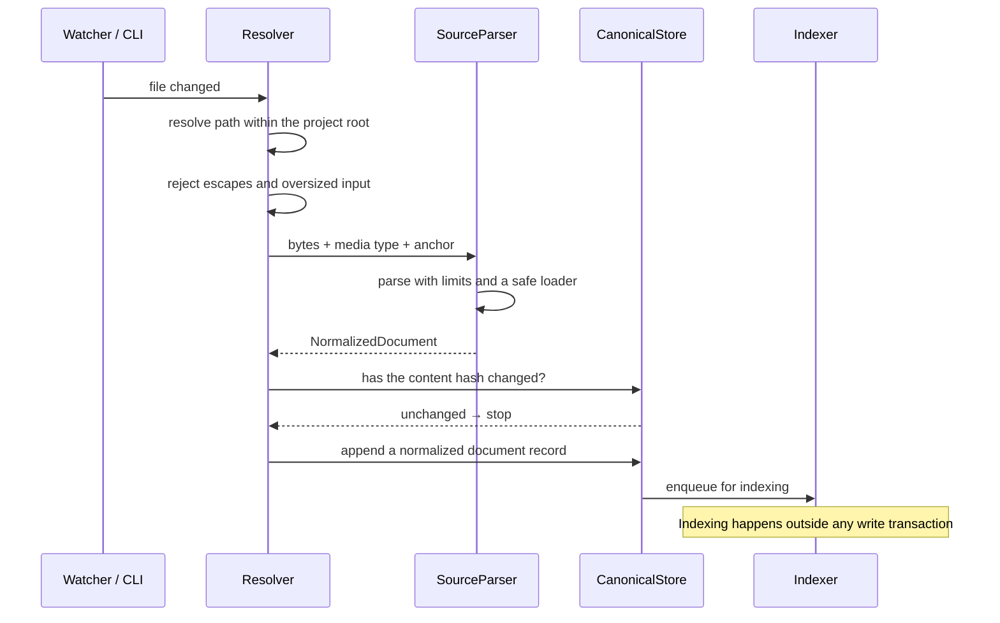

# Source normalization

How bytes become canonical knowledge. Decision record:
[ADR-0010](../adr/0010-three-layer-knowledge-model.md).

## Parse, never interpret



Normalization is a **mechanical transformation**. It never summarizes, never
infers, never resolves ambiguity, and never calls a model. Anything that requires
judgement happens later, explicitly, and leaves a record.

The reason is provenance: a normalized document must be reproducible from its
source bytes. If normalization involved a model, the same input would produce
different canonical records on different days, and the content hash — which every
downstream guarantee rests on — would mean nothing.

## The output

```python
NormalizedDocument(
    title="Authentication and authorization policy",
    body="...",                    # text projection, for lexical search
    content_type=MediaType("text/markdown"),
    content_hash=ContentHash(...),  # over the body bytes, exactly
    anchors=(SourceAnchor(...),),   # at least one
    structured={...},               # native fields, for structured queries
    metadata={"parser": "markdown", ...},
)
```

`structured` is what separates normalization from conversion. An OpenAPI document
yields both a searchable text rendering *and* its parsed operations, parameters,
and schemas. Discarding the latter is what makes coverage and drift detection
impossible later — and it is impossible to add back afterwards without
reprocessing everything.

## Anchors

Every document carries at least one:

```python
SourceAnchor(
    provider="git",
    repository="acme/backend-service",
    commit_sha="a1b2c3...",
    blob_sha="d4e5f6...",
    file_path=".theurian/knowledge/architecture/auth-policy.md",
    line_start=1,
    line_end=42,
    source_uri="git://...",
)
```

A `commit_sha` plus a `file_path` pins an immutable Git object: the anchor still
resolves after the file is edited, moved, or deleted. That is the difference
between provenance and a link that rots.

Knowledge authored inside Theurian carries the `authored-in-theurian` label
instead, so the invariant stays checkable without inventing a fake anchor.

## Content hashing

Bytes are hashed exactly as given. **No newline normalization, no Unicode
normalization, no whitespace trimming.**

Normalizing would make the same file hash differently depending on who checked it
out — different platforms, different Git `autocrlf` settings — and the state hash
would stop identifying a state. A test asserts `"a\r\nb"` and `"a\nb"` hash
differently.

## Nothing on the ingest path trusts its input

**Not every bound below is a parser's**, and the third column says whose each one
is. Three run in `security/paths.py` before any parser sees the bytes; one is the
YAML loader's, in `security/yaml_loading.py`, and so covers every format that
reaches it through YAML; two are the projection's, and belong to every structured
format; three are the OpenAPI parser's alone; and one is the Markdown parser's,
where it bounds what is *recorded* rather than what the scan spends. "Every
parser enforces" was the earlier heading here, and it made the file-kind refusal
and the `$ref` walk read as universal.

| Limit | Default | Enforced by | Threat |
| :-- | :-- | :-- | :-- |
| File size | 8 MiB | `security/paths.py::read_source_file` (`MAX_SOURCE_FILE_BYTES`) | T-6 memory exhaustion |
| Path depth | 32 | `security/paths.py::resolve_within_root` (`MAX_PATH_DEPTH`) | pathological trees |
| File *kind* | only a regular file is read | `security/paths.py::read_source_file`, through `_unbounded_shape` | T-6: a FIFO reports size 0 and then blocks the read forever ([#215](https://github.com/theurian/theurian/issues/215)) |
| Projected characters | 2 MiB, charged as the walk spends them | `normalization/projection.py::_Spend.emit` | T-6 alias-expansion bomb ([#232](https://github.com/theurian/theurian/issues/232)) |
| Projected nodes | 1,000,000 | `normalization/projection.py::_Spend.visit` | T-6: a container emits no characters, so characters alone do not price a traversal |
| `$ref` walk | every parsed node entered once, at most 64 deep, at most 5,000 recorded | `parsers/openapi.py::_external_refs` — **OpenAPI only** | T-6 shared-node re-traversal ([#245](https://github.com/theurian/theurian/issues/245)) |
| Operations recorded | 5,000 | `parsers/openapi.py::MAX_OPERATIONS` — **OpenAPI only** | T-6 index growth |
| Loader | `yaml.safe_load` only, under a 4 MiB document cap | `security/yaml_loading.py::load_yaml`, `MAX_YAML_BYTES` | arbitrary object construction |
| External `$ref` | recorded, never fetched | `parsers/openapi.py::_external_refs` — **OpenAPI only** | T-7 SSRF |
| Structure recorded from Markdown | 2,000 headings, 1,000 code fences | `parsers/markdown.py::MAX_HEADINGS`, `MAX_FENCES` — **Markdown only** | an unbounded structure tree — bounding the record only, not the scan; the fence scan itself is now a linear single pass by construction ([#331](https://github.com/theurian/theurian/issues/331), discharged) |

Size is re-checked after reading, because a file can grow between `stat` and
`read`.

**Both residuals below are discharged, each owned by its own issue and
measured in `docs/security/threat-model.md` under T-6.**

- The `$ref` walk used to build a path string per edge with nothing charging
  it, quadratic in document size. `_external_refs` now carries the path as a
  tuple of un-rendered segments, rendered to a string only where a ref or a
  truncation is actually recorded, bounding the per-edge cost to `O(depth)`
  — capped by `MAX_REF_DEPTH` — instead of `O(len of the rendered string)`
  ([#328](https://github.com/theurian/theurian/issues/328), discharged;
  measured 2026-08-27 at n=240,000, ~3.25 MB: 1.28 s → 0.037 s, now linear).
- `parsers/markdown.py::_fences` used to be quadratic on fence openers that
  never close. It was not line iteration: the pattern spanned the whole
  document with `(.*?)` under `re.DOTALL`, so every opener that found no
  closer scanned to the end. Measured 2026-08-24 over a body of `` ```a ``
  lines, which open a fence and can never close one: 9.8 KiB 0.10 s, 19.5 KiB
  0.39 s, 39.1 KiB 1.56 s, 78.1 KiB 6.24 s, 156.2 KiB 25.12 s — four times the
  cost per doubling, and no reference recorded either way. `_fences` is now a
  single forward pass over lines instead ([#331](https://github.com/theurian/theurian/issues/331),
  discharged; measured on the same 156.2 KiB shape: 25.3 s → 0.0065 s,
  roughly 3900×, now linear). A bounded residual replaces it: `_fences`
  materializes `lines` and `line_starts` up front, so peak memory is now
  `O(line-count)` — measured 2026-08-27, ~202 MB at the 8 MiB
  `MAX_SOURCE_FILE_BYTES` cap, linear and irrelevant at ordinary document
  sizes.

The rest of the Markdown parse is priced differently and is not a residual.
`_FRONT_MATTER` is `\A`-anchored, so it matches at one position: 0.048 s over
4 MiB with no front matter present. The heading pass is linear in the document
and priced by `MAX_HEADINGS` rather than by the input, because each recorded
heading re-counts the newlines before it — 2,000 headings at the tail of an
8 MiB file cost 6.68 s, and doubling the file doubles that (both measured
2026-08-24).

Two limits this table used to claim are **not** enforced, and are named here
rather than quietly dropped. There is no *archive expansion ratio*, because
nothing in `src/` unpacks an archive — no `zipfile`, `tarfile`, `gzip` or `zlib`
import exists anywhere in it — and there is no *parse wall clock*, because
nothing in `src/` bounds any parse by time. The bounds above are counted instead
of timed: they price the work a parse spends rather than the seconds it takes.
`docs/security/threat-model.md` (T-6) records both decisions, and who owns the
query-side timeout that is still owed.

## Per-format handling

| Format | Text projection | Structured fields |
| :-- | :-- | :-- |
| Markdown | the document | heading tree, code fences |
| YAML / JSON | rendered key paths and values | the full tree |
| JSON Schema | descriptions and titles | definitions, properties, required |
| OpenAPI | summaries and descriptions | paths, operations, parameters, responses |
| Git commit | subject and body | author, tree, parents, changed paths |
| Git diff | hunk content | file paths, line ranges, change type |
| GitHub review — **not built**, owed with review ingestion (roadmap Phase B), owned by [#479](https://github.com/theurian/theurian/issues/479) | comment bodies | thread structure, resolution, target lines, fix commit |

## Ingestion pipeline



Content-hash comparison is the cheap early exit: touching a file without changing
it costs one hash, not a reparse and a reindex.

## Failure isolation

A parser failure fails **one document**, not the ingestion run. A malformed YAML
file in a repository of two hundred knowledge documents should not prevent the
other 199 from being available. Failures are reported per document with the path
and the reason, and the run's exit status reflects that some documents were
skipped.

The same principle is owed further up, when review ingestion lands (roadmap
Phase B): if LLM-based candidate generation fails, raw review ingestion must
still succeed
(FR-V5). Evidence collection and interpretation are to stay separate steps
precisely so the fragile one cannot take down the reliable one.

**That work is owned by
[#479](https://github.com/theurian/theurian/issues/479)**, which was filed from
this sweep's own measurement after four nearer candidates were each read and
verified not to cover it — among them
[#429](https://github.com/theurian/theurian/issues/429), which gates the first
outbound request but ingests nothing, and
[#200](https://github.com/theurian/theurian/issues/200), which owns the
`Git commit` and `Git diff` rows of the table above and says this row is not its
scope. Both cites above used to name
[#129](https://github.com/theurian/theurian/issues/129), which closed
`COMPLETED` on the wording of documents like this one rather than on a parser.

**The tracker half of this cannot be pinned. The consistency half can be, and is
not.** Whether an issue is open is a fact about the tracker, and a test that
asked would reach the network from the offline unit suite — the reason
[#80](https://github.com/theurian/theurian/issues/80) records for why its own
pin can assert that *an* issue is named and not that the issue is open. That is
not a hypothetical: #80 exists because the pointer it pins went stale within a
day of shipping. So "owned by #479" is a dated claim (2026-09-01, measured over
the 164 then-open issues) that a later reader has to re-check rather than one a
check will defend.

**What is makeable and not built is the check across the carriers.** Five cites
over four files carry this owner — two here, `theurian/review/__init__.py`,
`plugins/claude-code/commands/ingest.md`, and
`tests/unit/test_findings_store_is_unreachable.py`, which paraphrases the third
— and asserting that they name the *same* number needs no network at all. Its
absence is not theoretical either: the review of the change that repointed them
found the last carrier still reading "owned by no open issue" after the others
had moved.

**The same gap holds for T-16's successor clause**, and for the same reason.
Five sites say that #80 owns the artifact-verification gap and that an issue for
the control itself is still owed — `README.md` ×2, `packaging/README.md`,
`docs/architecture/requirements-analysis.md`, and the threat model's T-16 entry
they were all carried from. Nothing checks that those five agree, and nothing
can check that #80 is still the live owner; a same-number check across them is
as makeable, and as absent, as the one above.

Both are recorded rather than built, because a new mechanism mid-review is a new
claim to attack. A same-number check across carriers belongs with the
object-keyed census that
[#199](https://github.com/theurian/theurian/issues/199) unit B landed in
`tools/audit/`, which already walks the sites either one would — the instrument,
not the issue, which closed on 2026-09-02. The two nearest live candidates were
read and neither carries this check:
[#512](https://github.com/theurian/theurian/issues/512) hardens how those
instruments *match* and enumerates the members it took from PR #501, and
[#506](https://github.com/theurian/theurian/issues/506) decides which files the
owner-cite audit reads. So this check is owned by
[#531](https://github.com/theurian/theurian/issues/531). That issue was filed
2026-09-03 out of the same reading, rather than folded into either candidate.
