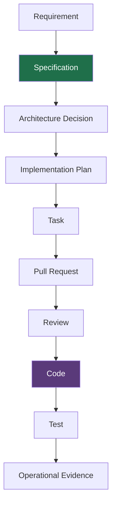
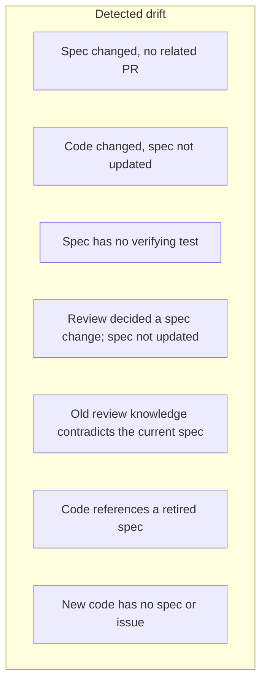
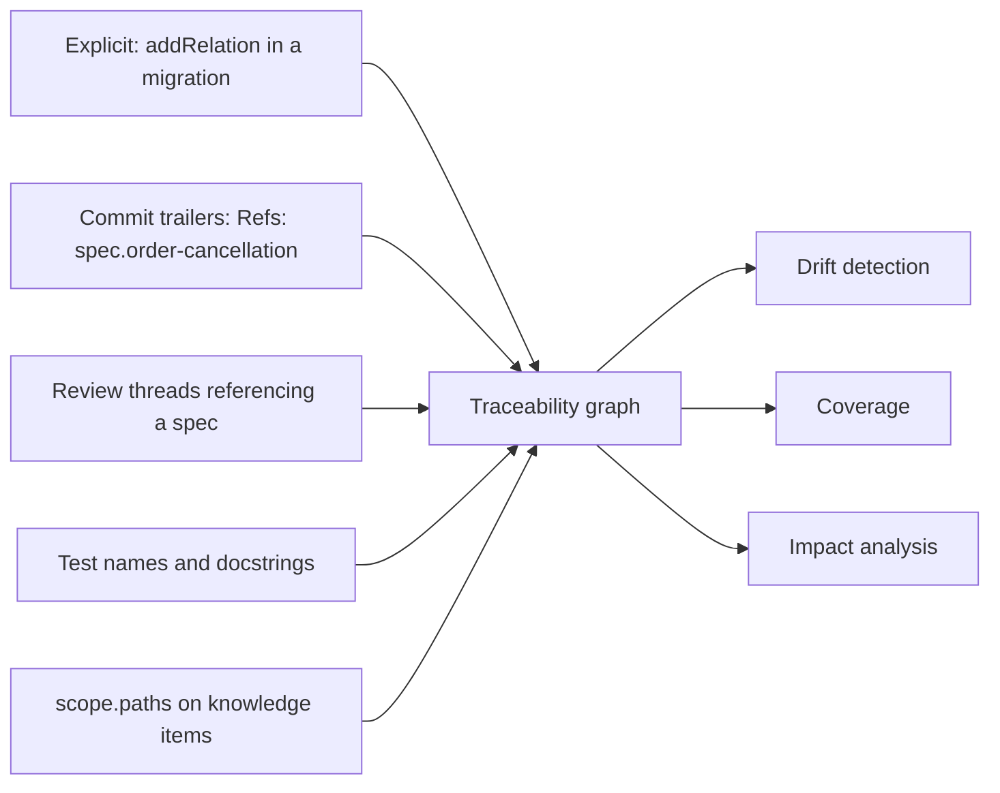

# Specification traceability

## The chain



Most teams have every link in this chain somewhere. Almost none can traverse it.
"Which tests verify this specification?" is answerable in principle and
unanswerable in practice, which is why specifications drift out of date without
anyone noticing.

## Edges, not a fixed schema

```text
spec:order-cancellation
  implements     → pr:431
  verifiedBy     → test:cancel-order.integration
  constrainedBy  → adr:transaction-boundary
  reviewedBy     → review-thread:PRRT-123
  supersedes     → spec:order-cancellation-v1
```

A `TraceNode` is `(node_type, node_id)` and deliberately not a foreign key: the
graph must be able to point at a test file or a pull request that Theurian does
not own.

Each edge carries **evidence** and **confidence**:

```python
TraceabilityEdge(
    source=TraceNode(SPECIFICATION, "spec.order-cancellation"),
    relation_type="verified_by",
    target=TraceNode(TEST, "tests/integration/test_cancel_order.py::test_deadline"),
    evidence=(SourceAnchor(commit_sha="a1b2c3", file_path="...", line_start=42),),
    confidence=1.0,
)
```

Confidence separates "a human asserted this" from "a heuristic matched a name".
Drift reporting has to distinguish *we know* from *we guessed*, because acting on
a guess as though it were a fact is how a team stops trusting the tool.

## Drift detection

Seven conditions (§22 of the brief):



| Condition | Signal | Typical cause |
| :-- | :-- | :-- |
| D1 | spec revision newer than any `implements` edge | a spec written and forgotten |
| D2 | code commit touches `scope.paths` with no spec revision | the common one |
| D3 | active spec with no `verified_by` edge | untested behaviour |
| D4 | review thread classified `specification-gap`, resolved, spec unchanged | a decision made in review and never written down |
| D5 | approved knowledge contradicting an active spec | the spec moved on; the rule did not |
| D6 | code anchor referencing a retired spec | stale reference |
| D7 | commit outside every `scope.paths` | unspecified work |

D2 and D4 are the ones that matter most in practice: both are the failure where a
decision exists but only in someone's memory.

## Traceability policy

Not every change needs the same rigour. Requiring a specification for a
whitespace fix teaches people to route around the tool.

```yaml
traceabilityPolicy:
  domain-behavior:
    specification: required
    test: required
    review: required

  architecture:
    adr: required
    review: required

  bug-fix:
    issue: required
    regressionTest: required

  refactoring:
    specification: optional
    behaviorPreservationEvidence: required

  formatting:
    traceability: none
```

An unconfigured change type defaults to permissive. Adopting the policy must
never block work it was not written for — a policy that blocks unrelated work
gets disabled entirely, which is strictly worse than a partial one.

## Queries

| MCP tool | Question |
| :-- | :-- |
| `trace.get` | What is connected to this node? |
| `trace.findImplementations` | What implements this spec? |
| `trace.findTests` | What verifies it? |
| `trace.findUnimplementedSpecs` | What did we specify and not build? |
| `trace.findUnverifiedSpecs` | What did we build and not test? |
| `trace.findCodeWithoutSpec` | What are we maintaining that nobody specified? |
| `spec.getCoverage` | Which outcomes have tests? |
| `spec.findContradictions` | Which specs disagree? |
| `spec.findStaleImplementations` | Which code references a superseded spec? |

`spec.getCoverage` is only possible because specifications keep their structured
form. Coverage means "which of these declared *outcomes* has a verifying test" —
and the outcomes have to still exist as data
([ADR-0010](../adr/0010-three-layer-knowledge-model.md)).

## Where edges come from



Explicit edges get confidence 1.0. Inferred ones get less, and their confidence
travels with them so a report can say which is which rather than presenting a
guess as a fact.

## Worked example

A change to `services/orders/cancel.py`:

1. `scope.paths` matches → knowledge item `domain.order-cancellation` governs it
2. That item is `constrained_by` `adr:transaction-boundary`
3. It is `implemented_by` `spec:order-cancellation`
4. That spec is `verified_by` one integration test
5. The spec declares two failure outcomes; only one has a test → **D3 drift**
6. Policy for `domain-behavior` requires a test → the gap is reportable, with the
   exact untested outcome named

Step 6 is the difference between a warning and something a developer can act on
in the next five minutes.
