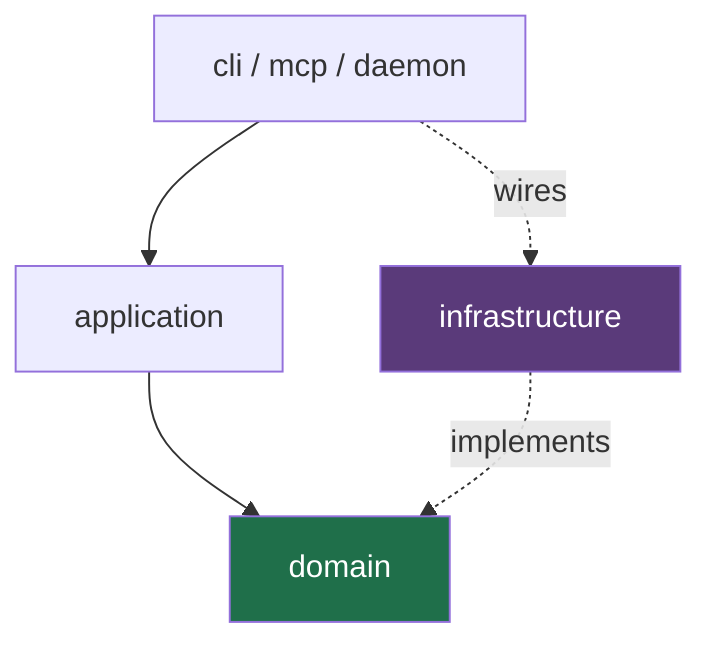

# Development

## Requirements

| Tool | Version | Why |
| :-- | :-- | :-- |
| Python | 3.13+ | `StrEnum`, `override`, modern generics |
| uv | 0.7+ | workspace resolution and the committed lock file |
| Git | 2.30+ | worktrees |

Everything else is installed by `uv sync`.

## Setup

```sh
git clone https://github.com/theurian/theurian
cd theurian
uv sync          # workspace + all extras + dev tools
uv run pytest    # ~275 tests, offline, a couple of seconds
```

No API key. No network. No account. If any of those become necessary to run the
test suite, that is a bug ([ADR-0009](../adr/0009-no-llm-vendor-lock-in.md)).

## Everyday commands

```sh
uv run pytest                     # everything
uv run pytest -m unit             # fast subset
uv run pytest -m contract         # against the installed CLI
uv run pytest --cov               # with the 80% gate
uv run pytest -k scope_isolation  # by name

uv run ruff format packages tests
uv run ruff check packages tests
uv run mypy                       # strict

uv run theurian version --json
```

Before opening a pull request, run the same four commands CI runs: format check,
lint, mypy, pytest with coverage.

## Layout

```text
packages/theurian-core/src/theurian/
├── cli/              composition root — Typer
├── mcp/              composition root — MCP tools
├── daemon/           composition root — HTTP, lifecycle, locking
├── application/      use cases; depends on domain only
├── domain/           entities, value objects, invariants
│   └── ports/        14 Protocols
├── infrastructure/   adapters (sqlite, vector, raptor, git, github, fs, secrets)
├── migrations/       schema migrations for the derived store
├── ingestion/ normalization/ indexing/ retrieval/
├── review/ specification/ traceability/
├── security/         path containment, input limits
└── observability/    tracing and metrics
```

## The rules, and why they are tests



- `domain/` imports nothing from `application/` or `infrastructure/`
- `application/` depends on ports, never adapters
- only `cli/`, `daemon/`, and `mcp/` may name a concrete adapter
- `sqlite_vec` stays inside `infrastructure/`; `mcp` inside `mcp/` and `daemon/`
- no vendor name in `domain/` or `application/`
- no file under `plugins/` imports `theurian`

All enforced by `tests/unit/test_layering.py` and `test_plugin_boundary.py`,
which walk the real import graph, plus a banned-import lint rule. A rule that
lives only in a document gets violated within a quarter.

Breaking one of these needs an ADR, not a `# noqa`.

## Adding a port

Rare — the port set is closed and adding to it requires an ADR
([ADR-0003](../adr/0003-ports-and-adapters.md)). When it is genuinely warranted:

1. Write the ADR first: what substitution does this enable, and what breaks
   without it?
2. Define the `Protocol` in `domain/ports/`.
3. Add it to `ALL_PORTS` in `domain/ports/__init__.py`.
4. Write a **deterministic fake** in `tests/fakes/`. A port without a fake is not
   finished, because it cannot be exercised offline.
5. Write a real adapter in `infrastructure/`.
6. Wire it in a composition root — nowhere else.

## Adding a source parser

No domain or application change is needed; that is the point of the port.

1. Implement `SourceParser` in `infrastructure/filesystem/parsers/`.
2. Enforce the input limits from `theurian.security` — parsers never trust input.
3. Use safe loaders (`yaml.safe_load`, never `yaml.load`).
4. Never fetch an external `$ref`; record it unresolved (SSRF, SEC-10).
5. Preserve structure in `NormalizedDocument.structured`. Extracting text only
   is what makes coverage and drift detection impossible later.
6. Register it in the composition root.

## Testing

| Marker | Scope |
| :-- | :-- |
| `unit` | pure, fast, no filesystem or network |
| `integration` | SQLite, filesystem, or a local subprocess |
| `contract` | a published contract, exercised through the installed CLI |
| `e2e` | the real CLI, daemon, or plugin end to end |

Conventions:

- ≥80% line and branch coverage, enforced in CI.
- Name the behaviour, not the method:
  `test_symlink_pointing_outside_root_is_refused`, not `test_resolve_2`.
- A security control needs a test proving the control **fires**, not only that
  the happy path works.
- Contract tests run against the *installed* binary. Importing Core would pass
  even if the console script or packaging were broken.
- **No test calls an external service.** Ever.

## Determinism

`Clock` and `IdGenerator` are ports specifically so tests can freeze time and
seed identifiers. Without that, "the same migrations produce the same state
hash" ([ADR-0007](../adr/0007-state-hash-partitioned-databases.md)) is not
assertable.

In library code, never call `datetime.now()` or generate a ULID directly. Inject
the port. Ruff's `DTZ` rules catch naive datetimes, which silently compare wrong
across a DST boundary — and validity windows depend on those comparisons.

## Working on the plugin

The plugin is shell and Markdown by design.

```sh
uv run pytest packages/theurian-core/tests/unit/test_plugin_boundary.py -v
shellcheck --severity=warning plugins/claude-code/scripts/*.sh
claude plugin validate ./plugins/claude-code --strict   # if the CLI is available
```

To test locally, point a marketplace at your checkout:

```text
/plugin marketplace add /path/to/theurian/plugins
```

## Dependencies

Every dependency is pinned with `==`, `uv.lock` is committed, and CI runs
`uv sync --frozen` ([ADR-0014](../adr/0014-dependency-pinning-and-pre-1-0-isolation.md)).

Adding one:

1. Check the current version on PyPI — pin it, do not recall it.
2. Pin exactly in the right `pyproject.toml`.
3. If it is pre-1.0, it needs an ADR naming the port that contains it and the
   fallback if it is abandoned.
4. Run `uv sync` and commit `uv.lock`.
5. Confirm the licence is Apache-2.0-compatible; CI will fail on copyleft.

## Commits

Conventional Commits, DCO sign-off, a
[verified commit signature](https://github.com/theurian/theurian/blob/main/CONTRIBUTING.md#signing-your-commits),
one topic per pull request. Full detail in
[CONTRIBUTING.md](https://github.com/theurian/theurian/blob/main/CONTRIBUTING.md).

```sh
git config commit.template .gitmessage   # optional, prompts for both
```

## Troubleshooting

| Symptom | Cause |
| :-- | :-- |
| `ModuleNotFoundError: theurian` | Run `uv sync`, or prefix with `uv run` |
| mypy complains about a missing stub | Add `types-*` to the dev group and pin it |
| A contract test skips | `theurian` is not on `PATH`; `uv sync` installs it |
| Coverage below 80% | New code without tests — that is the gate working |
| A layering test fails | An import crossed a boundary; see [ADR-0003](../adr/0003-ports-and-adapters.md) |
