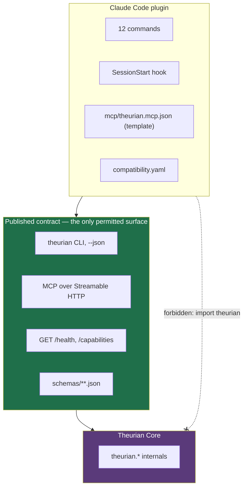
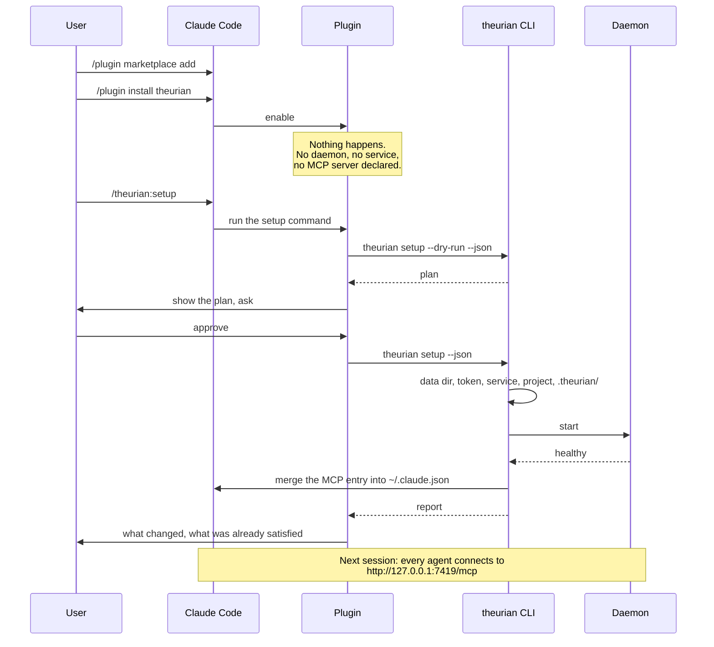
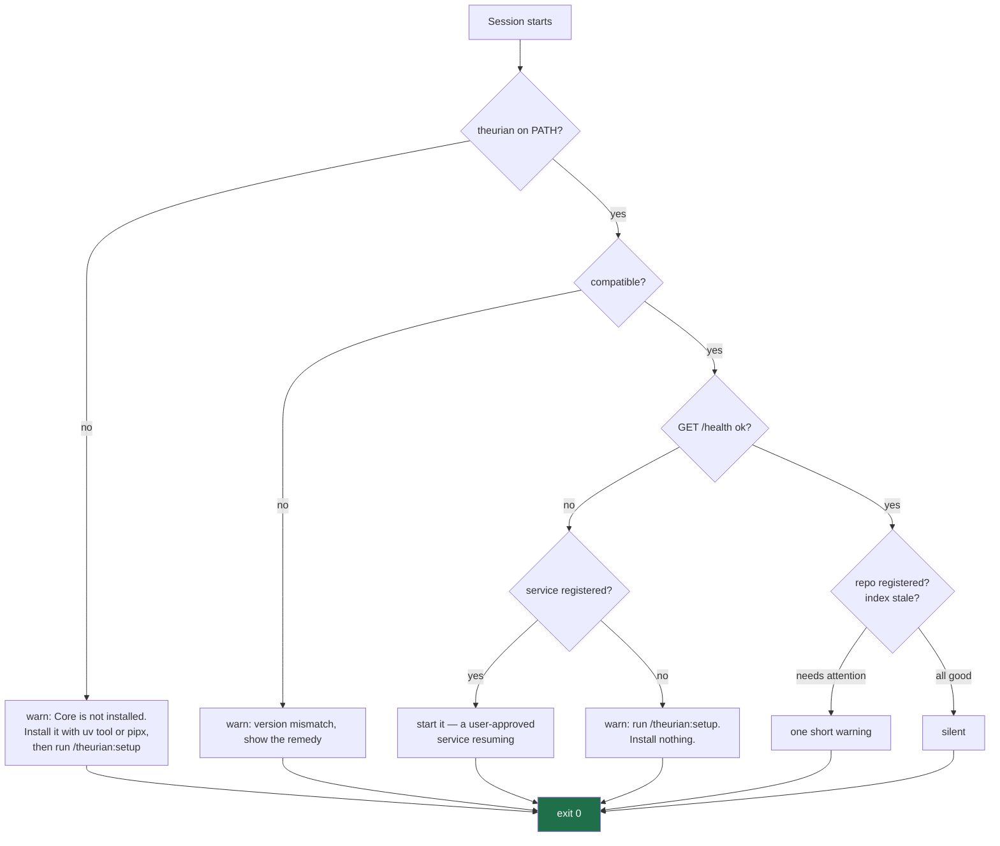

# Claude Code integration

The [plugin README](https://github.com/theurian/theurian/blob/main/plugins/claude-code/README.md) is the user-facing
guide. This page covers how the integration works and why it is shaped this way.

## Two artifacts, one contract



The plugin contains no Python at all. Its scripts shell out to `theurian
<verb> --json`. A CI job greps for `import theurian` under `plugins/` and fails
the build, and a test asserts no `.py` file exists there.

That constraint is what keeps the plugin movable to its own repository, and it is
also why the plugin can never quietly acquire logic that belongs in Core.

## Installation flow



## Why the plugin declares no MCP server

Claude Code starts a plugin's MCP servers as soon as the plugin is enabled. For
an HTTP entry that means an immediate connection attempt — nothing is spawned,
but the user's first experience is a red, failed server, before they have been
told `/theurian:setup` exists. That failed entry then persists as an artifact of
merely enabling the plugin, which is exactly the "installation had side effects"
property FR-L3 rules out.

So the plugin ships the definition at `plugins/claude-code/mcp/theurian.mcp.json`
— a path Claude Code does not scan — and `/theurian:setup` installs it at user
scope, merging rather than replacing.

A side benefit: the connection outlives plugin removal, so `theurian` stays
usable by other MCP clients, and `/theurian:uninstall` can remove the entry
independently of the plugin, the daemon, or the data.

Detail: [ADR-0012](../adr/0012-plugin-does-not-autoregister-mcp-server.md).

## What SessionStart does

Runs on every session, often several times a day, usually while the user is
thinking about something else. It must therefore be cheap and boring.



The `theurian`-absent branch names the installer before the command that needs
one. What it prints, verbatim:

```text
Theurian: Core is not installed. Install it with: uv tool install --python 3.13 'theurian[daemon]' or: pipx install --python 3.13 'theurian[daemon]', then run /theurian:setup to configure this machine.
```

Printed, never run. Naming `/theurian:setup` on its own was advice nobody could
follow: that command shells out to the `theurian` binary whose absence produced
the warning.

Budget: p95 ≤ 300 ms, hard timeout 5 s, and it exits 0 unconditionally — a
degraded Theurian must never stop a session from starting.

**Never:** install a package, register an OS service, regenerate a token, rebuild
an index, delete a database, modify a Git-tracked file, or do anything
resembling `/theurian:setup`.

Starting an *already-registered* service is allowed: that is a service the user
approved, resuming. Registering one is not.

These constraints are tested by
`tests/unit/test_plugin_boundary.py::test_session_start_hook_performs_no_heavy_or_mutating_work`,
which greps the script for forbidden operations — a rule enforced by prose is a
rule that erodes.

## Every subagent shares one daemon

Because the connection is a URL rather than a spawned process, every agent that
inherits the MCP configuration reaches the same daemon. Ten subagents means ten
connections to one process, sharing a warm index.

If Theurian were stdio, ten subagents would mean ten processes writing to one
SQLite database and ten index builders racing. That is corruption, not slowness.
([ADR-0002](../adr/0002-single-local-daemon-over-streamable-http.md))

## Commands

All twelve are thin adapters over the CLI and contain no Theurian logic.
`/theurian:propose` was the exception until Milestone 7 registered the `propose`
subcommand [ADR-0013](../adr/0013-ai-writes-produce-proposals.md) describes
([#212](https://github.com/theurian/theurian/issues/212), closing
[#89](https://github.com/theurian/theurian/issues/89)); the command now shells out
to `theurian propose` / `theurian propose accept` like the rest, so the migration
format lives in Core rather than in the command document.

| Command | Underlying CLI |
| :-- | :-- |
| `/theurian:setup` | `theurian setup [--dry-run] --json` |
| `/theurian:status` | `theurian daemon\|project\|index\|migrate status --json` |
| `/theurian:doctor` | `theurian doctor --json` |
| `/theurian:register-project` | `theurian project register --json` |
| `/theurian:unregister-project` | `theurian project unregister --json` |
| `/theurian:index` | `theurian index build --json` |
| `/theurian:reindex` | `theurian index build [--raptor] --json`, `theurian index gc [--dry-run] --json` |
| `/theurian:migrate` | `theurian migrate validate\|apply --json` |
| `/theurian:ingest` | `theurian ingest --json` |
| `/theurian:propose` | `theurian propose --json`, `theurian propose accept --json` |
| `/theurian:upgrade` | `theurian version --json`, `theurian compat check --json` |
| `/theurian:uninstall` | `theurian uninstall [--dry-run] --json` |

`/theurian:propose` shells out to `theurian propose` to draft the proposal and
`theurian propose accept` to move it into place. Core writes
`.theurian/proposals/<proposal-id>/`; the command's own `Write` grant is only for
the body file it hands to `--body-file`. Accepting and the commands after it are
the user's: `theurian migrate validate --json` on the accepted migration, then
`theurian migrate apply --json` and `theurian index build --json` after the pull
request merges — `--raptor` on that last one where the project keeps a summary
forest, since a plain build writes no summary nodes.

The `Write` grant does not bound what the command may invoke. `allowed-tools`
grants and never removes — the semantics, with the vendor citation, are stated
once in
[`upgrade.md`](https://github.com/theurian/theurian/blob/main/plugins/claude-code/commands/upgrade.md) — so
`Bash(theurian:*)` auto-approves `migrate apply`, `index gc`, and now `propose
accept` (which moves a migration into `.theurian/migrations/`) even in the very
commands that reserve them for a human. That boundary is the command documents'
rules rather than a check Core performs
([#209](https://github.com/theurian/theurian/issues/209)).

Setup logic exists once, in `SetupService`. `/theurian:setup` and `theurian
setup` are the same code path with different presentation — duplicating it in the
plugin would guarantee the two drift.

## Compatibility

The plugin declares its supported range in `compatibility.yaml`; **Core performs
the comparison**, so nothing reimplements SemVer ordering or the PEP 440
translation. On a mismatch the plugin stops with an actionable message and
changes nothing.

Detail: [plugin-core-compatibility.md](../protocol/plugin-core-compatibility.md).

## Uninstalling

Eight independent scopes: plugin configuration, MCP entry, daemon service,
binary, cache and derived indexes, user settings, and repository `.theurian/`.
Destructive scopes default to off, `--dry-run` enumerates everything first, and
`.theurian/` is never removed without a confirmation that names what is being
deleted.

Removing the plugin never deletes approved knowledge. It is in Git.

## Related

- [Plugin README](https://github.com/theurian/theurian/blob/main/plugins/claude-code/README.md)
- [Using Theurian with Serena](serena.md)
- [ADR-0001 — monorepo with independent artifacts](../adr/0001-monorepo-with-independent-artifacts.md)
- [ADR-0012 — the plugin does not auto-register the MCP server](../adr/0012-plugin-does-not-autoregister-mcp-server.md)
