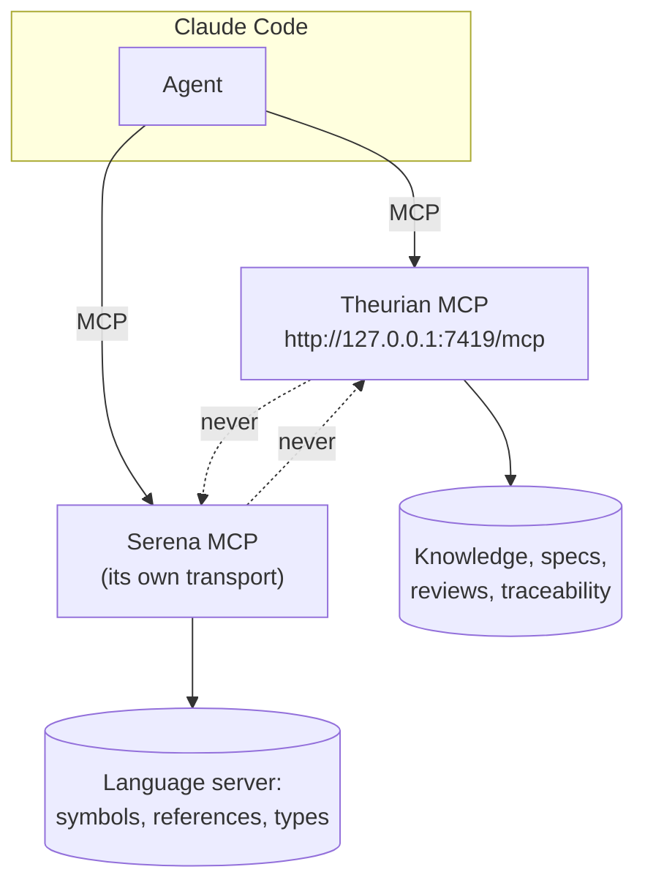
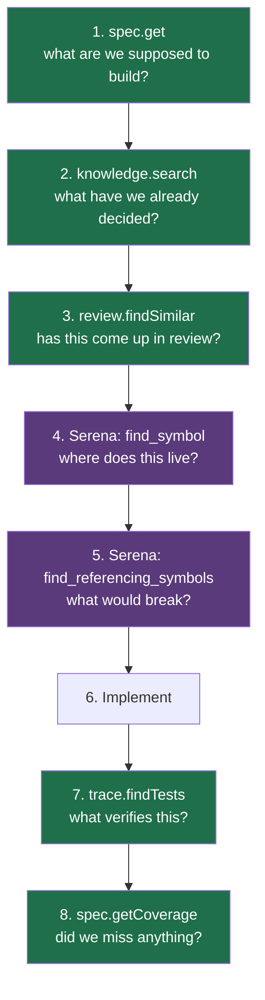
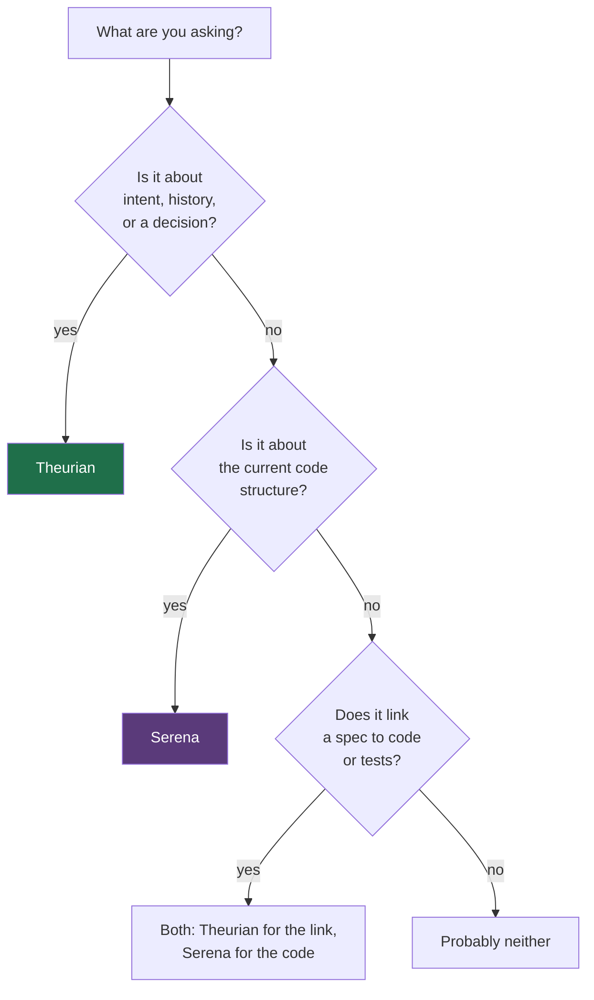

# Using Theurian with Serena

Theurian does not replace Serena, and it must never be built to. They answer
different questions, and an agent that has both is meaningfully better than one
with either.

## The split

| Theurian | Serena |
| :-- | :-- |
| What did we decide, and why? | Where is this symbol defined? |
| Was this approach rejected before? | Who calls this function? |
| What does the specification require? | What is this type's hierarchy? |
| Which tests verify this spec? | What are this symbol's references? |
| What did review say about this pattern? | What is the current code shape? |
| Has the spec drifted from the code? | — |
| Which knowledge governs these files? | — |

Put another way: **Serena knows what the code *is*. Theurian knows what the team
*decided*.** Serena reads the present through a language server. Theurian reads
the accumulated record, with provenance and validity.

## They never call each other



Theurian must not call Serena internally, and Serena's capabilities must not be
reimplemented inside Theurian Core. Two independent MCP servers, composed by the
agent. That keeps each one replaceable: a team that prefers a different code
intelligence tool swaps Serena out and Theurian is unaffected.

## Configuring both

They are independent MCP servers. Theurian is HTTP (never stdio — see below);
Serena is configured however Serena documents.

`/theurian:setup` writes only its own entry, merging into your existing
configuration and leaving every other server byte-for-byte unchanged. If Serena
is already configured, setup detects it and reports:

```text
✓ Serena MCP detected
✓ Theurian and Serena can be used together
```

Resulting user-scope configuration:

```json
{
  "mcpServers": {
    "theurian": {
      "type": "http",
      "url": "http://127.0.0.1:7419/mcp",
      "headers": { "Authorization": "Bearer ${THEURIAN_MCP_TOKEN}" }
    },
    "serena": {
      "command": "...",
      "args": ["..."]
    }
  }
}
```

Serena being stdio is fine. Serena is stateless per client and holds no shared
write-side state, so one process per client costs memory and nothing else.

## Why Theurian is never stdio

Because Theurian is not stateless.

A stdio MCP server is spawned **once per client**. In Claude Code that means one
per session and, in practice, one per subagent. For Theurian that would be:

- N processes opening write connections to one SQLite database;
- N independent index builders racing on the same files;
- N copies of every cache, with none of the benefit;
- no single publisher, so a partially built index could become visible.

The failure mode is not slowness — it is corruption. Every agent therefore shares
one daemon over Streamable HTTP.
([ADR-0002](../adr/0002-single-local-daemon-over-streamable-http.md))

If you ever see a `theurian` entry with a `command` field, that is a bug. Run
`/theurian:doctor`.

## All subagents use the same URL

Nothing special is required. Because the connection is an HTTP URL rather than a
spawned process, every agent that inherits the MCP configuration — main agent and
subagents alike — connects to the same daemon. Ten subagents produce ten
connections to one process, and they share a warm index.

## A workflow that uses both



Steps 1–3 are Theurian: understand the intent and the history before touching
anything. Steps 4–5 are Serena: understand the code as it is now. Steps 7–8 are
Theurian again: verify the change is traceable.

Skipping 1–3 is how an agent reimplements something the team rejected last
quarter. Skipping 4–5 is how it edits the wrong call site.

## Worked example

> "Add a cancellation deadline check to the order service."

| Step | Call | What comes back |
| :-- | :-- | :-- |
| 1 | `spec.get("spec.order-cancellation")` | preconditions, rules, outcomes — structured, not prose |
| 2 | `knowledge.search("order cancellation deadline")` | ADR on transaction boundaries; a runbook noting cancellation is idempotent |
| 3 | `review.findSimilar("deadline check")` | PR #431 thread: an earlier deadline check was rejected for running after the state mutation |
| 4 | Serena `find_symbol("cancelOrder")` | `src/orders/service.ts:142` |
| 5 | Serena `find_referencing_symbols` | three call sites, one in a scheduled job |
| 6 | — | implement, with the ordering constraint from step 3 |
| 7 | `trace.findTests("spec.order-cancellation")` | one integration test; no unit test for the deadline path |
| 8 | `spec.getCoverage` | `CANCELLATION_NOT_ALLOWED` outcome is untested |

Step 3 is the one that is hard to get any other way, and it is the step that
prevents shipping the same mistake twice.

## Which tool for a given question



## Troubleshooting

| Symptom | Cause | Fix |
| :-- | :-- | :-- |
| Theurian tools missing | Setup not run | `/theurian:setup` |
| Theurian returns 401 | `THEURIAN_MCP_TOKEN` not in the environment — common when Claude Code is launched from a GUI rather than a shell | `/theurian:doctor` explains the fix |
| Serena disappeared after setup | Would be a bug: setup merges, never replaces | Restore the timestamped backup and file an issue |
| Both configured, results conflict | They answer different questions | Trust Serena on code shape, Theurian on intent |
| A `theurian` entry with `command` | Misconfiguration | Remove it and re-run `/theurian:setup` |

## Related

- [ADR-0002 — single daemon, no stdio](../adr/0002-single-local-daemon-over-streamable-http.md)
- [ADR-0012 — the plugin does not auto-register the MCP server](../adr/0012-plugin-does-not-autoregister-mcp-server.md)
- [Claude Code integration](claude-code.md)
