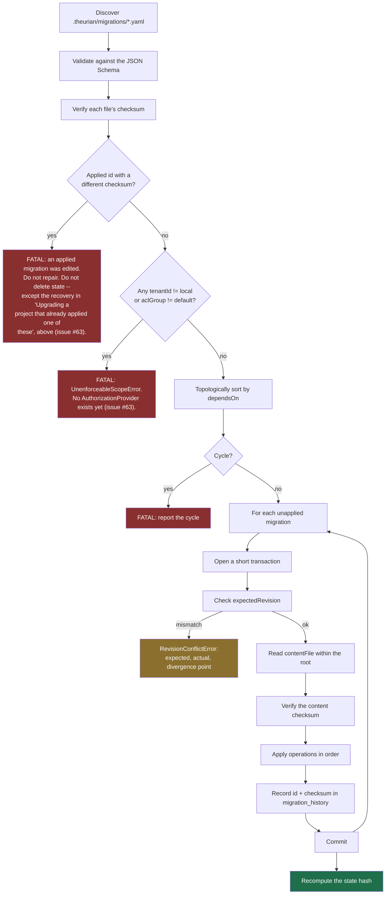

# Knowledge migration format

Normative schema:
[`schemas/migrations/migration.schema.json`](https://github.com/theurian/theurian/blob/main/schemas/migrations/migration.schema.json).
Decision record: [ADR-0005](../adr/0005-yaml-knowledge-migrations.md).

## Two migration systems, deliberately separate

| | Schema migration | **Knowledge migration** |
| :-- | :-- | :-- |
| Format | engine-native SQL | **YAML** |
| Changes | table structure of a derived store | **canonical knowledge state** |
| Lives in | `theurian/migrations/` (the package) | **`.theurian/migrations/`** (your repo) |
| Git-tracked as truth | no — the store is derived | **yes** |
| Reviewed by | Theurian maintainers | **your team** |

This page describes the second. They are separate because a structural change to
a rebuildable cache and an approval of an architecture decision are different
concerns, with different reviewers and different rollback semantics.

## Why YAML and not SQL

`UPDATE knowledge_items SET status='approved' WHERE item_id='...'` is
unreviewable as a statement about knowledge — a reviewer has to reconstruct
intent from a mutation. It also pins the log to one storage engine, and it cannot
express optimistic concurrency without hand-written guards in every statement.

An operation named `upsertRevision` with an `expectedRevision` reads as what it
is, replays into PostgreSQL or a document store as an adapter change, and carries
its concurrency guard in the format.

## Example

```yaml
apiVersion: theurian.dev/v1
id: 01K1DEFABC1234567890ABCDEF
createdAt: 2026-08-01T00:30:00+09:00
author: engineer@example.com
description: >
  Record the service-to-service authentication policy agreed in ADR-0009 and
  refined by the review on PR #431.
dependsOn:
  - 01K1ABCXYZ1234567890ABCDEF

operations:
  - op: upsertRevision
    itemId: architecture.auth-policy
    revisionId: 01K1DEFREV1234567890ABCDEF
    expectedRevision: 01K1ABCREV1234567890ABCDEF
    contentFile: ../knowledge/architecture/auth-policy.md
    metadata:
      title: Authentication and authorization policy
      contentType: text/markdown
      kind: architecture
      namespace: backend
      status: approved
      owner: platform-team
      trustLevel: reviewed
      sensitivity: internal
      scope:
        paths:
          - services/auth/**
```

Body content lives in a separate file rather than inline. Reviewers then read a
normal Markdown (or YAML, or JSON) diff, and the content hash covers the file's
actual bytes instead of a YAML-escaped copy of them.

## Operations

The set is closed. Adding one is a protocol change and bumps `apiVersion`.

| Operation | Effect |
| :-- | :-- |
| `createItem` | Create an item with no revision yet |
| `upsertRevision` | Append an immutable revision and move the item pointer |
| `deprecateItem` | Mark deprecated, optionally naming a successor |
| `restoreItem` | Undo a deprecation |
| `addRelation` / `removeRelation` | Typed edges between items |
| `addAlias` / `removeAlias` | Keep a renamed item reachable by its old id |
| `changeSensitivity` | Reclassify. **Requires a reason.** |
| `changeOwner` | Transfer ownership |
| `registerSpecification` | Register a spec against a revision |
| `supersedeSpecification` | Point a spec at its replacement |
| `addEvidence` / `removeEvidence` | Attach or detach supporting artifacts |

`changeSensitivity` requires a `reason` because reclassification changes who may
read the content. It updates the canonical record and every live response at
once: a search reports the new label the instant the migration commits, because a
result reads the item's current sensitivity the way it already reads the item's
current status, not the immutable revision's. It does **not** force a rebuild —
the built index keeps the label it derived until the next `index build`, which
re-derives every affected chunk and node scope at the item's current
classification. That lag reaches no reader, because no query filters on a chunk's
or node's sensitivity yet
([#119](https://github.com/theurian/theurian/issues/119)). Reclassification is
still not a change anyone should be able to make without saying why.

## Engine guarantees

### Identity and immutability

- Migration ids and revision ids are ULIDs, so lexical order equals creation
  order.
- **An applied migration is frozen.** Same id, different checksum is a fatal
  error, never an auto-repair: the recorded history and the file now make
  different claims, and only a human can say which is right.

### Ordering

- `dependsOn` is topologically sorted.
- Cycles are rejected before any operation runs.
- A missing dependency is an error, not a skip.

### Concurrency

`expectedRevision` guards each item:

| Value | Meaning |
| :-- | :-- |
| absent | must be creating the item's first revision |
| matches current | apply |
| does not match | `RevisionConflictError` with expected, actual, and the divergence point |

Conflicts are **reported, never merged**. An automatic three-way merge of a
design decision produces a paragraph nobody approved — precisely the failure
Theurian exists to prevent.

### Idempotence

Re-applying an applied migration is a no-op. This is a property of the engine,
not something each migration author has to implement.

### Tenant and ACL scope (issue #63)

`upsertRevision`'s `metadata` carries `tenantId` (default `local`) and
`aclGroup` (default `default`). The schema keeps both fields and their types —
they describe the shape a hosted, multi-tenant deployment needs (ADR-0003) —
but no `AuthorizationProvider` is implemented anywhere in Theurian Core yet.
Accepting a document that names another tenant or ACL group would let the
field read as an enforced boundary when nothing checks it.

**`migrate validate` and `migrate apply` both refuse a revision naming a
`tenantId` other than `local` or an `aclGroup` other than `default`.** The
refusal runs on the same function in both commands, checked against the
*whole* migration set rather than only what is still pending, so a document
is refused by both or by neither — never accepted by one and rejected by the
other, and never accepted quietly just because the offending revision already
applied. `migrate status` does not refuse — its contract is observation, not
a gate — but names every affected migration under `refusedIds`, so the same
property is visible there too. A later milestone lifts the refusal once a
hosted deployment ships a real principal to check these fields against.

```yaml
metadata:
  tenantId: local   # any other value is refused, in this build
  aclGroup: default  # any other value is refused, in this build
```

**Existing rows are not migrated by this fix — it closes the write side
only.** A revision that already carries a non-default `tenantId` or
`aclGroup` in canonical state (see below) keeps that value; nothing here
rewrites it, and reading it back through `knowledge.get` or `knowledge.search`
is unaffected. This was Phase 1 of #63 (FR-R1 scope filtering); enforcing the
field on read is [#119](https://github.com/theurian/theurian/issues/119), the
successor to #63.

#### Upgrading a project that already applied one of these

If a revision naming a foreign tenant or ACL group was applied before this
refusal shipped (possible only on `0.1.0.dev0` or `0.1.0.dev1`), the next
`migrate validate` or `migrate apply` against that project still refuses it —
but with a different remedy than an unapplied revision gets, because editing
an *applied* migration's file changes its checksum and would trip FR-K5's
tamper check instead ([`MigrationChecksumMismatchError`](#errors-you-will-actually-hit)),
whose own remedy says to restore the file. Following that remedy undoes the
edit and reintroduces the scope refusal — the two errors otherwise loop a
reader between them with no documented way out.

**The generic checksum remedy above — "restore the original, or write a new
migration" — does not escape this loop.** A new migration can add a new
revision; it cannot rewrite what an *earlier* revision's metadata already
says, and whole-set checking inspects every revision ever recorded, not only
an item's current one. The working procedure:

1. Edit `tenantId`/`aclGroup` to the default in **every** migration naming
   another value.
2. Delete `.theurian/state/` entirely.
3. Run `theurian migrate apply` to rebuild canonical state from the edited
   migrations from empty — this is what makes step 1 safe: state is fully
   reconstructible from the Git-tracked migrations (FR-K4), so there is
   nothing an in-place edit could leave inconsistent once the rebuild starts
   from nothing.

This is the one case in this document where deleting `.theurian/state/` after
an edit is the *correct*, sanctioned procedure, not a violation of node E's
"do not delete state" below — because the edit is deliberate and the loss it
causes is named and accepted, not accidental. It discards FR-K5's
tamper-evidence for every migration applied before that point: after the
rebuild, nothing in canonical state distinguishes "this file was always
`local`" from "this file was edited to say `local`". Do this once,
deliberately, when this section applies — not as a routine fix for an
ordinary checksum mismatch.

### Path safety

`contentFile` is resolved relative to the migration file and must stay inside the
project root. `..` traversal, absolute paths, and symlinks leaving the root are
all refused, including symlinks on intermediate components (SEC-7). The JSON
Schema rejects absolute paths as cheap defence in depth; the runtime check is the
real control, because only it can resolve symlinks.

### Rebuildability

Applying every migration to an empty database reproduces the complete canonical
state. That is the design (FR-K4), and it is what makes SQLite safe to treat as
a derived artifact.

**Nothing checks it.** This paragraph said the property was "enforced by the
`empty-db-rebuild` CI job"; that job does not exist, and no test rebuilds from
empty and compares. Tracked as
[#64](https://github.com/theurian/theurian/issues/64). Until it lands, a change
that made the migration engine's output depend on something outside the
Git-tracked inputs would not be caught here.

## Application



**Checksum verification (C/D) runs before the scope check (S), and it happens
at two places this one node stands in for**: `_verify_history` compares
against the *previously active* database (only when the state hash changed —
see [ADR-0007](../adr/0007-state-hash-partitioned-databases.md)), and
`MigrationEngine.plan` compares again against the *current* one, inside the
write transaction. Either can raise `MigrationChecksumMismatchError` first.
The scope check runs only once both have passed, which is why a migration
that is *both* tampered *and* names a foreign tenant is reported as a
checksum problem, never as a scope one — a reader who sees
`MigrationChecksumMismatchError` should never have to wonder whether a hidden
scope problem is the real reason their edit went unreported.

All operations in one migration share one transaction: either the whole logical
change lands or none of it does. Transactions stay short and never contain
external I/O (NFR-8).

## Naming and layout

```text
.theurian/
├── migrations/
│   ├── 01K1ABCXYZ1234567890ABCDEF-create-auth-policy.yaml
│   └── 01K1DEFABC1234567890ABCDEF-approve-auth-policy.yaml
└── knowledge/
    └── architecture/
        └── auth-policy.md
```

`<ulid>-<kebab-slug>.yaml`. The ULID is authoritative; the slug is for humans
scanning a directory listing and may be changed freely.

## Errors you will actually hit

| Error | What happened | What to do |
| :-- | :-- | :-- |
| `MigrationChecksumMismatchError` | An applied migration's file was edited | Restore the original, or write a new migration. Never "fix" the recorded checksum. |
| `RevisionConflictError` | Two people changed one item concurrently | Read both, decide, write a new migration with the correct `expectedRevision`. |
| `MigrationCycleError` | `dependsOn` loops | Break the cycle; the reported path shows where. |
| `MigrationDependencyMissingError` | A dependency is not in the reachable set | Usually a rebase dropped a migration. Check the branch. |
| `PathEscapeError` | `contentFile` points outside the root | Fix the path. If it looks intentional, treat it as a security finding. |
| `UnenforceableScopeError` | A revision named a `tenantId` other than `local` or an `aclGroup` other than `default` | Edit it to the default. **Unless the revision was already applied** — then the fix above does not apply; see [Upgrading a project that already applied one of these](#upgrading-a-project-that-already-applied-one-of-these), and do not use this row's checksum-error advice as a substitute (issue #63). |

## Related

- [ADR-0003 — ports and adapters](../adr/0003-ports-and-adapters.md), for why `tenantId` and `aclGroup` exist in the schema at all
- [ADR-0005 — YAML knowledge migrations](../adr/0005-yaml-knowledge-migrations.md)
- [ADR-0006 — immutable revisions and optimistic concurrency](../adr/0006-immutable-revisions-and-optimistic-concurrency.md)
- [ADR-0007 — state-hash-partitioned databases](../adr/0007-state-hash-partitioned-databases.md)
- [issue #63](https://github.com/theurian/theurian/issues/63) — the tenant/ACL refusal this page documents
