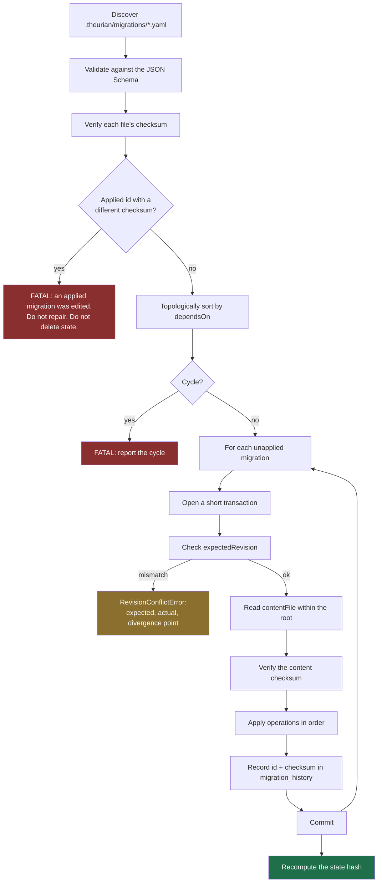

# Knowledge migration format

Normative schema:
[`schemas/migrations/migration.schema.json`](../../schemas/migrations/migration.schema.json).
Decision record: [ADR-0005](../adr/0005-yaml-knowledge-migrations.md).

## Two migration systems, deliberately separate

| | Schema migration | **Knowledge migration** |
| :-- | :-- | :-- |
| Format | engine-native SQL | **YAML** |
| Changes | table structure of a derived store | **canonical knowledge state** |
| Lives in | `theurian/migrations/` (the package) | **`.theurian/migrations/`** (your repo) |
| Git-tracked as truth | no — the store is derived | **yes** |
| Reviewed by | Theurian maintainers | **your team** |

This page describes the second. They are separate because a structural change to
a rebuildable cache and an approval of an architecture decision are different
concerns, with different reviewers and different rollback semantics.

## Why YAML and not SQL

`UPDATE knowledge_items SET status='approved' WHERE item_id='...'` is
unreviewable as a statement about knowledge — a reviewer has to reconstruct
intent from a mutation. It also pins the log to one storage engine, and it cannot
express optimistic concurrency without hand-written guards in every statement.

An operation named `upsertRevision` with an `expectedRevision` reads as what it
is, replays into PostgreSQL or a document store as an adapter change, and carries
its concurrency guard in the format.

## Example

```yaml
apiVersion: theurian.dev/v1
id: 01K1DEFABC1234567890ABCDEF
createdAt: 2026-08-01T00:30:00+09:00
author: engineer@example.com
description: >
  Record the service-to-service authentication policy agreed in ADR-0009 and
  refined by the review on PR #431.
dependsOn:
  - 01K1ABCXYZ1234567890ABCDEF

operations:
  - op: upsertRevision
    itemId: architecture.auth-policy
    revisionId: 01K1DEFREV1234567890ABCDEF
    expectedRevision: 01K1ABCREV1234567890ABCDEF
    contentFile: ../knowledge/architecture/auth-policy.md
    metadata:
      title: Authentication and authorization policy
      contentType: text/markdown
      kind: architecture
      namespace: backend
      status: approved
      owner: platform-team
      trustLevel: reviewed
      sensitivity: internal
      scope:
        paths:
          - services/auth/**
```

Body content lives in a separate file rather than inline. Reviewers then read a
normal Markdown (or YAML, or JSON) diff, and the content hash covers the file's
actual bytes instead of a YAML-escaped copy of them.

## Operations

The set is closed. Adding one is a protocol change and bumps `apiVersion`.

| Operation | Effect |
| :-- | :-- |
| `createItem` | Create an item with no revision yet |
| `upsertRevision` | Append an immutable revision and move the item pointer |
| `deprecateItem` | Mark deprecated, optionally naming a successor |
| `restoreItem` | Undo a deprecation |
| `addRelation` / `removeRelation` | Typed edges between items |
| `addAlias` / `removeAlias` | Keep a renamed item reachable by its old id |
| `changeSensitivity` | Reclassify. **Requires a reason.** |
| `changeOwner` | Transfer ownership |
| `registerSpecification` | Register a spec against a revision |
| `supersedeSpecification` | Point a spec at its replacement |
| `addEvidence` / `removeEvidence` | Attach or detach supporting artifacts |

`changeSensitivity` requires a `reason` because reclassification changes who can
read the content and forces every affected RAPTOR tree to rebuild. That is not a
change anyone should be able to make without saying why.

## Engine guarantees

### Identity and immutability

- Migration ids and revision ids are ULIDs, so lexical order equals creation
  order.
- **An applied migration is frozen.** Same id, different checksum is a fatal
  error, never an auto-repair: the recorded history and the file now make
  different claims, and only a human can say which is right.

### Ordering

- `dependsOn` is topologically sorted.
- Cycles are rejected before any operation runs.
- A missing dependency is an error, not a skip.

### Concurrency

`expectedRevision` guards each item:

| Value | Meaning |
| :-- | :-- |
| absent | must be creating the item's first revision |
| matches current | apply |
| does not match | `RevisionConflictError` with expected, actual, and the divergence point |

Conflicts are **reported, never merged**. An automatic three-way merge of a
design decision produces a paragraph nobody approved — precisely the failure
Theurian exists to prevent.

### Idempotence

Re-applying an applied migration is a no-op. This is a property of the engine,
not something each migration author has to implement.

### Path safety

`contentFile` is resolved relative to the migration file and must stay inside the
project root. `..` traversal, absolute paths, and symlinks leaving the root are
all refused, including symlinks on intermediate components (SEC-7). The JSON
Schema rejects absolute paths as cheap defence in depth; the runtime check is the
real control, because only it can resolve symlinks.

### Rebuildability

Applying every migration to an empty database reproduces the complete canonical
state. This is enforced by the `empty-db-rebuild` CI job, and it is what makes
SQLite safe to treat as a derived artifact.

## Application



All operations in one migration share one transaction: either the whole logical
change lands or none of it does. Transactions stay short and never contain
external I/O (NFR-8).

## Naming and layout

```text
.theurian/
├── migrations/
│   ├── 01K1ABCXYZ1234567890ABCDEF-create-auth-policy.yaml
│   └── 01K1DEFABC1234567890ABCDEF-approve-auth-policy.yaml
└── knowledge/
    └── architecture/
        └── auth-policy.md
```

`<ulid>-<kebab-slug>.yaml`. The ULID is authoritative; the slug is for humans
scanning a directory listing and may be changed freely.

## Errors you will actually hit

| Error | What happened | What to do |
| :-- | :-- | :-- |
| `MigrationChecksumMismatchError` | An applied migration's file was edited | Restore the original, or write a new migration. Never "fix" the recorded checksum. |
| `RevisionConflictError` | Two people changed one item concurrently | Read both, decide, write a new migration with the correct `expectedRevision`. |
| `MigrationCycleError` | `dependsOn` loops | Break the cycle; the reported path shows where. |
| `MigrationDependencyMissingError` | A dependency is not in the reachable set | Usually a rebase dropped a migration. Check the branch. |
| `PathEscapeError` | `contentFile` points outside the root | Fix the path. If it looks intentional, treat it as a security finding. |

## Related

- [ADR-0005 — YAML knowledge migrations](../adr/0005-yaml-knowledge-migrations.md)
- [ADR-0006 — immutable revisions and optimistic concurrency](../adr/0006-immutable-revisions-and-optimistic-concurrency.md)
- [ADR-0007 — state-hash-partitioned databases](../adr/0007-state-hash-partitioned-databases.md)
