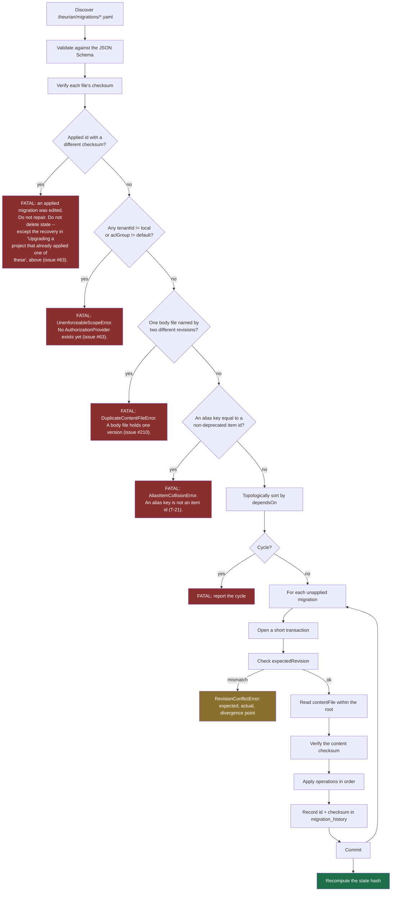

# Knowledge migration format

Normative schema:
[`schemas/migrations/migration.schema.json`](https://github.com/theurian/theurian/blob/main/schemas/migrations/migration.schema.json).
Decision record: [ADR-0005](../adr/0005-yaml-knowledge-migrations.md).

## Two migration systems, deliberately separate

| | Schema migration | **Knowledge migration** |
| :-- | :-- | :-- |
| Format | engine-native SQL | **YAML** |
| Changes | table structure of a derived store | **canonical knowledge state** |
| Lives in | `theurian/migrations/` (the package) | **`.theurian/migrations/`** (your repo) |
| Git-tracked as truth | no — the store is derived | **yes** |
| Reviewed by | Theurian maintainers | **your team** |

This page describes the second. They are separate because a structural change to
a rebuildable cache and an approval of an architecture decision are different
concerns, with different reviewers and different rollback semantics.

## Why YAML and not SQL

`UPDATE knowledge_items SET status='approved' WHERE item_id='...'` is
unreviewable as a statement about knowledge — a reviewer has to reconstruct
intent from a mutation. It also pins the log to one storage engine, and it cannot
express optimistic concurrency without hand-written guards in every statement.

An operation named `upsertRevision` with an `expectedRevision` reads as what it
is, replays into PostgreSQL or a document store as an adapter change, and carries
its concurrency guard in the format.

## Example

```yaml
apiVersion: theurian.dev/v1
id: 01K1DEFABC1234567890ABCDEF
createdAt: 2026-08-01T00:30:00+09:00
author: engineer@example.com
description: >
  Record the service-to-service authentication policy agreed in ADR-0009 and
  refined by the review on PR #431.
dependsOn:
  - 01K1ABCXYZ1234567890ABCDEF

operations:
  - op: upsertRevision
    itemId: architecture.auth-policy
    revisionId: 01K1DEFREV1234567890ABCDEF
    expectedRevision: 01K1ABCREV1234567890ABCDEF
    contentFile: ../knowledge/architecture/auth-policy.md
    contentSha256: 9a15842264396c898700b6bcfc7cc7d81f8dcaf617492b6c7c1001a3082d29c4
    metadata:
      title: Authentication and authorization policy
      contentType: text/markdown
      kind: architecture
      namespace: backend
      status: approved
      owner: platform-team
      trustLevel: reviewed
      sensitivity: internal
      scope:
        paths:
          - services/auth/**
```

Body content lives in a separate file rather than inline. Reviewers then read a
normal Markdown (or YAML, or JSON) diff, and the content hash covers the file's
actual bytes instead of a YAML-escaped copy of them.

The two guards on that operation cover two different things, and a hand-written
migration wants both: `expectedRevision` says which revision this one replaces
([Concurrency](#concurrency)), and `contentSha256` says which bytes the body
held when the migration was written
([Pinning the body](#pinning-the-body-contentsha256)). One body file backs one
revision — [a second revision naming it is refused](#one-body-file-one-revision-issue-210).

## Operations

The set is closed. Adding one is a protocol change and bumps `apiVersion`.

| Operation | Effect |
| :-- | :-- |
| `createItem` | Create an item with no revision yet |
| `upsertRevision` | Append an immutable revision and move the item pointer |
| `deprecateItem` | Mark deprecated, optionally naming a successor |
| `restoreItem` | Undo a deprecation |
| `addRelation` / `removeRelation` | Typed edges between items |
| `addAlias` / `removeAlias` | Keep a renamed item reachable by its old id |
| `changeSensitivity` | Reclassify. **Requires a reason.** |
| `changeOwner` | Transfer ownership |
| `registerSpecification` | Register a spec against a revision |
| `supersedeSpecification` | Point a spec at its replacement |
| `addEvidence` / `removeEvidence` | Attach or detach supporting artifacts |

`changeSensitivity` requires a `reason` because reclassification changes who may
read the content. It updates the canonical record and every live response at
once: a search reports the new label the instant the migration commits, because a
result reads the item's current sensitivity the way it already reads the item's
current status, not the immutable revision's. It does **not** force a full
rebuild.

It is not inert on the index either, and it stopped being so in
[#119](https://github.com/theurian/theurian/issues/119): every retriever now
filters on a chunk's and a node's sensitivity against the ceiling this deployment
declares, so a stale index row is no longer a label nothing reads. Three cases,
and only the middle one is a lag:

- **Past the ceiling the published build ran under** — the item is withdrawn from
  this deployment, and `migrate apply` purges its rows out of the published index
  in the same command, with no `index build` after it. The forest half is
  re-derived over the surviving rows, exactly as a `deprecateItem` already was
  (ADR-0024 decision 5, ADR-0025 part 2).
- **Within that ceiling** — nothing is withdrawn, so nothing is purged and no
  index file is copied. The chunk rows keep the label they were derived under
  until the next `index build`, and that lag reaches no reader: the label a caller
  sees is published from the item, and the gate the row must clear is applied
  against the item's current class as well.
- **Back down into that ceiling** — a purge copies a build and deletes from the
  copy, so an item the build was never allowed to write has no row to restore. It
  stays unserved until the next `index build` re-derives from canonical state,
  which fails toward *fewer* results.

Reclassification is still not a change anyone should be able to make without
saying why.

## Engine guarantees

### Identity and immutability

- Migration ids and revision ids are ULIDs, so lexical order equals creation
  order.
- **An applied migration is frozen.** Same id, different checksum is a fatal
  error, never an auto-repair: the recorded history and the file now make
  different claims, and only a human can say which is right.

### Ordering

- `dependsOn` is topologically sorted.
- Cycles are rejected before any operation runs.
- A missing dependency is an error, not a skip.

### Concurrency

`expectedRevision` guards each item:

| Value | Meaning |
| :-- | :-- |
| absent | must be creating the item's first revision |
| matches current | apply |
| does not match | `RevisionConflictError` with expected, actual, and the divergence point |

Conflicts are **reported, never merged**. An automatic three-way merge of a
design decision produces a paragraph nobody approved — precisely the failure
Theurian exists to prevent.

### Pinning the body: `contentSha256`

`expectedRevision` guards the item. `contentSha256` guards the body file the
revision points at. It is **required** on every `upsertRevision`
([ADR-0027](../adr/0027-accept-validates-before-it-moves.md)):

| `contentSha256` | What happens |
| :-- | :-- |
| present, agrees with the body | The migration loads. |
| present, disagrees with the body | `MigrationError`, exit 4. An out-of-band edit to the body is refused rather than adopted. |
| absent | A schema error at `theurian migrate validate`, before anything is applied. |

`theurian propose` pins every revision it writes, unconditionally — that pin is
why a proposed body is written to a per-revision path
([ADR-0013](../adr/0013-ai-writes-produce-proposals.md)). **A hand-written
migration must pin too, and an update should carry `expectedRevision` as
well.** The value is the SHA-256 of the body file's bytes:

```console
$ shasum -a 256 .theurian/knowledge/architecture/auth-policy.md
9a15842264396c898700b6bcfc7cc7d81f8dcaf617492b6c7c1001a3082d29c4  ...
```

Edit that body afterwards and the next `migrate validate` exits 4 rather than
carrying the change in silently:

```text
error: 01K1AAAAAA01234567890ABCDE-create.yaml: ../knowledge/architecture/auth-policy.md
hashes to 7e1eb70348da but the migration pins 9a1584226439. The body file changed
after the migration was written.
```

#### Why the pin is required rather than recommended

**A body nothing pins is frozen by nothing.** FR-K5 checksums the migration
YAML; that checksum does not cover the file the YAML points at. Measured while
the field was optional, on a project whose one migration declared no
`contentSha256`: apply it, edit the body, and `migrate validate` still reported
`valid: true` at exit 0. A second `migrate apply` then recorded the edited bytes
under the same revision id and returned `changed: true` — the state hash covers
body content, so the edit landed in a new state partition rather than being
reported anywhere. That residual is what
[#210](https://github.com/theurian/theurian/issues/210#issuecomment-5328173657)
recorded and what ADR-0027 closed by making the field required.

Requiring it was a breaking schema change with **no migration documents to
repair**: every tracked migration in this repository, the two under
`examples/sample-project/` included, already carried a `contentSha256` on every
`upsertRevision` (measured 2026-08-23). `theurian propose` has never emitted a
revision without one.

An absent pin is now a schema error, so `migrate validate` refuses the document
at exit 4 instead of warning about it. The refusal arrives as a `oneOf` failure
rather than a "required property" message, because an operation is a `oneOf`
over the operation types and dropping a required field simply stops it matching
`opUpsertRevision` — measured 2026-08-23 against a scratch project:

```text
error: 01K1AAAAAA01234567890ABCDE-auth.yaml is invalid at operations/1: does not
satisfy 'oneOf' (expected [{'$ref': '#/$defs/opCreateItem'}, ...]); the value
there is {'contentFile': '../knowledge/architecture/auth-policy.md', ...}
remedy: Fix the migration file, then retry.
```

`migrate validate --json` used to publish an `unpinnedRevisions` warning list
for this case. **The field is gone**: with the pin required it would be empty
for every document that got far enough to be reported on, and a permanently
empty published field claims its condition is still reachable.

**Adding a pin to an already-applied migration is not free**, so a project
carrying one from an older build needs the two-step escape rather than a one-line
edit. Editing an applied migration trips FR-K5's checksum guard
(["Identity and immutability"](#identity-and-immutability)), whose own remedy
says to restore the file — so the way through is to edit the migration, delete
`.theurian/state/`, and rebuild with `theurian migrate apply` (FR-K4), the same
sanctioned state-rebuild the scope and duplicate-body remedies name.

### One body file, one revision (issue #210)

**`migrate validate` and `migrate apply` both refuse a migration set in which
two *different* revisions back onto one body file.** A body file holds one
version at a time and cannot be independently frozen or attributed to each of
two revisions — there is one set of bytes to hash — so such a set does not
describe a state. The refusal is **unconditional of pinning**: even a pair that
both pin the same `contentSha256` is refused, because the hazard is the sharing,
not the missing pin. Where no pin is declared the failure is also silent —
measured before this refusal existed: two hand-written migrations sharing one
path, with a correct `expectedRevision` chain and no `contentSha256`, both
applied at exit 0, and the earlier revision recorded the *later* body under its
own title and author. Having adopted that body's hash, the wrong record was
self-consistent afterwards, so nothing could detect it later.

Both commands exit 4 on the same message, and `apply` refuses before it creates
a database file — a refused set costs no state, the property issue #63's refusal
already has.

**The key is the revision id, not the path alone.** Re-declaring one revision
against its own body is how an in-place status change is written: the revision
id does not move, `append_revision` stays the no-op FR-K8 requires, and only
`status` differs ([ADR-0024](../adr/0024-a-purge-is-a-build.md) decision 5, the
`reject` and in-place `draft` shapes). Keying on the path alone would refuse
that, and take the withdrawal purge's own faces with it. This passes:

```yaml
  - op: upsertRevision
    itemId: architecture.auth-policy
    revisionId: 01K1AAAREV01234567890ABCDE   # the item's *current* revision
    expectedRevision: 01K1AAAREV01234567890ABCDE
    contentFile: ../knowledge/architecture/auth-policy.md
    contentSha256: 9a15842264396c898700b6bcfc7cc7d81f8dcaf617492b6c7c1001a3082d29c4
    metadata:
      # every required field, as the current revision already has it, except:
      status: rejected
```

`metadata` is still required in full — this is a re-declaration, not a patch.
Measured against the set above: `migrate validate` and `migrate apply` both
exit 0, and `apply` reports both migrations applied.

Two *spellings* of one file do collide, because the comparison runs on the
body's **filesystem identity** (`st_dev`/`st_ino`), taken by the loader from the
same `stat` that read it — not on the path string. So
`../knowledge/architecture/./auth-policy.md` and
`../knowledge/architecture/auth-policy.md` are one file, and so are the spellings
a case-insensitive filesystem (APFS, NTFS) collapses onto one inode — an
uppercase extension, a case-variant directory, an NFC/NFD pair, or a second
hardlinked name. A guard keyed on the resolved *string* would leave those
distinct and let a second revision name the same body through a variant
spelling; identity is the platform-correct key, where casefolding the string
would go wrong the other way and refuse two genuinely different files on a
case-sensitive filesystem.

`migrate status` does not refuse — its contract is observation, not a gate —
but names every migration `validate`/`apply` refuse under `refusedIds`, exactly
as it does for the tenant/ACL rule above, so the property stays visible on the
one command that keeps going. It reports the *later* migration of each sharing
pair, the one whose body a reader gives its own file.

### An alias key is not an item id (T-21)

**`migrate validate` and `migrate apply` both refuse a migration set that leaves
an `addAlias` key equal to the id of an item whose final status is anything but
`deprecated`.** An alias key is a string an author chooses, and the store resolves
it *before* it looks up a status. So a key equal to a live item's id lets a lookup
for that id resolve to the item the alias points at: a `rejected` item's edge and
its `note` — where the secret that caused the rejection lives — could then surface
under the approved item the alias targets. Both directions are the same fault — an
`addAlias` authored over an existing item, and a `createItem` that takes an id an
alias already keys — and the check runs against the *whole* set, so a collision
that straddles an already-applied migration is caught too, because `apply` reloads
every migration file.

Both commands exit 4 with `AliasItemCollisionError`, naming the alias, the item it
points at, and the item's final status, and quoting no body and no note. `apply`
refuses before it creates a database file, so a refused set costs no state.

**The one exempt shape is the rename.** `deprecateItem(old)` then `addAlias(old ->
new)` leaves `old` `deprecated`, and a lookup for a deprecated id resolving to its
successor exposes nothing withheld — that is the reachability aliases exist for.
Every other final status is refused, `superseded` included: only a deprecated item
is safe to shadow with its own alias. This passes:

```yaml
  - op: deprecateItem
    itemId: architecture.auth-policy-old
  - op: addAlias
    alias: architecture.auth-policy-old   # now deprecated, so the alias is allowed
    itemId: architecture.auth-policy
```

`migrate status` does not refuse — its contract is observation, not a gate — but
names every colliding migration under `refusedIds`, exactly as it does for the
tenant/ACL and one-body-one-revision rules above.

### Idempotence

Re-applying an applied migration is a no-op. This is a property of the engine,
not something each migration author has to implement.

### Tenant and ACL scope (issue #63)

`upsertRevision`'s `metadata` carries `tenantId` (default `local`) and
`aclGroup` (default `default`). The schema keeps both fields and their types —
they describe the shape a hosted, multi-tenant deployment needs (ADR-0003) —
but no `AuthorizationProvider` is implemented anywhere in Theurian Core yet.
Accepting a document that names another tenant or ACL group would let the
field read as an enforced boundary when nothing checks it.

**`migrate validate` and `migrate apply` both refuse a revision naming a
`tenantId` other than `local` or an `aclGroup` other than `default`.** The
refusal runs on the same function in both commands, checked against the
*whole* migration set rather than only what is still pending, so a document
is refused by both or by neither — never accepted by one and rejected by the
other, and never accepted quietly just because the offending revision already
applied. `migrate status` does not refuse — its contract is observation, not
a gate — but names every affected migration under `refusedIds`, so the same
property is visible there too. A later milestone lifts the refusal once a
hosted deployment ships a real principal to check these fields against.

```yaml
metadata:
  tenantId: local   # any other value is refused, in this build
  aclGroup: default  # any other value is refused, in this build
```

**Existing rows are not migrated by this fix — it closes the write side
only.** A revision that already carries a non-default `tenantId` or
`aclGroup` in canonical state (see below) keeps that value; nothing here
rewrites it, and reading it back through `knowledge.get` or `knowledge.search`
is unaffected. This was Phase 1 of #63 (FR-R1 scope filtering); enforcing the
field on read is [#119](https://github.com/theurian/theurian/issues/119), the
successor to #63.

#### Upgrading a project that already applied one of these

If a revision naming a foreign tenant or ACL group was applied before this
refusal shipped (possible only on `0.1.0.dev0` or `0.1.0.dev1`), the next
`migrate validate` or `migrate apply` against that project still refuses it —
but with a different remedy than an unapplied revision gets, because editing
an *applied* migration's file changes its checksum and would trip FR-K5's
tamper check instead ([`MigrationChecksumMismatchError`](#errors-you-will-actually-hit)),
whose own remedy says to restore the file. Following that remedy undoes the
edit and reintroduces the scope refusal — the two errors otherwise loop a
reader between them with no documented way out.

**The generic checksum remedy above — "restore the original, or write a new
migration" — does not escape this loop.** A new migration can add a new
revision; it cannot rewrite what an *earlier* revision's metadata already
says, and whole-set checking inspects every revision ever recorded, not only
an item's current one. The working procedure:

1. Edit `tenantId`/`aclGroup` to the default in **every** migration naming
   another value.
2. Delete `.theurian/state/` entirely.
3. Run `theurian migrate apply` to rebuild canonical state from the edited
   migrations from empty — this is what makes step 1 safe: state is fully
   reconstructible from the Git-tracked migrations (FR-K4), so there is
   nothing an in-place edit could leave inconsistent once the rebuild starts
   from nothing.

This is the one case in this document where deleting `.theurian/state/` after
an edit is the *correct*, sanctioned procedure, not a violation of node E's
"do not delete state" below — because the edit is deliberate and the loss it
causes is named and accepted, not accidental. It discards FR-K5's
tamper-evidence for every migration applied before that point: after the
rebuild, nothing in canonical state distinguishes "this file was always
`local`" from "this file was edited to say `local`". Do this once,
deliberately, when this section applies — not as a routine fix for an
ordinary checksum mismatch.

### Path safety

`contentFile` is resolved relative to the migration file and must stay inside the
project root. `..` traversal, absolute paths, and symlinks leaving the root are
all refused, including symlinks on intermediate components (SEC-7). The JSON
Schema rejects absolute paths as cheap defence in depth; the runtime check is the
real control, because only it can resolve symlinks.

### Rebuildability

Applying every migration to an empty database reproduces the complete canonical
state. That is the design (FR-K4), and it is what makes SQLite safe to treat as
a derived artifact.

**Nothing checks it.** This paragraph said the property was "enforced by the
`empty-db-rebuild` CI job"; that job does not exist, and no test rebuilds from
empty and compares. Tracked as
[#64](https://github.com/theurian/theurian/issues/64). Until it lands, a change
that made the migration engine's output depend on something outside the
Git-tracked inputs would not be caught here.

## Application



**Checksum verification (C/D) runs before the scope check (S), and it happens
at two places this one node stands in for**: `_verify_history` compares
against the *previously active* database (only when the state hash changed —
see [ADR-0007](../adr/0007-state-hash-partitioned-databases.md)), and
`MigrationEngine.plan` compares again against the *current* one, inside the
write transaction. Either can raise `MigrationChecksumMismatchError` first.
The scope check runs only once both have passed, which is why a migration
that is *both* tampered *and* names a foreign tenant is reported as a
checksum problem, never as a scope one — a reader who sees
`MigrationChecksumMismatchError` should never have to wonder whether a hidden
scope problem is the real reason their edit went unreported.

**The duplicate-body refusal (U) runs after the scope check (S)**, in that order
in both commands and again inside `MigrationEngine.apply`. The scope rule names
one migration as wrong; U is a statement about the *set*, in which neither
migration is wrong on its own. Reporting the narrower fault first is what keeps
a reader from being sent to a second migration that is not the one to edit.

**The alias-collision refusal (W) runs after the duplicate-body check (U)**, again
in that order at both commands and inside `MigrationEngine.apply`. Like U it is a
statement about the *set* — an alias key and an item id are each valid on their
own, and only their coincidence is the fault — so it is reported after the
per-migration checks that can name a single offending file.

All operations in one migration share one transaction: either the whole logical
change lands or none of it does. Transactions stay short and never contain
external I/O (NFR-8).

## Naming and layout

```text
.theurian/
├── migrations/
│   ├── 01K1ABCXYZ1234567890ABCDEF-create-auth-policy.yaml
│   └── 01K1DEFABC1234567890ABCDEF-approve-auth-policy.yaml
└── knowledge/
    └── architecture/
        └── auth-policy.md
```

`<ulid>-<kebab-slug>.yaml`. The ULID is authoritative; the slug is for humans
scanning a directory listing and may be changed freely.

## Errors you will actually hit

| Error | What happened | What to do |
| :-- | :-- | :-- |
| `MigrationChecksumMismatchError` | An applied migration's file was edited | Restore the original, or write a new migration. Never "fix" the recorded checksum. |
| `RevisionConflictError` | Two people changed one item concurrently | Read both, decide, write a new migration with the correct `expectedRevision`. |
| `MigrationCycleError` | `dependsOn` loops | Break the cycle; the reported path shows where. |
| `MigrationDependencyMissingError` | A dependency is not in the reachable set | Usually a rebase dropped a migration. Check the branch. |
| `PathEscapeError` | `contentFile` points outside the root | Fix the path. If it looks intentional, treat it as a security finding. |
| `DuplicateContentFileError` | Two different revisions name one `contentFile` | Give the later revision a body file of its own under `.theurian/knowledge/` and point that migration at it; pin both with `contentSha256` while you are there. **If that migration was already applied**, the edit also trips the checksum guard above — delete `.theurian/state/` after the edit and run `theurian migrate apply`, which rebuilds canonical state from the corrected migrations (FR-K4). |
| `UnenforceableScopeError` | A revision named a `tenantId` other than `local` or an `aclGroup` other than `default` | Edit it to the default. **Unless the revision was already applied** — then the fix above does not apply; see [Upgrading a project that already applied one of these](#upgrading-a-project-that-already-applied-one-of-these), and do not use this row's checksum-error advice as a substitute (issue #63). |
| `AliasItemCollisionError` | An `addAlias` key equals the id of an item whose final status is not `deprecated` | Remove the `addAlias`, or give the item a distinct id — an alias key and an item id must not be the same string. If it is a rename, deprecate the old item first (`deprecateItem`), the one shape this allows. **If that migration was already applied**, the edit also trips the checksum guard above — delete `.theurian/state/` after the edit and run `theurian migrate apply`, which rebuilds canonical state from the corrected migrations (FR-K4). |

## Related

- [ADR-0003 — ports and adapters](../adr/0003-ports-and-adapters.md), for why `tenantId` and `aclGroup` exist in the schema at all
- [ADR-0005 — YAML knowledge migrations](../adr/0005-yaml-knowledge-migrations.md)
- [ADR-0006 — immutable revisions and optimistic concurrency](../adr/0006-immutable-revisions-and-optimistic-concurrency.md)
- [ADR-0007 — state-hash-partitioned databases](../adr/0007-state-hash-partitioned-databases.md)
- [ADR-0013 — AI writes produce proposals](../adr/0013-ai-writes-produce-proposals.md), for why every proposed revision pins its body
- [issue #63](https://github.com/theurian/theurian/issues/63) — the tenant/ACL refusal this page documents
- [issue #210](https://github.com/theurian/theurian/issues/210) — the body pin, `unpinnedRevisions`, and the one-body-one-revision refusal
