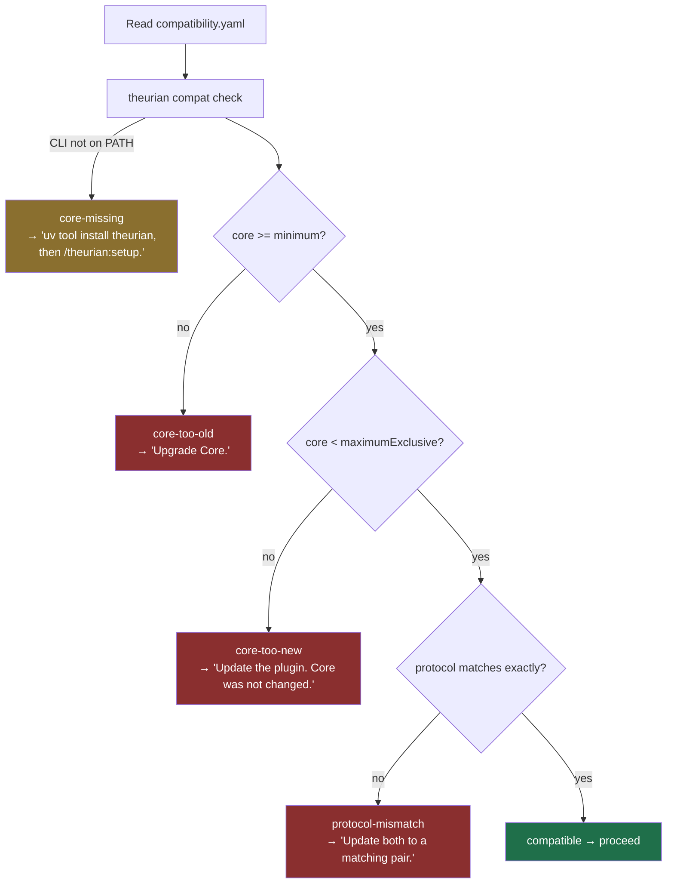

# Plugin/Core compatibility

Theurian Core and the Claude Code plugin are separate artifacts with separate
versions and separate release trains
([ADR-0001](../adr/0001-monorepo-with-independent-artifacts.md)). This document
defines how a client decides whether it may talk to an installed Core.

## Three versions

| Thing | Example | Changes when |
| :-- | :-- | :-- |
| Core version | `0.4.0` | any Core release |
| Plugin version | `0.2.1` | any plugin release |
| Protocol version | `theurian/v1` | the wire contract changes incompatibly |

The protocol version is what actually matters for interoperability. The version
range exists because a Core release can change behaviour a client depends on
without changing the wire format.

## The declaration

`plugins/claude-code/compatibility.yaml`, validated against
[`schemas/protocol/compatibility.schema.json`](../../schemas/protocol/compatibility.schema.json):

```yaml
pluginVersion: 0.2.1
coreCompatibility:
  minimum: 0.4.0
  maximumExclusive: 0.5.0
protocolVersion: theurian/v1
```

`maximumExclusive` is the first Core version the plugin does **not** support.
Pre-1.0 it is the next MINOR, because a pre-1.0 MINOR bump may break the
protocol. Post-1.0 it becomes the next MAJOR.

## Core performs the comparison

A client must not implement SemVer ordering itself. Ordering has genuinely subtle
edges — pre-releases sort *before* their release, numeric identifiers rank below
alphanumeric ones, build metadata is excluded from precedence — and every client
that reimplements them will get a different subset right.

There is also a cross-ecosystem seam: Core is a Python package, so it reports
PEP 440 (`0.1.0.dev0`, `0.2.0rc1`), while plugins declare SemVer. Core owns that
translation too, and it is the sharpest of the three edges — a client that
implements SemVer §11.4 *faithfully* still gets the next section wrong, because
the two ecosystems disagree about where a development build sits.

```sh
theurian compat check \
  --plugin-version 0.2.1 \
  --core-minimum 0.4.0 \
  --core-maximum-exclusive 0.5.0 \
  --protocol-version theurian/v1 \
  --json
```

```json
{
  "outcome": "compatible",
  "compatible": true,
  "message": "Theurian plugin 0.2.1 is compatible with Core 0.4.0 (theurian/v1).",
  "remedy": "",
  "pluginVersion": "0.2.1",
  "coreVersion": "0.4.0",
  "protocolVersion": "theurian/v1"
}
```

| Exit code | Meaning |
| :-- | :-- |
| 0 | compatible |
| 2 | the declaration itself was malformed |
| 3 | incompatible |

Distinct codes matter: a caller has to tell "your versions do not match" apart
from "the command failed", because the remedies are completely different.

## PEP 440 to SemVer

| Core reports | Treated as | Sorts |
| :-- | :-- | :-- |
| `0.1.0` | `0.1.0` | — |
| `0.1.0.dev0` | `0.1.0-dev.0` | before every `0.1.0` pre-release |
| `0.2.0a3` | `0.2.0-alpha.3` | before `0.2.0-beta.1` |
| `0.2.0a3.dev1` | `0.2.0-alpha.3.dev.1` | before `0.2.0-alpha.3` |
| `0.2.0rc1` | `0.2.0-rc.1` | before `0.2.0` |
| `1.2` | `1.2.0` | — |
| `1.2.0a` | `1.2.0-alpha.0` | PEP 440 defaults an omitted number to 0 |

Both sides are ordered by Core's release train, not by the alphabet. Within one
release that order is

```
dev  <  alpha  <  beta  <  rc  <  final
```

and a development build of a pre-release sorts below that pre-release
(`0.2.0-alpha.3.dev.1` before `0.2.0-alpha.3`). Both rules come from PEP 440 and
both differ from a literal reading of SemVer §11.4, which compares the phase
words as ASCII — putting `dev` between `beta` and `rc` — and ranks a longer
identifier list higher — putting `alpha.3.dev.1` above `alpha.3`.

Core applies the release-train order to the declaration's bounds and to its own
version alike. Applying it to one side only would move the version and leave the
floor behind.

**This is why a client must not compare versions itself.** A client that gets
SemVer §11.4 exactly right produces a floor with a hole in the middle:
`minimum: 0.1.0-dev.0` would accept `0.1.0.dev1` and `0.1.0rc1` while refusing
every alpha and beta between them — a `minimum` that is not a minimum. Getting
SemVer right is not the same as getting *this* right, so there is no level of
care at which reimplementing it becomes safe.

The practical consequence for a declaration: a plugin developed against Core
`0.1.0` should declare `minimum: 0.1.0-dev.0`. That is the earliest `0.1.0` Core
can report, so every pre-release of `0.1.0` — `0.1.0.dev1`, `0.1.0a1`,
`0.1.0b1`, `0.1.0rc1` — sorts above it and resolves `compatible`. It is also the
SemVer form of `0.1.0.dev0`, Core's first release, so the floor sits exactly at
the released Core rather than below anything installable. Pinning the minimum at `0.1.0` instead rejects all of them, and
the reason is the ordering rather than the spelling: `0.1.0rc1` carries no
development segment and is still below `0.1.0`.

## Resolution



## Outcomes

| Outcome | Meaning | Remedy |
| :-- | :-- | :-- |
| `compatible` | Proceed | — |
| `core-missing` | The CLI is not on `PATH` | Install Core with `uv tool install theurian` or `pipx install theurian`, then run `/theurian:setup`. **Not an error to repair automatically** — this is the normal "plugin installed, Core not yet installed" state (FR-L3). |
| `core-too-old` | Core predates `minimum` | Upgrade Core |
| `core-too-new` | Core is at or past `maximumExclusive` | Update the **plugin**. Downgrading Core would break every other client on the machine. |
| `protocol-mismatch` | Wire protocols differ | Update both to a matching pair |

Show the verdict's own `remedy` string rather than a copy of this column. The
column says what the outcome means; `remedy` is the sentence Core has already
written for the user, and the two staying in step is why it is in the response
at all.

`core-missing` is the one where that matters most: the client cannot reach Core
to ask, so it must not offer a remedy that needs Core to carry it out.
`/theurian:setup` is such a remedy — it shells out to the `theurian` binary
whose absence produced the verdict — which is why the installer is named first
here and in every other surface that answers this question.

## What "stop" means

A mismatch is terminal. The client prints an actionable message and exits
non-zero. It never installs, upgrades, downgrades, or deletes anything to resolve
the mismatch (§30 of the brief).

Automatic remediation is tempting and wrong: a "helpful" auto-upgrade during a
`SessionStart` hook changes software on a machine while the user is thinking
about something else, and a "helpful" auto-downgrade breaks every other client
sharing that Core.

## Unknown protocol is a mismatch, not an assumption

If Core reports no protocol version, the outcome is `protocol-mismatch`. Assuming
compatibility from an absent field means an old daemon that predates the field is
silently treated as current. A clear stop beats a silent wrong answer.

## Per-feature degradation

Version gating is coarse. When only an optional capability is missing —
say, no summarization provider is configured — a client should degrade per
feature instead of stopping entirely. `system.capabilities` reports what this
Core build actually supports.

## Bumping the protocol

Bump `protocolVersion` when the change is breaking:

| Change | Breaking? |
| :-- | :-- |
| New optional field in a response | No |
| New MCP tool | No |
| New optional CLI flag | No |
| Removing a field | **Yes** |
| Making an optional field required | **Yes** |
| Changing a field's type | **Yes** |
| Changing an exit code's meaning | **Yes** |
| Renaming a tool | **Yes** |

On a bump: raise `CURRENT_PROTOCOL_VERSION` in Core, release Core, then update
every client's `protocolVersion` and `coreCompatibility`, and release the
clients. In that order — clients that stop working loudly are recoverable;
clients that keep working against a changed contract are not.

## Testing

- `tests/unit/test_compatibility.py` — SemVer ordering, PEP 440 translation, every outcome, range boundaries
- `tests/unit/test_plugin_boundary.py` — the declaration validates, and the Core beside it is inside the declared range
- `tests/contract/test_cli_contract.py` — exit codes and JSON shape, against the installed binary

Inside `test_compatibility.py`, the ordering above is held by properties rather
than by a table of cases, because a table agrees with an ordering that is wrong.
The one that preceded them asserted only same-kind pairs — `a1` against `a2` —
which is the single comparison the translation never got wrong. Over a release
train enumerated exhaustively from the grammar:

- the translation is strictly monotone;
- a `minimum`'s accepted set is upward-closed — once a Core is accepted, every
  Core above it is;
- a `maximumExclusive`'s refused set is closed the other way — once a Core is
  refused as too new, every Core above it is. It is the same comparison read
  from the other end, so it fails the same way and needs holding separately.
