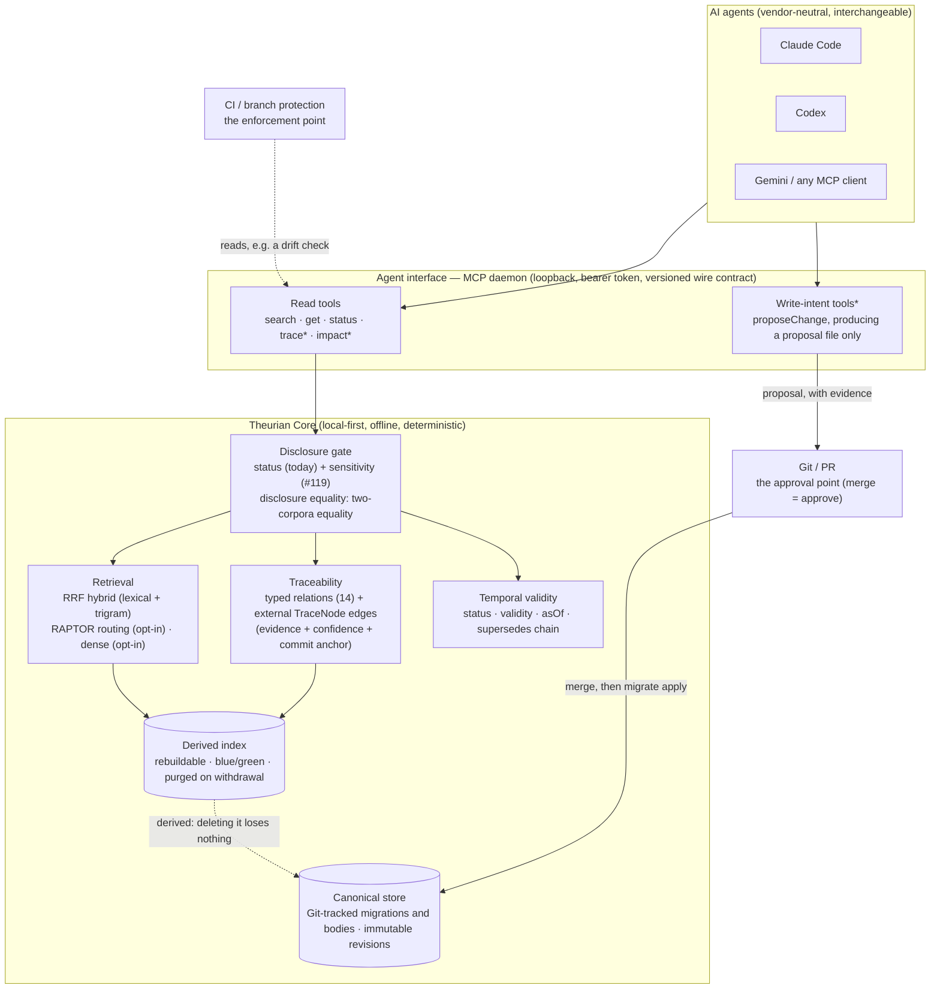
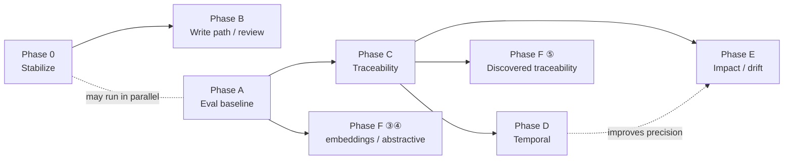

# Mid- and long-term roadmap

**Status: adopted 2026-08-20, with three amendments recorded at adoption**
(§6 principle 2, Phase F item ⑤, and the naming decision in §11).

**Every claim about the current codebase in this document was re-verified
against commit `f702736` on 2026-08-20.** Counts are written as dated
measurements against that commit rather than as standing facts, because a count
rots on the next merge. Where a number came from a measurement recorded
elsewhere in this repository, the source is named; nothing here is a fresh
benchmark.

**This document describes direction and design. It is not a description of
shipped capability.** `knowledge.trace` and `knowledge.impact` do not exist.
Neither does any write-intent MCP tool, review ingestion adapter, or evaluation
harness. What ships today is what
[`system.capabilities`](protocol/mcp-tools.md) reports, and that report is the
authority every sentence below was checked against:

| Flag | Value at `f702736` |
| :-- | :-- |
| `knowledgeSearch` | `"hybrid"` |
| `knowledgeGet` | `true` |
| `hybridRetrieval` | `true` |
| `raptor` | `true` |
| `reviewIngestion` | `false` |
| `traceability` | `false` |
| `writeTools` | `false` |

Measured: `packages/theurian-core/src/theurian/mcp/tools.py`, the
`system.capabilities` handler.

An eighth flag has joined them since that measurement, and is deliberately not
added to a table anchored to a commit: `sensitivityEnforcement: true`, from
[#119](https://github.com/theurian/theurian/issues/119). It reports that this
build enforces the disclosure axis, so an empty result may mean "withheld by the
deployment's declared ceiling" rather than "nothing matched" — and it reports
only that, never the ceiling itself.

A ninth joined on the same terms, and stays out of the same table:
`reviewFindings: true`, from
[#368](https://github.com/theurian/theurian/issues/368)
([ADR-0029](adr/0029-review-findings-are-governed-knowledge.md)). It reports that
`review.findings` is callable — an offline read of the `Review-Finding:` trailers
`theurian findings build` landed in that project's own store, served under the
untrusted-content safety triple. **It is not `reviewIngestion` moving.** That
flag, in the table above, is still `false`: nothing reaches GitHub, and no
review thread, inline comment or resolution state is read. The two are separate
on purpose, because the change that reaches GitHub is the one that owes SEC-10's
repository allowlist ([#429](https://github.com/theurian/theurian/issues/429)),
and an offline trailer read owes none.

## Contents

0. [Premise — the stated principles against the implementation](#0-premise)
1. [Current state assessment](#1-current-state-assessment)
2. [Product boundary](#2-product-boundary)
3. [Target architecture](#3-target-architecture)
4. [Knowledge model](#4-knowledge-model)
5. [Retrieval architecture](#5-retrieval-architecture)
6. [Standing design principles](#6-standing-design-principles)
7. [Roadmap: Phase 0 and Phases A–F](#7-roadmap)
8. [Prioritization](#8-prioritization)
9. [ADR candidates](#9-adr-candidates)
10. [Risks](#10-risks)
11. [Final recommendation](#11-final-recommendation)

[Appendix: documentation contradictions to clear in Phase 0](#appendix-documentation-contradictions-to-clear-in-phase-0)

---

## 0. Premise

The principles Theurian is commonly described by all exist in the repository.
Most are **half-implemented**: the label is published and the enforcement is not,
or the primitive exists and the query surface does not. The roadmap starts from
that gap rather than from the label.

**The State column below is the count.** It is deliberately not restated as a
number in this sentence: a total sitting beside a table anyone may edit is a
defect waiting for the next edit, and this document has already produced that
defect twice. Derived from the table rather than asserted: at `f702736` on
2026-08-20 it reads **seven `partial` against three `shipped`, over ten rows**.

| The principle, as usually stated | What the code actually holds | State |
| :-- | :-- | :-- |
| AI proposes; humans approve | More precisely: **AI proposes. Git reviews. Humans approve.** ([ADR-0013](adr/0013-ai-writes-produce-proposals.md)). There is no approval command and no approver field in Theurian — a search for `approver`, `approved_by` and `approvedBy` across `packages/theurian-core/src/` and `schemas/` returns nothing at `f702736`, and the approval record lives in Git metadata. But **the merge is the intended route, not an enforced one**: nothing in the code checks that a migration was ever merged (T-15's recorded residual — see §1). | partial |
| An agent cannot change approved knowledge directly | Stronger than usually stated. No write-intent MCP tool exists (`writeTools: false`), and a test walks the bytecode of every registered tool to hold that none reaches a canonical write (ADR-0013). | shipped |
| Git-native | Canonical state rebuilds from Git-tracked YAML migrations and body files into an empty database (FR-K4, [ADR-0004](adr/0004-sqlite-is-a-derived-artifact.md)). SQLite is always derived. But the CI job that would *prove* it — rebuild from empty and compare — does not exist; `rg empty-db-rebuild` returns four documents saying so and no workflow ([#64](https://github.com/theurian/theurian/issues/64)). Mechanism ships; the proof is owed. | partial |
| Evidence-backed knowledge | INV-8: every revision carries at least one `SourceAnchor` or the `authored-in-theurian` label, enforced in the dataclass constructor. Every search result carries provenance. | shipped |
| Local-first, reached over MCP | Loopback-only daemon (127.0.0.1:7419, bearer token), and an offline CI job proves "no API key needed" on every commit that touches Core, its schemas, tests, tools or the toolchain ([ADR-0009](adr/0009-no-llm-vendor-lock-in.md)). `core.yml` is path-filtered and `docs/**` is not among its paths, so a docs-only commit — this one included — does not run it. MCP is Streamable HTTP, and every tool it exposes is read-only. | shipped |
| Provenance | A revision carries `author`, `source_commit`, `source_anchors`; a proposal carries `evidence.json` (`agentId`, `model`, reasoning). But `evidence.json` is an input a human reads during review — Core does not read it — and the record of *who approved* exists only outside Theurian, in Git. | partial |
| Trust and validity | Validity windows (`validFrom`/`validTo`) and `asOf` search are implemented. **`trustLevel` is published on every result and filtered on by no query; `sensitivity` was in that sentence until [#119](https://github.com/theurian/theurian/issues/119) and is now an enforced read control.** The `chunks` table carries both columns; no retrieval query selects or filters on `trust_level`. What a caller sees is **published from canonical, not read off the index row**: `sensitivity` is threaded in as the *item's* current authority and `trustLevel` comes from `revision.metadata`, deliberately, because a `changeSensitivity` moves an item's classification without writing a new revision (`mcp/results.py`, SEC-14). `SqliteIndexStore._scope` now emits three predicates rather than two — `chunks.project_id = ?`, `chunks.status = ?` unless `include_unapproved`, and `chunks.sensitivity IN (…)` against the deployment's declared ceiling — and `_node_scope` emits the same three over `nodes`; a build writes no row above that ceiling, and a reclassification past it purges the published build (ADR-0025). Its docstring names `trust_level` and `namespace` as the columns "no query reads". "Theurian has a trust model" is a true sentence for one axis of three, which is what keeps this row *partial*: `trustLevel` is still a label, and tenant and ACL group are held by write-time refusal rather than by any predicate. | partial |
| Knowledge lifecycle | Six statuses exist (`draft`, `proposed`, `approved`, `deprecated`, `superseded`, `rejected`). **No transition graph is enforced anywhere** — a case-insensitive search for `transition` across `packages/theurian-core/src/` returns nothing, so a migration writing `rejected → approved` applies. Separately, `SURFACEABLE_STATUSES` is `{APPROVED, DRAFT, PROPOSED}`, so `rejected`, `superseded` and `deprecated` are unreachable under any flag. | partial |
| Reproducibility | `stateHash` and `snapshotId` are published on every response, but **passing a `snapshotId` back to re-query a past state is not implemented** (the second half of FR-R7). `knowledge.search` takes `projectId`, `query`, `limit`, `includeUnapproved`, `maxTokens`, `useDense`, `asOf` — and no snapshot parameter. | partial |
| Vendor neutrality | The wire surface (MCP tools, versioned schemas, `protocolVersion`) names no vendor and is neutral. **The install surface is Claude Code only**: `McpClientConfig` has exactly one adapter, `infrastructure/claude/mcp_config.py`. There is no Codex, Gemini, or generic `.mcp.json` adapter. | partial |

> **A correction worth carrying.** The vendor-coupling point is often stated as
> "setup can only write `~/.claude.json`". That is not what the adapter does:
> `infrastructure/claude/mcp_config.py` opens with "**Theurian reads
> `~/.claude.json`. It never writes it.**" — every write to the config itself is
> delegated to `claude mcp add` / `claude mcp remove`, so that the literal token
> never enters a config file (SEC-5) and Theurian never reformats Claude Code's
> live state. The coupling is real and it is the *adapter count*, not the file.

Four implementation facts that a first reading of the older planning material
tends to get wrong, all confirmed at `f702736`:

1. RAPTOR, embeddings, typed relations, the `traceability_edges` table, and
   `asOf` are **not prospective features**. They are in the schema and in the
   implementation today.
2. The relation vocabulary most often proposed for traceability has nine terms.
   Seven of them are already `RelationType` values (§4).
3. There is no standalone roadmap document before this one. The roadmap was the
   milestone table in the README.
4. **The milestone numbers are already unreliable.** ADR-0013 records
   `theurian propose` as "Landed in Milestone 7" while the README lists
   Milestone 7 as `planned`. This document uses phases for that reason.

---

## 1. Current state assessment

Where the project stands against the goal of being a foundation for
specification-driven development with AI. Legend: **shipped** — complete and
released; **partial** — the skeleton or the design exists, the capability does
not; **absent** — effectively nothing.

### Shipped

- **A governed knowledge lifecycle** — immutable revisions behind a mutable item
  pointer ([ADR-0006](adr/0006-immutable-revisions-and-optimistic-concurrency.md)),
  content addressing by SHA-256, six statuses, approved-only by default, and
  `rejected` unreachable under any flag as the place a rejection's reasoning can
  safely live.
- **"AI proposes" enforced structurally *on the MCP surface*** — no write tool
  exists there, and a bytecode-walk test over every registered tool holds that
  none reaches a canonical write. **The rest of the chain — proposal directory →
  PR → human merge → `migrate apply` — is intended, not enforced.** The threat
  model records the residual under T-15: *nothing enforces the merge*.
  `migrate apply` applies whatever is in `.theurian/migrations/`, committed or
  not; the human's review is a workflow convention rather than a check the code
  makes, and the actors table's untrusted same-UID process can run it directly.
- **Typed relations, 14 of them** — `implements` / `implemented_by`,
  `supersedes` / `superseded_by`, `depends_on`, `constrained_by`, `verified_by`,
  `reviewed_by`, `contradicts`, `related_to`, `derived_from`, `evidenced_by`,
  `rejects`, `exception_to`. Direction-dependent ones are mirrored
  automatically, and `knowledge.get` puts every edge through the disclosure gate
  individually. **Per-edge gating predates T-21 and was itself the leak path** —
  `_relation_is_visible` gated each endpoint through a read that *resolved
  aliases*, so an alias key equal to a withheld item's id evaluated the wrong
  item's authority. **T-21 was closed by two fixes, on both sides.** Read side:
  the non-resolving read — each endpoint is now read with `get_item_exact`, the
  row the id literally names, and the principle the split records is
  **reachability may resolve an alias; authority — a visibility decision on a
  referenced id — must read the literally-named row.** Write side: a whole-set
  refusal — `AliasItemCollisionError` rejects a migration set whose alias key
  also names a live, non-`deprecated` item id, so the collision cannot be
  authored in the first place. Reading only the first half would leave a reader
  thinking the class was closed read-side alone.
- **Temporal primitives** — validity windows, `asOf` search, `freshness`
  (`isWithinValidity`, `ageDays`), and the migration operation
  `deprecateItem`'s `supersededBy` field recording a
  `supersedes` edge automatically.
- **Hybrid retrieval** — FTS5 word index, a trigram index for CJK
  ([ADR-0023](adr/0023-trigram-index-beside-the-word-index.md)), RRF rank fusion
  ([ADR-0021](adr/0021-rank-fusion-over-score-normalisation.md)),
  diversification, a token budget, and a substring fallback when the index
  cannot answer.
- **Disclosure equality as a checkable safety property** — "an index holding
  withheld documents and an index that never held them return the same response
  to the same query", pinned by hypothesis tests (SEC-13, T-15, T-17). Purging
  the index on withdrawal is implemented (T-17a,
  [ADR-0024](adr/0024-a-purge-is-a-build.md)) **for the status axis only**, and
  the threat model records two residuals with it: a request already in flight at
  the pointer swap can still answer from the pre-purge build, and a purge that
  fails now taints the active-index pointer so the stale build is no longer served
  (GHSA-97q9-xxfg-33r6) — the failure is still reported (`indexPurge` with
  `published: false`, `failed: true`, and a remedy) rather than silent. The
  sensitivity axis is #119's work, and Phase 0 states its shape.
- **A RAPTOR forest** — implemented and opt-in (`raptor.enabled` defaults to
  `false` in `schemas/config/project-config.schema.json`). Summaries are
  **routing-only**: ADR-0008 decision 8 states that search may traverse a summary
  node and only leaf chunks are returned, so **a summary node is never a result
  row**. **What holds that is the visibility gate, not the test named after it**:
  a summary node has no (item, current-revision) pair for
  `CanonicalVisibility._may_surface` to clear, so it cannot reach a result row.
  Under a mutation that publishes node ids as item and revision ids,
  `test_a_summary_node_is_never_itself_a_result_row` still passed — two routing
  tests killed the mutation instead. The test-strength gap is tracked as
  [#269](https://github.com/theurian/theurian/issues/269); the property itself is
  not in doubt, only what enforces it.
  The default summarizer is extractive — every emitted sentence is a
  verbatim substring of its children — deterministic, and uses no LLM. A summary
  cannot span a scope boundary (`project`, `tenant`, `sensitivity`, `acl_group`,
  `namespace`, `status`) because a node whose children disagreed on any
  component would have no tree to belong to
  ([ADR-0008](adr/0008-raptor-forest.md)). The governance problem people expect
  AI-generated summaries to pose is solved here structurally rather than by
  policy.
- **The skeleton of reproducibility** — the state hash
  ([ADR-0007](adr/0007-state-hash-partitioned-databases.md),
  [ADR-0016](adr/0016-state-hash-covers-the-working-tree.md),
  [ADR-0017](adr/0017-sqlite-schema-versioning.md)), blue/green index files with
  a pointer swap ([ADR-0022](adr/0022-index-lives-in-its-own-database.md),
  ADR-0024), deterministic projection
  ([ADR-0020](adr/0020-deterministic-text-projection.md)).
- **A versioned wire contract** — `schemas/`, `protocolVersion`, tests that check
  schemas against real output, and a published compatibility policy.
- **A vendor-independent core** — ADR-0009 enforced in CI by an offline job and a
  ban on vendor names in `domain/` and `application/`.

### Partial

- **Traceability** — relations, a `traceability_edges` table, a `Specification`
  entity, and a notably complete design in
  [`docs/architecture/traceability.md`](architecture/traceability.md):
  non-foreign-key `TraceNode` references, per-edge evidence and confidence, drift
  conditions D1–D7, five edge sources. **What is missing is the collection path
  and the query surface** (`traceability: false`). The table is declared and
  unpopulated —
  `tests/integration/test_canonical_store_corruption.py` names
  `traceability_edges` in its `UNPOPULATED_TABLES` set, and the
  `system.capabilities` test states that
  `CanonicalStore.list_traceability_edges` "is declared on the port and called
  from nowhere in `src/`".
- **Temporal validity** — the primitives are there, but (a) status transitions
  are unenforced, (b) there is no access path to `superseded` or `deprecated`
  content, so a question about how something changed cannot be answered in
  principle, and (c) snapshot re-query is unimplemented.
- **Governed metadata** — `trustLevel` and `sensitivity` can be set at propose
  time ([#249](https://github.com/theurian/theurian/issues/249), shipped in
  `0.1.0.dev7`) and are published on every result. Nothing reads them (#119).
- **The agent write path** — the `theurian propose` CLI only. The write-intent
  MCP tools (`knowledge.proposeChange` and siblings) are designed in ADR-0013 and
  unimplemented.
- **Dense retrieval** — the port and an exact cosine scan exist. The default
  embedder is a hashed character n-gram vectoriser, and its own module says
  "**This is not a semantic model, and it does not pretend to be**". It is not
  weak; it is uninformative: the recorded measurement is that **91% of unrelated
  natural-language questions clear the similarity floor** (recorded in
  [`README.md`](https://github.com/theurian/theurian/blob/main/README.md),
  ADR-0009, ADR-0021 and `application/retrieval_service.py`). Off by default is
  the right call.
- **Review ingestion** — the domain model (`KnowledgeCandidate`,
  `domain/review.py`) is built; there is no collection adapter
  (`reviewIngestion: false`).
- **Multi-vendor integration** — neutral wire, Claude-only bootstrap (§0).

### Absent

- **Any evaluation baseline for retrieval quality.** There are no golden
  queries, no relevance judgements, and no measurement harness — `tools/` holds
  only the mutation-testing scripts, and a search for "golden quer", "relevance
  judg", "recall@", "ndcg" or "mrr" across the repository returns one file,
  ADR-0021, where the phrase appears in a *rejected* alternative. Every quality
  number this project has is a one-off record in prose. Ranking changes ship
  against no baseline.
- **Impact analysis.** One mention repository-wide, as an endpoint in a diagram.
  No design.
- **Drift detection.** The D1–D7 conditions are defined and nothing evaluates
  them. `propose --scope-path` (dev7) has only just started writing the data
  that a drift check would read.
- **History and evolution queries.** Superseded knowledge survives only in
  `git log`.
- **Security debt that gates widening the agent write path.** These are partly
  shipped rather than absent, and the difference matters when scoping Phase 0:

  | Requirement | What ships | What is owed |
  | :-- | :-- | :-- |
  | SEC-8 (resource bounds) | `MAX_YAML_BYTES` (4 MiB), the YAML loader's nesting-depth refusal, `read_source_file`'s `MAX_SOURCE_FILE_BYTES` cap, `MAX_BUDGET_TOKENS` (32,000) and `MAX_QUERY_CHARS` (2,000), `MAX_PROJECTION_CHARS` (2 MiB) | the wall-clock timeout and the archive expansion ratio ([#215](https://github.com/theurian/theurian/issues/215)), plus the discrete defects [#232](https://github.com/theurian/theurian/issues/232), [#245](https://github.com/theurian/theurian/issues/245) and [#26](https://github.com/theurian/theurian/issues/26) |
  | SEC-10 (SSRF) | external `$ref` targets are **recorded, never fetched** (`parsers/openapi.py`, cited to SEC-10 and T-7) | the scheme and private-network allowlists, and the repository allowlist nothing reads (owned by [#429](https://github.com/theurian/theurian/issues/429) against the first external fetch path; #129 closed on the wording, not the controls) |
  | SEC-11 (secret scanning) | the approval gate, over everything an acceptance lands: `theurian propose accept` scans every body it would land, the migration document's author-written field values (title, description, labels, scope paths, `contentType`, the date fields and — since [#349](https://github.com/theurian/theurian/issues/349) — the parsed `contentFile`), each operation's free text and chosen names, and every string of a source anchor ([#336](https://github.com/theurian/theurian/issues/336)); and, with them, the artifacts the acceptance writes — the migration file's raw bytes (a YAML comment and every field as written), the migration filename, and each landed body path ([#349](https://github.com/theurian/theurian/issues/349)) — `block` by default per `security.secretScan` (ADR-0027 decision 3), with an in-house best-effort detector whose finding locations are fixed literals that never reproduce the value | refusal *messages* elsewhere on the accept path still echo an author's filename, id or `contentFile` verbatim and the `accept --json` `bodyFiles` field prints landed paths full-length — general name hygiene, pre-existing and non-disclosing ([#360](https://github.com/theurian/theurian/issues/360)); a proposal's `evidence.json` travels into the pull request unscanned, because `accept` lands the rest of the proposal directory ([#361](https://github.com/theurian/theurian/issues/361)); `theurian index build` is SEC-11's second control since [#329](https://github.com/theurian/theurian/issues/329) — it scans every body it indexes, with the source anchors and relation notes served beside it, over every text channel of the approved, in-ceiling corpus this deployment serves by default on every rebuild, and reports rather than refusing because by then the content is already served; an unapproved body reachable through `includeUnapproved` and a superseded revision in the store are outside that population, recorded as residuals in the threat model and `SECURITY.md` — while `theurian ingest` runs no scan of its own and needs none, because it stores no content and draft-time advisory scanning remains owed ([#330](https://github.com/theurian/theurian/issues/330); #198 is closed, having shipped the `propose accept` half described in the left column) |
  | SEC-12 (MCP input schema validation) | nothing | the whole control |
  | SEC-16 (imperative text as data; a delimited untrusted region in summarization prompts) | the first half, by other means: SEC-15's safety triple rides every result, and the `SummarizationProvider` port docstring states the rule for summarizers | the delimited untrusted region itself. There is no summarization *prompt* to delimit — the default summarizer is extractive and calls no LLM — so this falls due with the first abstractive adapter (Phase F ④). No open issue tracks it |

  T-16 is graded **Critical** in [the threat model](security/threat-model.md) —
  "publication ships, install-time verification does not". The production half is
  real and substantial: a clean-environment install check before publish, a
  reproducible CycloneDX SBOM built from that verified install, `SHA256SUMS` over
  every artifact, PyPI Trusted Publishing with PEP 740 attestations, and
  tag-signature verification against a per-run trust root. **Every one of those
  acts on production; none acts on installation**, and that unmet half is what
  the Critical grade names. Tracked by
  [#80](https://github.com/theurian/theurian/issues/80). The threat model's
  summary row pointed at closed #39 until `efd30fe` repointed it; it now reads
  "install-time verification unmet ([#80]; #39 is closed, on its documentation
  half only)".
  **#80 carries `post-1.0`, so T-16's install-time residual is explicitly not a
  0.1.0-stable gate today** — which is precisely why Phase 0 asks for a recorded
  decision on it rather than for an implementation.
  **21 open issues carry `pre-1.0`, the label that gates 0.1.0 stable**
  (`gh issue list --label pre-1.0 --state open`, 21 measured 2026-08-20).

---

## 2. Product boundary

The design principle is **keep Theurian small**, and the boundary needs one test
rather than a list of preferences:

> Theurian owns *what humans approved, and the path to reach it*. It does not
> own *performing, sequencing, or enforcing an action*.

| Class | Contents | Why |
| :-- | :-- | :-- |
| **Must own** | Governed canonical knowledge (lifecycle, immutable revisions, provenance) · the disclosure gate and disclosure equality · retrieval over that corpus · typed relations and the read surface for trace and impact · the semantics of temporal validity · the proposal format and its validation · a vendor-neutral MCP surface and versioned wire contract · the evaluation of its own retrieval quality | This is the product's definition, and nothing else can hold it. Git holds *what is true*; it does not structure *which engineering judgement is currently in force*. |
| **Should own** | Write-intent MCP tools, up to producing a proposal · review → `KnowledgeCandidate` collection · impact reports as a bounded traversal over recorded edges · the machine-decidable subset of drift detection · a golden-query benchmark | Natural extensions of the above, already anticipated in existing ADRs and design documents. [GOVERNANCE.md](https://github.com/theurian/theurian/blob/main/GOVERNANCE.md) already commits review ingestion and traceability to Core permanently. |
| **May support** | A context-package export, explicitly labelled as derived · a real embedding adapter as an opt-in extra · install adapters for clients other than Claude Code · retrieval feedback signals | Valuable, and the product stands without them. Each is an additional implementation of a port that already exists (`EmbeddingProvider`, `McpClientConfig`). |
| **Should not own** | Agent orchestration, workflow state machines, task assignment · approval UI or approval by proxy (approval is the Git merge) · code and symbol search (delegated to Serena, stated in the issue template) · running CI, tests, or reviews · automatic promotion of AI output into knowledge · rule enforcement · a hosted multi-tenant service | Each either competes with a control point that already exists (Git branch protection, CI, the agent runtime) or contradicts "**Theurian labels; it does not enforce**" (README, T-3). |

### The boundary with agent orchestration

Against a workflow of the shape *human → requirement → spec agent → … → human
approval*, Theurian's responsibility is exactly three things:

1. **Read.** Any agent can pull the currently valid specifications, decisions,
   rejected approaches and constraints, with evidence attached.
2. **Receive proposals.** Any agent can produce a proposal (migration, body,
   evidence). Its status stops at `proposed`.
3. **Distribute what approval recorded.** A human's Git merge is the intended —
   not the enforced — route to `approved`, and then every agent sees the same
   truth. What is enforced is that no MCP tool writes; `migrate apply` will apply
   an uncommitted migration a same-UID process put in `.theurian/migrations/`
   (T-15's recorded residual, and Phase B's Security row carries it).

**Sequencing, assignment, and progress state do not live in Theurian.** Starting
an implementation agent once a spec is approved is the caller's job — a human, an
agent runtime, or CI. The states such a workflow needs are already expressible:
"awaiting spec approval" is an item at `status=proposed`, "this implementation
satisfies that spec" is an `implements` edge, "we rejected this" is an approved
item of `kind=rejected-approach`. *No workflow-specific schema is added.*

---

## 3. Target architecture

Six changes from the current architecture: ① write-intent tools join the MCP
surface, ② trace and impact read tools join it, ③ the disclosure gate gains a
sensitivity axis (#119, and see the shape below), ④ CI joins as a *reader*, with
enforcement staying on the CI side, ⑤ Phase B adds an `infrastructure/github/`
adapter for review ingestion, and ⑥ Phase D changes the semantics of
`SURFACEABLE_STATUSES` and adds an `includeSuperseded` opt-in. The diagram below
draws the first four, because those are the ones its existing nodes already
carry; ⑤ is an internal adapter with no node of its own, and ⑥ lands with Phase D
and is drawn there in prose rather than here. **⑥ does change the published
surface** — `includeSuperseded` is a new parameter on `knowledge.get` and
`knowledge.trace` — so it is named in the count, not filed under "internal".
Everything else — the canonical store, derived indexes, blue/green publication,
approval-as-merge — is unchanged.

③ is not a predicate-only change, and the diagram's single "sensitivity" line
understates it: see Phase 0's `#119` rows for the four-part shape.

\* = added by this roadmap (Phases B, C, E). The point of the diagram is that
approval and enforcement sit **outside** Core: Theurian is the surface of fact
that both of them share.

---

## 4. Knowledge model

### Approach: keep the model, add vocabulary and enforcement

The current model — `KnowledgeItem` (mutable pointer) + `KnowledgeRevision`
(immutable, content-addressed) + `KnowledgeKind` (a closed enum of 11) +
`KnowledgeRelation` edges typed by `RelationType` (a closed enum of 14) — already
carries most of the
expressiveness a traceability product needs. **No per-type schema is introduced**
(one schema for ADRs, another for specs, and so on). A type is expressed as
`kind` plus `structured` (an optional dict) plus relations, and the model stays
uniform. That serves migration compatibility and "keep it small" at the same
time.

### The commonly proposed relation vocabulary, mapped

| Proposed term | Existing `RelationType` | Verdict |
| :-- | :-- | :-- |
| implements | `implements` / `implemented_by` | exists |
| satisfies | expressible as `implements` — a spec also "implements" a requirement | no addition. Add via ADR if a case appears where the conflation actually misleads |
| derived-from | `derived_from` | exists |
| decided-by | expressible as `derived_from` pointing at an item of `kind=decision` | no addition |
| supersedes | `supersedes` / `superseded_by` (declared acyclic) | exists |
| depends-on | `depends_on` (declared acyclic) | exists |
| contradicts | `contradicts` | exists |
| verified-by | `verified_by` | exists |
| evidence-for | `evidenced_by` | exists |

Seven of the nine already exist, six of them verbatim — `evidence-for` maps onto
`evidenced_by` with the direction inverted. The conclusion is that **the
relation vocabulary is not an open "fixed graph schema or not" question**: the
answer — a closed enum extended by ADR — is already implemented, and this
roadmap keeps it. Free-string edge types are not introduced, because both search
and traversal depend on the type being closed.

### Four additions

1. **Two new `kind` values**: `requirement` and `specification`. This forces a
   decision about the existing separate `Specification` entity, which has its own
   table (`CREATE TABLE specifications`, `infrastructure/sqlite/schema.py`):
   fold it into the unified item, or keep it separate and connect it by
   relations. **ADR candidate #6** — decide before Phase C builds on top of
   either. The recommendation is the unified form: spec-as-knowledge goes in
   `kind`, and the machine-readable payload goes in `structured`.
2. **External nodes (code, PR, test, CI run) are `TraceNode`s.** Adopt
   [`traceability.md`](architecture/traceability.md)'s existing design unchanged:
   a non-foreign-key `(node_type, node_id)` reference, per-edge `evidence` (what
   asserts this edge) and `confidence` (1.0 for an explicit declaration, below
   1.0 for anything inferred), and `source_commit` pinning when it was measured.
   **The truth about a code entity is always Git's; Theurian holds only the
   edge, which is a claim.**
3. **Enforce INV-6 (acyclicity of `supersedes` and `depends_on`) at apply
   time.** `ACYCLIC_RELATIONS` is declared in `domain/enums.py` and exposed as
   `KnowledgeRelation.must_be_acyclic`, and at `f702736` that property has
   **no caller in `src/`** — its only reader is
   `tests/unit/test_domain_invariants.py`. Enforce it before Phases C and E
   build traversal on top of the graph.
4. **A thin approval-provenance pointer.** When `migrate apply` runs, record in
   `migration_history` the SHA of the merge commit the applied migration arrived
   through, where that is obtainable. Approval remains Git's; this is only a
   *pointer* to which merge was the approval. No approver field is added.

### Migration compatibility

- Relations are writable with the existing `addRelation` / `removeRelation`
  operations, so **no new operation is needed**. If `TraceNode` edges require one
  (an external node has no `itemId`), adding to the closed operation set is an
  `apiVersion` bump ([ADR-0005](adr/0005-yaml-knowledge-migrations.md)'s rule).
  Whether adding a `kind` or `RelationType` value is breaking or additive is
  **not stated anywhere in the current policy** — settle it in **ADR candidate
  #3**. Recommendation: specify the current behaviour (a migration containing a
  value an older Core cannot read is refused), treat the addition as minor, and
  make `compat check` detect it.
- On the SQLite side the discipline "schema version mismatch means rebuild, not
  migrate" is already established (ADR-0004, ADR-0017, ADR-0022), and table
  additions are absorbed by it. **In-place migration is still never built.**

---

## 5. Retrieval architecture

### Requirements by query class

| Query class | Example | Mechanism needed | Current state |
| :-- | :-- | :-- | :-- |
| Exact decision lookup | "Why don't we use optimistic locking?" | lexical + trigram + RRF | Should be sufficient — but unmeasured. Phase A confirms. |
| Rejected alternative | "What did we reject in March?" | as above, plus `kind=rejected-approach`. A rejected *approach* is recorded as approved knowledge; `status=rejected` is the graveyard of proposals that may contain secrets, and is a different thing | Mechanism sufficient; this is a corpus-discipline problem |
| Conceptual / broad | "What are our database design principles?" | RAPTOR routing as a path into cross-cutting document sets; a real embedding model later | RAPTOR implemented, effect unmeasured. One test asserts the mechanism — `test_a_summary_match_routes_to_sibling_leaves_a_leaf_search_misses` — and nothing quantifies what it buys. Whether it becomes default-on is decided by Phase A's measurement |
| Historical / evolution | "How has our consistency strategy evolved?" | traversal of the supersedes chain, plus semantics for historical disclosure | Impossible in principle today — nothing reaches `superseded`. Phase D |
| Traceability | "Why does this code exist?" | graph traversal, not search | Relations are visible through `get`; multi-hop traversal and external nodes are not. Phase C |
| Impact | "What breaks if SPEC-104 changes?" | bounded traversal plus an aggregated report | Absent. Phase E |
| Unknown / abstention | a question with no answer | refusing "withheld" and "absent" in the same words (implemented), plus measurement | Property is tested; accuracy is unmeasured. Include in Phase A's golden set |

### Query classification is not built — the tool split *is* the router

A query-classification layer inside Theurian is **not recommended**. Two
reasons: a deterministic classifier would be poor, and an LLM-backed one would
violate ADR-0009 (offline, deterministic, vendor-neutral); and the caller is
always an LLM agent, for whom **choosing the tool is the query classification**.
Routing is therefore achieved by publishing semantically distinct tools —
`knowledge.search`, `knowledge.get`, and later `knowledge.trace` and
`knowledge.impact` — each with a clear description. That is vendor-neutral,
deterministic, and costs almost no code.

### Where each retriever stands

- **RAPTOR — not the centrepiece. Keep the current design** (opt-in, extractive,
  routing-only). The instinct to avoid using a technique because it is
  sophisticated is already satisfied by the implementation: a summary is never a
  result row, derivation is deterministic, and a withdrawal purges it. The one
  open question is whether it actually buys recall, and Phase A answers that.
  **Abstractive summarisation (LLM-generated) stays frozen** until SEC-16 and an
  evaluation baseline both exist (Experimental).
- **Dense / semantic — the current hashed n-gram embedder is measured as
  uninformative**, so a real embedding adapter is considered only as an opt-in
  extra, poured into the existing `EmbeddingProvider` port with no change to
  retrieval itself. The default stays offline (ADR-0009). Adopt only if Phase A's
  harness shows an improvement on conceptual queries.
- **Reranker — held.** The port exists, but RRF is built on the premise that
  scores are incomparable and only ranks fuse (ADR-0021); a score-emitting
  reranker breaks that premise. Nothing starts here until evaluation shows a
  need.
- **Lexical + trigram — remains the workhorse.** The known defect — a short term
  dropping out of a mixed-length CJK query, `認証 トークン`, recorded in the
  README — gets measured in Phase A before it gets fixed.
- **Graph traversal — built as a read surface separate from retrieval** (Phases
  C and E). It does not fuse with ranking: trace and impact return *recorded
  edges*, not relevance.

---

## 6. Standing design principles

These are not phase deliverables. They constrain every phase, and a change that
violates one is wrong regardless of which phase it belongs to.

### 1. Theurian labels; it does not enforce

Already load-bearing today: every result carries `untrusted-knowledge`,
`mayContainInstructions` and `executable`, and acting on those labels is the
calling agent's responsibility (README, and the threat model's T-3 residual). It
is not a slogan: [CLAUDE.md](https://github.com/theurian/theurian/blob/main/CLAUDE.md)'s
review rubric anchors CRITICAL to *disclosure*, and cites T-3 being graded High
rather than Critical as the reason — so how a finding is graded in this project
depends on this line holding. Nothing in this roadmap moves enforcement into
Core.

### 2. Any impact-style answer declares the population it was computed over

**Adopted 2026-08-20 as a standing principle, not deferred to Phase E's
implementation.**

Any `knowledge.impact`-style answer this project ever ships must state, as part
of the answer:

- **the commit it was measured against**,
- **the number of recorded edges the traversal actually walked**, and
- **that coverage is not guaranteed.**

The rationale is that false traceability is this roadmap's own largest product
risk (§10). An assertive report computed over an incomplete graph does not merely
mislead — it induces agent error *with citations attached*, which is harder to
detect and harder to recover from than an obviously unsourced answer. A report
that cannot state its own population is not permitted to imply completeness.

This is recorded here so that it constrains the design of Phase C's traversal —
whose response shape Phase E's report is computed from — rather than being
discovered when Phase E writes its schema. **Phase E turns it into an ADR (ADR
candidate #7) and a schema-required field.**

### 3. A disclosure change is ADR-first

`may_surface` has **six call sites, pinned by
`tests/unit/test_gate_call_sites.py`**, and `domain/enums.py`'s module docstring
says so. Four security advisories have been published against this project, and
all four are disclosure defects (GHSA-266v-fcj2-qggx, GHSA-7997-g35f-q59h,
GHSA-vx8x-rjfj-9x54, GHSA-w5cm-cqf9-vm7r; the threat model records each). Any
change that relaxes what may surface — most directly Phase D's history access —
is written as an ADR and passed through security review *before* implementation,
not after.

### 4. A claim about a measured property ships with the measurement or not at all

This document's own header follows it. Numbers quoted here are attributed to
where they were recorded; nothing here is a fresh benchmark. The same applies to
every phase: a phase that asserts an improvement without a measurement has not
finished.

---

## 7. Roadmap

Phases rather than milestone numbers, because the milestone numbers already
disagree with reality (§0); Phase 0 includes making the README's table true.
**Each phase ships independently, and only dependencies constrain the order.**
Anything independent may run in parallel.

### Phase 0 — Stabilize: 0.1.0 stable, and making the record true

| | |
| :-- | :-- |
| **Goal** | Take the `pre-1.0` label to zero, ship 0.1.0 stable, and make every statement in the repository agree with the implementation. |
| **User value** | The first release that can promise an upgrade path. Every later phase's credibility rests on it. |
| **Architecture** | #119 (enforcement of the sensitivity, tenant and ACL axes — four-part shape below), a decision on T-16 (implement install-time verification or record it as a non-goal), and [#67](https://github.com/theurian/theurian/issues/67) (required status checks). |
| **#119 is mandatory before 0.1.0 stable** | Recorded as a decision on 2026-08-20 in [a comment on the issue itself](https://github.com/theurian/theurian/issues/119#issuecomment-5350556157). It was previously a recorded deferral; it is now a release gate. The reasoning: `sensitivity` and `trustLevel` are published on every retrieval result and filtered on by no query, which by this project's own severity rubric is the shape of a published claim that misleads a security decision. It must be closed before Phase B lets more agents write. |
| **#119 is not a predicate change** | A read-side predicate alone ships two defects, both verified in source and [recorded on the issue](https://github.com/theurian/theurian/issues/119#issuecomment-5351154317). **(1) The index side is half the control**: `IndexBuilder._build` gates on status only and writes `sensitivity` into every chunk row (`index_builder.py:146,209`), so a query-time predicate leaves withheld-by-sensitivity chunk text in the FTS5 tables, where BM25 collection statistics still price the visible rows — T-17a's mechanism moved from the status axis to the sensitivity axis. **(2) `changeSensitivity` must become a purge trigger**: `migration_engine.py:658-669` deliberately excludes it from the withdrawal-purge set, on the recorded ground that the stale `sensitivity` column "is read by no gate before #119". The moment a gate reads it, that exclusion inverts into a defect — a document reclassified `internal → restricted` keeps clearing the gate under its stale label until the next manual `index build`, and there is no canonical re-check for sensitivity of the kind `CanonicalVisibility._may_surface` performs for status. So the shape is **at least four-part**: build-time gating and derivation · a `changeSensitivity`-triggered purge extending ADR-0024 decision 5 · the read-side predicate · the two-corpora equality suite parametrized over the sensitivity axis. |
| **Schema** | No canonical change, and no new index columns — they already exist. But not index-side only: part 2 is an **application-layer** change, adding `changeSensitivity` to the migration engine's withdrawal set. |
| **MCP / API** | `system.capabilities` note updated. **The response shape is not the only observable** — withholding moves counts, budgets, rankings and collection statistics unless the equality property is held by construction, which is exactly what T-17 falsified about "more rows are withheld, that is all". |
| **Migration** | No canonical migration. What changes is what a `changeSensitivity` *triggers*: under ADR-0024 a purge copies the published build and deletes the withheld rows from the copy, so this is a copy-and-delete build rather than a full re-derive. |
| **Security** | SEC-8 resource bounds ([#215](https://github.com/theurian/theurian/issues/215), [#232](https://github.com/theurian/theurian/issues/232), [#245](https://github.com/theurian/theurian/issues/245), [#26](https://github.com/theurian/theurian/issues/26)), T-16, and the audit of every threat-model Controls line against `src` ([#199](https://github.com/theurian/theurian/issues/199)). |
| **Tests** | #119 extends the existing two-corpora equality tests by parameterising them over the sensitivity axis — over all four parts above, not the predicate alone. |
| **Benchmark** | None — Phase A owns that. |
| **Exit criteria** | 0.1.0 live on PyPI · `pre-1.0` open = 0 · every appendix contradiction cleared · SECURITY.md and README naming the current release · **the T-16 decision recorded — implement install-time verification, or record it as a non-goal with the reasoning**. Without this the Architecture row asks for a decision that nothing checks was ever taken. |
| **Dependencies** | None. Can start immediately. |
| **Risks** | Some of the 21 need a design decision (T-16, #119's defaults) rather than execution. Estimating the label as a queue of chores is how it overruns; apply the class-budget discipline from [CLAUDE.md](https://github.com/theurian/theurian/blob/main/CLAUDE.md). |
| **Open design question** | ~~Whether withheld-by-sensitivity rows are excluded from the index entirely or indexed-and-gated, and what entitlement decides "withheld" at all in a single-user loopback daemon~~ — **both settled and both recorded as amendments to [ADR-0025](adr/0025-sensitivity-is-enforced-before-0-1-0-stable.md), which is where the reasoning lives.** Exclusion at build time, with one build flavor per deployment; entitlement is a deployment serving profile, one operator-declared ceiling in the operator-owned data directory. This roadmap did not decide them and does not restate them. |
| **#119 closed (2026-08-24)** | **The three rows above are the analysis that opened it and are kept as the record of what was believed on 2026-08-20; two of their present-tense source claims are now false and are corrected here rather than edited there.** `IndexBuilder._build` no longer "gates on status only" — it consults `may_disclose` beside `may_surface` and writes no row above the deployment's ceiling. `migration_engine` no longer "deliberately excludes" `changeSensitivity` from the withdrawal-purge set — it admits it, and `revisions_to_purge` reduces the set against the build's recorded `indexedSensitivities` as a second flavor axis. The four-part shape those rows predicted is what shipped, and all four are discharged in ADR-0025's compliance section. `sensitivity` is no longer in the "filtered on by no query" sentence; `trustLevel` still is. What the **Risks** row calls "#119's defaults" was decided: a restrictive default, ceiling `internal`. |

### Phase A — Retrieval evaluation baseline (golden queries)

| | |
| :-- | :-- |
| **Goal** | Build a harness that measures retrieval quality reproducibly, and make it the regression baseline for every later retrieval and graph change. |
| **User value** | The first time "what did this ranking change improve, and what did it break?" has a numeric answer. Whether RAPTOR goes default-on, whether the mixed-length CJK defect is worth fixing, and whether a real embedding model is adopted are all decided here. |
| **Architecture** | A development tool, not a runtime feature: `tools/eval/` plus a pytest marker. A frozen fixture corpus (a snapshot of this project's own ADR corpus, synthetic withheld rows, a synthetic superseded chain, CJK documents) with committed golden queries and judgements. Fully offline and deterministic. |
| **Schema** | None. |
| **MCP / API** | None — evaluation runs against real MCP responses, the same discipline the wire-contract tests use. |
| **Migration** | None. |
| **Security** | Withheld rows in the fixture are synthetic only; no real secret goes into a fixture. The abstention class doubles as a disclosure-equality regression. |
| **Tests** | Determinism of the harness itself: the same corpus and the same queries produce a byte-identical report. |
| **What the harness will measure** | *Query classes:* exact decision · rejected alternative · cross-ADR · broad architectural · historical (enabled after Phase D) · spec → ADR → implementation (after Phase C) · code → decision (after Phase C) · impact (after Phase E) · conflicting · superseded · **unknown, where no answer exists**. *Metrics:* Recall@k · MRR · evidence precision (are the anchors right) · superseded-knowledge error rate · abstention accuracy · latency and index cost. **These are the quantities the harness will produce. They are not current properties and no target value is set here** — the first run defines the baseline, and the baseline is recorded as a dated measurement pinned to a commit SHA. |
| **Exit criteria** | A baseline report is committed and CI reports regressions against it. Whether it becomes a blocking gate is decided after #67. The RAPTOR, CJK and dense decisions each have a measurement behind them. |
| **Dependencies** | None. Runs in parallel with Phase 0. |
| **Risks** | ADR-0021 rejects learning to rank on the grounds that it "needs labelled relevance judgements this project has no way to collect, and would make ranking un-reproducible across installs", which looks like a collision. Design it so it is not one: judgements are **committed to the repository and thereby fixed**, are never used to train ranking, and serve only regression detection and design decisions. LTR stays a non-goal. Record the reconciliation as ADR candidate #5. |

### Phase B — Agent write path and review ingestion

| | |
| :-- | :-- |
| **Goal** | Let an agent from any vendor create a proposal over MCP, and collect `KnowledgeCandidate`s from GitHub reviews. Promote the "proposes" in "AI proposes" from a CLI to a protocol. |
| **User value** | The spec-agent / code-agent / review-agent → proposal → human-approval shape works for agents other than Claude Code. A shared write path across agents opens for the first time. |
| **Architecture** | The write-intent tools ADR-0013 already specifies (`knowledge.proposeChange`, `knowledge.generateMigrationDraft`, `review.generateKnowledgeCandidate`). Every one of them outputs a proposal file and nothing else — and each is added to the existing bytecode-walk test that holds no registered tool reachable to a canonical write. Review ingestion is an `infrastructure/github/` adapter plus normalisation, designed in [`review-knowledge.md`](architecture/review-knowledge.md). |
| **Schema** | The proposal format is unchanged. `KnowledgeCandidate` uses the domain model that already exists. |
| **MCP / API** | New tools plus their wire schemas (additive; a protocol bump is not expected). `writeTools: true`, and the `system.capabilities` note updated with it. |
| **Migration** | None. |
| **Security** | **The preconditions are already recorded in the threat model.** SEC-10's repository and URL allowlists are owed ([#429](https://github.com/theurian/theurian/issues/429); #129 closed on the wording, not the controls). SEC-11 (secret scanning) ships at the approval gate — `theurian propose accept` scans every body it would land **and the migration document's author-written fields with it** ([#336](https://github.com/theurian/theurian/issues/336)), `block` by default per `security.secretScan` (ADR-0027 decision 3) — so the title and the published source anchors (provider, sourceUri, repository, commitSha, filePath), which appear verbatim on every result, are covered at the gate; index-time scanning shipped under [#329](https://github.com/theurian/theurian/issues/329) and `theurian ingest` runs no scan of its own — #198 is closed, having shipped the `propose accept` half above — while a proposal's `evidence.json` is still owed under [#330](https://github.com/theurian/theurian/issues/330); the surfaces that describe what is and is not in force are regression-pinned by `test_config_key_call_sites.py` and `test_examples.py`. SEC-12 (JSON Schema validation of MCP input) becomes mandatory the moment a write-intent tool opens. **T-15's "nothing enforces the merge" residual is a Phase B precondition, not a background fact**: opening a protocol-level write path multiplies the callers who can put a file in `.theurian/migrations/`, and `migrate apply` does not ask whether it was committed. `evidence.json`'s `agentId` and `model` become the only record of origin in a multi-agent setting, so their being required is preserved. |
| **Tests** | The e2e ADR-0013 explicitly records as owed — after an agent session that calls every write-intent tool, approved state is unchanged — is discharged here. |
| **Benchmark** | No retrieval impact. Candidate quality is judged by the human reviewing; automatic quality scoring is a non-goal. |
| **Exit criteria** | A demonstration of propose → PR → merge → apply from both Claude Code and Codex (or any plain MCP client). `reviewIngestion: true`. |
| **Dependencies** | Phase 0 — #119 and SEC-12 first. The ordering is about *writers* increasing, not gates. |
| **Risks** | A new prompt-injection surface: review text is untrusted content, and turning it into a candidate is precisely the path by which an injected instruction becomes a knowledge candidate. The existing safety triple and never-auto-approve (FR-V4) absorb it, but the threat model's T-3 section needs the candidate path added. |

### Phase C — Traceability foundation

| | |
| :-- | :-- |
| **Goal** | Collect and query the graph exactly as [`traceability.md`](architecture/traceability.md) already designs it. Answer *why is this code here?* with citations. |
| **User value** | An agent can follow a chain of evidence — code → PR → spec → ADR → requirement — rather than a list of related documents. |
| **Architecture** | Three edge sources to start: ① migration declarations (`addRelation`, existing), ② commit trailers (`Refs: ADR-0021`) collected by `ingest`, ③ `scope.paths`, the data dev7 began writing. External nodes are `TraceNode` plus evidence, confidence and `source_commit`. Traversal is read-only with depth and node-count limits. |
| **Schema** | Promote the existing, unpopulated `traceability_edges` table to real use. Add apply-time enforcement of INV-6. |
| **MCP / API** | One new read tool, `knowledge.trace`: a bounded traversal from an item id or a `TraceNode`, with direction, edge type and depth. `traceability: true`. **The nine tools `traceability.md` anticipates are not built** — start with `trace` alone (plus Phase E's `impact`) and add only what use demonstrates. |
| **Migration** | If external-node edges need a migration operation, adding to the closed set is an `apiVersion` decision (ADR candidate #3). |
| **Security** | **A graph response is a new disclosure family.** Edge counts, reachability, and where a traversal truncates can each carry the existence of a withheld node. Apply the per-edge visibility gate at every hop — and apply it in T-21's corrected form, because per-edge gating on its own is what leaked: **a traversal hop must not resolve an alias when deciding authority.** Reachability may resolve; the visibility decision on each hop's endpoint reads the literally-named row (`get_item_exact`). Multi-hop traversal multiplies the number of places that distinction can be lost, which is why it is stated here as a requirement rather than left to the implementer. **Write the two-corpora equality test for trace responses in the same change as the implementation** — not afterwards. That is T-17's lesson. |
| **Tests** | Equality extension · depth limits · cycle tolerance · confidence and evidence passed through faithfully · **a test pinning that every hop's visibility decision goes through the non-resolving read path**, so a hop that reverts to a resolving read turns it red rather than reopening T-21 in graph form. |
| **Benchmark** | Enable the golden set's spec → ADR → implementation and code → decision classes. Add citation correctness as a metric the harness measures. |
| **Exit criteria** | A demonstration on this project's own corpus that "why is this module shaped this way" traces to an ADR. Equality tests green. |
| **Dependencies** | Phase A, for the measuring stick. Independent of Phase B — they may run in parallel. |
| **Risks** | Misleading a reader about how complete the edge collection is (§10, false traceability). Mitigation: the response says *recorded edges* in its schema field names and descriptions, and claims no coverage. §6 principle 2 governs the shape. |

### Phase D — Temporal engineering truth

| | |
| :-- | :-- |
| **Goal** | Guarantee "what is currently in force" by enforcement, and make "how did it change" answerable for the first time. |
| **User value** | On top of an agent not mistaking a superseded ADR for current guidance — which already holds today, since superseded content is never returned — *history becomes answerable when asked for*. |
| **Architecture** | ① Apply-time enforcement of the status transition graph (today any transition applies). ② **Separate the semantics of historical disclosure**: `rejected` may contain secrets and stays permanently non-surfaceable, exactly as now, while `superseded` and `deprecated` are *history* and become readable through an explicit opt-in, labelled. The current implementation collapses both into the same unreachability, which is what makes historical queries impossible in principle. ③ FR-R7's second half: re-query a past state by `snapshotId`. |
| **Schema** | The transition graph is a domain constant checked by the migration engine. The disclosure change is a change to the semantics of `SURFACEABLE_STATUSES` and `may_surface`. |
| **MCP / API** | `includeSuperseded` on `knowledge.get` and `knowledge.trace`: explicit opt-in, reachable only along a supersedes chain, every result labelled. **Not added to `search`** — history is traversed, not searched. |
| **Migration** | None; semantics only. |
| **Security** | **This is the phase's core risk.** §6 principle 3 applies in full: item ② is written as an ADR (candidate #2) and passed through security review before implementation, and the change is write-side as well as read-side — two of `may_surface`'s six call sites are writers (the index builder, which decides what is written, and the withdrawal purge, which decides what a published index must stop holding), so a semantics change moves what gets indexed and what gets purged, not just what a query returns. **Design on the assumption that superseded bodies contain secrets.** That is not a worst case but the recorded procedure: the threat model's T-15 names superseding the revision or retiring the item as *the* operation for removing a secret that got in, so superseded revisions are where removed secrets collect by design — and T-17 records that performing exactly that remediation is what re-opened a channel to read the secret back. Supersede-time disclosability metadata is therefore **mandatory in this phase, not a contingency**. |
| **Tests** | RED tests for transition enforcement · an equality test that history is reachable only through the opt-in and never leaks into `search` · determinism of snapshot re-query. |
| **Benchmark** | Enable the golden set's historical and superseded classes. The superseded-knowledge error rate becomes meaningful here. |
| **Exit criteria** | An evolution-shaped query is answerable from the supersedes chain with dates. An illegal transition is refused with an exit code. |
| **Dependencies** | Phase C (chain traversal sits on `trace`). ADR candidates #1 and #2 accepted. |
| **Risks** | A mistake on a disclosure surface is CRITICAL by this project's own definition. ADR-first and equality-test-first absorb it. Transition enforcement breaks `apply` if the existing corpus holds an illegal state — verify against the dogfood corpus beforehand. |

### Phase E — Impact analysis and drift detection

| | |
| :-- | :-- |
| **Goal** | Answer *what happens if SPEC-104 changes?* **within the range of recorded edges**, and detect divergence between the graph and reality by machine. |
| **User value** | Before starting a specification change, a list of ADRs to reconsider, implementations to touch, and tests to run, each with a citation. |
| **Architecture** | `knowledge.impact` is a report layer that aggregates Phase C's traversal by node type. **It performs no semantic inference** — graph traversal only. The output is a set of counts by node type, each item's confidence, and **the population declaration §6 principle 2 requires**. Drift is the machine-decidable subset of D1–D7 (`scope.paths` against changed files, superseded dependencies, dangling `TraceNode`s), implemented as a CLI command CI can call. **No policy engine is built** — `traceability.md` itself warns that "a policy that blocks *unrelated* work gets disabled entirely, which is strictly worse than a partial one", so whether to block is CI's configuration to make. |
| **Schema** | None; it sits on Phase C. |
| **MCP / API** | `knowledge.impact` (read-only). Drift is a `drift` CLI subcommand — Phase E work, and not a registered command today. |
| **Migration** | None. |
| **Security** | The same disclosure family as trace — an aggregate count must not carry a withheld row, so the equality tests extend to impact responses. On resources, the traversal bound is documented as a SEC-8-class limit. |
| **Tests** | Equality · limits · "an item with zero edges returns an empty report *plus* its population declaration". |
| **Benchmark** | Add impact precision and recall to the golden set, with a ground-truth impact set built by hand once over the dogfood corpus. |
| **Exit criteria** | A demonstration on the dogfood corpus: a spec change producing an impact report. Drift detection finds at least one real drift in this repository — the appendix below is full of candidates. |
| **Dependencies** | Phase C (required). Phase D (improves precision; not required). |
| **Risks** | §10's false impact confidence is the largest. Making the population declaration a schema-required field is what turns "claims no completeness" from an intention into a structure. |

### Phase F — Ecosystem (opportunistic, in any order)

| | |
| :-- | :-- |
| **Goal / contents** | ① **A second client install adapter** (a generic `.mcp.json`, or Codex CLI configuration) — the second implementation of `McpClientConfig`. Small, and the shortest route from asserting vendor neutrality to demonstrating it. ② **Context package export** — a context-package export command, not registered today: write a summary of approved knowledge to a static file of the AGENTS.md kind. Treated as an **Index-class derivative** — stamped with a generated-artifact label and the `stateHash` at generation, and never promoted to approved knowledge (ADR candidate #8). ③ **A real embedding adapter** (opt-in extra, only if Phase A justifies it). ④ **Abstractive RAPTOR** (only after SEC-16, and only if evaluation justifies it). ⑤ **Discovered traceability — experimental research, see below.** |
| **Security** | ① widens the config-writing surface (extends T-14's scope). ② carries the risk of a derivative being misread as truth, absorbed by the label and the `stateHash`. ④ is T-3 and SEC-16's main battleground. ⑤ is bounded by the fact that a discovered edge is never applied without human approval. |
| **Exit criteria** | Independent per item. ① is an e2e from Codex. ② is determinism across generate and regenerate. |
| **Dependencies** | ② none. ③ and ④ need Phase A. ⑤ needs Phase C. |

#### Phase F ⑤ — Discovered traceability (experimental)

**Adopted 2026-08-20 as an extension slot, not a commitment.**

External tools that already understand code — an LSP or Serena, Git, an OpenAPI
document, a test framework — can discover relations that a human never declared:
that this function implements that specification, that this test verifies that
requirement. The proposal is that such a tool may submit what it found as an
**evidence-backed proposal**, which goes to human review, and only a human's
approval turns it into a traceability edge.

That is exactly [ADR-0013](adr/0013-ai-writes-produce-proposals.md)'s principle,
applied to a discovered edge: **AI proposes. Git reviews. Humans approve.** A
discovered edge enters as a proposal like any other, carries its evidence and a
confidence below 1.0, and becomes an edge only through a merge.

**Theurian itself never performs code analysis.** Code and symbol search are
delegated to Serena, and this item does not reverse that: the analysis happens in
the external tool and Theurian receives only the claim. The scope of this item is
therefore the *submission surface* — what an external discovery tool has to
provide for its claim to be reviewable — and nothing else.

It is recorded here as an extension slot so that Phase C's edge model is designed
with room for it, and so that a future proposal to add it has a starting point.
It is not scheduled, and nothing depends on it.

### Dependency summary

---

## 8. Prioritization

| Priority | Item | Reason, in one line |
| :-- | :-- | :-- |
| **P0** | Phase 0 — the 21 `pre-1.0` issues, #119 sensitivity enforcement, making the record true, the T-16 decision | Everything else assumes it. #119 in particular is a precondition for going multi-agent |
| **P0** | Phase A — golden query set and evaluation harness | Without it every retrieval decision stays a guess |
| **P0** | Phase B's write-intent MCP tools, plus SEC-10, SEC-11, SEC-12 | The conditions under which "proposes" becomes vendor-interchangeable |
| **P1** | Phase B's review ingestion · Phase C (`trace`) · INV-6 enforcement · the second client adapter (F ①) | The core of the differentiation. F ① is small and turns an assertion into a demonstration |
| **P1** | Phase D's status transition enforcement, and drafting ADR candidates #1 and #2 | The hole in the lifecycle. The disclosure change is ADR-first |
| **P2** | Phase E (impact, drift) · Phase D's history disclosure and FR-R7's second half · context package (F ②) | The harvest that sits on top of C and D |
| **Experimental** | A real embedding adapter (F ③) · abstractive RAPTOR (F ④) · discovered traceability (F ⑤) · a reranker · `submitFeedback` | Each only if evaluation, or a demonstrated need, justifies it |
| **Not recommended** | Agent orchestration and workflow state machines · a query classifier inside Theurian · ANN or a vector database by default · a graph database (SQLite is sufficient at this scale) · a policy enforcement engine · code and symbol indexing · automating or proxying approval · becoming a "control plane" (§11) | Outside the boundary, or in conflict with an existing ADR or the threat model |

---

## 9. ADR candidates

1. **Enforcing the status transition graph** — define the legal transitions and
   check them in the migration engine (Phase D).
2. **Historical disclosure of `superseded` and `deprecated`** — separating their
   semantics from `rejected` (permanently non-surfaceable), the opt-in path, and
   non-exposure through `search`. Changes `SURFACEABLE_STATUSES`, so the ADR
   comes first without exception (Phase D).
3. **The compatibility policy for extending a closed enum** (`kind`,
   `RelationType`, migration operations) — what is additive and what is an
   `apiVersion` or `protocolVersion` bump (before Phase C).
4. **Formalising the traceability representation** — promoting
   `traceability.md`'s `TraceNode` + evidence + confidence + commit anchor design
   into an ADR (Phase C).
5. **Governance of golden-query evaluation** — the standing of committed
   judgements, and the reconciliation with ADR-0021's rejection of labelled
   relevance judgements (regression detection only; LTR permanently a non-goal)
   (Phase A).
6. **Whether the `Specification` entity folds into a knowledge `kind`** — which
   of the two the traceability work builds on (before Phase C).
7. **The semantics of impact analysis** — recorded-edges-only, the population
   declaration as a required field (§6 principle 2), and extending disclosure
   equality to graph responses (Phase E).
8. **Governance of a derived context package** — the proposal is that a
   generated artifact needs no new classification and is fixed as *Index-class*:
   losable without loss, and asserting no truth (Phase F ②).
9. **The default policy for a real embedding adapter** — as an amendment to
   ADR-0009 and ADR-0021 (Phase F ③).
10. **The approval-provenance pointer** — recording the merge commit at
    `migrate apply` (small; runs alongside Phase B).

**Existing ADRs needing reconciliation rather than replacement**, both folded
into Phase 0's truth-making:

- **ADR-0003's "the port set is exactly these fourteen" is already broken, and
  the closed-set test does not see the whole break.** Measured at `f702736` on
  2026-08-20: **17 `Protocol` classes are declared under
  `packages/theurian-core/src/theurian/domain/ports/`, while `ALL_PORTS` names
  15.** The two outside it are `CanonicalReadSession` — a read session
  `CanonicalStore` returns rather than a separately wired port — and
  **`McpClientConfig`, whose own module docstring calls itself a port
  ("McpClientConfig port … ADR-0012, §24.2")**. It is not in `ALL_PORTS` and
  `ports/__init__.py` does not import it, so `test_port_set_is_closed`, which
  compares names drawn from `ALL_PORTS`, cannot see it at all. So the ADR-less
  port additions past ADR-0003's fourteen are **at least two**: `IndexStore`,
  which at least reached `ALL_PORTS` and the closure test, and `McpClientConfig`,
  which reached neither. ADR-0003 point 5 says adding a port requires an ADR, and
  none was written for either. An amendment is owed, and it should say which
  register — `ALL_PORTS`, or "a `Protocol` under `domain/ports/`" — the closed
  set is actually closed over.
- **GOVERNANCE.md says an accepted ADR is never edited, only superseded; the
  practice is to append amendments.** All 26 ADRs are `accepted`, none is
  `superseded`, and 10 of them carry at least one `Amended in Milestone N` block
  (measured 2026-08-20; 24 at `f702736`, and 26 once ADR-0025 and ADR-0026 land
  — neither of the two new ones carries an amendment, so the 10 is unmoved).
  One of the two has to become the rule.

---

## 10. Risks

| Risk | Assessment | Mitigation |
| :-- | :-- | :-- |
| Complexity explosion | **Real, and the largest.** `traceability.md` already imagines nine tools | Phases, and starting from two tools (`trace`, `impact`). Keep the "not recommended" table as the *record of what was deliberately not built* |
| The graph becomes the source of truth | Medium. Edges themselves arrive through migrations and are governed, but an external-node edge is only a claim | Extend [ADR-0010](adr/0010-three-layer-knowledge-model.md)'s authority rule: *the edge is canonical; the truth about the external entity it points at is always Git's*. Surface confidence below 1.0 |
| Stale relationships | **Certain to happen** — code moves and the edge stays | Mandatory commit anchor, plus drift detection (Phase E), plus a staleness report of the same shape as `indexStale`. No magical automatic decay |
| Contamination by AI-generated knowledge | Low to medium. The structural defences are already strong: a candidate is never auto-approved, and a summary is routing-only | Phase B adds the candidate path to threat-model T-3. The context package is fixed as Index-class (ADR candidate #8) |
| Vendor coupling | Low on the wire, medium on bootstrap. Plus an external risk: **the MCP specification itself changing** | F ① early, for a second implementation. The SDK is already confined to `mcp/` and `daemon/` ([ADR-0014](adr/0014-dependency-pinning-and-pre-1-0-isolation.md)) and the wire contract versions the protocol |
| Indexing cost | Low. The graph tables are small, RAPTOR is opt-in, and purge cost is measured: **51 ms against 2,614 ms on a 12.3 MB index and 579 ms against 37,684 ms on a 150.3 MB one**, recorded in ADR-0024's table and quoted in ADR-0022 | Phase A includes index cost and update cost among the quantities the harness measures |
| Migration complexity | Low. "Schema mismatch means rebuild; no in-place migration" is already working | Keep the discipline. Every canonical addition is additive |
| **False traceability / false impact confidence** | **The product's largest risk.** An assertive report over an incomplete graph induces agent error *with citations attached* | §6 principle 2, as a schema-required field · confidence required · no wording that asserts completeness · impact precision and recall in the benchmark |
| **A graph response as a new disclosure family** | High. Edge counts, reachability and truncation each carry withheld existence — T-17's shape, in graph form | Extend two-corpora equality to trace and impact **in the same change as the implementation** (an exit criterion of Phases C and E) |
| **Execution bandwidth** | High. 21 `pre-1.0` issues and six phases under a single maintainer, in a project where a warm-up slice has already consumed four review rounds | Apply CLAUDE.md's class-budget rule at phase granularity too: three sibling findings, two follow-up PRs, or eight hours splits the box |

---

## 11. Final recommendation

### "From knowledge retrieval tool to engineering truth" — sound, and already on the record

[`docs/index.md`](index.md) already states that Theurian is *building toward* a
chain from requirement → spec → ADR → PR → review → code → test → evidence, and
[GOVERNANCE.md](https://github.com/theurian/theurian/blob/main/GOVERNANCE.md)
already commits review ingestion and traceability to Core permanently. The README
declares traceability as Milestone 8. The evolution into a record of engineering
truth is therefore not a hypothesis — it is **an established direction that is
unfinished**, and Phases B through E are the plan that finishes it. Technically,
this review confirmed that most of the required foundation already exists: typed
relations, the `TraceNode` design, validity, disclosure equality.

### "Control plane" — the name and the role are both rejected

Three reasons, each grounded in the codebase.

1. **It collides head-on with the project's own safety principle.** "Theurian
   labels; it does not enforce. Acting on the label is the calling agent's
   responsibility" (README, T-3) is not decoration — it is the basis on which the
   threat model grades. A control plane includes enforcement by definition, and
   the moment that line is crossed, "the agent did not comply" becomes a Theurian
   vulnerability.
2. **The control points already exist, and competing with them is wrong.**
   Approval's control point is Git (branch protection, ADR-0013's "Git reviews");
   enforcement's control point is CI. Making Theurian a third control point is
   the entrance to the sprawling ALM product this project exists not to be.
3. **The physical design — local-first, loopback, single user — is incompatible
   with a control plane's availability and consistency requirements.** Meeting
   them makes hosting inevitable, which conflicts with ADR-0009 and with
   GOVERNANCE's commitments.

### The name that was adopted: Evidence Plane / System of Record

**Settled 2026-08-20. The positioning is "Evidence Plane / System of Record",
not "Control Plane".** The surface of fact that agents, CI and humans all
*refer to*. Recorded as
[ADR-0026](adr/0026-evidence-plane-not-control-plane.md), which carries the
three reasons below as its rejected alternative and says which half of the
boundary is held by a test and which is policy.

> **Theurian does not orchestrate, does not approve, does not enforce.**

CI calling the Phase E `drift` subcommand and blocking a PR on the result is a
welcome configuration — and the thing that blocked was CI. That sentence is the
definition of the boundary.

### Theurian in three years — the target, not the present

*Everything in this paragraph is a description of where the phases above lead.
None of it is a claim about what ships today; §0 and §1 are.*

Theurian **would be** a local-first **system of record for engineering truth**,
running alongside each repository. An AI agent from any vendor pulls, over MCP,
the specifications, design decisions, constraints and rejected options that are
currently in force, each with its evidence and its origin. Every proposed change
lands in Git as a proposal, and **a human's merge** is what updates truth — by
then enforced rather than merely intended, which is work T-15's residual still
owes. It holds
typed edges from requirement through to test, and answers "why does this code
exist" and "what does changing this specification affect" — *while stating the
range of recorded edges it answered from*. It does not orchestrate. It does not
approve. It does not enforce — those are the jobs of the agent, of Git, and of
CI. Theurian stays the small, checkable, offline-capable surface of fact that all
of them can share while each remains replaceable.

---

## Appendix: documentation contradictions to clear in Phase 0

Inconsistencies between documents, and between documents and the implementation.
Each is the shape this project grades **HIGH** in its own review rubric: a
published claim that is false.

**Items are measured at the commit named in each cell; unless a cell says
otherwise, that commit is `f702736`, 2026-08-20.** Several cells have been
re-measured since, because later changes in this repository kept moving the
numbers they cite — each of those names its own commit and says which change
moved it.

**The table is a mixed list.** Rows marked *Discharged* are closed and kept for
the record rather than deleted; the rest are Phase 0's to clear.

Every item was re-verified against `f702736` on 2026-08-20. An item that had been
fixed since the original research pass would have been dropped; none had been.
Two further items were found during re-verification and added as items 11 and 12,
and four of the original ten had their counts or populations corrected — the
correction is recorded in the item rather than applied silently, because the
population key is the part a later reader has to be able to attack.

| # | The contradiction | Verified |
| :-- | :-- | :-- |
| 1 | [SECURITY.md](https://github.com/theurian/theurian/blob/main/SECURITY.md) names `0.1.0.dev0` as the live release | The string `0.1.0.dev0` appears **8 times**; the status table row ("**Released**, at `0.1.0.dev0`") and the release-line discussion are the load-bearing ones. Measured against the PyPI JSON API on 2026-08-20: of eight releases, `dev0` through `dev5` are **yanked** and only `dev6` and `dev7` are live. `dev7` is the current version in `packages/theurian-core/pyproject.toml` |
| 2 | README says Milestone 7 is `planned`; ADR-0013 says "Landed in Milestone 7" | Both still present. README's roadmap table row 7 reads `planned`; ADR-0013 records `theurian propose` as landed in Milestone 7, and it shipped in `0.1.0.dev5`. The definition of M7 also differs between documents |
| 3 | Three places state that the RAPTOR forest is built but never read | False since retrieval began routing through summaries. `docs/architecture/overview.md` ("the RAPTOR forest is *built* but never *read*"), `infrastructure/sqlite/index_schema.py` ("a forest is written, purged, and not yet retrieved from"), and `infrastructure/raptor/__init__.py` ("No traversal reads a node back at query time") all still say it, while `IndexStore.search_summaries` and `raptor_path` exist and `system.capabilities` reports `raptor: true` with a comment stating that this build reads the forest. Two further package docstrings — `indexing/__init__.py` and `retrieval/__init__.py` — assign RAPTOR work to "Milestone 6" in the future tense for work that has since landed |
| 4 | "The port set is exactly these fourteen" | `ALL_PORTS` holds **15**, and **17 `Protocol` classes are declared under `domain/ports/`**. The claim stands in ADR-0003 (twice), `docs/architecture/overview.md`'s diagram (`PORT["14 ports (Protocols)"]`) and the root CHANGELOG ("fourteen ports as `Protocol`s"). Fixing the number is not the whole fix: `McpClientConfig` calls itself a port in its own docstring, is absent from `ALL_PORTS`, and is not imported by `ports/__init__.py`, so `test_port_set_is_closed` never sees it. Whichever number Phase 0 writes, the register the closed set is closed *over* has to be stated with it |
| 5 | An `active_indexes` table is described as the publication mechanism | No such table exists; the mechanism is `.theurian/state/active-index.json`. ADR-0008 **already records this** in an amendment and names the remaining population as four: `docs/architecture/overview.md`, `docs/architecture/local-daemon.md`, `docs/architecture/requirements-analysis.md`, and the `indexing/__init__.py` docstring. `docs/architecture/raptor.md` was discharged by [#136](https://github.com/theurian/theurian/issues/136). All four still stand |
| 6 | `docs/protocol/mcp-tools.md` documents tools in the present tense that do not exist | Population key: *a backticked `namespace.member` name on that page*, less the four that are response-field paths rather than tools (`freshness.isWithinValidity`, `retrieval.snapshotId`, `retrieval.stale`, `retrieval.indexed`) — which is how `f702736`'s 34 was reached. **Re-measured at `394c850`, 2026-09-02**, because ADR-0029's serving slice moved both halves in this branch and item 11's precedent is that a line this document falsifies itself is corrected in the same change: the page now names **35 distinct tools**, and **6** are registered (`knowledge.search`, `knowledge.get`, `knowledge.status`, `project.list`, `review.findings`, `system.capabilities`). A single blanket disclaimer at the top of the page is the only qualification. The page also describes `snapshotId` as pinning a state hash so results stay reproducible, which is the unimplemented half of FR-R7. **Both figures are pinned as of [#504](https://github.com/theurian/theurian/pull/504); before that neither was, which is why this row had already been re-measured by hand twice.** `test_documented_tool_set.py`'s reach now names this file as its third: `test_the_roadmap_row_counts_the_tools_the_protocol_page_names` recomputes the named figure from the page under the population key stated at the top of this cell, and `test_the_roadmap_row_counts_and_names_the_tools_the_built_server_registers` recomputes the registered figure *and* the six names from the built server. A seventh tool now takes this row RED instead of falsifying it silently. Same class as [#462](https://github.com/theurian/theurian/issues/462), which records the ADR count this document and the README carry with no derivation behind it; that issue does not cover this row |
| 7 | ~~README says "23 ADRs"~~ **Discharged.** | **Fixed twice, because the first fix was overtaken.** The README said "23 ADRs" against 24 at `f702736`; the README-repositioning change (#282) corrected it to 24 but left this row asserting the old text, so the row was itself stale for one commit. The ADR-drafting change that added ADR-0025 and ADR-0026 sets the README to **26** and there are **26** (`docs/adr/0001`–`0026`, excluding the template and the index), measured in the same change. Nothing pins the number, so the next ADR falsifies it again — the durable fix is either a test or dropping the count from the link label, and neither is done |
| 8 | GOVERNANCE.md forbids editing an accepted ADR; the practice is to amend | GOVERNANCE.md: "Decisions are changed by superseding an ADR, never by editing an accepted one", echoed by `docs/adr/README.md` ("Do not edit an accepted ADR beyond typo fixes"). In fact all **26** ADRs are `accepted` (24 at `f702736`, plus ADR-0025 and ADR-0026), none is `superseded`, and **10 carry at least one `Amended in Milestone N` block** — which is what [CLAUDE.md](https://github.com/theurian/theurian/blob/main/CLAUDE.md) instructs. Two documents give opposite instructions. ADR-0025 sharpens the conflict rather than easing it: it commits to being *amended* when #119 settles its open questions, which is the practice GOVERNANCE.md forbids |
| 9 | "Every port ships a deterministic fake" | Population key: *any statement that a fake exists for every port*, not the literal string "deterministic fake" — the sixth site below phrases it differently and would be missed by a literal search. `tests/fakes/` defines **five** doubles (`FrozenClock`, `SeededIdGenerator`, `InMemoryWriter`, `FakeService`, `FakeMcpConfig`) against 15 `ALL_PORTS` entries, and `FakeMcpConfig` is a fake for `McpClientConfig` — a port `ALL_PORTS` does not contain (item 4). The claim stands in **six** places: ADR-0003 point 7, `docs/architecture/requirements-analysis.md`, `docs/contributing/development.md`, `CONTRIBUTING.md`, `domain/ports/__init__.py`, and **`packages/theurian-core/tests/fakes/__init__.py`**, which adds a second false claim — "a conformance test asserts it" — where `test_ports.py` contains no occurrence of "fake" at all. ADR-0003's own *Still owed* section already refutes its point 7, so the ADR contradicts itself within one file |
| 10 | ADRs still carry *Still owed* items addressed to Milestone 6, which the README declares done | Population key: *any `Still owed` section*, not one literal heading. Under the exact string `Still owed, with the milestone that will satisfy it:` the count is **17 of 26**; under the concept it is **21**, across five distinct heading spellings. **Re-measured at the ADR-drafting change** that added ADR-0025 and ADR-0026: it was 17 of 24 and 19 by concept at `f702736`, and this document's own new ADRs joined the concept population — ADR-0025 heads its section `Still owed, with the part of the decision each discharges:` and ADR-0026 `Still owed, with the phase that would satisfy it:`, two more spellings a literal sweep misses. The two pre-existing variants are ADR-0012's `Still owed:` and **ADR-0013**'s `Still owed, with the milestone that brings the feature under test:` — ADR-0013 being the very ADR Phase B claims to discharge, so a literal-string sweep would skip the one that matters most to this roadmap. That the count moved because *this* document's changes moved it is the point of stating the key: the number is a measurement, and measurements have a date. The clearest instance: ADR-0004, ADR-0005 and ADR-0017 each name an `empty-db-rebuild` CI job as the thing that would discharge FR-K4, and `rg empty-db-rebuild` returns four documents saying it does not exist and no workflow ([#64](https://github.com/theurian/theurian/issues/64)). Each item needs to be discharged or re-addressed to a phase |
| 11 | **Found during this re-verification.** The root CHANGELOG says it records "milestone completions"; it records Milestone 0 and nothing after | [`CHANGELOG.md`](https://github.com/theurian/theurian/blob/main/CHANGELOG.md) has three entries — the 2026-08-20 note recording this roadmap's adoption, plus "Milestone 0 complete" and "Project started" — while the README declares Milestones 0 through 6 done. The file's own statement of scope is still false for **six** completed milestones, 1 through 6; the adoption note is a governance event, not one of them. (The evidence in this cell was "two entries" until the README-repositioning change added the third — a line this document falsified itself, corrected in the same change rather than left for Phase 0.) |
| 12 | **Found during this re-verification.** SECURITY.md contradicts itself about whether `sensitivity` is refused at write time | One passage says the migration schema accepts `public\|internal\|confidential\|restricted` "with no refusal (unlike tenant and ACL group, which are refused at write time)"; another says "sensitivity, tenant and ACL group are refused at write time". The code agrees with the first: only `tenantId` and `aclGroup` raise `UnenforceableScopeError`, and `migration_engine.py` sets `sensitivity` unconditionally. This sits directly on #119's path, so Phase 0 must fix it before the axis gains a gate |

---

*This document records direction. It is not a commitment to dates, and nothing
in it describes a capability that ships today. The recommended first move under
the adopted plan is Phase 0 and Phase A in parallel, together with drafting ADR
candidates #3 through #6.*
