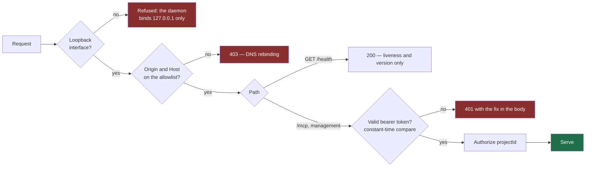

# Local MCP security

How the Theurian daemon protects itself on a developer's machine. The decision
record is [ADR-0011](../adr/0011-local-mcp-authentication.md); the threat
analysis is the [threat model](threat-model.md).

## The uncomfortable fact about loopback

`127.0.0.1` feels private. It is not.

- Every process running as your user can open a socket to it. A `curl` in a
  postinstall script reaches it as easily as Claude Code does.
- A web page you visit can attempt to reach it by resolving a hostname to
  `127.0.0.1`, so the browser treats the request as same-origin — DNS rebinding.

Theurian serves architecture decisions, security rules, incident write-ups, and
unreleased specifications. An unauthenticated loopback endpoint discloses all of
it to anything running on the machine.

## Controls



### Binding

`127.0.0.1` only. Binding a non-loopback interface is not a supported
configuration of the OSS Core — not a flag, not an environment variable. Remote
access is a hosted-deployment concern with an entirely different security model
(TLS, OAuth 2.1, audience and scope validation, tenant isolation), and shipping
half of that would be worse than shipping none.

### Origin and Host validation

Checked on every request. The MCP SDK enables DNS-rebinding protection
automatically for localhost hosts; Theurian asserts it is enabled rather than
assuming, because a silently-disabled control is indistinguishable from a working
one until it matters.

### The token

- ≥32 bytes from `secrets.token_urlsafe`.
- Required on `/mcp` and every management endpoint.
- Compared in constant time.
- Stored at `~/.theurian/auth/mcp-token`, mode 0600, inside a 0700 directory, and in
  the OS secret store where one exists. **A world-readable token file is refused,
  not used** — a credential anyone can read is not a credential.
- Rotated only by explicit request (`theurian auth rotate`). Never by
  `SessionStart`, and never automatically.

### `/health` is deliberately unauthenticated

It returns exactly:

```json
{ "status": "ok", "version": "0.4.0", "protocolVersion": "theurian/v1", "uptimeSeconds": 3421 }
```

Nothing about projects, knowledge, or configuration. This is what lets the
`SessionStart` hook stay fast and unprivileged: a health check that needed a
credential would push credential handling into a hook that runs on every session.

## Getting the token to Claude Code without writing it down

The obvious approach — put the token in the MCP configuration file — is wrong.
Those files get copied into gists, synced to dotfile repositories, pasted into
issues, and read by every tool on the machine.

Claude Code expands `${VAR}` in an HTTP server's `url` and `headers`. So the
configuration holds a *reference*:

```json
{
  "mcpServers": {
    "theurian": {
      "type": "http",
      "url": "http://127.0.0.1:7419/mcp",
      "headers": { "Authorization": "Bearer ${THEURIAN_MCP_TOKEN}" }
    }
  }
}
```

`/theurian:setup` writes `~/.theurian/env` (mode 0600):

```sh
THEURIAN_MCP_TOKEN="$(cat "${HOME}/.theurian/auth/mcp-token")"
export THEURIAN_MCP_TOKEN
```

and offers — showing the diff, and asking first — to add one guarded block to
your shell profile:

```sh
# >>> theurian >>>
[ -f "$HOME/.theurian/env" ] && . "$HOME/.theurian/env"
# <<< theurian <<<
```

Only that block is ever rewritten. The rest of your profile is never touched. If
you decline, setup completes in `degraded` state and prints the export line for
you to place yourself.

The secret exists in exactly one file. Everything else points at it.

### The known rough edge

If you launch Claude Code from a GUI launcher rather than a shell, it may not
inherit your shell environment, `${THEURIAN_MCP_TOKEN}` stays unexpanded, and the
daemon returns 401. `theurian doctor` detects this specific case and explains it,
because "401 Unauthorized" on a tool you just installed is otherwise a mystery.

## Never in a log

Redaction happens at the logging sink — one formatter that scrubs the token,
`Authorization` header values, and configured secret patterns. Not at each call
site: relying on every future call site to remember is precisely how tokens end
up in logs.

`theurian doctor --report` redacts credentials and knowledge bodies by default,
because its output is what people paste into public issues.

A test asserts, using a poisoned-token fixture, that the token appears in no log
record, error message, setup report, or doctor output.

## Filesystem boundary

Every path Theurian reads is resolved with `realpath` and checked with
`is_relative_to` against a resolved root. Absolute paths, `..` traversal, and
symlinks leaving the root are refused — including symlinks on *intermediate* path
components, not only the final target.

Resolving the root as well as the candidate matters: `/tmp` is a symlink on
macOS, and many people keep repositories under a symlinked home directory.
Resolving only one side would reject every read for those users.

## Project isolation

`projectId` is required on every project-scoped call and validated against the
published schema. There is no process-global and no connection-scoped current
project. With ten subagents sharing one daemon, an implicit default is a
cross-project data leak waiting for a race.

## Untrusted results

Every retrieval result carries:

```json
{
  "contentClassification": "untrusted-knowledge",
  "mayContainInstructions": true,
  "executable": false
}
```

`executable` cannot be set true — the type rejects it.

**Theurian labels; it does not enforce.** An agent that treats document text as
instructions will be influenced by a document that contains instructions, and no
MCP server can prevent that from the server side. This is a shared responsibility
with the calling agent, and it is stated plainly in
[SECURITY.md](../../SECURITY.md) rather than buried in a design document.

## Verifying your installation

```sh
theurian doctor --json
```

Checks the bind address, token file permissions, secret store backend, MCP
configuration shape, and whether any derived artifact is tracked by Git.

Manual checks:

```sh
# Only loopback should be listening.
lsof -nP -iTCP:7419 -sTCP:LISTEN

# Health needs no credential.
curl -s http://127.0.0.1:7419/health

# MCP does.
curl -s -o /dev/null -w '%{http_code}\n' http://127.0.0.1:7419/mcp   # expect 401
```

## Related

- [ADR-0002 — single local daemon over Streamable HTTP](../adr/0002-single-local-daemon-over-streamable-http.md)
- [ADR-0011 — local MCP authentication](../adr/0011-local-mcp-authentication.md)
- [ADR-0012 — the plugin does not auto-register the MCP server](../adr/0012-plugin-does-not-autoregister-mcp-server.md)
- [Threat model](threat-model.md)
