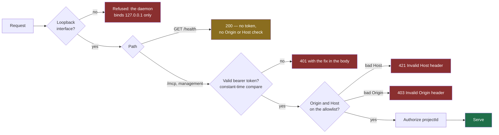

# Local MCP security

How the Theurian daemon protects itself on a developer's machine. The decision
record is [ADR-0011](../adr/0011-local-mcp-authentication.md); the threat
analysis is the [threat model](threat-model.md).

## The uncomfortable fact about loopback

`127.0.0.1` feels private. It is not.

- Every process running as your user can open a socket to it. A `curl` in a
  postinstall script reaches it as easily as Claude Code does.
- A web page you visit can attempt to reach it by resolving a hostname to
  `127.0.0.1`, so the browser treats the request as same-origin — DNS rebinding.

Theurian serves architecture decisions, security rules, incident write-ups, and
unreleased specifications. An unauthenticated loopback endpoint discloses all of
it to anything running on the machine.

## Controls

The order below is the order the code applies, not the order these controls are
usually listed in. The token is checked by Starlette middleware wrapping the
whole app; the `Origin` and `Host` allowlist belongs to the *mounted* MCP app, so
it is reached only after the token passes — and `/health`, which sits beside the
mount, never reaches it at all.



Measured against the real ASGI app: a rebound `Host` gives 421 and a foreign
`Origin` gives 403, both only once a valid token has been presented; without one
the answer is 401 whatever the headers say.

### Binding

`127.0.0.1` only. Binding a non-loopback interface is not a supported
configuration of the OSS Core — not a flag, not an environment variable. Remote
access is a hosted-deployment concern with an entirely different security model
(TLS, OAuth 2.1, audience and scope validation, tenant isolation), and shipping
half of that would be worse than shipping none.

### Origin and Host validation

Checked on every request. The MCP SDK enables DNS-rebinding protection
automatically for localhost hosts; Theurian asserts it is enabled rather than
assuming, because a silently-disabled control is indistinguishable from a working
one until it matters.

### The token

- ≥32 bytes from `secrets.token_urlsafe`.
- Required on `/mcp` and every management endpoint.
- Compared in constant time.
- Stored at `~/.theurian/auth/mcp-token`, mode 0600, inside a 0700 directory, and in
  the OS secret store where one exists. **A world-readable token file is refused,
  not used** — a credential anyone can read is not a credential.
- Rotated only by explicit request (`theurian auth rotate`). Never by
  `SessionStart`, and never automatically.

### `/health` is deliberately unauthenticated

It returns exactly:

```json
{
  "status": "ok",
  "version": "0.4.0",
  "protocolVersion": "theurian/v1",
  "dataDir": "/Users/you/.theurian",
  "startedAt": "2026-08-04T09:12:44.108312+00:00"
}
```

Nothing about projects or knowledge. This is what lets the `SessionStart` hook
stay fast and unprivileged: a health check that needed a credential would push
credential handling into a hook that runs on every session. `dataDir` is there so
a second starter can tell *this* daemon from a different Theurian squatting on
the port — see ADR-0011, point 4.

**It is also outside the `Origin` and `Host` allowlist, not only outside the
token.** The rebinding settings are given to the mounted MCP app, and `/health`
sits beside it. So a page the user visits can read this body cross-origin, where
the same request to `/mcp` gets 401 without a token and 421 `Invalid Host header`
with one. To that caller `dataDir` names the OS user, and `startedAt` gives the
uptime. Recorded as a residual under T-2 in the [threat model](threat-model.md)
rather than closed in Milestone 5.

## Getting the token to Claude Code without writing it down

The obvious approach — put the token in the MCP configuration file — is wrong.
Those files get copied into gists, synced to dotfile repositories, pasted into
issues, and read by every tool on the machine.

Claude Code expands `${VAR}` in an HTTP server's `url` and `headers`. So the
configuration holds a *reference*:

```json
{
  "mcpServers": {
    "theurian": {
      "type": "http",
      "url": "http://127.0.0.1:7419/mcp",
      "headers": { "Authorization": "Bearer ${THEURIAN_MCP_TOKEN}" }
    }
  }
}
```

`theurian setup` writes one guarded block into `~/.theurian/env` (mode 0600):

```sh
# >>> theurian >>>
# Written by `theurian setup`. Sourced by your shell profile so that
# Claude Code can expand ${THEURIAN_MCP_TOKEN} in its MCP configuration
# without the literal token ever entering a config file (ADR-0011).
#
# Theurian rewrites only the lines between these two markers. Anything
# you add outside them is left exactly as you wrote it.
THEURIAN_MCP_TOKEN="$(cat "/Users/you/.theurian/auth/mcp-token")"
export THEURIAN_MCP_TOKEN
# <<< theurian <<<
```

The token's path is written out resolved, not as `${HOME}`.

**Only that block is ever rewritten, and everything around it survives byte for
byte** — under `theurian setup` and under `theurian auth rotate` alike. The file
invites you to add lines to it and it means it: put your own exports above or
below the markers and they stay where you put them, trailing whitespace
included. A file your editor left without a final newline keeps its last line
and gains one, rather than having the marker run onto the end of it.

Until [#128](https://github.com/theurian/theurian/issues/128) that was not true.
Both commands rendered the whole file and truncated whatever else was in it, so
a line you had added was gone with no diff, no backup and no mention in the
report. If you set this machine up with `0.1.0.dev0` through `dev2`, the first
`setup` or `auth rotate` after upgrading replaces that older rendering in place
with the block above — one export of `THEURIAN_MCP_TOKEN` afterwards, not two —
and keeps anything you appended to it.

That replacement is recognised by those lines naming *this* data directory's
token path, exactly and whole. If you edited one of them, or if the file was
written for another installation, it is not recognised and not touched: you get
the block appended below it and both exports visible. Your shell keeps the
block's value, because it reads it last, and you can tidy the rest yourself.

**A marker is a whole line, never text inside one.** The file is split on `\n`
and on nothing else — what your shell ends a line at — with a trailing carriage
return dropped before the comparison, so a file with CRLF endings delimits just
as well. A line of yours that happens to mention a marker is a line of yours:

```sh
echo "everything between # >>> theurian >>> and here"
```

opens nothing. The block's own lines are written with `\n` endings, so a block
that came back from a Windows editor with CRLF markers is rewritten once to
normalise it and then left alone for good — the lines around it keeping the line
endings you gave them, including a `\r` inside a quoted value, which would
otherwise become a newline and split the assignment in two.

**Markers that do not delimit exactly one block stop the write instead of
guessing:**

| What your file holds | What Theurian does |
| :-- | :-- |
| two or more start lines, wherever they are | refuses; it cannot tell which lines between them are its own |
| a start line with no end line after it | refuses; it cannot tell where its own lines end |
| an end line with no start above it, or a second end line | nothing — it delimits nothing, so it is one more line of yours to keep |

The start lines are counted across the whole file before anything is delimited,
so pasting a fresh block above a broken one is caught rather than swallowing
whatever sits between the two. With two blocks your shell would export whichever
came last, which need not be the one setup chose.

On a refusal `setup` reports a conflict and writes nothing (`--approve-conflicts`
buys progress on the rest of the plan, never an overwrite of this file), and
`auth rotate` leaves the file alone, still rotates the token, and names the file
to repair in `nextSteps` — an exposed credential outranks a comment marker. What
either one tells you is the two marker strings, the path they are in, and the
command to re-run; never a line out of the file, because `theurian doctor
--report` is meant to be pasted in public.

**One thing setup can be right about and still be wrong.** Its question is
whether the block is current, which is deliberately blind to your lines — so if
one of them assigns `THEURIAN_MCP_TOKEN` again *below* the block, your shell
keeps that one and not the block's. That line is yours, so it is not edited away
and it is not a conflict; the run says so and finishes `degraded` instead of
`converged`, naming the file, the variable and the marker to move the line above.
`theurian doctor` says the same thing, as a warning and not a problem: there is
nothing for setup to do about a line of yours, so it does not count against
`problemCount`, and a machine whose only finding is this one is still `healthy`
and still exits 0. Neither command prints the line, because whatever is on the
right of that `=` is a credential often enough to matter.

**That check reads one line at a time, so treat it as a help and not a
guarantee.** It recognises a plain `THEURIAN_MCP_TOKEN=…` at the start of a line,
with or without `export`. It does not recognise an assignment tucked inside a
conditional, a `{ … }` group or an `eval` — measured with `bash`, those export
their value and setup stays quiet and says `converged` — and it *does* warn about
an assignment inside a quoted heredoc body, which your shell never runs at all.
That is why the sentence says the line *appears* to assign rather than that it
overrides: deciding what a line really does means running your shell profile, and
Theurian will not do that to answer a question about a file. If a `setup` that
ended `converged` is followed by a 401, ask a fresh shell what it really has —
this compares it against the file the block points at and prints neither:

```sh
[ "$THEURIAN_MCP_TOKEN" = "$(cat ~/.theurian/auth/mcp-token)" ] && echo match || echo mismatch
```

Nothing here edits your shell profile. The line that sources `~/.theurian/env`
is yours to add, which is the one real ergonomic cost of keeping the token out
of every config file.

The secret exists in exactly one file. Everything else points at it.

### The known rough edge

If you launch Claude Code from a GUI launcher rather than a shell, it may not
inherit your shell environment, `${THEURIAN_MCP_TOKEN}` stays unexpanded, and the
daemon returns 401. `theurian doctor` detects this specific case and explains it,
because "401 Unauthorized" on a tool you just installed is otherwise a mystery.

## Never in a log

`tests/e2e/test_daemon_single_instance.py::test_the_token_never_reaches_the_log`
starts a real daemon, makes an authenticated MCP call, and asserts the token is
absent from its log file.

The reason it passes is worth stating exactly, because this page used to state
it wrongly. `uvicorn` runs with `access_log=False` and `log_level="warning"`,
which is what everything here pointed at — but switching both back on still puts
no token in the output. `uvicorn.logging.AccessFormatter` writes the client
address, method, path, HTTP version and status code, and no header. The token
stays out of the log because **nothing in this stack logs request headers**, not
because access logging is off.

One thing that *is* logged when access logging is on: the full path, query string
included. Theurian carries the credential in a header, so nothing leaks — but a
future endpoint taking a secret as a query parameter would be logged verbatim.

**Redaction at a logging sink is a design, not a shipped control.** ADR-0011
decision 12 describes one formatter that scrubs the token, `Authorization` header
values, and configured secret patterns — because relying on every future call
site to remember is precisely how tokens end up in logs. It is not implemented:
`security/tokens.redact` exists and nothing in the product calls it, because
there is no sink yet to apply it at. Said here rather than left implied, since a
control that does not exist is the one nobody re-checks.

The token is also asserted absent from the `/health` body, from the 401 body
both in-process and over a real socket, from `theurian auth rotate` output, and
from the generated MCP configuration and env file.

`theurian doctor --report` redacts by default, because its output is what people
paste into public issues, and it does so two ways. **Absolute paths Theurian
itself put in the payload are substituted** — your home directory, the repository
root, the token file, the executable, and any data directory you chose yourself,
replaced wherever they appear. **Values Theurian
did not write are withheld**, because substitution cannot reach them: a string
read out of somebody else's configuration file was never held by this process, so
there is nothing to match it against.

That second half is not theoretical, and it is why it exists. A `theurian` MCP
entry in `~/.claude.json` carrying `Authorization: Bearer <literal token>`
instead of `${THEURIAN_MCP_TOKEN}` is precisely the state that makes the
`mcp-connection` step conflict — so it is the state that gives someone a reason
to run `doctor --report` and paste the result — and the step published the
installed entry verbatim, inside a payload that said `redacted: true`. The same
route ran through a service unit's environment, another daemon's `/health` reply,
the ids of other repositories in the project registry, and any exception a probe
raised.

Under `--report` those steps now say what differs without saying what it holds:
a count, `<another data directory>`, an exception's type, and — for a differing
configuration — **only the names of the fields Theurian's own renderer
produces**, with anything else counted.

That last rule is narrower than "names, not values", and it had to be. The first
version of this fix published the differing field names on the reasoning that a
name is schema. It is not, unless Theurian defined it: the names came from a
union with the installed file, so a systemd continuation line — which is the
*value* of the directive above it — parsed alone as a directive name, and a
bearer token was published as a field name inside the sentence promising the
values were withheld. A name Theurian writes cannot be a value it read.

Plain `theurian doctor` still prints everything, for the person who has to act
on it. Asserted on the values themselves rather than on the shape of the output,
in `packages/theurian-core/tests/integration/test_setup_report_withholding.py` —
a test that only checked the path anchors passed before the fix and after it.
That file sweeps every step in `STEPS` with a seeded sentinel rather than testing
the routes already known to be broken, because one line added to an unrelated
step reopened the class with the whole suite green.

It remains true that no *knowledge body* enters that payload, and that a path
outside the substituted anchors goes out verbatim.

## Filesystem boundary

Every path Theurian reads is resolved with `realpath` and checked with
`is_relative_to` against a resolved root. Absolute paths, `..` traversal, and
symlinks leaving the root are refused — including symlinks on *intermediate* path
components, not only the final target.

Resolving the root as well as the candidate matters: `/tmp` is a symlink on
macOS, and many people keep repositories under a symlinked home directory.
Resolving only one side would reject every read for those users.

## Project isolation

`projectId` is required on every project-scoped call and validated against the
published schema. There is no process-global and no connection-scoped current
project. With ten subagents sharing one daemon, an implicit default is a
cross-project data leak waiting for a race.

## Untrusted results

Every retrieval result carries:

```json
{
  "contentClassification": "untrusted-knowledge",
  "mayContainInstructions": true,
  "executable": false
}
```

`executable` is `const: false` in
[`schemas/knowledge/retrieval-result.schema.json`](../../schemas/knowledge/retrieval-result.schema.json),
and a real tool response carrying `executable: true` is rejected by it —
asserted in `tests/integration/test_wire_contract.py`. This used to say "the type
rejects it", naming `domain.retrieval.SafetyMetadata`, which does refuse it and
is not on the path that produces this value; see the round-eight correction to
T-3 in [the threat model](threat-model.md).

**Theurian labels; it does not enforce.** An agent that treats document text as
instructions will be influenced by a document that contains instructions, and no
MCP server can prevent that from the server side. This is a shared responsibility
with the calling agent, and it is stated plainly in
[SECURITY.md](../../SECURITY.md) rather than buried in a design document.

## Verifying your installation

```sh
theurian doctor --json
```

Checks the bind address, token file permissions, secret store backend, MCP
configuration shape, and whether any derived artifact is tracked by Git.

Manual checks:

```sh
# Only loopback should be listening.
lsof -nP -iTCP:7419 -sTCP:LISTEN

# Health needs no credential.
curl -s http://127.0.0.1:7419/health

# MCP does.
curl -s -o /dev/null -w '%{http_code}\n' http://127.0.0.1:7419/mcp   # expect 401
```

## Related

- [ADR-0002 — single local daemon over Streamable HTTP](../adr/0002-single-local-daemon-over-streamable-http.md)
- [ADR-0011 — local MCP authentication](../adr/0011-local-mcp-authentication.md)
- [ADR-0012 — the plugin does not auto-register the MCP server](../adr/0012-plugin-does-not-autoregister-mcp-server.md)
- [Threat model](threat-model.md)
