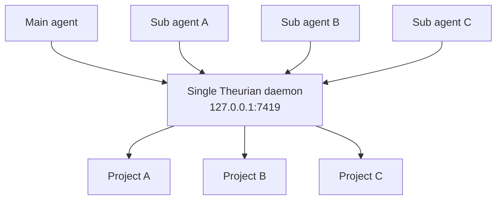

# Theurian for Claude Code

> Invoke your engineering knowledge.

This plugin connects Claude Code to a **Theurian daemon** running on your
machine, so every agent in your session can search your team's specifications,
architecture decisions, review history, and traceability graph.

It is an independently versioned artifact. It ships no Theurian logic of its
own — every command is a thin adapter over the `theurian` CLI.

---

## Install

Theurian Core is a prerequisite, not something this plugin brings with it. Every
command here shells out to the `theurian` binary, so it goes on the machine
first:

```sh
uv tool install 'theurian[daemon]'    # or: pipx install 'theurian[daemon]'
```

The `[daemon]` extra is what `/theurian:setup` goes on to configure. Without
it you get the CLI and the migration engine, and `theurian daemon start` fails
with `No module named 'uvicorn'`.

Then, in Claude Code:

```text
/plugin marketplace add theurian/theurian-plugins
/plugin install theurian@theurian-plugins
/theurian:setup
```

Installing the plugin **does nothing** on its own: no daemon starts, no OS
service is registered, no file outside the plugin directory is written. The
third line is what performs setup — it configures the machine around the Core
you already put there, never installs Core itself, and it is idempotent, so run
it as many times as you like.

## Why setup is a separate step

Software that installs an OS service the moment you enable it is software you
cannot evaluate. `/theurian:setup` shows you a plan first (`--dry-run`), asks
before touching anything you own, and lists every file it changed afterwards.
Everything it does is enumerable in advance and reversible with
`/theurian:uninstall`.

It is also why this plugin declares no MCP server in its manifest: Claude Code
starts a plugin's MCP servers as soon as the plugin is enabled, which would put
a failed server in your session before you had ever asked for one. The
connection definition ships in `mcp/theurian.mcp.json` and is installed by
setup. See [ADR-0012](../../docs/adr/0012-plugin-does-not-autoregister-mcp-server.md).

## One daemon, not one per agent

Every Claude Code agent — main and subagents alike — talks to the same endpoint:

```text
http://127.0.0.1:7419/mcp
```



**Theurian must never be configured as a stdio MCP server.** A stdio server is
spawned once per client, so ten subagents would mean ten processes writing to
one SQLite database, ten index builders, and ten copies of every cache. The
result is not slowness — it is corruption. See
[ADR-0002](../../docs/adr/0002-single-local-daemon-over-streamable-http.md).

If you ever see a `theurian` entry in your MCP configuration with a `command`
field, that is a bug. Run `/theurian:doctor`.

## Using Theurian alongside Serena

They answer different questions, and they work well together.

| Question | Tool |
| :-- | :-- |
| What did we decide about auth, and why? | **Theurian** |
| Was this approach rejected before? | **Theurian** |
| What does the order-cancellation spec require? | **Theurian** |
| Which tests verify this specification? | **Theurian** |
| Where is `validateOrder` defined? | **Serena** |
| Who calls this function? | **Serena** |
| What is this type's hierarchy? | **Serena** |

A workflow that uses both:

```text
1. spec.get              — what are we supposed to build?
2. knowledge.search      — what have we already decided?
3. review.findSimilar    — has this come up in review before?
4. Serena: find_symbol   — where does this live in the code?
5. Serena: find_referencing_symbols — what would this change break?
6. implement
7. trace.findTests       — what verifies this?
8. spec.getCoverage      — did we miss anything?
```

Configure both as independent MCP servers. Theurian never calls Serena, and
Serena never calls Theurian. Full detail:
[docs/integrations/serena.md](../../docs/integrations/serena.md).

## What the SessionStart hook does

It runs a bounded health check — a few hundred milliseconds — and prints a
warning if something needs attention.

**It does:** probe the daemon's health endpoint; check whether this repository is
registered; check whether the index is stale; check whether the MCP connection
is configured; check plugin/Core compatibility; start an *already-registered*
service that happens to be stopped.

**It never:** install a package; register an OS service; regenerate a token;
rebuild an index; delete a database; modify a Git-tracked file; or do anything
resembling `/theurian:setup`.

A hook that runs on every session has to be cheap and predictable, or it becomes
a tax you pay all day for a benefit you notice once.

## Commands

| Command | Purpose |
| :-- | :-- |
| `/theurian:setup` | First-time setup. Idempotent. Run once. |
| `/theurian:status` | Daemon, project, index, and migration state. |
| `/theurian:doctor` | Diagnose problems and print remedies. Never auto-repairs. |
| `/theurian:register-project` | Register this repository. |
| `/theurian:unregister-project` | Stop serving a project. Keeps Git-tracked knowledge. |
| `/theurian:index` | Incremental index update. |
| `/theurian:reindex` | Full rebuild of derived index data. |
| `/theurian:migrate` | Validate and apply knowledge migrations. |
| `/theurian:ingest` | Ingest local sources — docs and specs. |
| `/theurian:propose` | Draft a reviewable knowledge change. |
| `/theurian:upgrade` | Report whether Core needs upgrading, and print the command. Never upgrades. |
| `/theurian:uninstall` | Remove Theurian, scope by scope. |

## AI cannot approve knowledge

Write-intent tools produce a **proposal**:

```text
.theurian/proposals/<proposal-id>/
├── migration.yaml
├── content.md
└── evidence.json
```

A human reviews it, and it becomes team knowledge through a merged pull request.
There is no MCP path that mutates approved state — not a permission, not a flag.
Approved knowledge is what an agent will cite tomorrow as a team decision, so a
person has to have said yes. See
[ADR-0013](../../docs/adr/0013-ai-writes-produce-proposals.md).

## Compatibility

This plugin declares which Core versions it supports in
[`compatibility.yaml`](compatibility.yaml). Core performs the comparison, so
there is exactly one implementation of the rules:

```sh
theurian compat check --plugin-version 0.1.1 \
  --core-minimum 0.1.0-dev.0 --core-maximum-exclusive 0.2.0 \
  --protocol-version theurian/v1 --json
```

On a mismatch the plugin stops and tells you how to fix it. It never upgrades,
downgrades, or deletes anything on its own.

## Uninstalling

`/theurian:uninstall` treats each scope as a separate choice: plugin
configuration, daemon service, binary, cache, user settings, and repository
knowledge. Destructive scopes default to off, and `.theurian/` is never removed
without a confirmation that names what is being deleted.

**Removing this plugin never deletes your team's knowledge.** It lives in Git.

## License

Apache-2.0. See [LICENSE](LICENSE).
